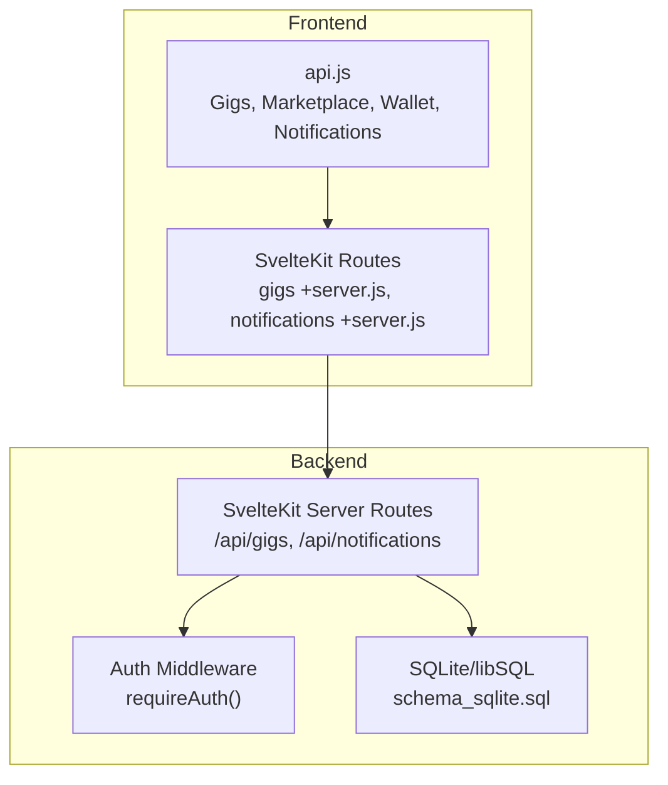
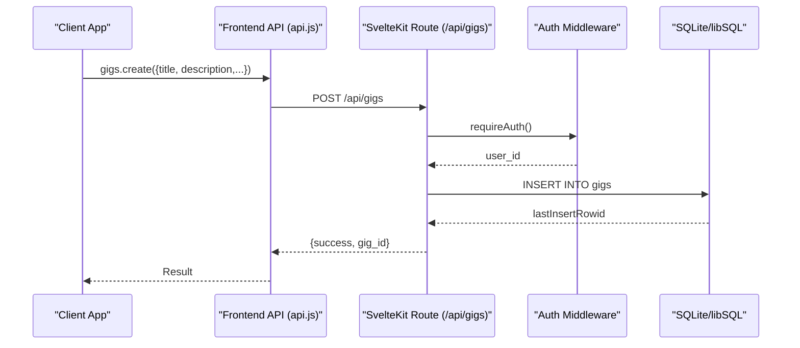
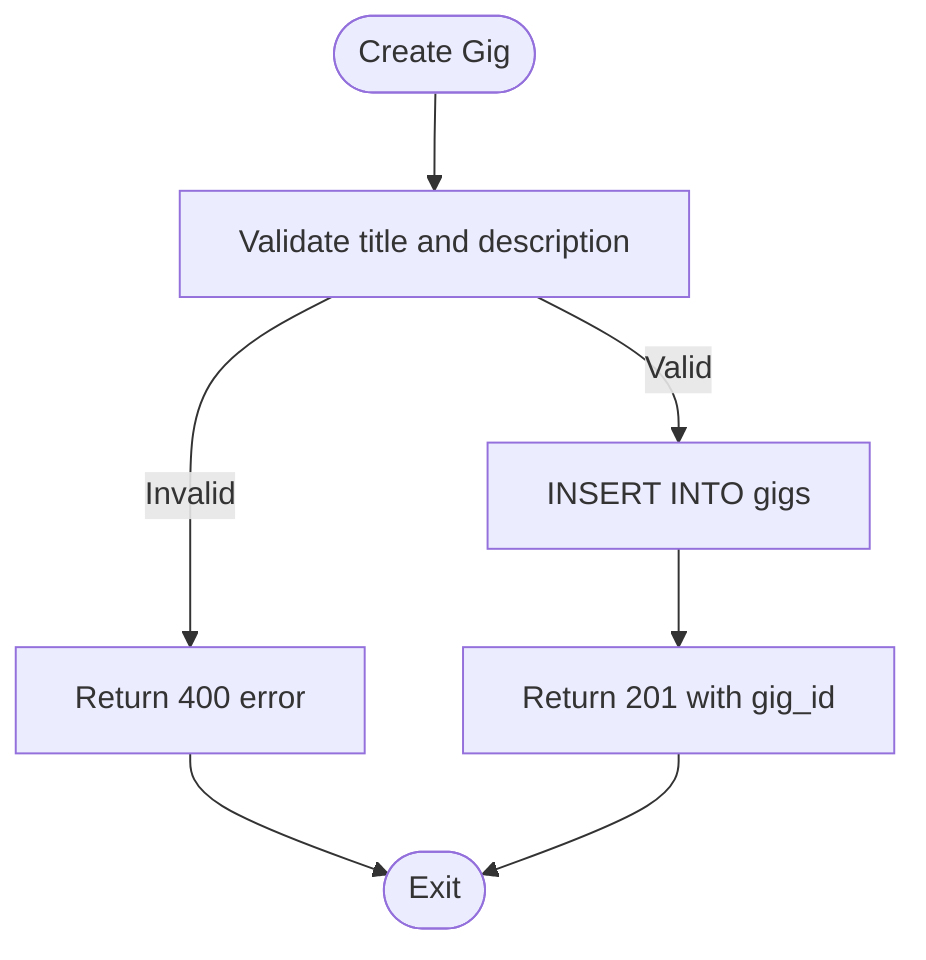
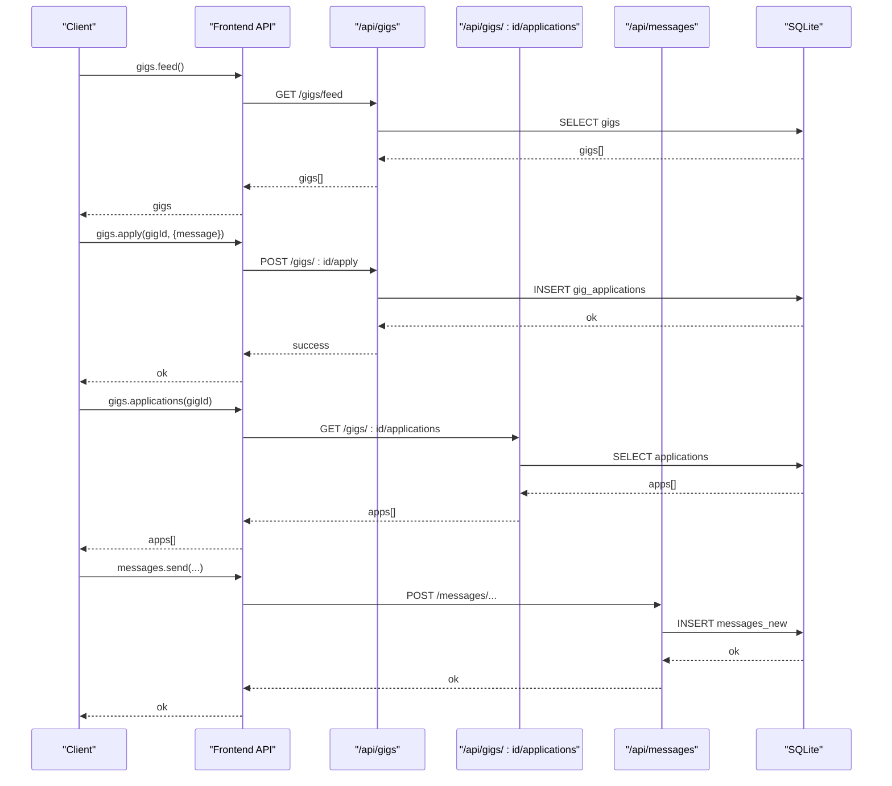
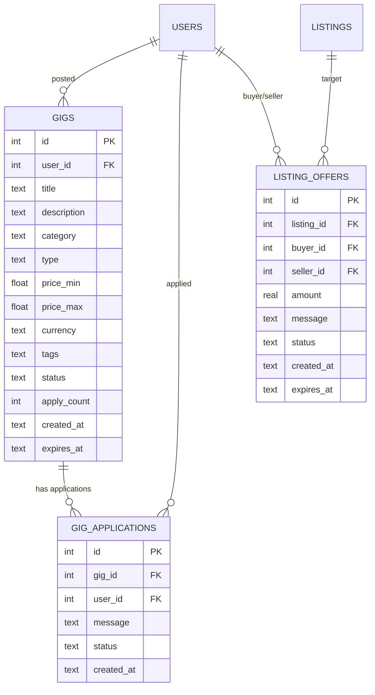
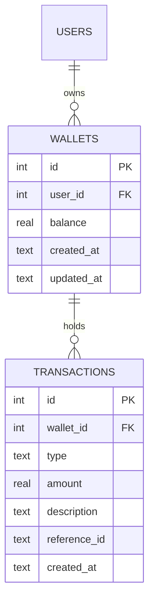
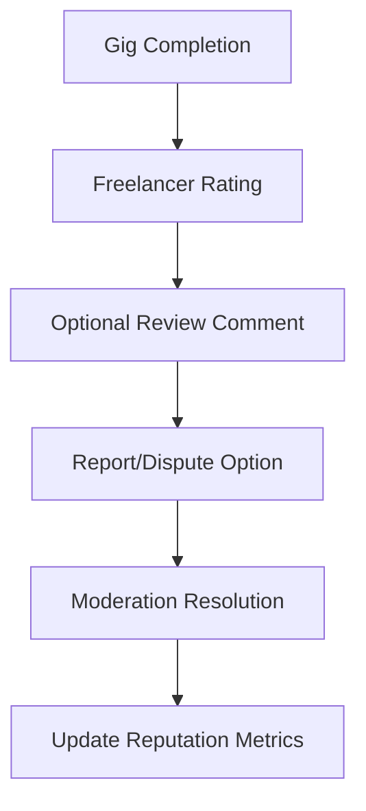
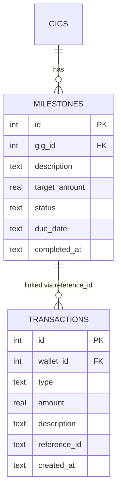
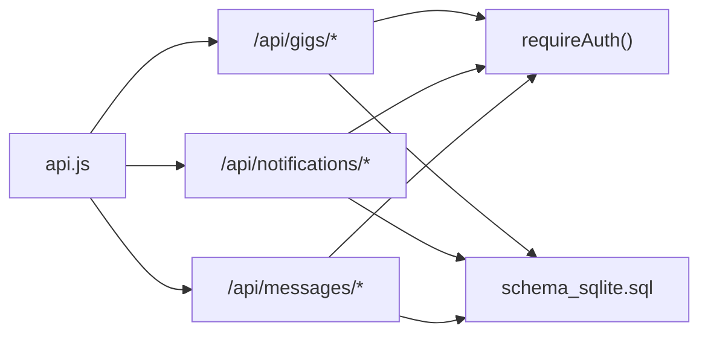

# Freelance Gig Platform

<cite>
**Referenced Files in This Document**
- [README.md](file://README.md)
- [ARCHITECTURE.md](file://ARCHITECTURE.md)
- [schema_sqlite.sql](file://schema_sqlite.sql)
- [001_schema.sql](file://migrations/001_schema.sql)
- [002_phase2.sql](file://migrations/002_phase2.sql)
- [api.js](file://frontend/src/lib/api.js)
- [gigs +server.js](file://frontend/src/routes/api/gigs/[...path]+server.js)
- [notifications +server.js](file://frontend/src/routes/api/notifications/[...path]+server.js)
- [messages +server.js](file://frontend/src/routes/api/messages/[...path]+server.js)
- [notifications store](file://frontend/src/lib/stores/notifications.svelte.js)
- [marketplace +page.svelte](file://frontend/src/routes/marketplace/+page.svelte)
</cite>

## Table of Contents
1. [Introduction](#introduction)
2. [Project Structure](#project-structure)
3. [Core Components](#core-components)
4. [Architecture Overview](#architecture-overview)
5. [Detailed Component Analysis](#detailed-component-analysis)
6. [Dependency Analysis](#dependency-analysis)
7. [Performance Considerations](#performance-considerations)
8. [Troubleshooting Guide](#troubleshooting-guide)
9. [Conclusion](#conclusion)
10. [Appendices](#appendices)

## Introduction
This document describes VSocial’s freelance gig platform module, focusing on the gig posting system, application and hiring workflow, offer/bid management, payment processing integration, ratings and reputation, and dispute/reporting mechanisms. It also documents the API endpoints for gig operations, application management, and communication between clients and freelancers.

VSocial is a full-stack social network featuring posts, stories, reels, real-time messaging, a marketplace, and a freelance gig board. The backend is implemented with SvelteKit server-side routes, while the frontend uses Svelte 5 with SvelteKit for routing and state. The database is SQLite (via libSQL), with raw SQL and prepared statements for performance and safety.

**Section sources**
- [README.md:12-21](file://README.md#L12-L21)
- [ARCHITECTURE.md:8-25](file://ARCHITECTURE.md#L8-L25)

## Project Structure
The gig platform spans frontend API clients, backend SvelteKit routes, and database schemas. Key areas:
- Frontend API client exposes typed endpoints for gigs, marketplace, wallet, and notifications.
- Backend routes handle authentication, gig CRUD, applications, and related operations.
- Database schema defines gigs, applications, marketplace listings/offers, and wallet/transactions.

**Diagram sources**
- [api.js:305-319](file://frontend/src/lib/api.js#L305-L319)
- [gigs +server.js](file://frontend/src/routes/api/gigs/[...path]+server.js)
- [notifications +server.js](file://frontend/src/routes/api/notifications/[...path]+server.js)
- [schema_sqlite.sql:377-402](file://schema_sqlite.sql#L377-L402)

**Section sources**
- [api.js:305-319](file://frontend/src/lib/api.js#L305-L319)
- [schema_sqlite.sql:377-402](file://schema_sqlite.sql#L377-L402)

## Core Components
- Gigs domain: gigs and gig_applications tables define the posting and application lifecycle.
- Applications: freelancers apply to gigs with a message; clients review and decide.
- Marketplace listings/offers: separate auction-style offers for items/services; useful as a reference for offer/bid mechanics.
- Wallet and transactions: wallets and transactions tables support in-app monetization.
- Notifications: real-time notification engine for gig-related updates.
- Messaging: real-time chat for client-freelancer communication.

Key schema highlights:
- Gigs: title, description, category, type, pricing range, currency, tags, status, counts, timestamps.
- Applications: references gig and user, message, status, timestamps.
- Wallets and transactions: per-user wallet with transaction history.
- Notifications: recipient, actor, type, entity, message, read status.

**Section sources**
- [schema_sqlite.sql:377-402](file://schema_sqlite.sql#L377-L402)
- [schema_sqlite.sql:355-371](file://schema_sqlite.sql#L355-L371)
- [schema_sqlite.sql:289-299](file://schema_sqlite.sql#L289-L299)
- [schema_sqlite.sql:254-283](file://schema_sqlite.sql#L254-L283)

## Architecture Overview
The gig platform integrates frontend API clients with SvelteKit server routes backed by SQLite. Authentication middleware ensures requests originate from authorized users. Data flows from UI actions to backend handlers, persisted in the database, and surfaced via notifications and messages.

**Diagram sources**
- [api.js:314](file://frontend/src/lib/api.js#L314)
- [gigs +server.js:75-77](file://frontend/src/routes/api/gigs/[...path]+server.js#L75-L77)

## Detailed Component Analysis

### Gigs Posting and Pricing
- Service creation: authenticated users post gigs with title, description, category, type, optional price range, currency, tags, and optional expiration.
- Pricing model: supports min/max pricing and currency selection; frontend enforces presence of title/description.
- Status and visibility: gigs default to open status; expiration supported.

**Diagram sources**
- [gigs +server.js:71-77](file://frontend/src/routes/api/gigs/[...path]+server.js#L71-L77)

**Section sources**
- [gigs +server.js:70-79](file://frontend/src/routes/api/gigs/[...path]+server.js#L70-L79)
- [schema_sqlite.sql:377-392](file://schema_sqlite.sql#L377-L392)

### Application and Hiring Workflow
- Discovery: clients browse gigs via feed endpoint.
- Application: freelancers submit applications with a message; uniqueness constraint prevents duplicate applications.
- Management: clients fetch applications for a gig and manage statuses.
- Communication: real-time messaging enables negotiation and coordination.

**Diagram sources**
- [api.js:308-318](file://frontend/src/lib/api.js#L308-L318)
- [gigs +server.js:67-79](file://frontend/src/routes/api/gigs/[...path]+server.js#L67-L79)
- [schema_sqlite.sql:394-402](file://schema_sqlite.sql#L394-L402)
- [messages +server.js:167-177](file://frontend/src/routes/api/messages/[...path]+server.js#L167-L177)

**Section sources**
- [api.js:308-318](file://frontend/src/lib/api.js#L308-L318)
- [schema_sqlite.sql:394-402](file://schema_sqlite.sql#L394-L402)
- [messages +server.js:167-177](file://frontend/src/routes/api/messages/[...path]+server.js#L167-L177)

### Offer System and Bid Management
- Reference model: marketplace listings and offers demonstrate a robust offer lifecycle with buyer/seller roles, amounts, messages, status, and expiry.
- Mapping to gigs: offers can be adapted to represent bids on gigs, with similar fields and status transitions (pending, accepted, rejected).
- Recommendations:
  - Extend gigs with a dedicated bids/offers table mirroring listing_offers.
  - Add endpoints for creating bids, accepting/rejecting, and expiring bids.
  - Track bid amounts, delivery timelines, and revisions.

**Diagram sources**
- [schema_sqlite.sql:377-402](file://schema_sqlite.sql#L377-L402)
- [schema_sqlite.sql:428-439](file://schema_sqlite.sql#L428-L439)

**Section sources**
- [schema_sqlite.sql:428-439](file://schema_sqlite.sql#L428-L439)

### Payment Processing Integration
- Wallet and transactions: wallets table holds balances; transactions record income/expense entries with descriptions and references.
- Integration points:
  - Convert offers/bids to payment intents or escrow holds.
  - Deduct deposits from wallets upon acceptance.
  - Release funds according to milestones or completion.
  - Record transaction entries for audit trails.

**Diagram sources**
- [schema_sqlite.sql:355-371](file://schema_sqlite.sql#L355-L371)

**Section sources**
- [schema_sqlite.sql:355-371](file://schema_sqlite.sql#L355-L371)

### Ratings, Disputes, and Reputation
- Ratings: marketplace reviews demonstrate a star-based rating system with comments; this pattern can be extended to gig completions.
- Disputes: reports table captures user-generated reports with reasons and statuses; can be leveraged for dispute tracking.
- Reputation: user profiles include metrics like follower counts and activity; consider adding gig-specific stats (completion rate, rating average).

**Diagram sources**
- [schema_sqlite.sql:445-453](file://schema_sqlite.sql#L445-L453)
- [marketplace +page.svelte:610-660](file://frontend/src/routes/marketplace/+page.svelte#L610-L660)

**Section sources**
- [schema_sqlite.sql:445-453](file://schema_sqlite.sql#L445-L453)
- [marketplace +page.svelte:610-660](file://frontend/src/routes/marketplace/+page.svelte#L610-L660)

### Escrow, Milestones, and Tracking
- Escrow: maintain a dedicated escrow account or per-gig escrow wallet linked to the platform.
- Milestones: introduce a milestones table with descriptions, targets, due dates, and completion flags.
- Tracking: link transactions to milestones; update milestone statuses on payment releases; notify parties on changes.

**Diagram sources**
- [schema_sqlite.sql:377-392](file://schema_sqlite.sql#L377-L392)
- [schema_sqlite.sql:363-371](file://schema_sqlite.sql#L363-L371)

**Section sources**
- [schema_sqlite.sql:377-392](file://schema_sqlite.sql#L377-L392)
- [schema_sqlite.sql:363-371](file://schema_sqlite.sql#L363-L371)

## Dependency Analysis
- Frontend API client depends on SvelteKit routes under /api.
- SvelteKit routes depend on authentication middleware and database access.
- Gigs rely on users and applications; messaging relies on conversations and participants; notifications depend on actors and recipients.

**Diagram sources**
- [api.js:305-319](file://frontend/src/lib/api.js#L305-L319)
- [gigs +server.js](file://frontend/src/routes/api/gigs/[...path]+server.js)
- [notifications +server.js](file://frontend/src/routes/api/notifications/[...path]+server.js)
- [messages +server.js](file://frontend/src/routes/api/messages/[...path]+server.js)
- [schema_sqlite.sql:377-402](file://schema_sqlite.sql#L377-L402)

**Section sources**
- [api.js:305-319](file://frontend/src/lib/api.js#L305-L319)
- [schema_sqlite.sql:377-402](file://schema_sqlite.sql#L377-L402)

## Performance Considerations
- Prepared statements and raw SQL minimize ORM overhead.
- Indexes on frequently queried columns (e.g., notifications recipient, messages conversation) improve query performance.
- Pagination and cursors reduce payload sizes for feeds and lists.
- Optimistic UI updates for notifications and messaging improve perceived responsiveness.

[No sources needed since this section provides general guidance]

## Troubleshooting Guide
- Authentication failures: ensure tokens are present and valid; verify requireAuth middleware behavior.
- Duplicate applications: uniqueness constraint prevents repeated applications; check gig_id and user_id pairing.
- Notification delivery: confirm notification insertion and read/update endpoints; use optimistic updates with fallbacks.
- Message sending: validate conversation membership and enforce required fields (text/media/voice).

**Section sources**
- [gigs +server.js:67-79](file://frontend/src/routes/api/gigs/[...path]+server.js#L67-L79)
- [notifications +server.js:49-63](file://frontend/src/routes/api/notifications/[...path]+server.js#L49-L63)
- [notifications store:187-200](file://frontend/src/lib/stores/notifications.svelte.js#L187-L200)
- [messages +server.js:160-166](file://frontend/src/routes/api/messages/[...path]+server.js#L160-L166)

## Conclusion
VSocial’s gig platform builds on a solid foundation of SvelteKit, SQLite, and raw SQL. The current implementation covers gig creation, applications, and basic monetization via wallets. To reach a production-ready freelance marketplace, extend the system with dedicated bids/offers, milestone tracking, and robust escrow/payment flows, while preserving the existing notification and messaging infrastructure.

[No sources needed since this section summarizes without analyzing specific files]

## Appendices

### API Endpoints Summary
- Gigs
  - GET /api/gigs/feed
  - GET /api/gigs/my
  - GET /api/gigs/:id
  - POST /api/gigs
  - PUT /api/gigs/:id
  - DELETE /api/gigs/:id
  - POST /api/gigs/:id/apply
  - GET /api/gigs/:id/applications
- Notifications
  - GET /api/notifications
  - POST /api/notifications/read-all
  - POST /api/notifications/:id/read
  - DELETE /api/notifications/:id
- Messages
  - POST /api/messages/conversations/:id/messages
- Wallet
  - GET /api/wallet
  - GET /api/wallet/transactions
  - POST /api/wallet/transfer
  - POST /api/wallet/tip
  - POST /api/wallet/deposit
  - POST /api/wallet/withdraw

**Section sources**
- [api.js:308-318](file://frontend/src/lib/api.js#L308-L318)
- [api.js:244-250](file://frontend/src/lib/api.js#L244-L250)
- [api.js:208-217](file://frontend/src/lib/api.js#L208-L217)
- [api.js:292-302](file://frontend/src/lib/api.js#L292-L302)