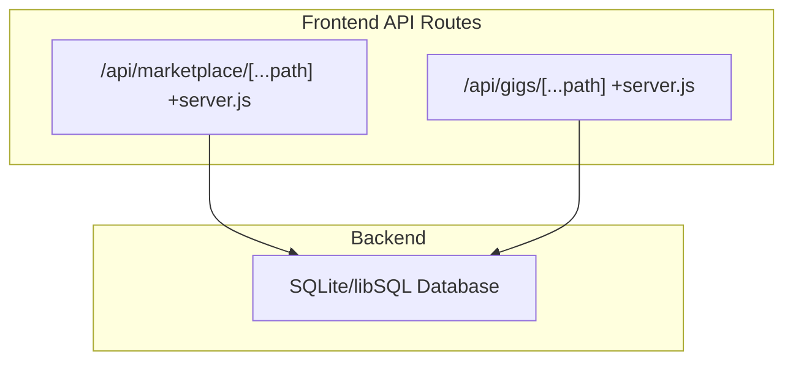
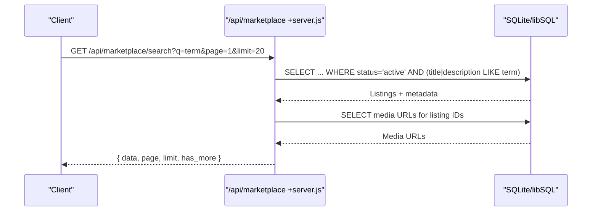
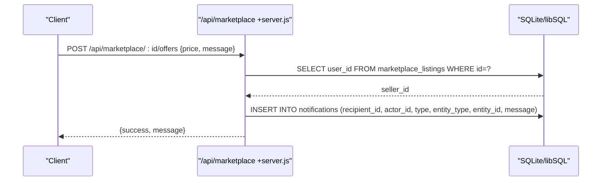
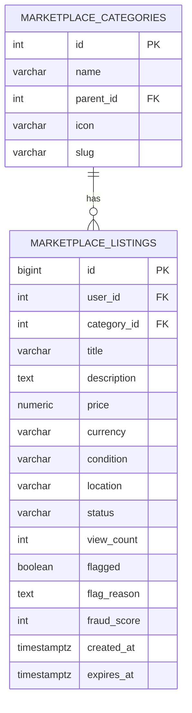
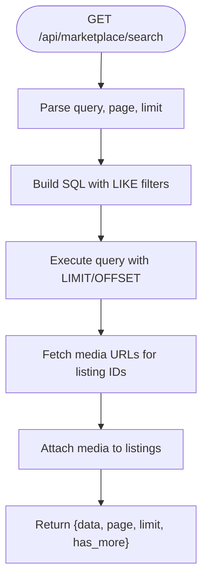
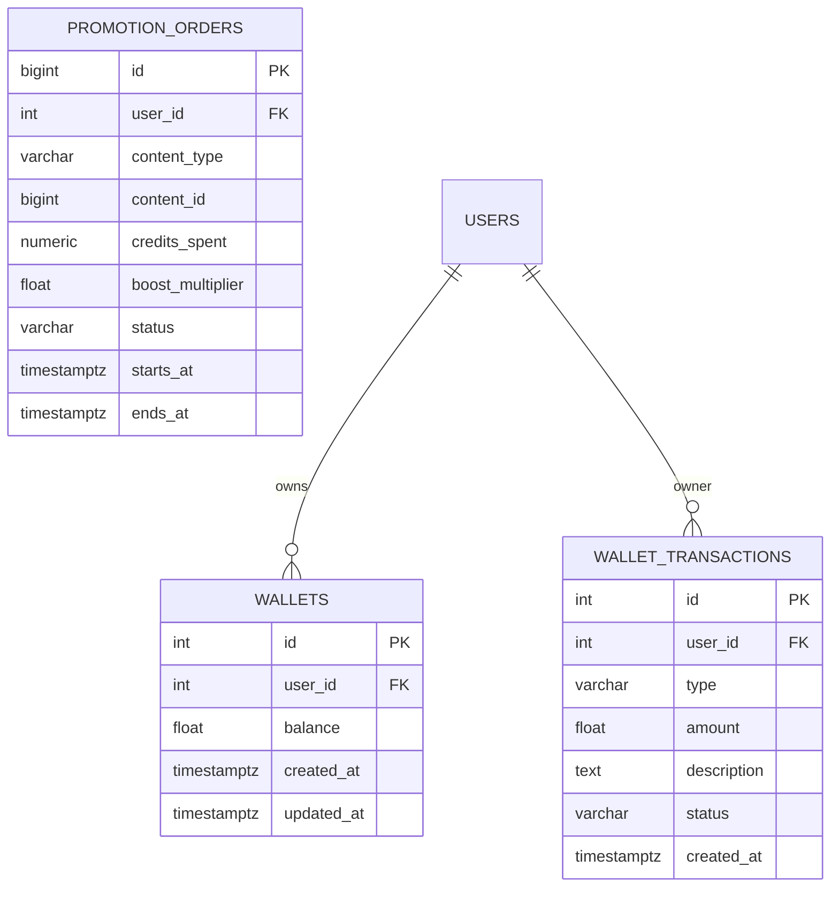
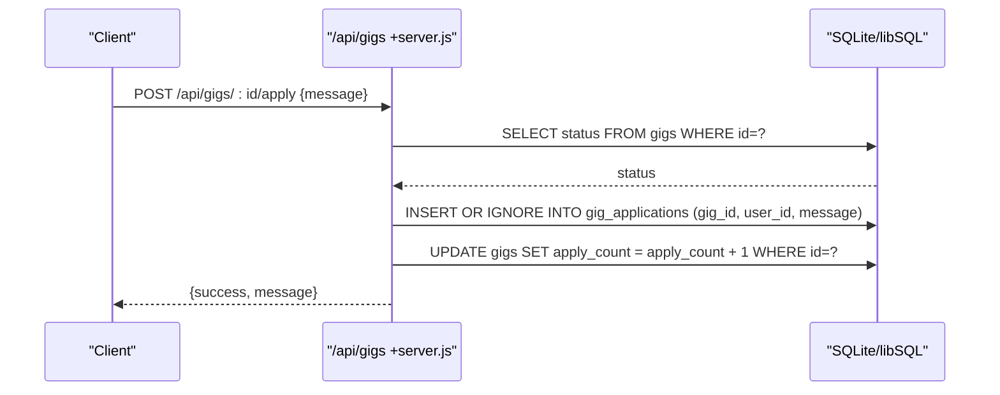
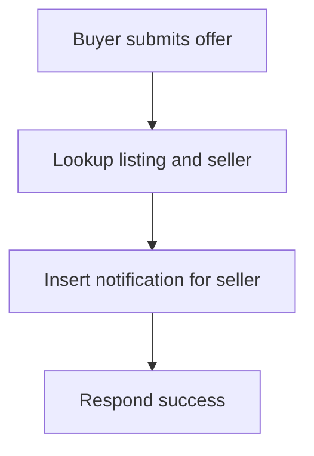
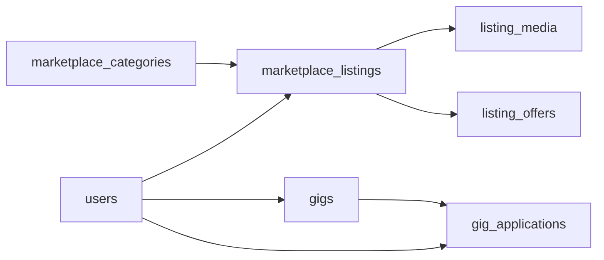

# Marketplace & Freelance Gigs

<cite>
**Referenced Files in This Document**
- [README.md](file://README.md)
- [ARCHITECTURE.md](file://ARCHITECTURE.md)
- [schema_sqlite.sql](file://schema_sqlite.sql)
- [001_schema.sql](file://migrations/001_schema.sql)
- [002_phase2.sql](file://migrations/002_phase2.sql)
- [marketplace +server.js](file://frontend/src/routes/api/marketplace/[...path]/+server.js)
- [gigs +server.js](file://frontend/src/routes/api/gigs/[...path]/+server.js)
</cite>

## Table of Contents
1. [Introduction](#introduction)
2. [Project Structure](#project-structure)
3. [Core Components](#core-components)
4. [Architecture Overview](#architecture-overview)
5. [Detailed Component Analysis](#detailed-component-analysis)
6. [Dependency Analysis](#dependency-analysis)
7. [Performance Considerations](#performance-considerations)
8. [Troubleshooting Guide](#troubleshooting-guide)
9. [Conclusion](#conclusion)
10. [Appendices](#appendices)

## Introduction
This document explains VSocial’s marketplace and freelance gig systems. It covers product listing management, categorization, search, offers, and reviews; the freelance gig lifecycle including posting, applications, offers, and reviews; and the backend API surface for e-commerce operations. It also outlines moderation, seller/buyer protection, dispute resolution, media handling, order fulfillment tracking, and financial transaction security considerations.

## Project Structure
The marketplace and gigs are implemented as SvelteKit server-side API routes backed by a relational schema. The frontend routes define REST-like endpoints under `/api/marketplace` and `/api/gigs`. The database schema defines normalized tables for categories, listings, media, offers, gigs, and applications.

**Diagram sources**
- [marketplace +server.js:1-127](file://frontend/src/routes/api/marketplace/[...path]/+server.js#L1-L127)
- [gigs +server.js:1-114](file://frontend/src/routes/api/gigs/[...path]/+server.js#L1-L114)

**Section sources**
- [README.md:12-20](file://README.md#L12-L20)
- [ARCHITECTURE.md:16-24](file://ARCHITECTURE.md#L16-L24)

## Core Components
- Marketplace domain
  - Categories, listings, media, offers, and optional reviews
- Freelance gigs domain
  - Gigs, applications, and offer handling
- Wallet and transactions
  - Wallets and transactions for financial operations
- Moderation and reporting
  - Reports and moderation queue for content safety

Key schema domains and representative tables:
- Marketplace: marketplace_categories, marketplace_listings, listing_media, listing_offers
- Gigs: gigs, gig_applications
- Wallet: wallets, wallet_transactions
- Moderation: reports

**Section sources**
- [001_schema.sql:356-403](file://migrations/001_schema.sql#L356-L403)
- [schema_sqlite.sql:306-341](file://schema_sqlite.sql#L306-L341)
- [schema_sqlite.sql:377-403](file://schema_sqlite.sql#L377-L403)
- [schema_sqlite.sql:355-372](file://schema_sqlite.sql#L355-L372)
- [schema_sqlite.sql:445-453](file://schema_sqlite.sql#L445-L453)

## Architecture Overview
The marketplace and gigs APIs are implemented as SvelteKit server routes. They:
- Authenticate requests via a helper that validates session/JWT
- Use prepared statements against a SQLite/libSQL database
- Enforce ownership and permissions for write operations
- Support pagination and filtering for listing retrieval

**Diagram sources**
- [marketplace +server.js:26-43](file://frontend/src/routes/api/marketplace/[...path]/+server.js#L26-L43)

**Section sources**
- [marketplace +server.js:1-127](file://frontend/src/routes/api/marketplace/[...path]/+server.js#L1-L127)

## Detailed Component Analysis

### Marketplace Product Listing Management
- Listing creation
  - Requires authenticated user, title, and price
  - Inserts listing with default status “active”
  - Optionally attaches media URLs in order
- Listing retrieval
  - Supports paginated catalog, per-ID lookup, categories, and search
  - Search filters by title/description for active listings
  - Returns media URLs grouped by listing ID
- Offers
  - Buyers can submit offers to a listing; system notifies the seller via a notification record
- Reviews
  - Endpoint exists for reviews; implementation is stubbed

**Diagram sources**
- [marketplace +server.js:98-108](file://frontend/src/routes/api/marketplace/[...path]/+server.js#L98-L108)

**Section sources**
- [marketplace +server.js:72-114](file://frontend/src/routes/api/marketplace/[...path]/+server.js#L72-L114)
- [001_schema.sql:364-403](file://migrations/001_schema.sql#L364-L403)

### Marketplace Categorization
- Categories are hierarchical with optional parent reference, slug, and icon
- Listings reference a category ID

**Diagram sources**
- [001_schema.sql:356-381](file://migrations/001_schema.sql#L356-L381)
- [001_schema.sql:364-381](file://migrations/001_schema.sql#L364-L381)

**Section sources**
- [001_schema.sql:356-381](file://migrations/001_schema.sql#L356-L381)

### Marketplace Search Functionality
- Full-text search uses LIKE on title and description for active listings
- Pagination supported via limit and offset
- Media URLs aggregated per listing for efficient client rendering

**Diagram sources**
- [marketplace +server.js:26-43](file://frontend/src/routes/api/marketplace/[...path]/+server.js#L26-L43)

**Section sources**
- [marketplace +server.js:26-43](file://frontend/src/routes/api/marketplace/[...path]/+server.js#L26-L43)

### Transaction Processing and Wallet Integration
- Wallets and transactions are modeled with dedicated tables
- Credit transactions track balances and reference IDs
- Promotion orders support boosting content visibility

**Diagram sources**
- [schema_sqlite.sql:355-372](file://schema_sqlite.sql#L355-L372)
- [001_schema.sql:456-503](file://migrations/001_schema.sql#L456-L503)

**Section sources**
- [schema_sqlite.sql:355-372](file://schema_sqlite.sql#L355-L372)
- [001_schema.sql:456-503](file://migrations/001_schema.sql#L456-L503)

### Freelance Gig System
- Posting gigs
  - Requires authenticated user, title, and description
  - Supports category, type, pricing range, and tags
- Applications
  - Users can apply to gigs; duplicates are prevented
  - Applies increment the gig’s application counter
- Retrieval
  - Supports paginated lists, filtering by category/type/query, and “my gigs” and “my applications”

**Diagram sources**
- [gigs +server.js:58-68](file://frontend/src/routes/api/gigs/[...path]/+server.js#L58-L68)

**Section sources**
- [gigs +server.js:50-80](file://frontend/src/routes/api/gigs/[...path]/+server.js#L50-L80)
- [002_phase2.sql:266-272](file://migrations/002_phase2.sql#L266-L272)

### Offer Handling in Marketplace
- Buyers can propose offers to listings
- Notification is generated for the seller upon offer submission
- Offers include price, optional message, and expiration support in later phase

**Diagram sources**
- [marketplace +server.js:98-108](file://frontend/src/routes/api/marketplace/[...path]/+server.js#L98-L108)
- [002_phase2.sql:266-272](file://migrations/002_phase2.sql#L266-L272)

**Section sources**
- [marketplace +server.js:98-108](file://frontend/src/routes/api/marketplace/[...path]/+server.js#L98-L108)
- [002_phase2.sql:266-272](file://migrations/002_phase2.sql#L266-L272)

### Review Systems
- Marketplace reviews endpoint exists but is currently a stub
- Gigs may support reviews in future iterations

**Section sources**
- [marketplace +server.js:110-112](file://frontend/src/routes/api/marketplace/[...path]/+server.js#L110-L112)

### API Endpoints Summary

- Marketplace
  - GET /api/marketplace/categories
  - GET /api/marketplace/search?q=&page=&limit=
  - GET /api/marketplace/:id
  - GET /api/marketplace
  - POST /api/marketplace (create listing)
  - POST /api/marketplace/:id/offers (submit offer)
  - POST /api/marketplace/:id/reviews (submit review)
  - DELETE /api/marketplace/:id (delete listing)

- Gigs
  - GET /api/gigs/:id
  - GET /api/gigs?my|mine=
  - GET /api/gigs?applications=
  - GET /api/gigs?category=&type=&q=&page=&limit=
  - POST /api/gigs (create gig)
  - POST /api/gigs/:id/apply (apply to gig)
  - PUT /api/gigs/:id (update gig)
  - DELETE /api/gigs/:id (delete gig)

**Section sources**
- [marketplace +server.js:17-127](file://frontend/src/routes/api/marketplace/[...path]/+server.js#L17-L127)
- [gigs +server.js:8-114](file://frontend/src/routes/api/gigs/[...path]/+server.js#L8-L114)

## Dependency Analysis
- Authentication dependency
  - Both marketplace and gigs routes depend on a shared authentication helper to enforce user identity
- Database schema dependencies
  - Marketplace listings reference categories and media
  - Offers reference listings and users
  - Gigs reference users and applications reference gigs and users
- Indexes and constraints
  - Active/expired listings indexed by status and created_at
  - Unique constraints prevent duplicate applications
  - Foreign keys maintain referential integrity

**Diagram sources**
- [001_schema.sql:356-403](file://migrations/001_schema.sql#L356-L403)
- [schema_sqlite.sql:377-403](file://schema_sqlite.sql#L377-L403)

**Section sources**
- [001_schema.sql:356-403](file://migrations/001_schema.sql#L356-L403)
- [schema_sqlite.sql:377-403](file://schema_sqlite.sql#L377-L403)

## Performance Considerations
- Prepared statements and parameterized queries are used across endpoints to avoid injection and improve cache locality
- Pagination via LIMIT and OFFSET prevents large payloads
- Indexes on frequently filtered columns (e.g., listing status, created timestamps) improve query performance
- Aggregation of media URLs per listing reduces round-trips

[No sources needed since this section provides general guidance]

## Troubleshooting Guide
- Authentication failures
  - Ensure the authentication helper is invoked before write operations; unauthorized deletions return appropriate errors
- Duplicate applications
  - Application insertion uses a constraint to ignore duplicates; verify the unique constraint is respected
- Offer submission
  - Verify listing exists and belongs to the correct seller; confirm notification insertion succeeds
- Search results
  - Confirm LIKE queries match expected terms and that pagination parameters are within accepted bounds

**Section sources**
- [marketplace +server.js:116-126](file://frontend/src/routes/api/marketplace/[...path]/+server.js#L116-L126)
- [gigs +server.js:58-68](file://frontend/src/routes/api/gigs/[...path]/+server.js#L58-L68)

## Conclusion
VSocial’s marketplace and gigs systems are built on a clear relational schema and straightforward SvelteKit API routes. Ownership checks, prepared statements, and pagination provide a solid foundation. The marketplace supports listings, categories, media, offers, and a stubbed review system, while the gigs system enables posting, applications, and updates. Future enhancements can focus on full review workflows, advanced moderation, and robust financial transaction security.

[No sources needed since this section summarizes without analyzing specific files]

## Appendices

### Practical Examples

- Marketplace moderation
  - Flagging listings and assigning fraud scores can be integrated into listing updates; moderation queue entries can be created for flagged items
  - Example flow: admin updates listing flagged=true and inserts a moderation queue record

- Seller/buyer protection
  - Use offers with expiration dates; notify buyers/sellers via the notifications table
  - Restrict listing deletion to owners; enforce non-self-application for gigs

- Dispute resolution
  - Reports table captures user-generated reports; moderation actions can restrict offending users or content
  - Banning and row-level security policies help enforce protections

- Media handling
  - Store media URLs in listing_media; fetch and attach per listing for efficient rendering
  - Validate upload sizes via system settings and enforce limits in uploads

- Order fulfillment tracking
  - Extend offers to include fulfillment status and timestamps
  - Introduce a fulfillment table linking offers to delivery metadata

- Financial transaction security
  - Use wallets and transactions to track credits; ensure atomic updates and rollback on failure
  - Add audit logs for high-value operations; enforce two-factor verification for sensitive actions

**Section sources**
- [001_schema.sql:408-451](file://migrations/001_schema.sql#L408-L451)
- [schema_sqlite.sql:355-372](file://schema_sqlite.sql#L355-L372)
- [schema_sqlite.sql:445-453](file://schema_sqlite.sql#L445-L453)
- [schema_sqlite.sql:679-701](file://schema_sqlite.sql#L679-L701)