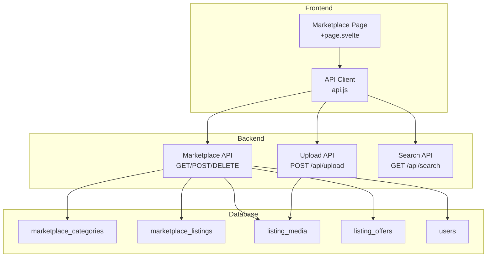
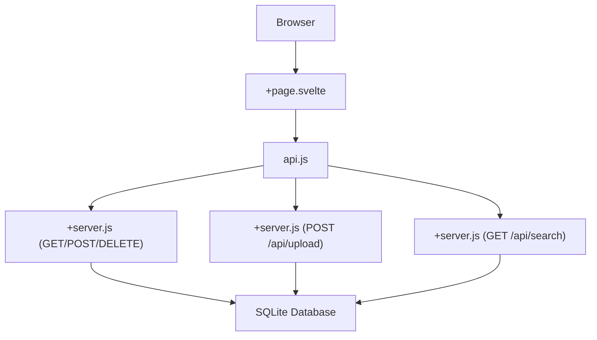
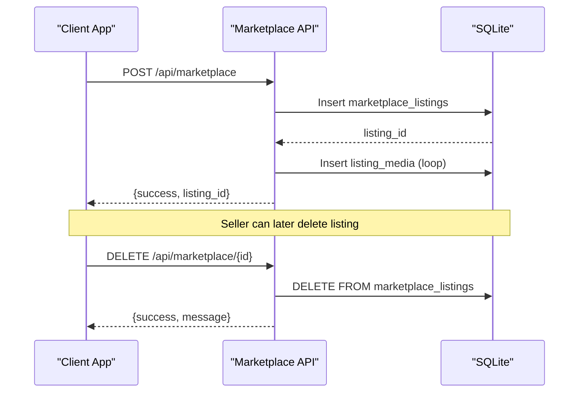
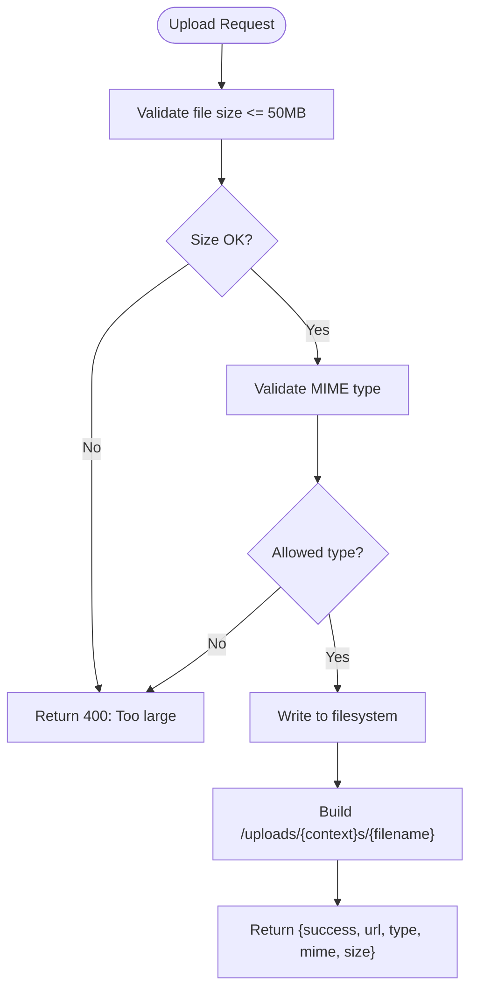
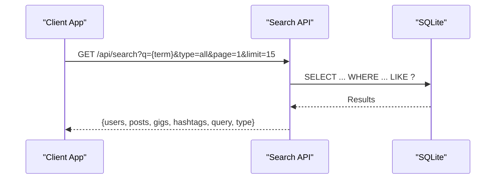
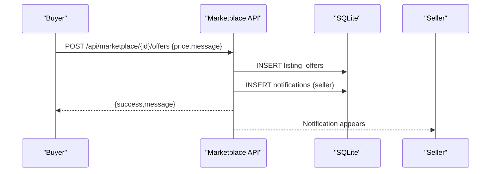
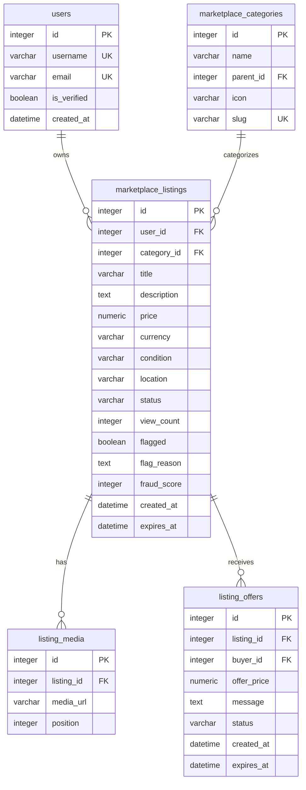
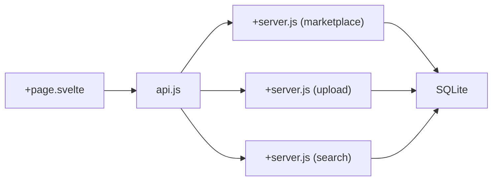

# Marketplace System

<cite>
**Referenced Files in This Document**
- [ARCHITECTURE.md](file://ARCHITECTURE.md)
- [schema_sqlite.sql](file://schema_sqlite.sql)
- [001_schema.sql](file://migrations/001_schema.sql)
- [002_phase2.sql](file://migrations/002_phase2.sql)
- [marketplace +server.js](file://frontend/src/routes/api/marketplace/[...path]/+server.js)
- [upload +server.js](file://frontend/src/routes/api/upload/+server.js)
- [search +server.js](file://frontend/src/routes/api/search/+server.js)
- [marketplace +page.svelte](file://frontend/src/routes/marketplace/+page.svelte)
- [api.js](file://frontend/src/lib/api.js)
</cite>

## Table of Contents
1. [Introduction](#introduction)
2. [Project Structure](#project-structure)
3. [Core Components](#core-components)
4. [Architecture Overview](#architecture-overview)
5. [Detailed Component Analysis](#detailed-component-analysis)
6. [Dependency Analysis](#dependency-analysis)
7. [Performance Considerations](#performance-considerations)
8. [Troubleshooting Guide](#troubleshooting-guide)
9. [Conclusion](#conclusion)

## Introduction
This document provides comprehensive documentation for VSocial's marketplace system. It covers product listing management (CRUD operations), media handling, categorization, search and discovery with filtering and pagination, the e-commerce workflow from listing creation to purchase completion, API endpoints with request/response schemas and authentication requirements, moderation and verification mechanisms, and technical aspects such as image optimization, storage management, and performance considerations for media-heavy content.

## Project Structure
The marketplace system spans frontend SvelteKit routes, backend API handlers, and database schemas. Key areas include:
- API endpoints under `/api/marketplace` for listing management, offers, and search
- Media upload endpoint under `/api/upload` for secure file uploads
- Frontend marketplace page implementing filters, sorting, and pagination
- Database schema defining marketplace categories, listings, and related entities

**Diagram sources**
- [marketplace +page.svelte](file://frontend/src/routes/marketplace/+page.svelte)
- [api.js](file://frontend/src/lib/api.js)
- [marketplace +server.js](file://frontend/src/routes/api/marketplace/[...path]/+server.js)
- [upload +server.js](file://frontend/src/routes/api/upload/+server.js)
- [search +server.js](file://frontend/src/routes/api/search/+server.js)
- [schema_sqlite.sql](file://schema_sqlite.sql)

**Section sources**
- [ARCHITECTURE.md](file://ARCHITECTURE.md)
- [schema_sqlite.sql](file://schema_sqlite.sql)
- [001_schema.sql](file://migrations/001_schema.sql)
- [002_phase2.sql](file://migrations/002_phase2.sql)

## Core Components
- Marketplace API: Provides listing catalog, search, CRUD operations, offers, and reviews
- Upload API: Handles secure file uploads with size/type validation and context scoping
- Frontend Marketplace Page: Implements client-side filtering, sorting, pagination, and user actions
- Database Schema: Defines marketplace categories, listings, media, offers, and related entities

Key implementation references:
- Marketplace API handler: [marketplace +server.js](file://frontend/src/routes/api/marketplace/[...path]/+server.js)
- Upload API handler: [upload +server.js](file://frontend/src/routes/api/upload/+server.js)
- Frontend marketplace page: [marketplace +page.svelte](file://frontend/src/routes/marketplace/+page.svelte)
- API client bindings: [api.js](file://frontend/src/lib/api.js)
- Database schema: [schema_sqlite.sql](file://schema_sqlite.sql)

**Section sources**
- [marketplace +server.js](file://frontend/src/routes/api/marketplace/[...path]/+server.js)
- [upload +server.js](file://frontend/src/routes/api/upload/+server.js)
- [marketplace +page.svelte](file://frontend/src/routes/marketplace/+page.svelte)
- [api.js](file://frontend/src/lib/api.js)
- [schema_sqlite.sql](file://schema_sqlite.sql)

## Architecture Overview
The marketplace system follows a layered architecture:
- Presentation Layer: SvelteKit page component renders listings, handles user interactions, and invokes API client methods
- Application Layer: SvelteKit server routes implement marketplace, upload, and search endpoints
- Data Access Layer: Direct SQL queries against SQLite with prepared statements
- Storage Layer: Filesystem-based uploads with validated MIME types and size limits

**Diagram sources**
- [marketplace +page.svelte](file://frontend/src/routes/marketplace/+page.svelte)
- [api.js](file://frontend/src/lib/api.js)
- [marketplace +server.js](file://frontend/src/routes/api/marketplace/[...path]/+server.js)
- [upload +server.js](file://frontend/src/routes/api/upload/+server.js)
- [search +server.js](file://frontend/src/routes/api/search/+server.js)

## Detailed Component Analysis

### Product Listing Management
The marketplace supports listing creation, retrieval, updates, and deletion with media associations.

- Listing Creation
  - Endpoint: POST /api/marketplace
  - Authentication: Required
  - Request body fields:
    - title (required)
    - description (optional)
    - price (required)
    - category_id (optional, defaults to 1)
    - condition (optional, defaults to "new")
    - media_urls (array of URLs, optional)
  - Response: { success: true, listing_id: number }
  - Implementation reference: [marketplace +server.js](file://frontend/src/routes/api/marketplace/[...path]/+server.js)

- Listing Retrieval
  - Catalog: GET /api/marketplace?page=1&limit=20
    - Pagination: page (default 1), limit (min 1, max 50)
    - Response: { data: [listing], page: number, limit: number, has_more: boolean }
  - Single Listing: GET /api/marketplace/{id}
    - Response: listing object with media array and image_url
  - Categories: GET /api/marketplace/categories
    - Response: array of categories
  - Implementation reference: [marketplace +server.js](file://frontend/src/routes/api/marketplace/[...path]/+server.js)

- Listing Deletion
  - Endpoint: DELETE /api/marketplace/{id}
  - Authentication: Required
  - Authorization: Only listing owner can delete
  - Response: { success: true, message: string }
  - Implementation reference: [marketplace +server.js](file://frontend/src/routes/api/marketplace/[...path]/+server.js)

- Offers and Reviews
  - Offers: POST /api/marketplace/{id}/offers
    - Request body: { price: number, message?: string }
    - On success, a notification is inserted for the seller
  - Reviews: POST /api/marketplace/{id}/reviews
    - Request body: { rating: number, comment?: string }
    - Response: { success: true, message: string }
  - Implementation reference: [marketplace +server.js](file://frontend/src/routes/api/marketplace/[...path]/+server.js)

**Diagram sources**
- [marketplace +server.js](file://frontend/src/routes/api/marketplace/[...path]/+server.js)

**Section sources**
- [marketplace +server.js](file://frontend/src/routes/api/marketplace/[...path]/+server.js)

### Media Handling and Storage
The upload system supports secure file uploads with validation and context scoping.

- Endpoint: POST /api/upload
- Authentication: Required
- Validation:
  - Maximum file size: 50 MB
  - Allowed MIME types: image/jpeg, image/png, image/webp, image/gif, audio/webm, audio/mp4, audio/mpeg, audio/ogg, video/mp4, video/webm
  - Context parameter: one of avatar, cover, chat, listing, post (defaults to chat)
- Response: { success: true, url: string, type: string, mime: string, size: number }
- Implementation reference: [upload +server.js](file://frontend/src/routes/api/upload/+server.js)

Frontend integration:
- The marketplace page allows selecting a file and uploading via the upload API, then sets the selected media URL for listing creation
- Implementation reference: [marketplace +page.svelte](file://frontend/src/routes/marketplace/+page.svelte)

**Diagram sources**
- [upload +server.js](file://frontend/src/routes/api/upload/+server.js)

**Section sources**
- [upload +server.js](file://frontend/src/routes/api/upload/+server.js)
- [marketplace +page.svelte](file://frontend/src/routes/marketplace/+page.svelte)

### Search and Discovery
The marketplace integrates with a unified search API supporting users, posts, gigs, and hashtags.

- Endpoint: GET /api/search?q=query&type=all|users|posts|gigs|hashtags&page=1&limit=15
- Behavior:
  - Empty query returns trending users, popular hashtags, and featured posts
  - Otherwise, returns paginated results for requested types
- Implementation reference: [search +server.js](file://frontend/src/routes/api/search/+server.js)

Frontend integration:
- The marketplace page exposes a search box and applies client-side filtering based on title/description and category/price/sort
- Implementation reference: [marketplace +page.svelte](file://frontend/src/routes/marketplace/+page.svelte)

**Diagram sources**
- [search +server.js](file://frontend/src/routes/api/search/+server.js)

**Section sources**
- [search +server.js](file://frontend/src/routes/api/search/+server.js)
- [marketplace +page.svelte](file://frontend/src/routes/marketplace/+page.svelte)

### E-commerce Workflow
The marketplace workflow includes listing creation, browsing, offer submission, and notifications.

- Listing Creation: POST /api/marketplace with title, price, category, and optional media URLs
- Offer Submission: POST /api/marketplace/{id}/offers with offer price and optional message
- Notification: On offer submission, a notification is inserted for the seller
- Review Submission: POST /api/marketplace/{id}/reviews (placeholder response)
- Implementation references:
  - [marketplace +server.js](file://frontend/src/routes/api/marketplace/[...path]/+server.js)
  - [marketplace +page.svelte](file://frontend/src/routes/marketplace/+page.svelte)

**Diagram sources**
- [marketplace +server.js](file://frontend/src/routes/api/marketplace/[...path]/+server.js)

**Section sources**
- [marketplace +server.js](file://frontend/src/routes/api/marketplace/[...path]/+server.js)
- [marketplace +page.svelte](file://frontend/src/routes/marketplace/+page.svelte)

### API Endpoints Summary
- GET /api/marketplace
  - Purpose: Retrieve paginated marketplace listings
  - Query params: page (default 1), limit (min 1, max 50)
  - Response: { data: [listing], page, limit, has_more }
- GET /api/marketplace/categories
  - Purpose: Retrieve marketplace categories
  - Response: [category]
- GET /api/marketplace/search?q=&page=&limit=
  - Purpose: Search listings by title/description
  - Response: { data: [listing], page, limit, has_more }
- GET /api/marketplace/{id}
  - Purpose: Retrieve single listing with media
  - Response: listing object with media array and image_url
- POST /api/marketplace
  - Purpose: Create a new listing
  - Body: { title, description?, price, category_id?, condition?, media_urls? }
  - Response: { success, listing_id }
- POST /api/marketplace/{id}/offers
  - Purpose: Submit an offer to a listing
  - Body: { price, message? }
  - Response: { success, message }
- POST /api/marketplace/{id}/reviews
  - Purpose: Submit a review
  - Body: { rating, comment? }
  - Response: { success, message }
- DELETE /api/marketplace/{id}
  - Purpose: Delete a listing (owner only)
  - Response: { success, message }
- POST /api/upload
  - Purpose: Upload media files
  - Form fields: file (required), context (avatar/cover/chat/listing/post)
  - Response: { success, url, type, mime, size }

Authentication:
- All marketplace and upload endpoints require authentication via JWT cookies
- Reference: [ARCHITECTURE.md](file://ARCHITECTURE.md)

**Section sources**
- [marketplace +server.js](file://frontend/src/routes/api/marketplace/[...path]/+server.js)
- [upload +server.js](file://frontend/src/routes/api/upload/+server.js)
- [ARCHITECTURE.md](file://ARCHITECTURE.md)

### Data Models
The marketplace relies on the following relational schema:

**Diagram sources**
- [schema_sqlite.sql](file://schema_sqlite.sql)
- [001_schema.sql](file://migrations/001_schema.sql)
- [002_phase2.sql](file://migrations/002_phase2.sql)

**Section sources**
- [schema_sqlite.sql](file://schema_sqlite.sql)
- [001_schema.sql](file://migrations/001_schema.sql)
- [002_phase2.sql](file://migrations/002_phase2.sql)

## Dependency Analysis
- Frontend depends on:
  - API client module for marketplace endpoints
  - Upload API for media selection and preview
  - Optional search API for global discovery
- Backend endpoints depend on:
  - SQLite database with marketplace and user tables
  - Filesystem for uploads
- Authentication:
  - JWT cookies enforced via middleware
  - Authenticated routes restrict access to authorized users

**Diagram sources**
- [marketplace +page.svelte](file://frontend/src/routes/marketplace/+page.svelte)
- [api.js](file://frontend/src/lib/api.js)
- [marketplace +server.js](file://frontend/src/routes/api/marketplace/[...path]/+server.js)
- [upload +server.js](file://frontend/src/routes/api/upload/+server.js)
- [search +server.js](file://frontend/src/routes/api/search/+server.js)

**Section sources**
- [marketplace +page.svelte](file://frontend/src/routes/marketplace/+page.svelte)
- [api.js](file://frontend/src/lib/api.js)
- [marketplace +server.js](file://frontend/src/routes/api/marketplace/[...path]/+server.js)
- [upload +server.js](file://frontend/src/routes/api/upload/+server.js)
- [search +server.js](file://frontend/src/routes/api/search/+server.js)

## Performance Considerations
- Database indexing:
  - Listings indexed by category, status, and created_at for efficient filtering and pagination
  - Reports and moderation tables include indexes for flagged content and queue management
- Prepared statements:
  - All endpoints use prepared statements to prevent SQL injection and improve query plan reuse
- Pagination:
  - Limits set to prevent oversized result sets (e.g., max 50 per page)
- Media handling:
  - File size validation prevents excessive storage usage
  - Context-scoped upload folders help organize storage
- Frontend:
  - Client-side filtering reduces unnecessary network requests
  - Skeleton loaders improve perceived performance during initial load

[No sources needed since this section provides general guidance]

## Troubleshooting Guide
Common issues and resolutions:
- Authentication errors:
  - Ensure JWT cookie is present and valid for protected endpoints
  - Reference: [ARCHITECTURE.md](file://ARCHITECTURE.md)
- File upload failures:
  - Verify file size does not exceed 50 MB and MIME type is allowed
  - Confirm context parameter is one of avatar, cover, chat, listing, post
  - Reference: [upload +server.js](file://frontend/src/routes/api/upload/+server.js)
- Listing not found:
  - Verify listing ID exists and belongs to the authenticated user for deletion
  - Reference: [marketplace +server.js](file://frontend/src/routes/api/marketplace/[...path]/+server.js)
- Exceeded rate limits:
  - Respect pagination limits and avoid excessive polling
  - Reference: [marketplace +server.js](file://frontend/src/routes/api/marketplace/[...path]/+server.js)

**Section sources**
- [ARCHITECTURE.md](file://ARCHITECTURE.md)
- [upload +server.js](file://frontend/src/routes/api/upload/+server.js)
- [marketplace +server.js](file://frontend/src/routes/api/marketplace/[...path]/+server.js)

## Conclusion
VSocial’s marketplace system provides a robust foundation for product listings, media handling, and discovery. Its layered architecture, strict authentication, and database-first design enable scalable growth while maintaining performance. The frontend integrates seamlessly with backend APIs to deliver a responsive shopping experience, supported by practical moderation and verification signals embedded in the schema.