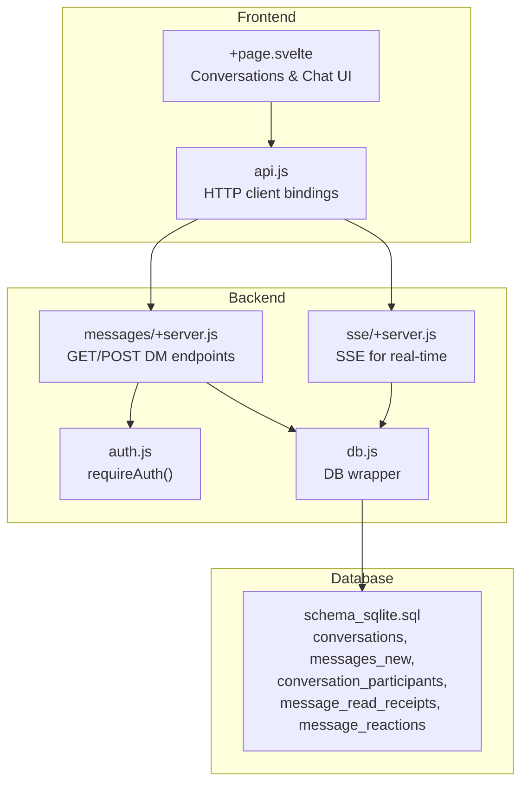
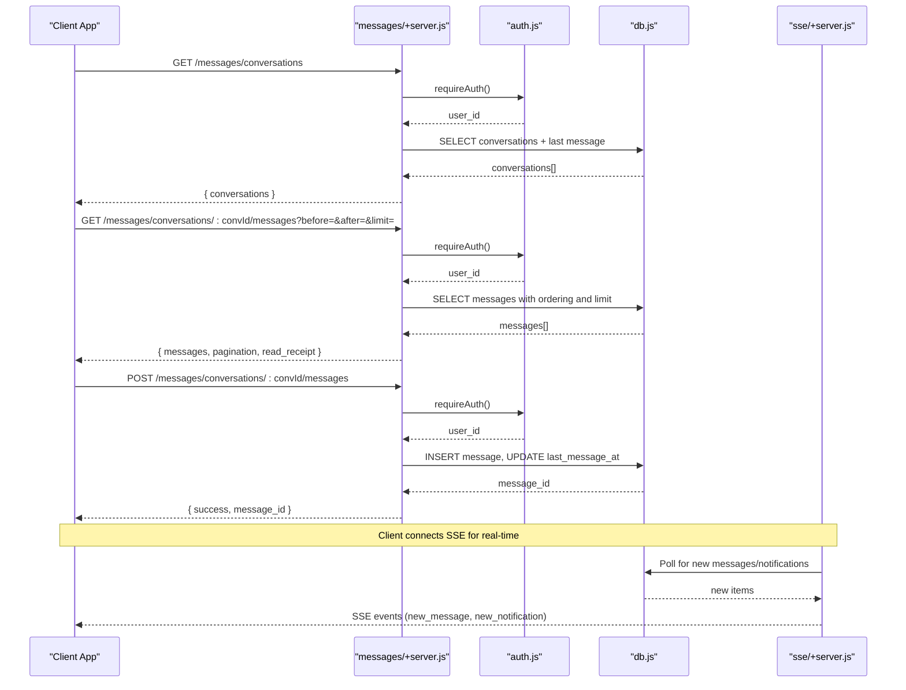
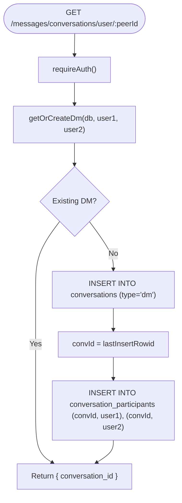
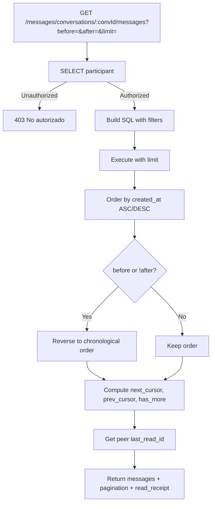
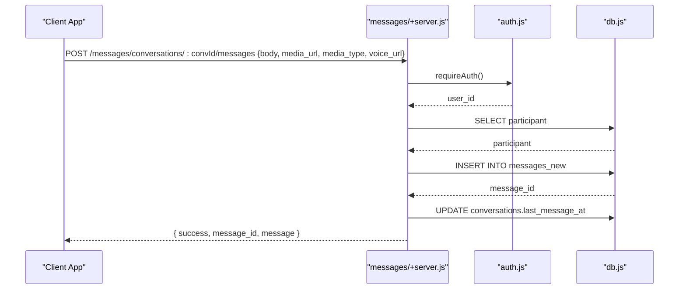
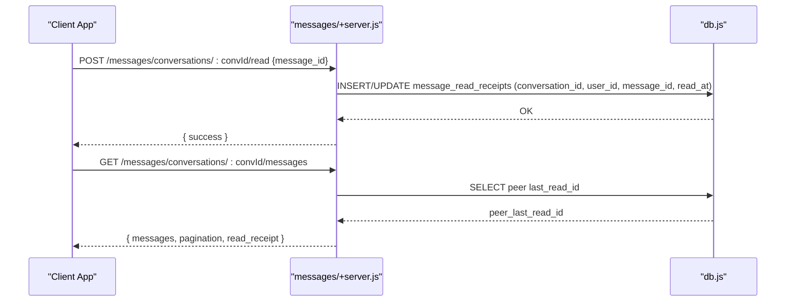
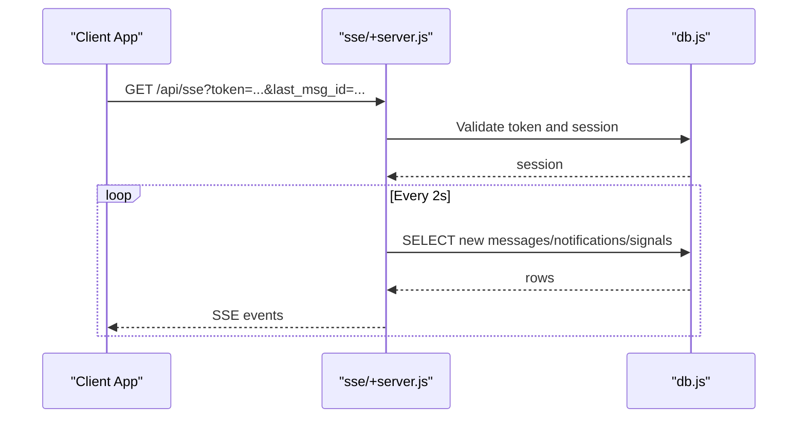
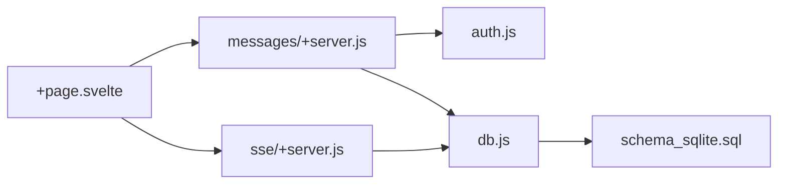

# Direct Messaging

<cite>
**Referenced Files in This Document**
- [messages/+server.js](file://frontend/src/routes/api/messages/+server.js)
- [sse/+server.js](file://frontend/src/routes/api/sse/+server.js)
- [schema_sqlite.sql](file://schema_sqlite.sql)
- [db.js](file://frontend/src/lib/server/db.js)
- [auth.js](file://frontend/src/lib/server/auth.js)
- [+page.svelte](file://frontend/src/routes/messages/+page.svelte)
- [api.js](file://frontend/src/lib/api.js)
</cite>

## Table of Contents
1. [Introduction](#introduction)
2. [Project Structure](#project-structure)
3. [Core Components](#core-components)
4. [Architecture Overview](#architecture-overview)
5. [Detailed Component Analysis](#detailed-component-analysis)
6. [Dependency Analysis](#dependency-analysis)
7. [Performance Considerations](#performance-considerations)
8. [Troubleshooting Guide](#troubleshooting-guide)
9. [Conclusion](#conclusion)

## Introduction
This document describes VSocial’s direct messaging (DM) system. It covers how conversations are created and managed, how message CRUD operations are handled (including text, media, and voice), how cursor-based pagination works for retrieving message history, how read receipts and last-message tracking are implemented, and how real-time delivery is achieved. It also documents the API surface for conversation listing, message retrieval, and real-time message sending, along with security considerations for access control and participant verification.

## Project Structure
The DM system spans backend endpoints, database schema, and frontend integration:
- Backend endpoints: messages API and server-sent events (SSE) for real-time updates
- Database schema: conversations, participants, messages, read receipts, and reactions
- Frontend: UI for conversations and chat, API bindings, and real-time integration

**Diagram sources**
- [messages/+server.js:1-240](file://frontend/src/routes/api/messages/+server.js#L1-L240)
- [sse/+server.js:1-185](file://frontend/src/routes/api/sse/+server.js#L1-L185)
- [schema_sqlite.sql:235-283](file://schema_sqlite.sql#L235-L283)
- [db.js:1-209](file://frontend/src/lib/server/db.js#L1-L209)
- [+page.svelte:1-800](file://frontend/src/routes/messages/+page.svelte#L1-L800)
- [api.js:203-217](file://frontend/src/lib/api.js#L203-L217)

**Section sources**
- [messages/+server.js:1-240](file://frontend/src/routes/api/messages/+server.js#L1-L240)
- [sse/+server.js:1-185](file://frontend/src/routes/api/sse/+server.js#L1-L185)
- [schema_sqlite.sql:235-283](file://schema_sqlite.sql#L235-L283)
- [db.js:1-209](file://frontend/src/lib/server/db.js#L1-L209)
- [+page.svelte:1-800](file://frontend/src/routes/messages/+page.svelte#L1-L800)
- [api.js:203-217](file://frontend/src/lib/api.js#L203-L217)

## Core Components
- Conversation creation and participant management
  - Automatic DM conversation creation between two users
  - Participant verification via conversation_participants
- Message CRUD
  - Create: text, media, and voice attachments
  - Retrieve: cursor-based pagination with before/after cursors
  - Read receipts: per-user last-read tracking
  - Reactions: emoji reactions per message
- Real-time delivery
  - SSE endpoint for new messages and notifications
- Security
  - JWT-based authentication and session validation
  - Endpoint-level participant checks

**Section sources**
- [messages/+server.js:8-22](file://frontend/src/routes/api/messages/+server.js#L8-L22)
- [messages/+server.js:74-146](file://frontend/src/routes/api/messages/+server.js#L74-L146)
- [messages/+server.js:149-239](file://frontend/src/routes/api/messages/+server.js#L149-L239)
- [sse/+server.js:9-35](file://frontend/src/routes/api/sse/+server.js#L9-L35)
- [auth.js:15-44](file://frontend/src/lib/server/auth.js#L15-L44)

## Architecture Overview
The DM system is composed of:
- HTTP endpoints for conversations and messages
- Database tables for conversations, participants, messages, read receipts, and reactions
- SSE for real-time updates
- Frontend UI that lists conversations, renders messages, and handles pagination

**Diagram sources**
- [messages/+server.js:24-146](file://frontend/src/routes/api/messages/+server.js#L24-L146)
- [messages/+server.js:149-179](file://frontend/src/routes/api/messages/+server.js#L149-L179)
- [sse/+server.js:36-152](file://frontend/src/routes/api/sse/+server.js#L36-L152)
- [auth.js:15-44](file://frontend/src/lib/server/auth.js#L15-L44)
- [db.js:169-172](file://frontend/src/lib/server/db.js#L169-L172)

## Detailed Component Analysis

### Conversation Creation and Participant Management
- Automatic DM creation
  - Given two user IDs, the endpoint finds an existing dm conversation or creates a new one and inserts both participants
- Participant verification
  - Every message retrieval and read operation validates that the requesting user belongs to the conversation

**Diagram sources**
- [messages/+server.js:8-22](file://frontend/src/routes/api/messages/+server.js#L8-L22)
- [messages/+server.js:67-72](file://frontend/src/routes/api/messages/+server.js#L67-L72)

**Section sources**
- [messages/+server.js:8-22](file://frontend/src/routes/api/messages/+server.js#L8-L22)
- [messages/+server.js:67-72](file://frontend/src/routes/api/messages/+server.js#L67-L72)

### Message Retrieval and Cursor-Based Pagination
- Endpoint: GET /messages/conversations/:convId/messages
- Behavior:
  - Validates participant
  - Supports before/after cursors and limit
  - Orders by created_at ascending or descending depending on cursor direction
  - Returns ordered messages and pagination cursors (next_cursor, prev_cursor, has_more, limit)
  - Includes peer’s last read message id for read receipt visualization

**Diagram sources**
- [messages/+server.js:74-146](file://frontend/src/routes/api/messages/+server.js#L74-L146)

**Section sources**
- [messages/+server.js:74-146](file://frontend/src/routes/api/messages/+server.js#L74-L146)

### Message Creation (Text, Media, Voice)
- Endpoint: POST /messages/conversations/:convId/messages
- Behavior:
  - Validates participant
  - Accepts body, media_url, media_type, voice_url
  - Inserts message into messages_new
  - Updates conversation last_message_at
  - Broadcasts notifications to peers
  - Returns success and message metadata

**Diagram sources**
- [messages/+server.js:149-179](file://frontend/src/routes/api/messages/+server.js#L149-L179)
- [auth.js:15-44](file://frontend/src/lib/server/auth.js#L15-L44)
- [db.js:169-172](file://frontend/src/lib/server/db.js#L169-L172)

**Section sources**
- [messages/+server.js:149-179](file://frontend/src/routes/api/messages/+server.js#L149-L179)

### Read Receipts and Last Message Tracking
- Read receipts
  - Endpoint: POST /messages/conversations/:convId/read
  - Stores or updates a per-user, per-conversation last read message id with read_at timestamp
- Last message tracking
  - conversations.last_message_at is updated upon new message insertion
- Peer last read id
  - Returned during message list retrieval for UI indicators

**Diagram sources**
- [messages/+server.js:187-204](file://frontend/src/routes/api/messages/+server.js#L187-L204)
- [messages/+server.js:220-237](file://frontend/src/routes/api/messages/+server.js#L220-L237)
- [messages/+server.js:112-125](file://frontend/src/routes/api/messages/+server.js#L112-L125)

**Section sources**
- [messages/+server.js:187-204](file://frontend/src/routes/api/messages/+server.js#L187-L204)
- [messages/+server.js:220-237](file://frontend/src/routes/api/messages/+server.js#L220-L237)
- [messages/+server.js:112-125](file://frontend/src/routes/api/messages/+server.js#L112-L125)

### Reactions
- Endpoint: POST /messages/:msgId/reactions
- Behavior:
  - Upserts a reaction for the current user and emoji
  - Ignores constraint violations for repeated reactions

**Section sources**
- [messages/+server.js:206-218](file://frontend/src/routes/api/messages/+server.js#L206-L218)

### Real-Time Delivery (SSE)
- Endpoint: GET /api/sse?token=...&last_msg_id=...
- Behavior:
  - Validates JWT and session
  - Periodically polls for new messages and notifications
  - Emits SSE events: connected, new_message, new_notification, rtc_signal
  - Automatically disconnects after a fixed interval

**Diagram sources**
- [sse/+server.js:9-35](file://frontend/src/routes/api/sse/+server.js#L9-L35)
- [sse/+server.js:63-173](file://frontend/src/routes/api/sse/+server.js#L63-L173)

**Section sources**
- [sse/+server.js:9-35](file://frontend/src/routes/api/sse/+server.js#L9-L35)
- [sse/+server.js:63-173](file://frontend/src/routes/api/sse/+server.js#L63-L173)

### Frontend Integration
- Conversation listing and selection
- Message list with cursor-based pagination
- Sending text and media messages
- Real-time updates via SSE
- Read receipt visualization and reactions

**Section sources**
- [+page.svelte:134-181](file://frontend/src/routes/messages/+page.svelte#L134-L181)
- [+page.svelte:183-217](file://frontend/src/routes/messages/+page.svelte#L183-L217)
- [+page.svelte:219-263](file://frontend/src/routes/messages/+page.svelte#L219-L263)
- [api.js:203-217](file://frontend/src/lib/api.js#L203-L217)

## Dependency Analysis
- Backend endpoints depend on:
  - Authentication middleware for JWT/session validation
  - Database wrapper for prepared statements and transactions
- Database schema defines:
  - Foreign keys and indexes for performance and referential integrity
- Frontend depends on:
  - API bindings for HTTP requests
  - SSE for real-time updates

**Diagram sources**
- [messages/+server.js:1-240](file://frontend/src/routes/api/messages/+server.js#L1-L240)
- [sse/+server.js:1-185](file://frontend/src/routes/api/sse/+server.js#L1-L185)
- [db.js:1-209](file://frontend/src/lib/server/db.js#L1-L209)
- [auth.js:1-92](file://frontend/src/lib/server/auth.js#L1-L92)
- [schema_sqlite.sql:235-283](file://schema_sqlite.sql#L235-L283)
- [+page.svelte:1-800](file://frontend/src/routes/messages/+page.svelte#L1-L800)

**Section sources**
- [messages/+server.js:1-240](file://frontend/src/routes/api/messages/+server.js#L1-L240)
- [sse/+server.js:1-185](file://frontend/src/routes/api/sse/+server.js#L1-L185)
- [db.js:1-209](file://frontend/src/lib/server/db.js#L1-L209)
- [auth.js:1-92](file://frontend/src/lib/server/auth.js#L1-L92)
- [schema_sqlite.sql:235-283](file://schema_sqlite.sql#L235-L283)
- [+page.svelte:1-800](file://frontend/src/routes/messages/+page.svelte#L1-L800)

## Performance Considerations
- Cursor-based pagination avoids OFFSET for large datasets; queries are bounded by limit and ordered by created_at
- Indexes on messages_new(conversation_id, created_at DESC) and conversation_participants(user_id) improve query performance
- Using SQLite WAL mode and pragmas improves concurrency and durability
- SSE polling interval balances responsiveness and resource usage

[No sources needed since this section provides general guidance]

## Troubleshooting Guide
- 401 Unauthorized
  - Missing or invalid JWT token; ensure token is present and not expired
- 403 Forbidden
  - Requesting user is not a participant of the conversation
- 400 Bad Request
  - Missing required fields when sending messages (body/media/voice)
- SSE disconnections
  - Verify token validity and session freshness; SSE auto-disconnects after a fixed period

**Section sources**
- [messages/+server.js:77-78](file://frontend/src/routes/api/messages/+server.js#L77-L78)
- [messages/+server.js:157-158](file://frontend/src/routes/api/messages/+server.js#L157-L158)
- [messages/+server.js:165-165](file://frontend/src/routes/api/messages/+server.js#L165-L165)
- [sse/+server.js:12-34](file://frontend/src/routes/api/sse/+server.js#L12-L34)

## Conclusion
VSocial’s DM system provides robust, secure, and real-time messaging with automatic conversation creation, flexible message CRUD, and efficient cursor-based pagination. Read receipts and last-message tracking enhance user experience, while SSE ensures timely delivery of new messages and notifications. The architecture cleanly separates concerns between frontend UI, backend endpoints, and database schema, enabling scalability and maintainability.