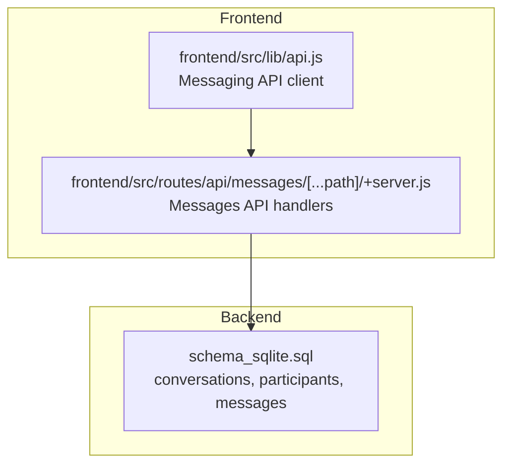
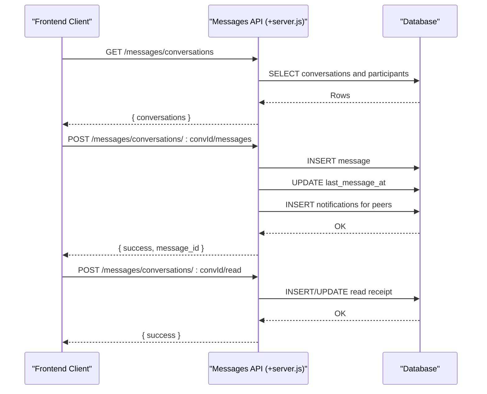
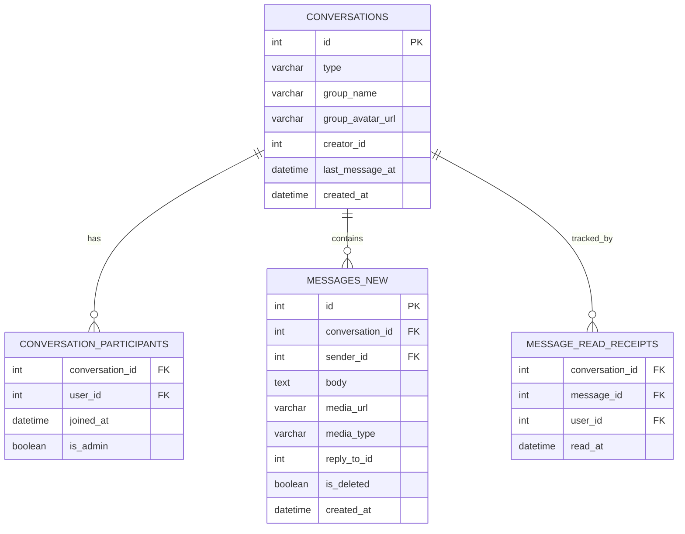
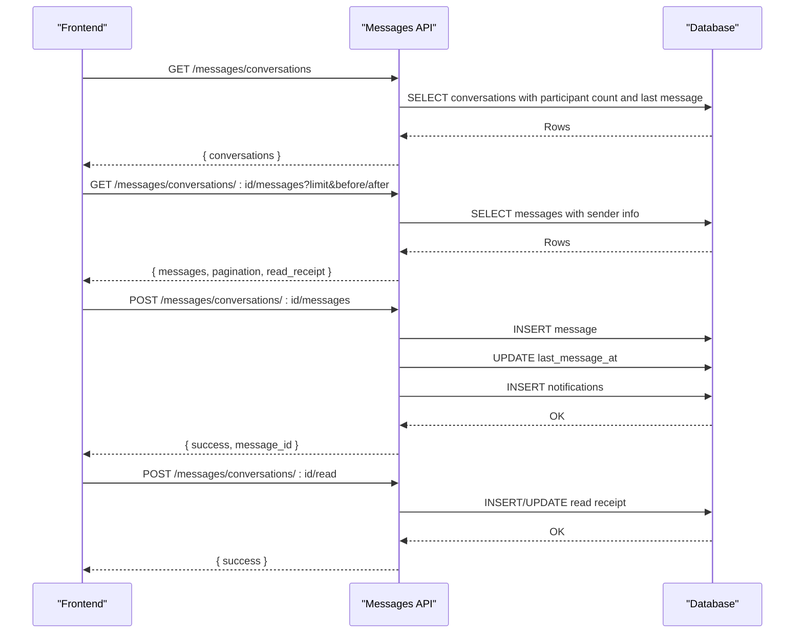
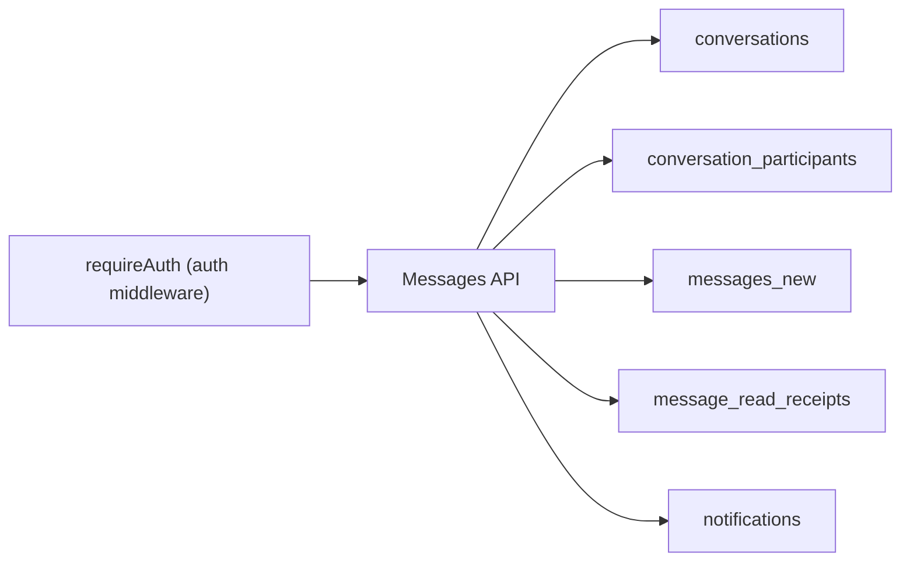

# Group Chats

<cite>
**Referenced Files in This Document**
- [api.js](file://frontend/src/lib/api.js)
- [messages.server.js](file://frontend/src/routes/api/messages/[...path]/+server.js)
- [schema_sqlite.sql](file://schema_sqlite.sql)
</cite>

## Table of Contents
1. [Introduction](#introduction)
2. [Project Structure](#project-structure)
3. [Core Components](#core-components)
4. [Architecture Overview](#architecture-overview)
5. [Detailed Component Analysis](#detailed-component-analysis)
6. [Dependency Analysis](#dependency-analysis)
7. [Performance Considerations](#performance-considerations)
8. [Troubleshooting Guide](#troubleshooting-guide)
9. [Conclusion](#conclusion)

## Introduction
This document describes VSocial’s group chat functionality as implemented in the current codebase. It covers how group conversations are represented in the database, how the backend exposes messaging APIs for group contexts, and how the frontend interacts with those APIs. It also documents participant management, role-based permissions, metadata handling (names, avatars, descriptions), and group-wide read receipts. Finally, it outlines API specifications for group CRUD operations, member management, and message distribution, along with scalability considerations and moderation tools.

## Project Structure
The group chat implementation spans three primary areas:
- Database schema defines conversations, participants, and messages with support for group types.
- Backend API routes expose endpoints for listing conversations, sending messages, and managing read receipts.
- Frontend API client provides typed wrappers for messaging endpoints.

**Diagram sources**
- [api.js:200-217](file://frontend/src/lib/api.js#L200-L217)
- [messages.server.js:24-146](file://frontend/src/routes/api/messages/[...path]/+server.js#L24-L146)
- [schema_sqlite.sql:235-283](file://schema_sqlite.sql#L235-L283)

**Section sources**
- [api.js:200-217](file://frontend/src/lib/api.js#L200-L217)
- [messages.server.js:24-146](file://frontend/src/routes/api/messages/[...path]/+server.js#L24-L146)
- [schema_sqlite.sql:235-283](file://schema_sqlite.sql#L235-L283)

## Core Components
- Conversations table supports both DM and group types, with optional group metadata (name, avatar).
- Conversation participants table tracks membership and roles.
- Messages table stores per-conversation messages with reactions and replies.
- Message read receipts track per-user read status per conversation.
- Notifications table is used for message delivery to participants.

Key schema highlights:
- conversations: type, group_name, group_avatar_url, creator_id, last_message_at
- conversation_participants: user_id, joined_at, is_admin
- messages_new: conversation_id, sender_id, body, media_url, media_type, reply_to_id, is_deleted
- message_read_receipts: conversation_id, user_id, message_id, read_at
- notifications: used to deliver message events to recipients

**Section sources**
- [schema_sqlite.sql:235-283](file://schema_sqlite.sql#L235-L283)

## Architecture Overview
The messaging architecture separates concerns between frontend clients, backend routes, and the database. The frontend client encapsulates HTTP requests and authentication, while the backend validates access, persists data, and emits notifications.

**Diagram sources**
- [messages.server.js:24-146](file://frontend/src/routes/api/messages/[...path]/+server.js#L24-L146)
- [messages.server.js:149-238](file://frontend/src/routes/api/messages/[...path]/+server.js#L149-L238)
- [schema_sqlite.sql:235-283](file://schema_sqlite.sql#L235-L283)

## Detailed Component Analysis

### Database Model for Groups
The conversations table supports a “group” type alongside “dm”. Group metadata (name, avatar) is stored directly on the conversation row. Participants are tracked in conversation_participants with an is_admin flag indicating moderation privileges.

**Diagram sources**
- [schema_sqlite.sql:235-283](file://schema_sqlite.sql#L235-L283)

**Section sources**
- [schema_sqlite.sql:235-283](file://schema_sqlite.sql#L235-L283)

### Backend Messaging API (Group Context)
The backend exposes endpoints for:
- Listing conversations (including group metadata)
- Fetching paginated messages for a conversation
- Sending messages (supports text, media, voice attachments)
- Marking messages as read
- Adding reactions
- Typing indicators

Group-specific behaviors:
- Conversations with type “group” surface group_name and group_avatar_url in listings.
- Message reads are tracked per-user per-conversation.
- Notifications are generated for new messages.

**Diagram sources**
- [messages.server.js:24-146](file://frontend/src/routes/api/messages/[...path]/+server.js#L24-L146)
- [messages.server.js:149-238](file://frontend/src/routes/api/messages/[...path]/+server.js#L149-L238)

**Section sources**
- [messages.server.js:24-146](file://frontend/src/routes/api/messages/[...path]/+server.js#L24-L146)
- [messages.server.js:149-238](file://frontend/src/routes/api/messages/[...path]/+server.js#L149-L238)

### Frontend Messaging API Client (Group Context)
The frontend client provides convenient methods for:
- Listing conversations
- Getting a single conversation
- Creating a conversation with a peer (DM)
- Fetching paginated messages
- Marking messages as read
- Sending messages
- Adding reactions
- Typing indicators

These methods map directly to the backend endpoints documented above.

**Section sources**
- [api.js:200-217](file://frontend/src/lib/api.js#L200-L217)

### Participant Management and Permissions
- Membership: Users join a group via conversation_participants entries.
- Moderation: is_admin flag indicates moderator privileges for a user in a given conversation.
- Read receipts: message_read_receipts records the latest read message per user.

Note: The current backend does not expose explicit endpoints for adding/removing members or promoting/demoting moderators. These would need to be added to support full group administration.

**Section sources**
- [schema_sqlite.sql:245-251](file://schema_sqlite.sql#L245-L251)
- [messages.server.js:77-144](file://frontend/src/routes/api/messages/[...path]/+server.js#L77-L144)

### Group Metadata Handling
- group_name and group_avatar_url are stored on the conversations row.
- Frontend receives these fields in conversation listings for group type conversations.

**Section sources**
- [schema_sqlite.sql:235-243](file://schema_sqlite.sql#L235-L243)
- [messages.server.js:31-63](file://frontend/src/routes/api/messages/[...path]/+server.js#L31-L63)

### Group-Wide Read Receipts
- The API returns peer_last_read_id for DMs; for group contexts, similar logic can be applied by aggregating per-participant read receipts.
- The current implementation focuses on DMs but the model supports group read receipts.

**Section sources**
- [messages.server.js:112-144](file://frontend/src/routes/api/messages/[...path]/+server.js#L112-L144)
- [schema_sqlite.sql:277-283](file://schema_sqlite.sql#L277-L283)

### Broadcast Notifications
- New messages trigger notifications inserted into the notifications table for each participant.
- Frontend can consume these notifications to drive UI updates.

**Section sources**
- [messages.server.js:174-176](file://frontend/src/routes/api/messages/[...path]/+server.js#L174-L176)
- [schema_sqlite.sql:289-299](file://schema_sqlite.sql#L289-L299)

## Dependency Analysis
The messaging subsystem depends on:
- Authentication middleware to authorize access to conversations and messages.
- Database queries to enforce participant checks and manage state.
- Notification generation for message delivery.

**Diagram sources**
- [messages.server.js:6-26](file://frontend/src/routes/api/messages/[...path]/+server.js#L6-L26)
- [schema_sqlite.sql:235-283](file://schema_sqlite.sql#L235-L283)

**Section sources**
- [messages.server.js:6-26](file://frontend/src/routes/api/messages/[...path]/+server.js#L6-L26)
- [schema_sqlite.sql:235-283](file://schema_sqlite.sql#L235-L283)

## Performance Considerations
- Pagination: Messages are fetched with cursor-based pagination and capped limits to avoid large payloads.
- Indexes: Queries leverage indexes on conversations, participants, and messages to improve lookup performance.
- Read receipts: Upserts are used to efficiently update the latest read message per user.

Recommendations:
- For very large groups, consider partitioning messages by date or limiting history retention.
- Batch read receipts updates and deduplicate notifications.
- Use background jobs for expensive operations (e.g., bulk notifications).

**Section sources**
- [messages.server.js:80-105](file://frontend/src/routes/api/messages/[...path]/+server.js#L80-L105)
- [schema_sqlite.sql:267-283](file://schema_sqlite.sql#L267-L283)

## Troubleshooting Guide
Common issues and resolutions:
- Unauthorized access: Ensure the requesting user is a participant of the conversation; otherwise, the API returns an unauthorized error.
- Empty responses: The client handles empty responses and throws errors with status codes and messages.
- Read receipts not updating: Verify the conversation and user IDs match existing records and that the message ID exists.

**Section sources**
- [messages.server.js:77-78](file://frontend/src/routes/api/messages/[...path]/+server.js#L77-L78)
- [messages.server.js:190-191](file://frontend/src/routes/api/messages/[...path]/+server.js#L190-L191)
- [api.js:38-43](file://frontend/src/lib/api.js#L38-L43)

## Conclusion
VSocial’s messaging layer provides a robust foundation for group chats, with clear separation between frontend clients, backend routes, and database models. While the current implementation focuses on DMs and basic group listings, the underlying schema and backend routes support group conversations, read receipts, and notifications. To enable full group administration (adding/removing members, promoting/demoting moderators), additional backend endpoints and frontend flows should be implemented atop the existing infrastructure.