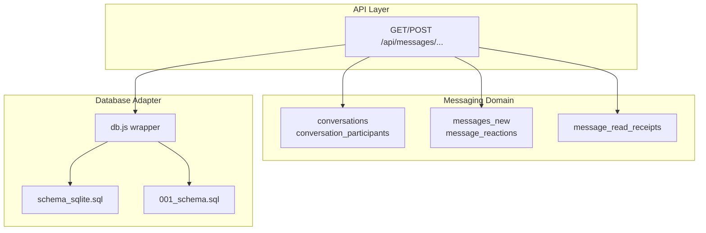
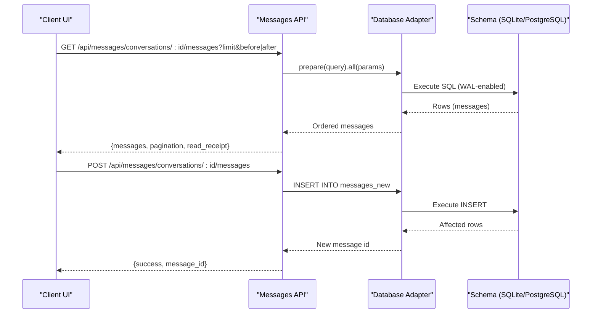
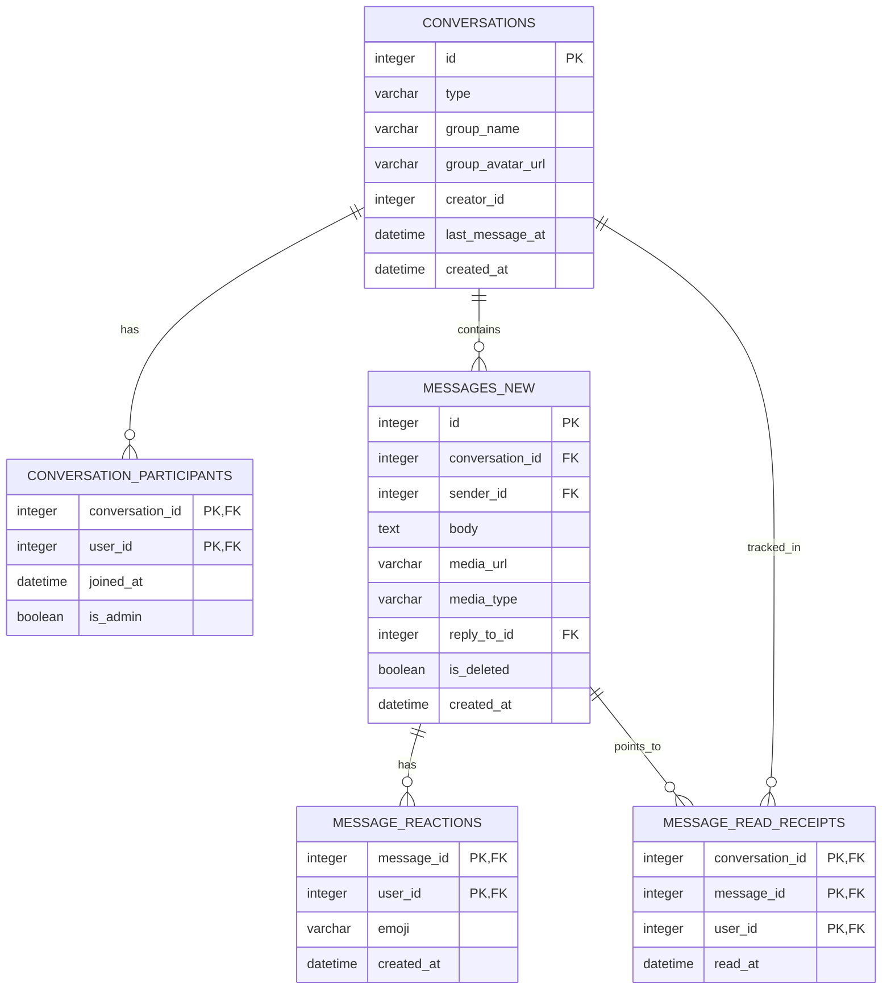
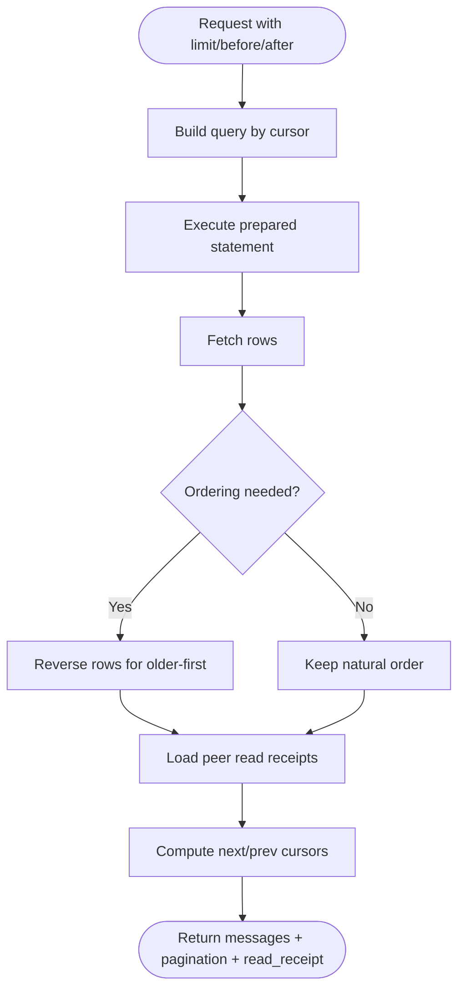
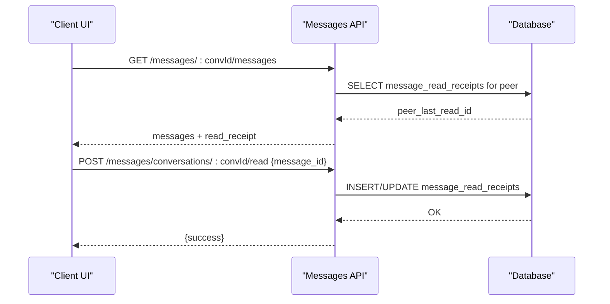
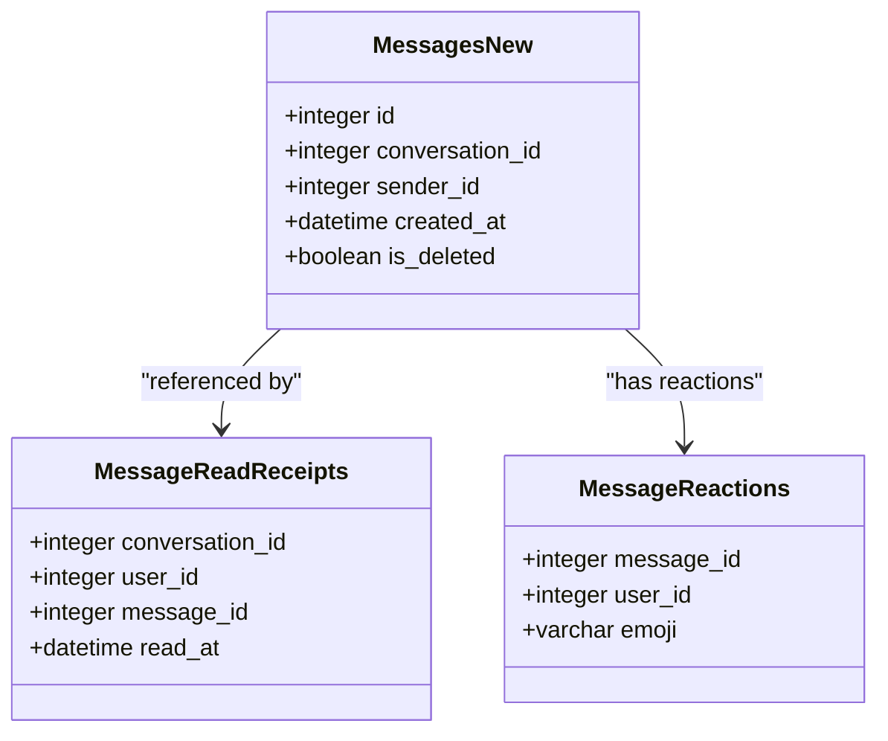
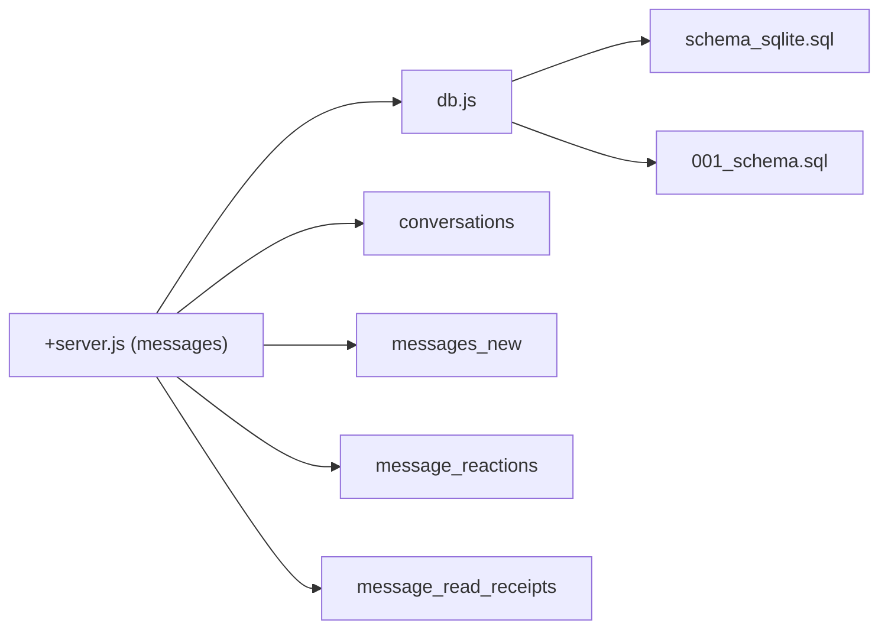

# Message Persistence & Storage

<cite>
**Referenced Files in This Document**
- [001_schema.sql](file://migrations/001_schema.sql)
- [002_phase2.sql](file://migrations/002_phase2.sql)
- [schema_sqlite.sql](file://schema_sqlite.sql)
- [+server.js (messages API)](file://frontend/src/routes/api/messages/[...path]+server.js)
- [db.js](file://frontend/src/lib/server/db.js)
- [migrate-up.js](file://scripts/migrate-up.js)
- [migrate-down.js](file://scripts/migrate-down.js)
- [+page.svelte (messages UI)](file://frontend/src/routes/messages/+page.svelte)
</cite>

## Table of Contents
1. [Introduction](#introduction)
2. [Project Structure](#project-structure)
3. [Core Components](#core-components)
4. [Architecture Overview](#architecture-overview)
5. [Detailed Component Analysis](#detailed-component-analysis)
6. [Dependency Analysis](#dependency-analysis)
7. [Performance Considerations](#performance-considerations)
8. [Troubleshooting Guide](#troubleshooting-guide)
9. [Conclusion](#conclusion)

## Introduction
This document explains VSocial’s message storage and persistence architecture with a focus on:
- Database schema for messages, conversations, and related metadata
- Message lifecycle management (creation, modification, deletion, archival)
- Cursor-based pagination for efficient retrieval and infinite scrolling
- Read receipt tracking and indexing strategies
- Database optimization and operational practices
- Data retention, cleanup, and storage capacity management
- Backup and recovery, integrity checks, and consistency guarantees

## Project Structure
The messaging domain spans two complementary schema definitions and a dedicated API layer:
- PostgreSQL-first schema with row-level security and advanced indexes
- SQLite-compatible schema for local/edge deployments and migrations
- API endpoints implementing cursor-based pagination, read receipts, and reactions
- Database adapter supporting both remote and local drivers with WAL tuning

**Diagram sources**
- [schema_sqlite.sql:235-283](file://schema_sqlite.sql#L235-L283)
- [+server.js (messages API):24-147](file://frontend/src/routes/api/messages/[...path]+server.js#L24-L147)
- [db.js:117-167](file://frontend/src/lib/server/db.js#L117-L167)
- [001_schema.sql:282-332](file://migrations/001_schema.sql#L282-L332)

**Section sources**
- [schema_sqlite.sql:235-283](file://schema_sqlite.sql#L235-L283)
- [+server.js (messages API):24-147](file://frontend/src/routes/api/messages/[...path]+server.js#L24-L147)
- [db.js:117-167](file://frontend/src/lib/server/db.js#L117-L167)
- [001_schema.sql:282-332](file://migrations/001_schema.sql#L282-L332)

## Core Components
- Conversations and participants: manage chat rooms (direct and group) and membership
- Messages: store text, media, replies, and timestamps
- Reactions: per-message emoji reactions keyed by user
- Read receipts: per-user, per-conversation pointers to the latest read message
- API endpoints: cursor-based retrieval, send, mark-read, and reactions

Key schema highlights:
- Conversations and participants define room membership and roles
- Messages are indexed by conversation and created_at for fast retrieval
- Read receipts track the latest read message per participant
- Reactions are stored with composite primary keys to prevent duplicates

**Section sources**
- [schema_sqlite.sql:235-283](file://schema_sqlite.sql#L235-L283)
- [001_schema.sql:303-332](file://migrations/001_schema.sql#L303-L332)
- [+server.js (messages API):74-147](file://frontend/src/routes/api/messages/[...path]+server.js#L74-L147)

## Architecture Overview
The messaging stack integrates a unified database adapter with two schema variants and a REST-like API:

**Diagram sources**
- [+server.js (messages API):74-147](file://frontend/src/routes/api/messages/[...path]+server.js#L74-L147)
- [db.js:31-112](file://frontend/src/lib/server/db.js#L31-L112)
- [schema_sqlite.sql:254-267](file://schema_sqlite.sql#L254-L267)

## Detailed Component Analysis

### Database Schema: Conversations, Messages, Reactions, Read Receipts
- conversations: identifies chat rooms (direct or group), creator, and timestamps
- conversation_participants: enforces membership and roles
- messages_new: stores message bodies, media, reply-to references, and timestamps
- message_reactions: emoji reactions per message and user
- message_read_receipts: per-user read pointers within a conversation

Indexes and constraints:
- messages_new: index on (conversation_id, created_at DESC)
- message_read_receipts: composite primary key (conversation_id, user_id)
- message_reactions: composite primary key (message_id, user_id, emoji)

**Diagram sources**
- [schema_sqlite.sql:235-283](file://schema_sqlite.sql#L235-L283)

**Section sources**
- [schema_sqlite.sql:235-283](file://schema_sqlite.sql#L235-L283)
- [001_schema.sql:303-332](file://migrations/001_schema.sql#L303-L332)

### Message Lifecycle Management
- Creation: POST to create a message in a conversation; validated against participantship
- Modification: not exposed in the referenced API surface
- Deletion: messages are marked as deleted; consumers filter out deleted entries
- Archival: not implemented in the referenced schema/API; consider soft-deleting or partitioning historical data

Operational flow:
- Send message validates participantship, inserts into messages_new, and triggers notifications
- Read receipts update per-user latest read pointer

**Section sources**
- [+server.js (messages API):149-179](file://frontend/src/routes/api/messages/[...path]+server.js#L149-L179)
- [+server.js (messages API):187-237](file://frontend/src/routes/api/messages/[...path]+server.js#L187-L237)
- [schema_sqlite.sql:254-267](file://schema_sqlite.sql#L254-L267)

### Cursor-Based Pagination
The API supports efficient pagination using message_id cursors:
- before: fetch older messages up to a limit
- after: fetch newer messages (for live updates)
- next_cursor/prev_cursor: returned for subsequent requests
- Ordering: messages are returned chronologically depending on direction

**Diagram sources**
- [+server.js (messages API):85-110](file://frontend/src/routes/api/messages/[...path]+server.js#L85-L110)

**Section sources**
- [+server.js (messages API):80-144](file://frontend/src/routes/api/messages/[...path]+server.js#L80-L144)

### Read Receipt Tracking
- On load: API queries the peer’s latest read message_id
- On send/read: client marks read; server persists/upserts read receipt
- UI displays read indicators for own messages when read_at is present

**Diagram sources**
- [+server.js (messages API):112-144](file://frontend/src/routes/api/messages/[...path]+server.js#L112-L144)
- [+server.js (messages API):187-237](file://frontend/src/routes/api/messages/[...path]+server.js#L187-L237)

**Section sources**
- [+server.js (messages API):112-144](file://frontend/src/routes/api/messages/[...path]+server.js#L112-L144)
- [+server.js (messages API):187-237](file://frontend/src/routes/api/messages/[...path]+server.js#L187-L237)
- [schema_sqlite.sql:277-283](file://schema_sqlite.sql#L277-L283)

### Indexing Strategies and Optimizations
- messages_new: index on (conversation_id, created_at DESC) for fast retrieval
- message_read_receipts: composite primary key ensures uniqueness and fast lookup
- message_reactions: composite primary key prevents duplicate reactions
- Database adapter enables WAL mode and PRAGMAs for concurrency and durability

**Diagram sources**
- [schema_sqlite.sql:254-283](file://schema_sqlite.sql#L254-L283)

**Section sources**
- [schema_sqlite.sql:254-283](file://schema_sqlite.sql#L254-L283)
- [db.js:124-153](file://frontend/src/lib/server/db.js#L124-L153)

### Data Retention, Cleanup, and Capacity Management
- Message retention: not enforced in the referenced schema/API
- Cleanup: consider periodic pruning of deleted or stale records; implement partitioning for historical data
- Capacity: monitor disk usage; enable WAL and tune cache_size for performance

Note: The referenced code does not include explicit retention policies or automated cleanup routines.

[No sources needed since this section provides general guidance]

### Backup and Recovery Procedures
- Migration runner applies schema changes safely and tracks applied migrations
- WAL mode improves durability; ensure backups capture the latest checkpoint
- For remote deployments, coordinate with the chosen driver (libSQL or better-sqlite3)

**Section sources**
- [migrate-up.js:13-51](file://scripts/migrate-up.js#L13-L51)
- [db.js:124-153](file://frontend/src/lib/server/db.js#L124-L153)

### Data Integrity and Consistency Guarantees
- Foreign keys enabled for referential integrity
- Transactions supported via the adapter for multi-statement consistency
- Row-level security policies in PostgreSQL schema restrict access to authorized users

**Section sources**
- [db.js:104-110](file://frontend/src/lib/server/db.js#L104-L110)
- [001_schema.sql:601-642](file://migrations/001_schema.sql#L601-L642)

## Dependency Analysis
Messaging components depend on:
- Database adapter for unified async API and transaction support
- Schema definitions for table structures and indexes
- API endpoints for client-server communication

**Diagram sources**
- [+server.js (messages API):24-147](file://frontend/src/routes/api/messages/[...path]+server.js#L24-L147)
- [db.js:117-167](file://frontend/src/lib/server/db.js#L117-L167)
- [schema_sqlite.sql:235-283](file://schema_sqlite.sql#L235-L283)
- [001_schema.sql:282-332](file://migrations/001_schema.sql#L282-L332)

**Section sources**
- [+server.js (messages API):24-147](file://frontend/src/routes/api/messages/[...path]+server.js#L24-L147)
- [db.js:117-167](file://frontend/src/lib/server/db.js#L117-L167)
- [schema_sqlite.sql:235-283](file://schema_sqlite.sql#L235-L283)
- [001_schema.sql:282-332](file://migrations/001_schema.sql#L282-L332)

## Performance Considerations
- Use cursor-based pagination to minimize scanning and reduce latency
- Leverage indexes on conversation_id and created_at for fast retrieval
- Enable WAL mode and tune cache_size for concurrent workloads
- Batch reads/writes and avoid excessive round-trips in the UI

[No sources needed since this section provides general guidance]

## Troubleshooting Guide
Common issues and remedies:
- Authentication errors: ensure requireAuth resolves a valid user_id
- Authorization errors: verify participantship before accessing a conversation
- Pagination anomalies: confirm before/after cursors are properly passed and ordered
- Read receipts mismatch: ensure upsert logic is invoked after send/read actions

**Section sources**
- [+server.js (messages API):26-78](file://frontend/src/routes/api/messages/[...path]+server.js#L26-L78)
- [+server.js (messages API):187-237](file://frontend/src/routes/api/messages/[...path]+server.js#L187-L237)

## Conclusion
VSocial’s messaging persistence leverages a robust dual-schema design, a cursor-based API, and strong indexing to support scalable message retrieval and read receipts. While lifecycle features like hard deletion and archival are not present in the referenced code, the architecture provides clear extension points. Operational excellence depends on WAL tuning, migration safety, and optional retention/cleanup policies tailored to deployment needs.