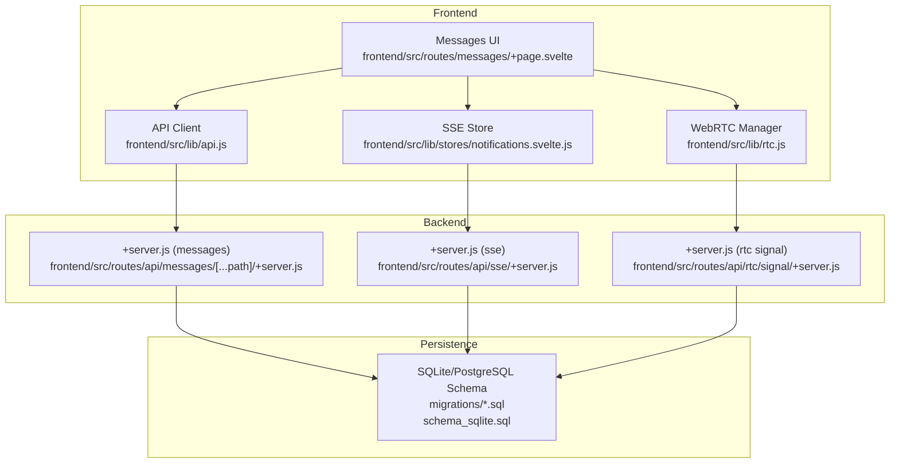
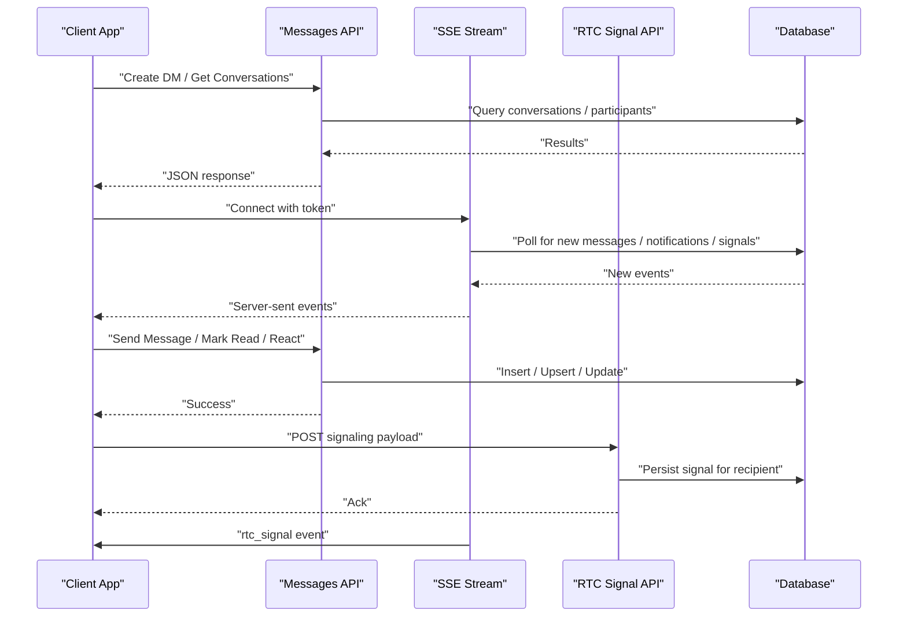
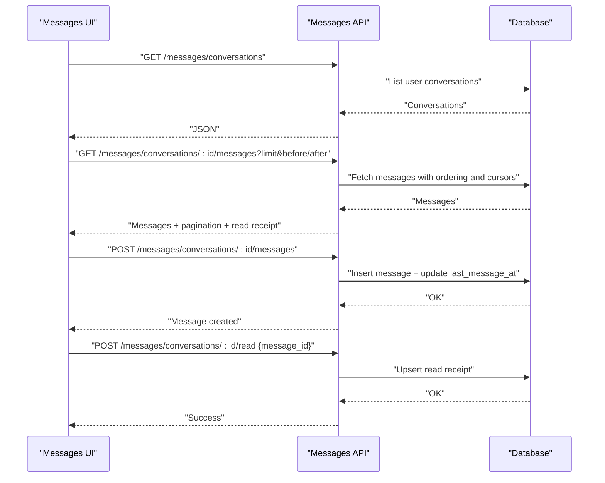
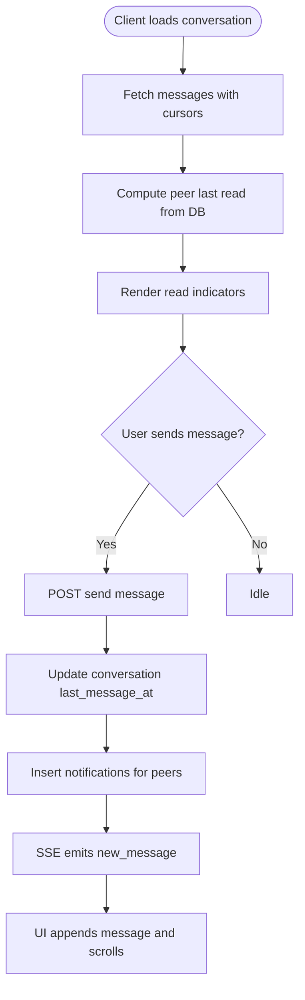
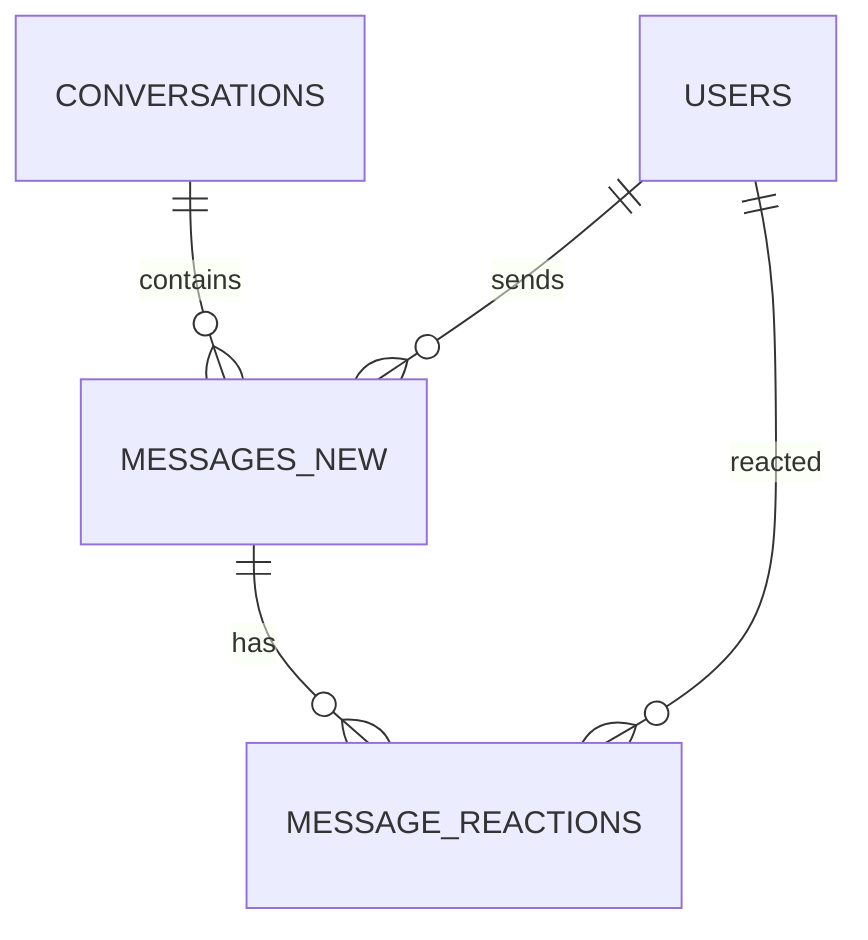
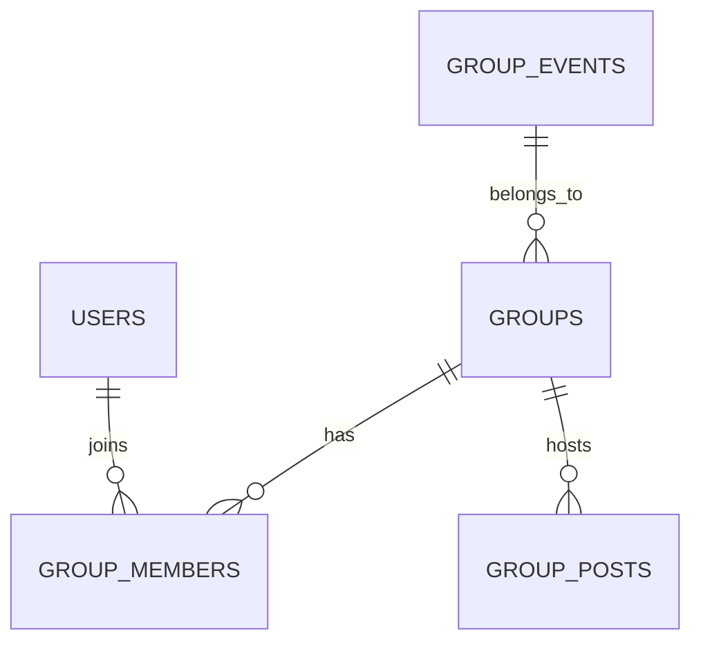
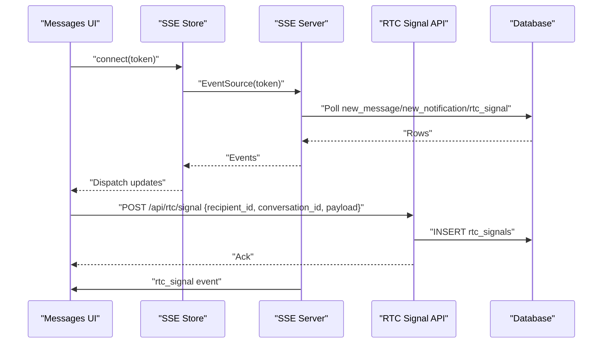
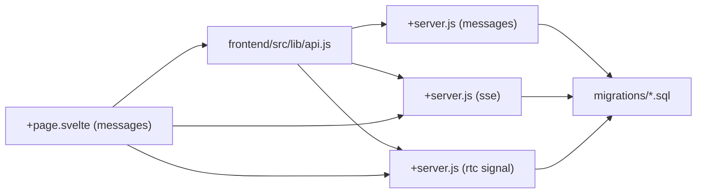

# Messaging & Communication

<cite>
**Referenced Files in This Document**
- [api.js](file://frontend/src/lib/api.js)
- [+server.js (messages)](file://frontend/src/routes/api/messages/[...path]/+server.js)
- [001_schema.sql](file://migrations/001_schema.sql)
- [002_phase2.sql](file://migrations/002_phase2.sql)
- [schema_sqlite.sql](file://schema_sqlite.sql)
- [+server.js (sse)](file://frontend/src/routes/api/sse/+server.js)
- [notifications.svelte.js](file://frontend/src/lib/stores/notifications.svelte.js)
- [rtc.js](file://frontend/src/lib/rtc.js)
- [+server.js (rtc signal)](file://frontend/src/routes/api/rtc/signal/+server.js)
- [+page.svelte (messages)](file://frontend/src/routes/messages/+page.svelte)
</cite>

## Table of Contents
1. [Introduction](#introduction)
2. [Project Structure](#project-structure)
3. [Core Components](#core-components)
4. [Architecture Overview](#architecture-overview)
5. [Detailed Component Analysis](#detailed-component-analysis)
6. [Dependency Analysis](#dependency-analysis)
7. [Performance Considerations](#performance-considerations)
8. [Troubleshooting Guide](#troubleshooting-guide)
9. [Conclusion](#conclusion)

## Introduction
This document explains VSocial’s messaging and communication features with a focus on:
- Direct messaging (DM) with message threading, read receipts, reactions, and media sharing
- Group chat capabilities (conceptual overview based on schema)
- Real-time communication using Server-Sent Events (SSE) and WebRTC signaling
- API specifications for message CRUD, group management, and presence-like updates
- Scalability considerations for real-time messaging, persistence, and offline delivery
- Examples of message encryption, spam prevention, and content moderation

## Project Structure
The messaging system spans three layers:
- Frontend API client and UI: centralized HTTP client and chat UI
- Backend API: message endpoints, SSE, and WebRTC signaling
- Database: relational schema supporting DMs, read receipts, reactions, and optional group features

**Diagram sources**
- [api.js:200-217](file://frontend/src/lib/api.js#L200-L217)
- [+server.js (messages):24-146](file://frontend/src/routes/api/messages/[...path]/+server.js#L24-L146)
- [+server.js (sse):1-184](file://frontend/src/routes/api/sse/+server.js#L1-L184)
- [+server.js (rtc signal):1-58](file://frontend/src/routes/api/rtc/signal/+server.js#L1-L58)
- [001_schema.sql:232-332](file://migrations/001_schema.sql#L232-L332)
- [schema_sqlite.sql:232-266](file://schema_sqlite.sql#L232-L266)

**Section sources**
- [api.js:200-217](file://frontend/src/lib/api.js#L200-L217)
- [+server.js (messages):24-146](file://frontend/src/routes/api/messages/[...path]/+server.js#L24-L146)
- [+server.js (sse):1-184](file://frontend/src/routes/api/sse/+server.js#L1-L184)
- [+server.js (rtc signal):1-58](file://frontend/src/routes/api/rtc/signal/+server.js#L1-L58)
- [001_schema.sql:232-332](file://migrations/001_schema.sql#L232-L332)
- [schema_sqlite.sql:232-266](file://schema_sqlite.sql#L232-L266)

## Core Components
- API client: central HTTP client with auth and upload helpers; exposes messages endpoints for conversations, messages, read receipts, reactions, and typing indicators
- Messages backend: handles DM creation, message retrieval with cursor-based pagination, read receipts, reactions, and typing
- SSE: long-lived connection delivering real-time messages, notifications, and WebRTC signals
- WebRTC manager: mesh signaling and media orchestration with ICE restart and quality monitoring
- Database: schema supporting DM threads, read receipts, reactions, and optional group chat entities

**Section sources**
- [api.js:200-217](file://frontend/src/lib/api.js#L200-L217)
- [+server.js (messages):24-146](file://frontend/src/routes/api/messages/[...path]/+server.js#L24-L146)
- [+server.js (sse):1-184](file://frontend/src/routes/api/sse/+server.js#L1-L184)
- [rtc.js:1-299](file://frontend/src/lib/rtc.js#L1-L299)
- [001_schema.sql:232-332](file://migrations/001_schema.sql#L232-L332)
- [schema_sqlite.sql:232-266](file://schema_sqlite.sql#L232-L266)

## Architecture Overview
The system combines HTTP APIs for request/response with persistent SSE streams for real-time updates. WebRTC signaling complements chat for voice/video calls.

**Diagram sources**
- [+server.js (messages):24-146](file://frontend/src/routes/api/messages/[...path]/+server.js#L24-L146)
- [+server.js (sse):1-184](file://frontend/src/routes/api/sse/+server.js#L1-L184)
- [+server.js (rtc signal):1-58](file://frontend/src/routes/api/rtc/signal/+server.js#L1-L58)
- [001_schema.sql:232-332](file://migrations/001_schema.sql#L232-L332)

## Detailed Component Analysis

### Direct Messaging (DM)
- Conversation lifecycle: create or reuse a DM thread between two users; list recent conversations; fetch messages with cursor-based pagination
- Message threading: messages belong to a conversation; ordering supports before/after cursors for efficient pagination
- Read receipts: per-user last-read tracking per conversation; backend persists and returns peer last read ID
- Reactions: emoji reactions stored per message and user; API inserts reactions safely
- Media sharing: messages support text, media URL, media type, and voice note metadata

**Diagram sources**
- [+server.js (messages):24-146](file://frontend/src/routes/api/messages/[...path]/+server.js#L24-L146)
- [001_schema.sql:232-332](file://migrations/001_schema.sql#L232-L332)
- [schema_sqlite.sql:232-266](file://schema_sqlite.sql#L232-L266)

**Section sources**
- [+server.js (messages):24-146](file://frontend/src/routes/api/messages/[...path]/+server.js#L24-L146)
- [api.js:200-217](file://frontend/src/lib/api.js#L200-L217)
- [001_schema.sql:232-332](file://migrations/001_schema.sql#L232-L332)
- [schema_sqlite.sql:232-266](file://schema_sqlite.sql#L232-L266)

### Read Receipts and Presence Detection
- Read receipts: stored per conversation and user; returned alongside message lists to indicate peer last read
- Presence-like behavior: typing indicator endpoint exists; SSE delivers real-time updates for new messages and notifications

**Diagram sources**
- [+server.js (messages):74-145](file://frontend/src/routes/api/messages/[...path]/+server.js#L74-L145)
- [+server.js (sse):85-117](file://frontend/src/routes/api/sse/+server.js#L85-L117)

**Section sources**
- [+server.js (messages):187-204](file://frontend/src/routes/api/messages/[...path]/+server.js#L187-L204)
- [+server.js (sse):85-117](file://frontend/src/routes/api/sse/+server.js#L85-L117)

### Media Sharing and Reactions
- Media: messages support media_url and media_type; voice notes supported in phase 2 schema
- Reactions: emoji reactions stored per message; API inserts safely and ignores duplicates

**Diagram sources**
- [001_schema.sql:254-266](file://migrations/001_schema.sql#L254-L266)
- [001_schema.sql:326-332](file://migrations/001_schema.sql#L326-L332)

**Section sources**
- [+server.js (messages):154-179](file://frontend/src/routes/api/messages/[...path]/+server.js#L154-L179)
- [+server.js (messages):206-218](file://frontend/src/routes/api/messages/[...path]/+server.js#L206-L218)
- [002_phase2.sql:116-123](file://migrations/002_phase2.sql#L116-L123)

### Group Chat Functionality
- Conceptual schema includes group entities and members; encryption flag present
- Current messages API focuses on DMs; group endpoints would follow similar patterns (list, create, join, manage roles, moderation)

**Diagram sources**
- [001_schema.sql:282-301](file://migrations/001_schema.sql#L282-L301)
- [002_phase2.sql:131-202](file://migrations/002_phase2.sql#L131-L202)

**Section sources**
- [001_schema.sql:282-301](file://migrations/001_schema.sql#L282-L301)
- [002_phase2.sql:131-202](file://migrations/002_phase2.sql#L131-L202)

### Real-Time Communication: SSE and WebRTC
- SSE: long-lived connection validates JWT via query param, polls for new messages, notifications, and WebRTC signals; includes keepalive pings and periodic cleanup
- WebRTC: signaling payloads persisted to a temporary table and delivered via SSE; manager handles ICE candidates, offers/answers, and connection quality metrics

**Diagram sources**
- [+server.js (sse):1-184](file://frontend/src/routes/api/sse/+server.js#L1-L184)
- [+server.js (rtc signal):1-58](file://frontend/src/routes/api/rtc/signal/+server.js#L1-L58)
- [rtc.js:78-88](file://frontend/src/lib/rtc.js#L78-L88)

**Section sources**
- [+server.js (sse):1-184](file://frontend/src/routes/api/sse/+server.js#L1-L184)
- [+server.js (rtc signal):1-58](file://frontend/src/routes/api/rtc/signal/+server.js#L1-L58)
- [rtc.js:1-299](file://frontend/src/lib/rtc.js#L1-L299)

## Dependency Analysis
- API client depends on auth token storage and wraps fetch with JSON handling
- Messages API requires authentication, validates participation, and interacts with conversations, messages, reactions, and read receipts
- SSE depends on validated sessions and polls for new rows; cleans up old notifications periodically
- WebRTC signaling depends on a lazily initialized table and cleans up stale signals

**Diagram sources**
- [api.js:200-217](file://frontend/src/lib/api.js#L200-L217)
- [+server.js (messages):24-146](file://frontend/src/routes/api/messages/[...path]/+server.js#L24-L146)
- [+server.js (sse):1-184](file://frontend/src/routes/api/sse/+server.js#L1-L184)
- [+server.js (rtc signal):1-58](file://frontend/src/routes/api/rtc/signal/+server.js#L1-L58)
- [001_schema.sql:232-332](file://migrations/001_schema.sql#L232-L332)

**Section sources**
- [api.js:200-217](file://frontend/src/lib/api.js#L200-L217)
- [+server.js (messages):24-146](file://frontend/src/routes/api/messages/[...path]/+server.js#L24-L146)
- [+server.js (sse):1-184](file://frontend/src/routes/api/sse/+server.js#L1-L184)
- [+server.js (rtc signal):1-58](file://frontend/src/routes/api/rtc/signal/+server.js#L1-L58)
- [001_schema.sql:232-332](file://migrations/001_schema.sql#L232-L332)

## Performance Considerations
- Pagination: cursor-based before/after queries reduce scanning and maintain stable ordering
- Indexing: message and conversation indexes optimize frequent queries
- SSE polling: fixed interval with keepalive minimizes overhead; periodic cleanup reduces noise
- WebRTC signals: bounded retention and deterministic cleanup prevent table growth
- Recommendations:
  - Shard conversations by user or partition messages by date
  - Use background jobs for heavy maintenance tasks (cleanup)
  - Implement client-side caching and optimistic updates for smoother UX

[No sources needed since this section provides general guidance]

## Troubleshooting Guide
- Authentication failures: ensure token is present and valid; SSE validates via token hash against sessions
- Unauthorized access: participant checks in messages API return 403 for non-participants
- SSE disconnections: exponential backoff with jitter; verify token validity and network stability
- WebRTC signaling: ensure signals are inserted and SSE emits rtc_signal events; check for stale signals cleanup

**Section sources**
- [+server.js (messages):157-158](file://frontend/src/routes/api/messages/[...path]/+server.js#L157-L158)
- [+server.js (sse):10-34](file://frontend/src/routes/api/sse/+server.js#L10-L34)
- [notifications.svelte.js:24-30](file://frontend/src/lib/stores/notifications.svelte.js#L24-L30)
- [+server.js (rtc signal):29-50](file://frontend/src/routes/api/rtc/signal/+server.js#L29-L50)

## Conclusion
VSocial’s messaging stack integrates HTTP APIs, SSE for real-time updates, and WebRTC signaling to deliver a responsive DM experience with read receipts, reactions, and media. The schema supports future expansion to group chat and advanced moderation. For production, prioritize indexing, background maintenance, and robust client-side reconnection strategies.