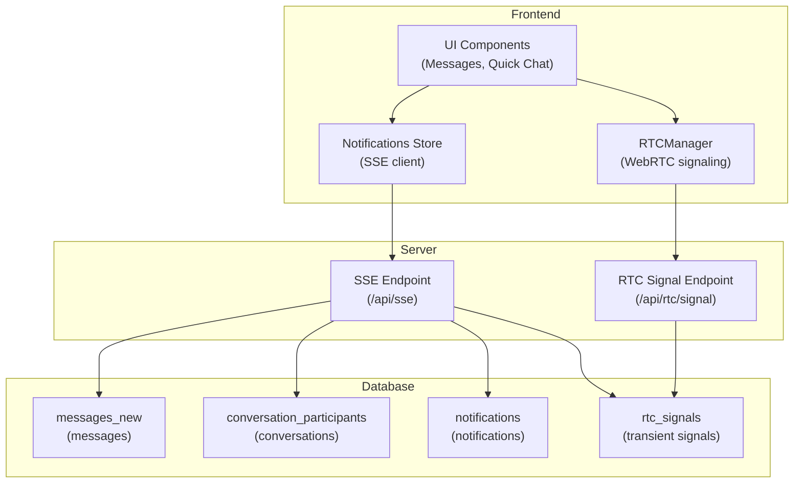
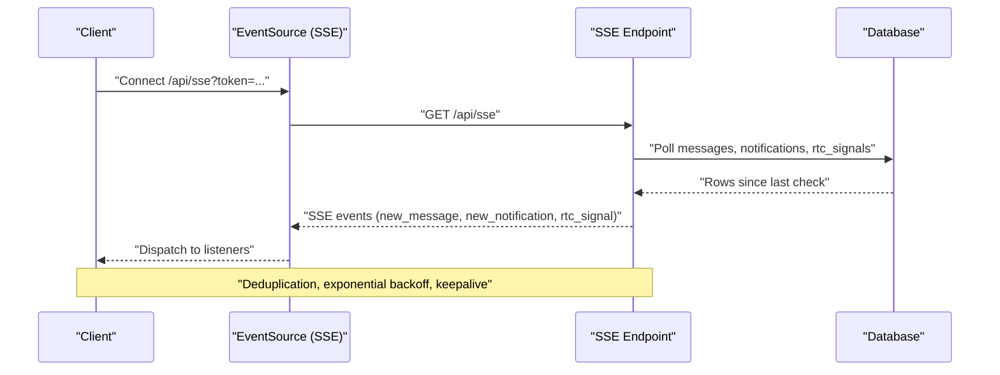
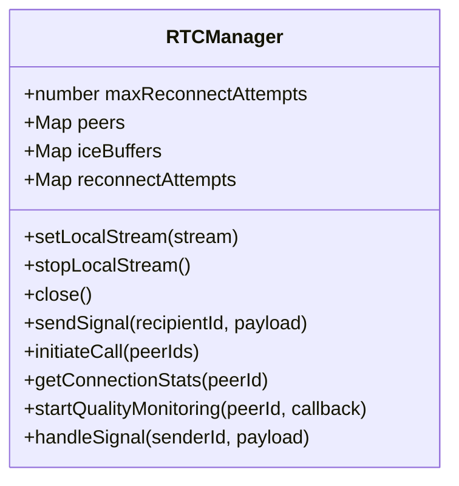
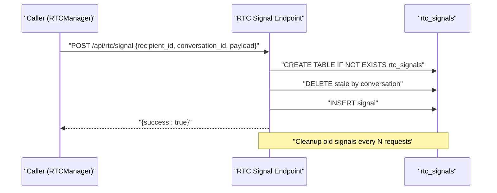
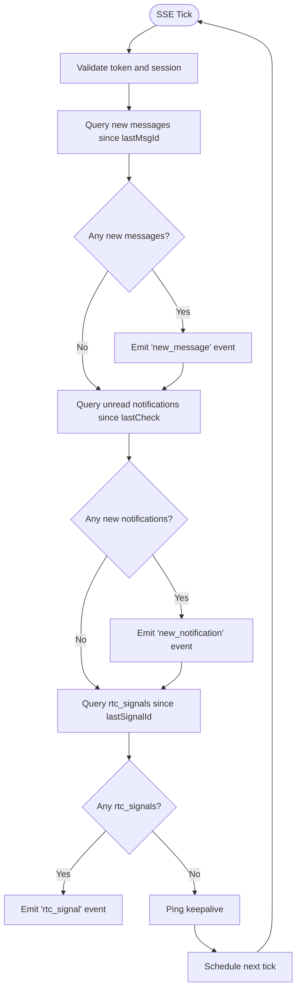
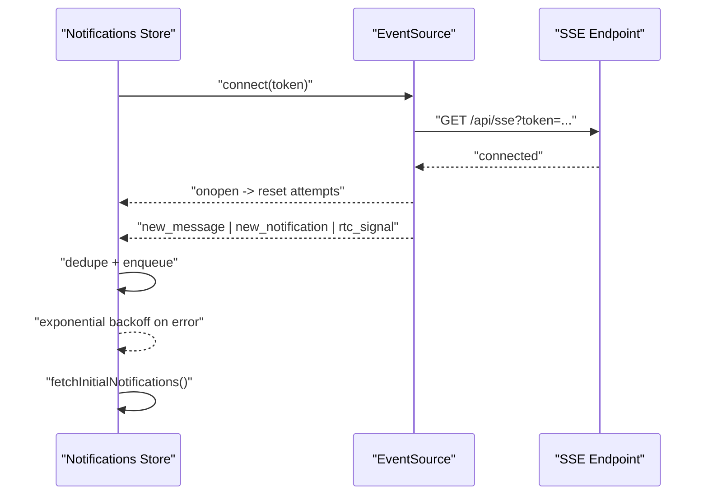
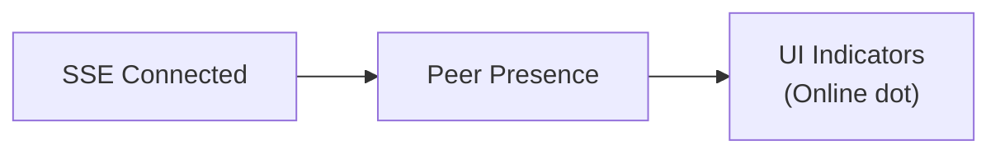
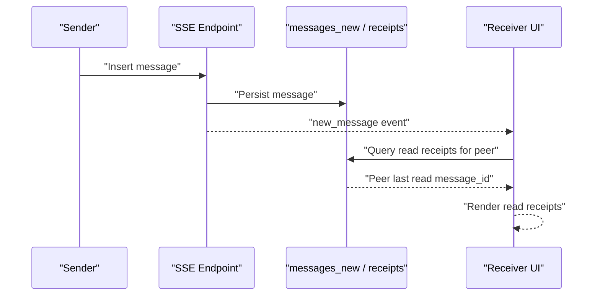
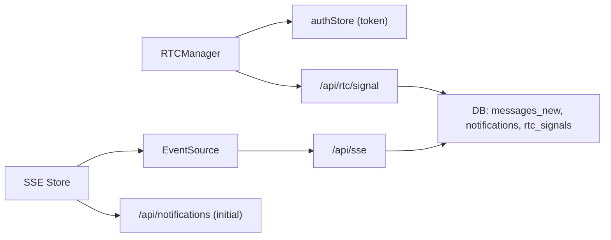

# Real-time Communication

<cite>
**Referenced Files in This Document**
- [rtc.js](file://frontend/src/lib/rtc.js)
- [api.js](file://frontend/src/lib/api.js)
- [+server.js (RTC Signal)](file://frontend/src/routes/api/rtc/signal/+server.js)
- [+server.js (SSE)](file://frontend/src/routes/api/sse/+server.js)
- [notifications.svelte.js](file://frontend/src/lib/stores/notifications.svelte.js)
- [+page.svelte (Messages List)](file://frontend/src/routes/messages/+page.svelte)
- [QuickChatWidget.svelte](file://frontend/src/lib/components/QuickChatWidget.svelte)
</cite>

## Table of Contents
1. [Introduction](#introduction)
2. [Project Structure](#project-structure)
3. [Core Components](#core-components)
4. [Architecture Overview](#architecture-overview)
5. [Detailed Component Analysis](#detailed-component-analysis)
6. [Dependency Analysis](#dependency-analysis)
7. [Performance Considerations](#performance-considerations)
8. [Troubleshooting Guide](#troubleshooting-guide)
9. [Conclusion](#conclusion)

## Introduction
This document explains VSocial’s real-time communication infrastructure with a focus on:
- WebSocket-free real-time messaging via Server-Sent Events (SSE)
- WebRTC-based peer-to-peer signaling for audio/video calls
- Presence indicators and online/offline status
- Message broadcasting, read receipts propagation, and typing indicators
- Robust connection failure handling, reconnection logic, and message queuing during network interruptions
- Performance optimization strategies for high-concurrency scenarios

## Project Structure
The real-time stack spans three layers:
- Frontend client libraries and stores for SSE and WebRTC
- SvelteKit server endpoints for SSE streaming and RTC signaling persistence
- Database-backed queues for reliable delivery of transient signals

**Diagram sources**
- [rtc.js:1-299](file://frontend/src/lib/rtc.js#L1-L299)
- [+server.js (SSE):1-185](file://frontend/src/routes/api/sse/+server.js#L1-L185)
- [+server.js (RTC Signal):1-58](file://frontend/src/routes/api/rtc/signal/+server.js#L1-L58)

**Section sources**
- [rtc.js:1-299](file://frontend/src/lib/rtc.js#L1-L299)
- [+server.js (SSE):1-185](file://frontend/src/routes/api/sse/+server.js#L1-L185)
- [+server.js (RTC Signal):1-58](file://frontend/src/routes/api/rtc/signal/+server.js#L1-L58)

## Core Components
- RTCManager: Manages WebRTC peer connections, ICE candidates, SDP exchange, reconnection, and quality monitoring.
- SSE Notifications Store: Maintains an EventSource connection, deduplicates events, and applies exponential backoff with jitter.
- SSE Endpoint: Streams messages, notifications, and WebRTC signals to authenticated clients.
- RTC Signal Endpoint: Accepts transient signaling payloads and persists them per-recipient and per-conversation.

Key capabilities:
- Real-time message delivery via SSE polling loop
- WebRTC signaling relayed through the server to peers
- Presence indicators driven by SSE-connected clients
- Typing indicators and read receipts propagated through SSE and message APIs
- Resilient reconnection and deduplication to handle network interruptions

**Section sources**
- [rtc.js:1-299](file://frontend/src/lib/rtc.js#L1-L299)
- [+server.js (SSE):1-185](file://frontend/src/routes/api/sse/+server.js#L1-L185)
- [+server.js (RTC Signal):1-58](file://frontend/src/routes/api/rtc/signal/+server.js#L1-L58)
- [api.js:200-217](file://frontend/src/lib/api.js#L200-L217)

## Architecture Overview
The system uses two complementary real-time channels:
- SSE for persistent, long-lived streams of messages, notifications, and WebRTC signals
- WebRTC signaling via HTTP POST to a server-managed transient queue

**Diagram sources**
- [+server.js (SSE):1-185](file://frontend/src/routes/api/sse/+server.js#L1-L185)
- [notifications.svelte.js:35-144](file://frontend/src/lib/stores/notifications.svelte.js#L35-L144)

## Detailed Component Analysis

### WebRTC Signaling (RTCManager)
RTCManager orchestrates peer-to-peer connections and handles signaling transport:
- ICE configuration with STUN/TURN servers
- Offer/answer lifecycle and ICE candidate buffering
- Reconnection attempts with ICE restart and exponential backoff
- Quality monitoring via connection statistics
- Signal forwarding to peers via HTTP POST to the RTC Signal endpoint

**Diagram sources**
- [rtc.js:7-299](file://frontend/src/lib/rtc.js#L7-L299)

**Section sources**
- [rtc.js:78-88](file://frontend/src/lib/rtc.js#L78-L88)
- [rtc.js:90-136](file://frontend/src/lib/rtc.js#L90-L136)
- [rtc.js:138-167](file://frontend/src/lib/rtc.js#L138-L167)
- [rtc.js:251-297](file://frontend/src/lib/rtc.js#L251-L297)

### Real-time Signaling Protocol (HTTP Relay)
The RTC Signal endpoint persists transient signaling messages for recipients:
- Validates authentication and ensures the rtc_signals table exists
- Cleans stale signals per conversation to prevent accumulation
- Inserts signaling payloads with conversation scoping
- Periodic deterministic cleanup of old entries

**Diagram sources**
- [+server.js (RTC Signal):5-58](file://frontend/src/routes/api/rtc/signal/+server.js#L5-L58)

**Section sources**
- [+server.js (RTC Signal):17-50](file://frontend/src/routes/api/rtc/signal/+server.js#L17-L50)

### SSE Streaming and Event System
The SSE endpoint streams:
- New messages scoped to the authenticated user’s conversations
- Unread notifications
- WebRTC signals queued for the user
It also implements:
- Keepalive pings
- Token/session validation
- Iterative polling with bounded runtime and automatic disconnection
- Periodic cleanup of read notifications

**Diagram sources**
- [+server.js (SSE):85-152](file://frontend/src/routes/api/sse/+server.js#L85-L152)

**Section sources**
- [+server.js (SSE):9-35](file://frontend/src/routes/api/sse/+server.js#L9-L35)
- [+server.js (SSE):85-152](file://frontend/src/routes/api/sse/+server.js#L85-L152)
- [+server.js (SSE):138-149](file://frontend/src/routes/api/sse/+server.js#L138-L149)

### SSE Client Store (Real-time Event Handling)
The SSE client maintains:
- An EventSource connection with exponential backoff and jitter
- Deduplication sets for messages, notifications, and signals
- Queues for new messages and RTC signals
- Automatic initial sync of notifications upon connect

**Diagram sources**
- [notifications.svelte.js:35-144](file://frontend/src/lib/stores/notifications.svelte.js#L35-L144)
- [+server.js (SSE):63-174](file://frontend/src/routes/api/sse/+server.js#L63-L174)

**Section sources**
- [notifications.svelte.js:18-30](file://frontend/src/lib/stores/notifications.svelte.js#L18-L30)
- [notifications.svelte.js:35-144](file://frontend/src/lib/stores/notifications.svelte.js#L35-L144)
- [notifications.svelte.js:146-158](file://frontend/src/lib/stores/notifications.svelte.js#L146-L158)

### Presence Detection and Online/Offline Status
Presence is inferred from SSE connectivity:
- UI components render online indicators when a peer has an active SSE connection
- The messages list and quick chat widget reflect peer online status

**Diagram sources**
- [+page.svelte (Messages List):590-611](file://frontend/src/routes/messages/+page.svelte#L590-L611)
- [QuickChatWidget.svelte:198-200](file://frontend/src/lib/components/QuickChatWidget.svelte#L198-L200)

**Section sources**
- [+page.svelte (Messages List):590-611](file://frontend/src/routes/messages/+page.svelte#L590-L611)
- [QuickChatWidget.svelte:198-200](file://frontend/src/lib/components/QuickChatWidget.svelte#L198-L200)

### Message Broadcasting and Read Receipts Propagation
- Messages are streamed to participants via SSE
- Read receipts are computed by querying the latest read message per participant and ordering around the current message set
- UI reflects read status and unread counts

**Diagram sources**
- [+server.js (SSE):88-104](file://frontend/src/routes/api/sse/+server.js#L88-L104)
- [+server.js (SSE):112-117](file://frontend/src/routes/api/sse/+server.js#L112-L117)
- [+server.js (SSE):120-133](file://frontend/src/routes/api/sse/+server.js#L120-L133)

**Section sources**
- [+server.js (SSE):88-104](file://frontend/src/routes/api/sse/+server.js#L88-L104)
- [+server.js (SSE):112-117](file://frontend/src/routes/api/sse/+server.js#L112-L117)
- [+server.js (SSE):120-133](file://frontend/src/routes/api/sse/+server.js#L120-L133)

### Typing Indicators
Typing indicators are exposed via the messages API and can be integrated with SSE to broadcast typing activity to conversation participants.

**Section sources**
- [api.js:212-216](file://frontend/src/lib/api.js#L212-L216)

### Group Chat Coordination
Group conversations are supported by:
- Conversation metadata and participant lists
- SSE scoping to participants via conversation joins
- RTC signaling per-recipient with conversation scoping

**Section sources**
- [+server.js (SSE):39-46](file://frontend/src/routes/api/sse/+server.js#L39-L46)
- [+server.js (RTC Signal):29-35](file://frontend/src/routes/api/rtc/signal/+server.js#L29-L35)

## Dependency Analysis
- RTCManager depends on:
  - Authentication store for bearer tokens
  - HTTP POST to the RTC Signal endpoint
  - Browser WebRTC APIs for peer connections
- SSE Store depends on:
  - EventSource for streaming
  - Notifications API for initial sync
- SSE Endpoint depends on:
  - JWT decoding and session validation
  - Database queries for messages, notifications, and rtc_signals
- RTC Signal Endpoint depends on:
  - Database for transient signaling storage

**Diagram sources**
- [rtc.js:5,78-88](file://frontend/src/lib/rtc.js#L5,L78-L88)
- [notifications.svelte.js:44-47](file://frontend/src/lib/stores/notifications.svelte.js#L44-L47)
- [+server.js (SSE):9-35](file://frontend/src/routes/api/sse/+server.js#L9-L35)
- [+server.js (RTC Signal):5-15](file://frontend/src/routes/api/rtc/signal/+server.js#L5-L15)

**Section sources**
- [rtc.js:5,78-88](file://frontend/src/lib/rtc.js#L5,L78-L88)
- [notifications.svelte.js:44-47](file://frontend/src/lib/stores/notifications.svelte.js#L44-L47)
- [+server.js (SSE):9-35](file://frontend/src/routes/api/sse/+server.js#L9-L35)
- [+server.js (RTC Signal):5-15](file://frontend/src/routes/api/rtc/signal/+server.js#L5-L15)

## Performance Considerations
- SSE polling interval: 2 seconds with capped runtime to balance latency and load
- Deduplication via ID sets prevents redundant UI updates
- Stale signal cleanup per conversation reduces database bloat during active calls
- Deterministic cleanup of rtc_signals every N requests avoids probabilistic misses
- RTC ICE restart with exponential backoff limits churn during transient failures
- Connection quality monitoring runs at 1-second intervals for responsive feedback
- UI queues limit retained items to bounded sizes to control memory growth

[No sources needed since this section provides general guidance]

## Troubleshooting Guide
Common issues and remedies:
- SSE connection drops
  - Symptom: Frequent reconnect attempts and degraded UX
  - Action: Verify token validity and session freshness; confirm SSE endpoint availability
  - Evidence: Backoff logs and reconnection timers in the SSE store
- Duplicate events
  - Symptom: Repeated messages or notifications
  - Action: Confirm deduplication sets are active and not cleared prematurely
- Stale WebRTC signals
  - Symptom: Missed ICE candidates or SDP offers
  - Action: Ensure conversation-scoped cleanup is applied and signals are fetched after reconnect
- RTC ICE failures
  - Symptom: Calls fail to establish or drop unexpectedly
  - Action: Monitor ICE state transitions and verify TURN/STUN reachability; inspect retry attempts and exponential backoff

**Section sources**
- [notifications.svelte.js:122-139](file://frontend/src/lib/stores/notifications.svelte.js#L122-L139)
- [+server.js (RTC Signal):29-35](file://frontend/src/routes/api/rtc/signal/+server.js#L29-L35)
- [rtc.js:108-129](file://frontend/src/lib/rtc.js#L108-L129)

## Conclusion
VSocial’s real-time infrastructure combines SSE for persistent, low-latency updates and HTTP-backed WebRTC signaling for secure peer-to-peer media sessions. The design emphasizes reliability through deduplication, bounded queues, deterministic cleanup, and robust reconnection strategies. Together, these patterns enable scalable, responsive messaging and media experiences suitable for high-concurrency environments.