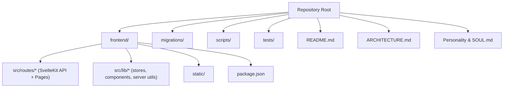
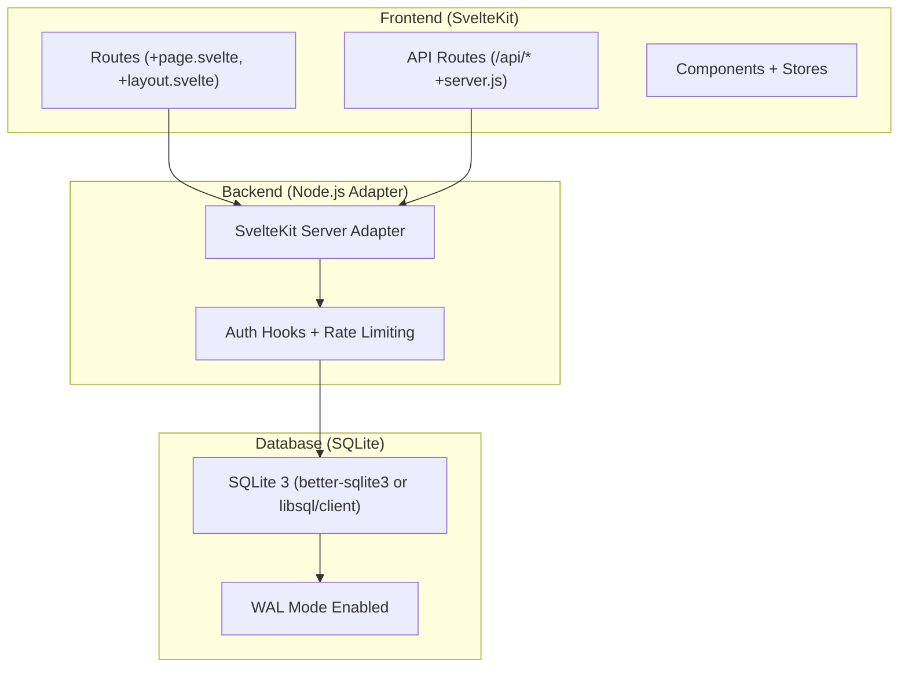
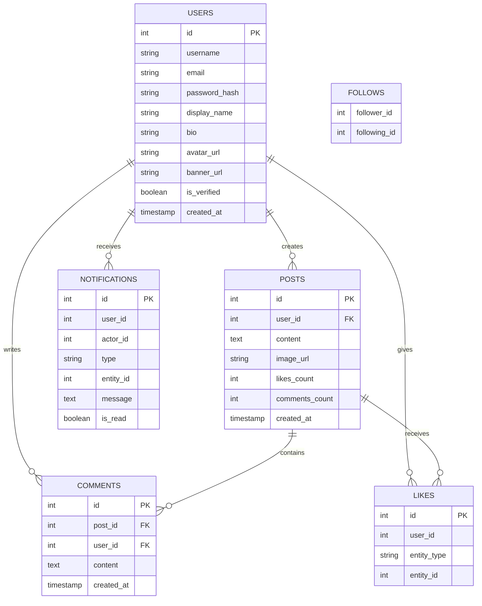
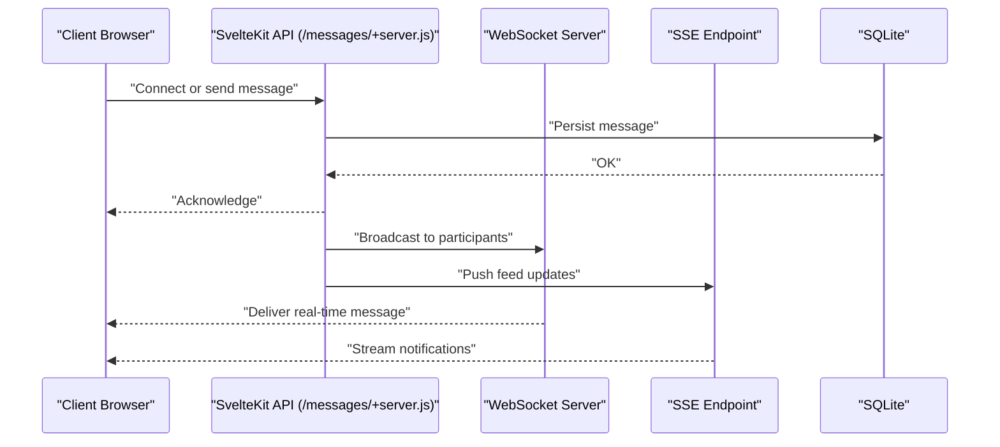
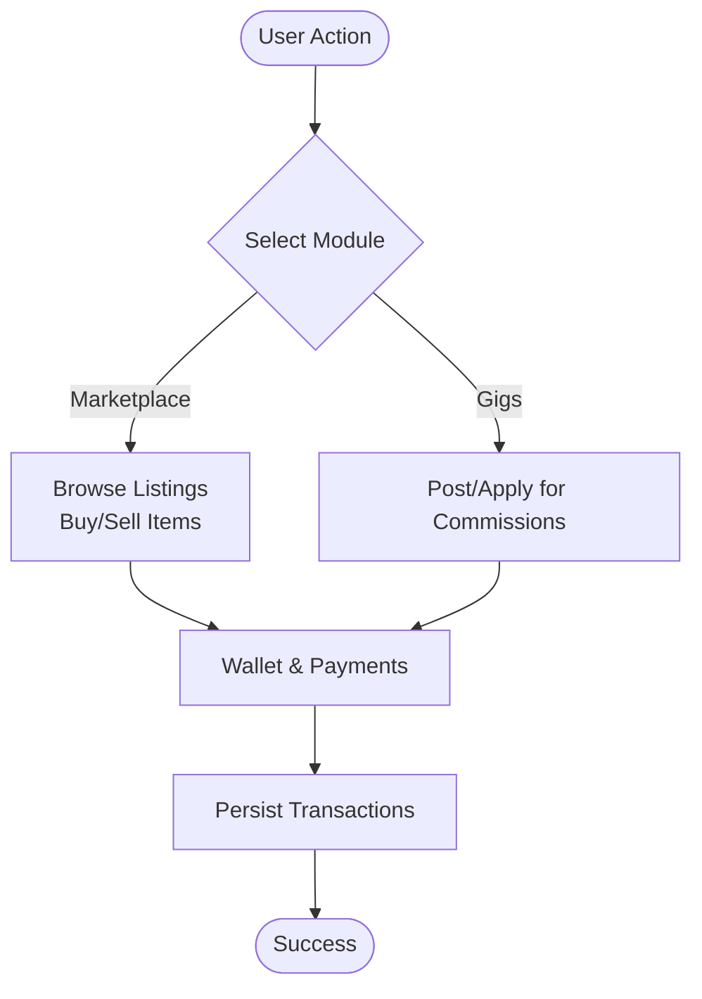
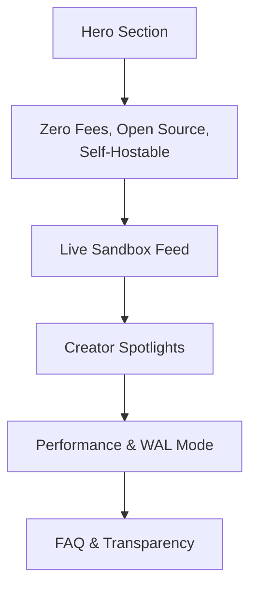
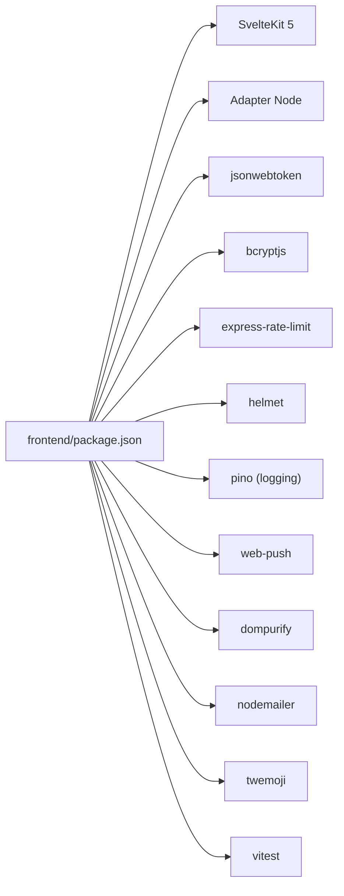

# Project Overview

<cite>
**Referenced Files in This Document**
- [README.md](file://README.md)
- [ARCHITECTURE.md](file://ARCHITECTURE.md)
- [Personality & SOUL.md](file://Personality & SOUL.md)
- [frontend/src/routes/+page.svelte](file://frontend/src/routes/+page.svelte)
- [frontend/package.json](file://frontend/package.json)
</cite>

## Table of Contents
1. [Introduction](#introduction)
2. [Project Structure](#project-structure)
3. [Core Components](#core-components)
4. [Architecture Overview](#architecture-overview)
5. [Detailed Component Analysis](#detailed-component-analysis)
6. [Dependency Analysis](#dependency-analysis)
7. [Performance Considerations](#performance-considerations)
8. [Troubleshooting Guide](#troubleshooting-guide)
9. [Conclusion](#conclusion)

## Introduction
VSocial is a full-stack social networking application designed specifically for virtual creators—such as VTubers, streamers, and digital artists. Its mission is to provide a creator-friendly ecosystem that emphasizes transparency, sovereignty, and freedom from platform fees. The platform offers core social features (posts, stories, reels, likes, comments, follows), real-time messaging, a marketplace for buying and selling digital goods, a freelance gigs board for commissions, groups/pages for communities, and an integrated wallet and monetization system. It is currently in Alpha v0.0.1 and actively under development.

Key differentiators from mainstream social networks include:
- Zero-platform commission model: creators keep 100% of sales and commissions.
- Self-hostable architecture powered by SQLite (via better-sqlite3 or libsql/client), enabling low-cost, private deployments.
- Transparent, auditable technology stack with explicit raw SQL and strong security defaults.
- Creator-centric feed ordering (chronological) without opaque algorithmic manipulation.
- Immersive UI built with Svelte 5, Glassmorphism 2.0, and Neo-Aero design tokens.

Target audience:
- Independent digital artists, VTubers, streamers, and content creators who want ownership over their audience, revenue, and data.
- Developers and sysadmins interested in a modern, open-source social platform they can deploy and customize themselves.

Roadmap highlights (based on current alpha status and documented architecture):
- Immediate: stabilize core social graph, refine real-time messaging, and harden marketplace/gigs flows.
- Near-term: enhance monetization tools, improve moderation/admin panels, and expand self-hosting tooling.
- Mid-term: introduce advanced analytics, optional monetization plugins, and optional horizontal scaling patterns while retaining SQLite-first simplicity.

**Section sources**
- [README.md:6-30](file://README.md#L6-L30)
- [Personality & SOUL.md:12-407](file://Personality & SOUL.md#L12-L407)

## Project Structure
The repository is organized into a frontend-first structure aligned with SvelteKit’s conventions, with a dedicated frontend directory containing routes, API handlers, stores, and UI components. Supporting directories include migrations, scripts, and tests. The top-level README and architecture documents provide high-level overviews and technical decisions.

**Diagram sources**
- [README.md:1-112](file://README.md#L1-L112)
- [frontend/package.json:1-49](file://frontend/package.json#L1-L49)

**Section sources**
- [README.md:1-112](file://README.md#L1-L112)
- [frontend/package.json:1-49](file://frontend/package.json#L1-L49)

## Core Components
- Social Core: posts, stories, reels, likes, comments, follows, and user profiles.
- Real-time Messaging: direct and group chats with media and voice notes, supported by Server-Sent Events and WebSockets.
- Marketplace: categorized listings for buying and selling digital goods and assets.
- Freelance Gigs: posting and applying for commissions and freelance work.
- Groups & Pages: community spaces and public pages with event organization capabilities.
- Wallet & Monetization: integrated wallet and transaction system enabling peer-to-peer payments.
- Admin & Moderation: user management, reports, and system settings.

These features are reflected in the frontend routing and API surface, with backend implemented as SvelteKit server-side routes and a SQLite-backed persistence layer.

**Section sources**
- [README.md:12-21](file://README.md#L12-L21)
- [ARCHITECTURE.md:8-30](file://ARCHITECTURE.md#L8-L30)
- [Personality & SOUL.md:136-196](file://Personality & SOUL.md#L136-L196)

## Architecture Overview
VSocial follows a full-stack SvelteKit architecture with a clear separation between frontend (SSR/CSR), backend (SvelteKit server routes), and database (SQLite with better-sqlite3 or libsql/client). The design philosophy prioritizes performance, transparency, and creator sovereignty.

**Diagram sources**
- [ARCHITECTURE.md:10-24](file://ARCHITECTURE.md#L10-L24)
- [Personality & SOUL.md:336-354](file://Personality & SOUL.md#L336-L354)

**Section sources**
- [ARCHITECTURE.md:10-24](file://ARCHITECTURE.md#L10-L24)
- [Personality & SOUL.md:336-354](file://Personality & SOUL.md#L336-L354)

## Detailed Component Analysis

### Social Graph and Notifications
The social graph is modeled with relational tables (users, posts, comments, likes, follows, notifications) and optimized with composite indexes. Real-time notification delivery is handled via Server-Sent Events and WebSockets, with optimistic UI updates and fallback mechanisms for resilience.

**Diagram sources**
- [ARCHITECTURE.md:27-50](file://ARCHITECTURE.md#L27-L50)

**Section sources**
- [ARCHITECTURE.md:27-50](file://ARCHITECTURE.md#L27-L50)
- [Personality & SOUL.md:148-168](file://Personality & SOUL.md#L148-L168)

### Real-Time Messaging Flow
Real-time messaging leverages Server-Sent Events for activity feeds and WebSockets for persistent chat connections. The frontend integrates RTC signaling endpoints for media sessions.

**Diagram sources**
- [Personality & SOUL.md:143-146](file://Personality & SOUL.md#L143-L146)

**Section sources**
- [Personality & SOUL.md:143-146](file://Personality & SOUL.md#L143-L146)

### Marketplace and Freelance Gigs
The marketplace and gigs modules enable creators to list products/services and clients to browse and apply. These features integrate with the wallet and monetization systems for secure peer-to-peer transactions.

**Diagram sources**
- [README.md:16-17](file://README.md#L16-L17)
- [Personality & SOUL.md:156-163](file://Personality & SOUL.md#L156-L163)

**Section sources**
- [README.md:16-17](file://README.md#L16-L17)
- [Personality & SOUL.md:156-163](file://Personality & SOUL.md#L156-L163)

### Creator-Friendly Landing and Showcase
The landing page demonstrates the platform’s core value proposition with immersive UI, performance simulations, and creator spotlights. It emphasizes zero-commission monetization, self-hosting feasibility, and transparent SQL.

**Diagram sources**
- [frontend/src/routes/+page.svelte:224-262](file://frontend/src/routes/+page.svelte#L224-L262)
- [frontend/src/routes/+page.svelte:428-469](file://frontend/src/routes/+page.svelte#L428-L469)
- [frontend/src/routes/+page.svelte:564-668](file://frontend/src/routes/+page.svelte#L564-L668)
- [frontend/src/routes/+page.svelte:671-736](file://frontend/src/routes/+page.svelte#L671-L736)
- [frontend/src/routes/+page.svelte:739-796](file://frontend/src/routes/+page.svelte#L739-L796)

**Section sources**
- [frontend/src/routes/+page.svelte:224-262](file://frontend/src/routes/+page.svelte#L224-L262)
- [frontend/src/routes/+page.svelte:428-469](file://frontend/src/routes/+page.svelte#L428-L469)
- [frontend/src/routes/+page.svelte:564-668](file://frontend/src/routes/+page.svelte#L564-L668)
- [frontend/src/routes/+page.svelte:671-736](file://frontend/src/routes/+page.svelte#L671-L736)
- [frontend/src/routes/+page.svelte:739-796](file://frontend/src/routes/+page.svelte#L739-L796)

## Dependency Analysis
The frontend package.json lists core dependencies including SvelteKit, adapters, authentication libraries, rate limiting, security headers, logging, and testing utilities. These reflect the platform’s emphasis on developer experience, security, and observability.

**Diagram sources**
- [frontend/package.json:17-47](file://frontend/package.json#L17-L47)

**Section sources**
- [frontend/package.json:17-47](file://frontend/package.json#L17-L47)

## Performance Considerations
- Database: SQLite with WAL mode, prepared statements, and aggressive indexing ensures high concurrency and low-latency reads/writes.
- Rendering: Hybrid SSR/CSR with Svelte 5 Runes for efficient reactivity and minimal bundle sizes.
- Real-time: SSE for feeds and WebSockets for chat reduce overhead compared to polling.
- UI: Glassmorphism 2.0 and Neo-Aero design emphasize visual richness without sacrificing performance, with GPU-accelerated animations and containment strategies.

[No sources needed since this section provides general guidance]

## Troubleshooting Guide
Common operational tips grounded in the architecture:
- Database migrations: Use the provided migration scripts to apply pending schema changes.
- Seeding: Optionally seed the database with initial data for development.
- Development server: Start the frontend dev server after installing dependencies.
- Docker: Use docker-compose for containerized deployment.
- Testing: Run unit and integration tests with Vitest and related tooling.

**Section sources**
- [README.md:58-74](file://README.md#L58-L74)
- [README.md:85-87](file://README.md#L85-L87)
- [README.md:91-95](file://README.md#L91-L95)
- [README.md:99-103](file://README.md#L99-L103)

## Conclusion
VSocial is a forward-looking social platform tailored for virtual creators, emphasizing transparency, sovereignty, and performance. Built with Svelte 5, SQLite, and a creator-first ethos, it delivers a modern, self-hostable experience without compromising on security or user privacy. As an active Alpha, it continues to evolve toward a robust, scalable ecosystem for the next generation of digital creators.

[No sources needed since this section summarizes without analyzing specific files]