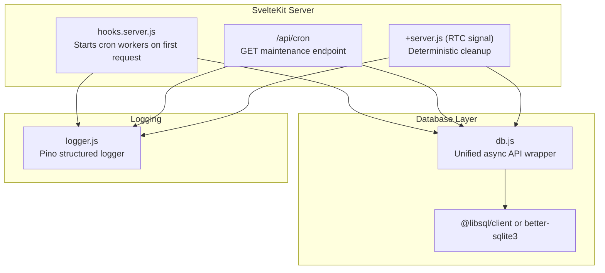
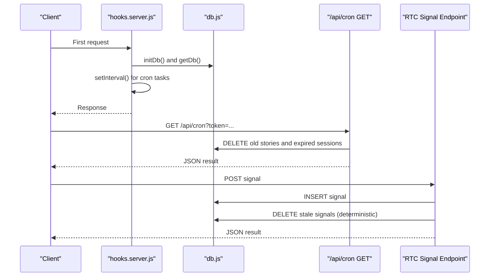
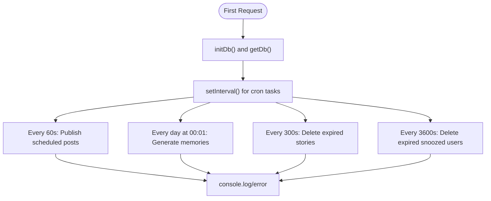
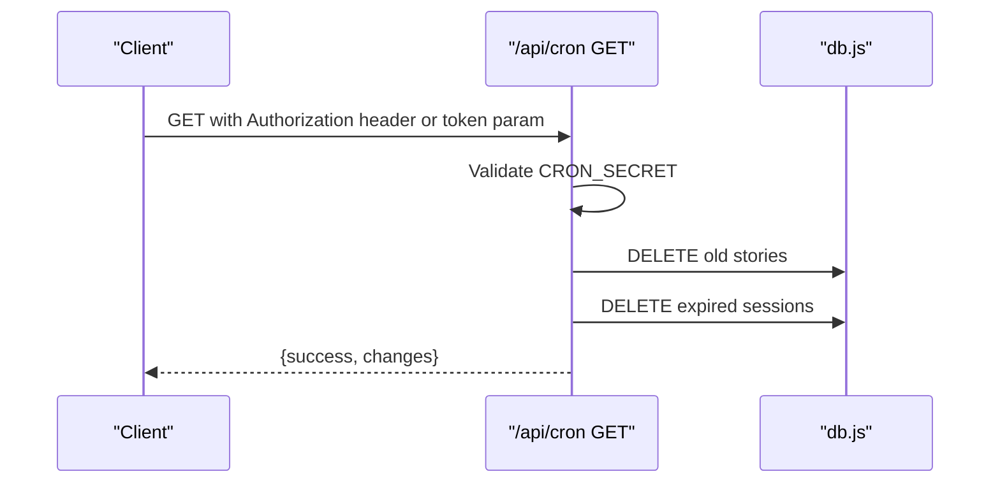
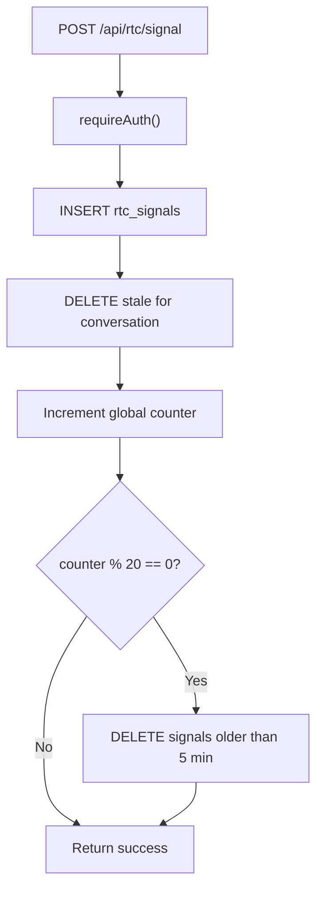
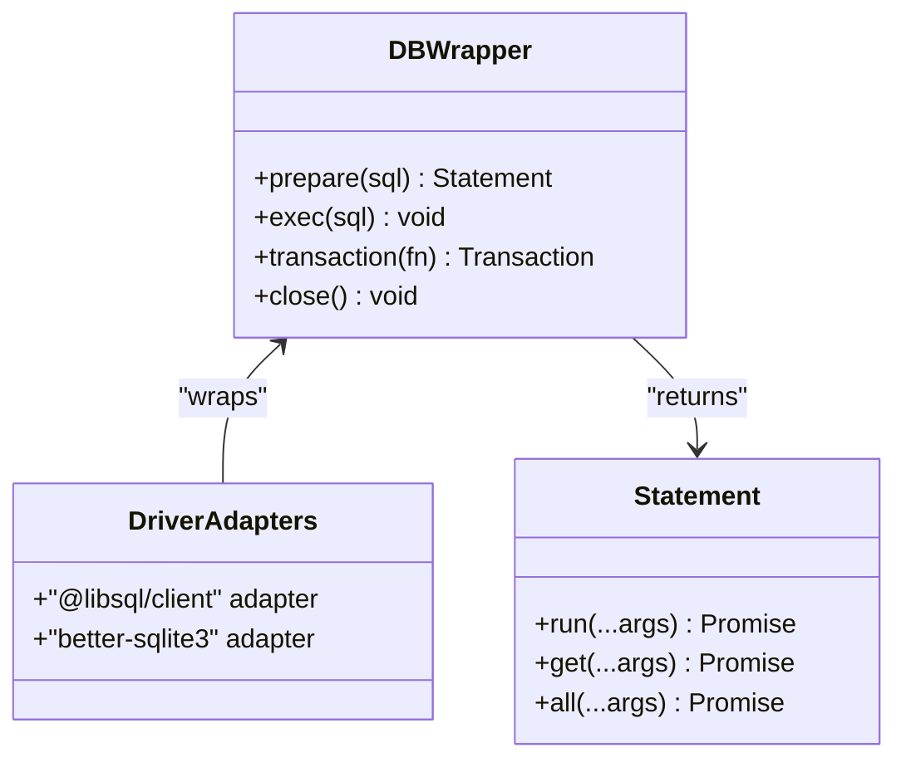
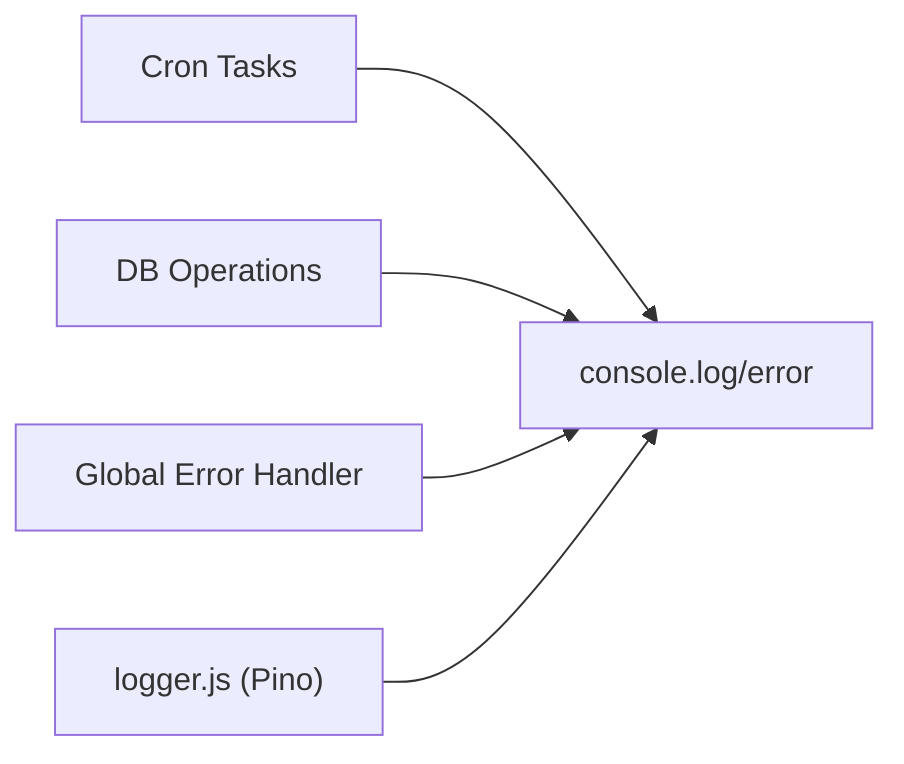
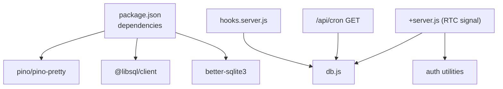

# Cron Jobs & Background Processing

<cite>
**Referenced Files in This Document**
- [hooks.server.js](file://frontend/src/hooks.server.js)
- [+server.js (cron endpoint)](file://frontend/src/routes/api/cron/+server.js)
- [+server.js (RTC signal)](file://frontend/src/routes/api/rtc/signal/+server.js)
- [db.js](file://frontend/src/lib/server/db.js)
- [logger.js](file://frontend/src/lib/server/logger.js)
- [package.json](file://frontend/package.json)
</cite>

## Table of Contents
1. [Introduction](#introduction)
2. [Project Structure](#project-structure)
3. [Core Components](#core-components)
4. [Architecture Overview](#architecture-overview)
5. [Detailed Component Analysis](#detailed-component-analysis)
6. [Dependency Analysis](#dependency-analysis)
7. [Performance Considerations](#performance-considerations)
8. [Troubleshooting Guide](#troubleshooting-guide)
9. [Conclusion](#conclusion)

## Introduction
This document explains VSocial’s cron job system and background processing capabilities implemented within the SvelteKit server environment. It covers scheduled task execution, system maintenance automation, and periodic cleanup operations. It also documents how cron jobs are configured and managed, along with examples of automated tasks such as signal cleanup, user session management, and system health checks. The guide addresses scheduling strategies, error handling, logging mechanisms, and monitoring approaches for reliable background processing.

## Project Structure
VSocial organizes cron-related logic across server hooks and API endpoints:
- Server hooks initialize the database and start recurring background tasks on the first request.
- Dedicated API endpoints expose controlled triggers for maintenance tasks requiring explicit authorization.
- Real-time signaling pathways include deterministic cleanup routines integrated with request handling.

**Diagram sources**
- [hooks.server.js:18-103](file://frontend/src/hooks.server.js#L18-L103)
- [+server.js (cron endpoint):5-31](file://frontend/src/routes/api/cron/+server.js#L5-L31)
- [+server.js (RTC signal):5-57](file://frontend/src/routes/api/rtc/signal/+server.js#L5-L57)
- [db.js:31-113](file://frontend/src/lib/server/db.js#L31-L113)
- [logger.js:9-26](file://frontend/src/lib/server/logger.js#L9-L26)

**Section sources**
- [hooks.server.js:1-179](file://frontend/src/hooks.server.js#L1-L179)
- [+server.js (cron endpoint):1-32](file://frontend/src/routes/api/cron/+server.js#L1-L32)
- [+server.js (RTC signal):1-58](file://frontend/src/routes/api/rtc/signal/+server.js#L1-L58)
- [db.js:1-209](file://frontend/src/lib/server/db.js#L1-L209)
- [logger.js:1-27](file://frontend/src/lib/server/logger.js#L1-L27)

## Core Components
- Cron worker orchestration: Starts on the first incoming request and runs periodic tasks using Node.js timers.
- Maintenance endpoint: Authorized GET endpoint to trigger cleanup tasks.
- Deterministic cleanup: Integrated cleanup in real-time signaling pathway to prevent accumulation of stale records.
- Database abstraction: Unified async API wrapper supporting two drivers with consistent transaction semantics.
- Logging: Structured logging via Pino for operational visibility.

Key responsibilities:
- Scheduled post publishing
- Daily “Memories” notifications
- Periodic cleanup of expired stories and snoozed users
- Endpoint-triggered cleanup of old stories and expired sessions
- Deterministic RTC signal cleanup per request cadence

**Section sources**
- [hooks.server.js:18-103](file://frontend/src/hooks.server.js#L18-L103)
- [+server.js (cron endpoint):5-31](file://frontend/src/routes/api/cron/+server.js#L5-L31)
- [+server.js (RTC signal):43-50](file://frontend/src/routes/api/rtc/signal/+server.js#L43-L50)
- [db.js:31-113](file://frontend/src/lib/server/db.js#L31-L113)
- [logger.js:9-26](file://frontend/src/lib/server/logger.js#L9-L26)

## Architecture Overview
The cron system is event-driven and timer-based:
- On first request, server hooks initialize the database and schedule recurring tasks.
- Tasks execute at fixed intervals, performing database operations and emitting logs.
- An authorized endpoint allows external triggers for maintenance cleanup.
- Real-time signaling integrates cleanup into request handling with deterministic cadence.

**Diagram sources**
- [hooks.server.js:18-103](file://frontend/src/hooks.server.js#L18-L103)
- [+server.js (cron endpoint):5-31](file://frontend/src/routes/api/cron/+server.js#L5-L31)
- [+server.js (RTC signal):5-57](file://frontend/src/routes/api/rtc/signal/+server.js#L5-L57)
- [db.js:31-113](file://frontend/src/lib/server/db.js#L31-L113)

## Detailed Component Analysis

### Cron Worker Orchestration
The server hooks module initializes the database and starts four recurring tasks:
- Every minute: Publish scheduled posts and notify followers.
- Daily at 00:01: Generate “Memories” notifications for yearly anniversaries.
- Every five minutes: Remove expired stories.
- Every hour: Remove expired snoozed users.

Each task is wrapped in try/catch blocks and logs outcomes or errors. The scheduler is guarded against duplicate initialization.

**Diagram sources**
- [hooks.server.js:18-103](file://frontend/src/hooks.server.js#L18-L103)

**Section sources**
- [hooks.server.js:18-103](file://frontend/src/hooks.server.js#L18-L103)

### Authorized Maintenance Endpoint
The cron endpoint enforces authorization via a shared secret and performs:
- Deletion of stories older than 24 hours.
- Removal of expired user sessions.

It returns a JSON response indicating success and counts of affected rows, or an error on failure.

**Diagram sources**
- [+server.js (cron endpoint):5-31](file://frontend/src/routes/api/cron/+server.js#L5-L31)
- [db.js:31-113](file://frontend/src/lib/server/db.js#L31-L113)

**Section sources**
- [+server.js (cron endpoint):5-31](file://frontend/src/routes/api/cron/+server.js#L5-L31)

### Deterministic RTC Signal Cleanup
The RTC signal endpoint:
- Requires authentication.
- Inserts signaling data into a lazily created table.
- Performs a targeted cleanup of stale signals for the current conversation before insertion.
- Executes a global cleanup of stale signals every N requests using a deterministic counter.

**Diagram sources**
- [+server.js (RTC signal):5-57](file://frontend/src/routes/api/rtc/signal/+server.js#L5-L57)

**Section sources**
- [+server.js (RTC signal):5-57](file://frontend/src/routes/api/rtc/signal/+server.js#L5-L57)

### Database Abstraction and Transactions
The database wrapper normalizes operations across drivers:
- Provides prepare/run/get/all methods returning promises.
- Implements transactions with commit/rollback semantics.
- Exposes exec for multi-statement scripts.
- Wraps driver-specific errors into unified messages.

**Diagram sources**
- [db.js:31-113](file://frontend/src/lib/server/db.js#L31-L113)

**Section sources**
- [db.js:31-113](file://frontend/src/lib/server/db.js#L31-L113)

### Logging and Monitoring
- Structured logging via Pino supports development-friendly pretty printing and configurable log levels.
- Console logging is used for operational messages from cron tasks and error reporting.
- Global error handler captures unhandled async errors and returns sanitized responses.

**Diagram sources**
- [hooks.server.js:43-44](file://frontend/src/hooks.server.js#L43-L44)
- [hooks.server.js:87-88](file://frontend/src/hooks.server.js#L87-L88)
- [logger.js:9-26](file://frontend/src/lib/server/logger.js#L9-L26)
- [hooks.server.js:154-178](file://frontend/src/hooks.server.js#L154-L178)

**Section sources**
- [logger.js:9-26](file://frontend/src/lib/server/logger.js#L9-L26)
- [hooks.server.js:154-178](file://frontend/src/hooks.server.js#L154-L178)

## Dependency Analysis
- Runtime dependencies include Pino for logging and database drivers (@libsql/client or better-sqlite3).
- Cron logic depends on the database wrapper for all persistence operations.
- The RTC signal endpoint depends on authentication and database utilities.

**Diagram sources**
- [package.json:17-32](file://frontend/package.json#L17-L32)
- [hooks.server.js:5](file://frontend/src/hooks.server.js#L5)
- [+server.js (cron endpoint):3](file://frontend/src/routes/api/cron/+server.js#L3)
- [+server.js (RTC signal):2](file://frontend/src/routes/api/rtc/signal/+server.js#L2)

**Section sources**
- [package.json:17-32](file://frontend/package.json#L17-L32)

## Performance Considerations
- Timer granularity: Tasks run on 60-second, 300-second, and 3600-second intervals. Adjust intervals based on workload and database capacity.
- Batch limits: Scheduled post publishing caps batch size to reduce lock contention.
- Cleanup cadence: Deterministic cleanup avoids probabilistic misses and reduces accumulated stale data.
- WAL mode: Database initialization enables WAL mode for improved concurrency and durability.
- Logging overhead: Prefer structured logging for production and minimize verbose console output in hot paths.

[No sources needed since this section provides general guidance]

## Troubleshooting Guide
Common issues and remedies:
- Unauthorized access to maintenance endpoint: Ensure CRON_SECRET is set and matches the Authorization header or token query parameter.
- Database initialization failures: Verify environment variables for database URL and credentials; confirm driver availability.
- Cron tasks not starting: Confirm the first request reaches the hooks.handle path so cron workers can be initialized.
- Excessive logging: Tune LOG_LEVEL and review console.log statements in cron tasks.
- RTC signal cleanup not triggered: Verify the deterministic counter modulo logic and that requests are being processed.

Operational checks:
- Verify console logs for “[cron]” messages after startup and at scheduled times.
- Monitor database change counts returned by the maintenance endpoint.
- Inspect global error handler logs for unhandled exceptions.

**Section sources**
- [+server.js (cron endpoint):9-13](file://frontend/src/routes/api/cron/+server.js#L9-L13)
- [hooks.server.js:8-14](file://frontend/src/hooks.server.js#L8-L14)
- [hooks.server.js:154-178](file://frontend/src/hooks.server.js#L154-L178)

## Conclusion
VSocial’s cron and background processing system combines timer-based tasks, an authorized maintenance endpoint, and deterministic cleanup routines to maintain a responsive and efficient platform. The modular design leverages a unified database abstraction and structured logging to ensure reliability and observability. By tuning intervals, monitoring logs, and validating configurations, administrators can achieve robust automation for scheduled publishing, daily reminders, and periodic maintenance.