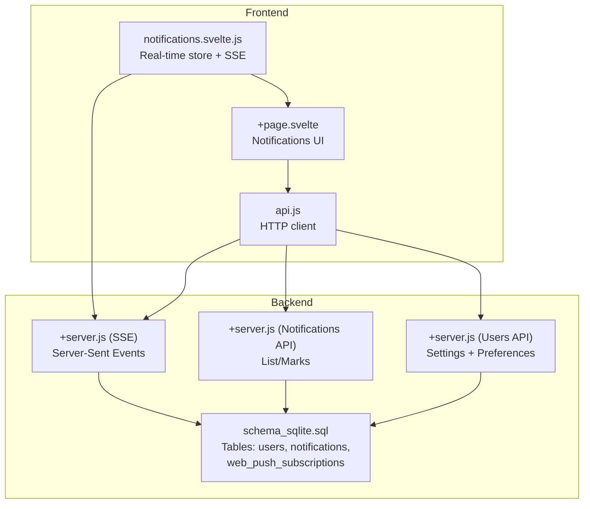
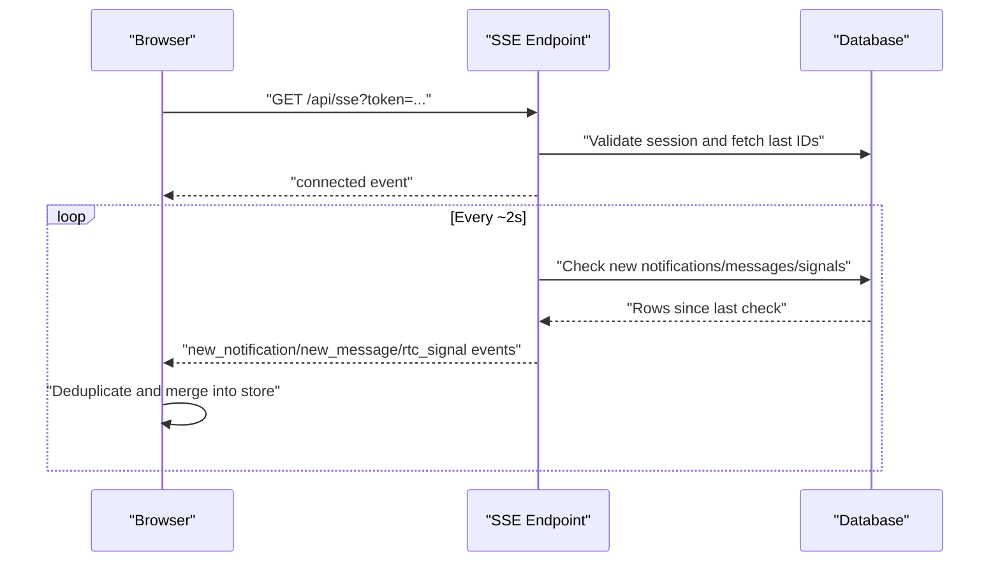
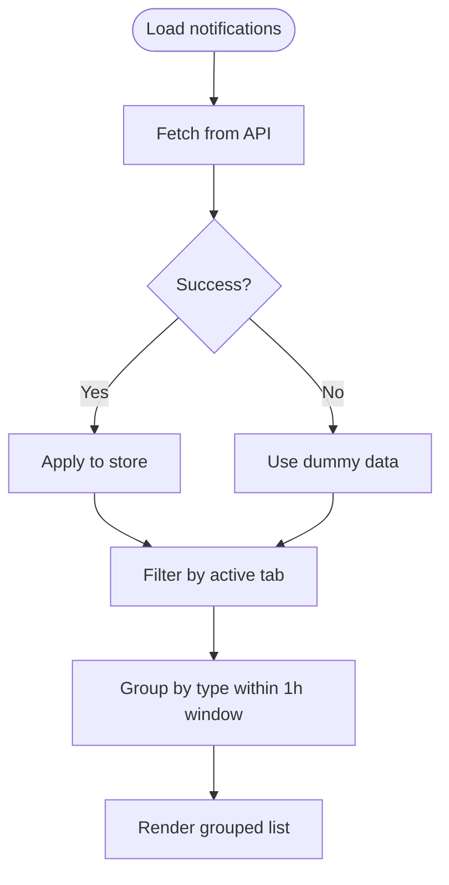
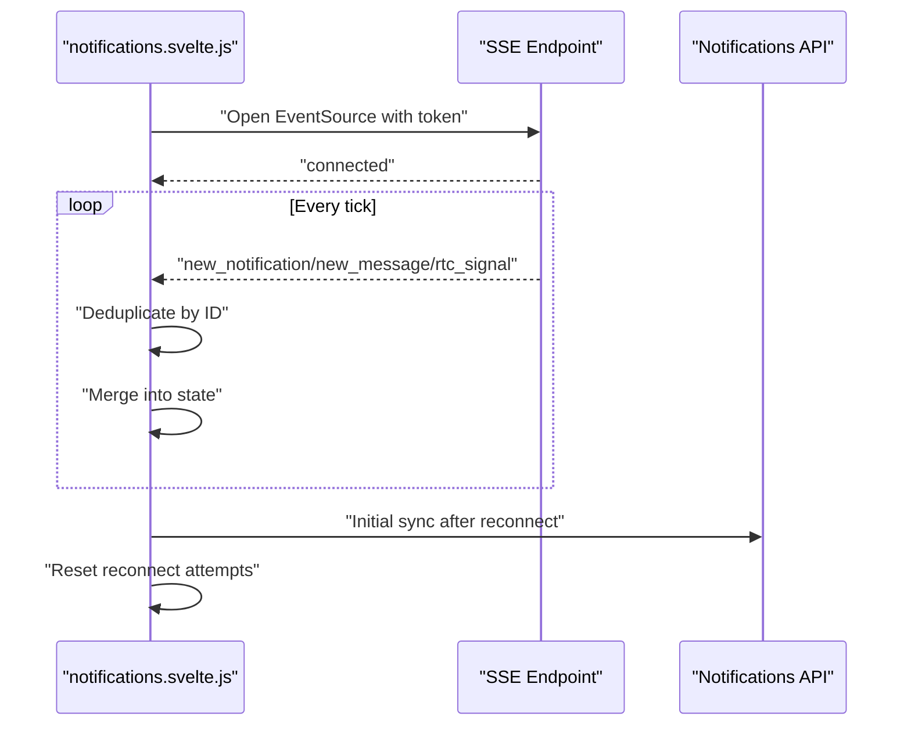
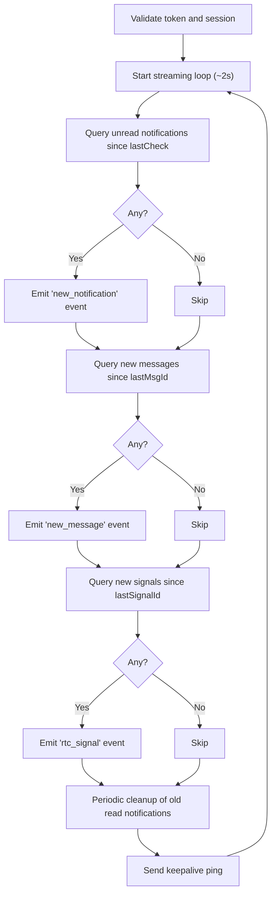
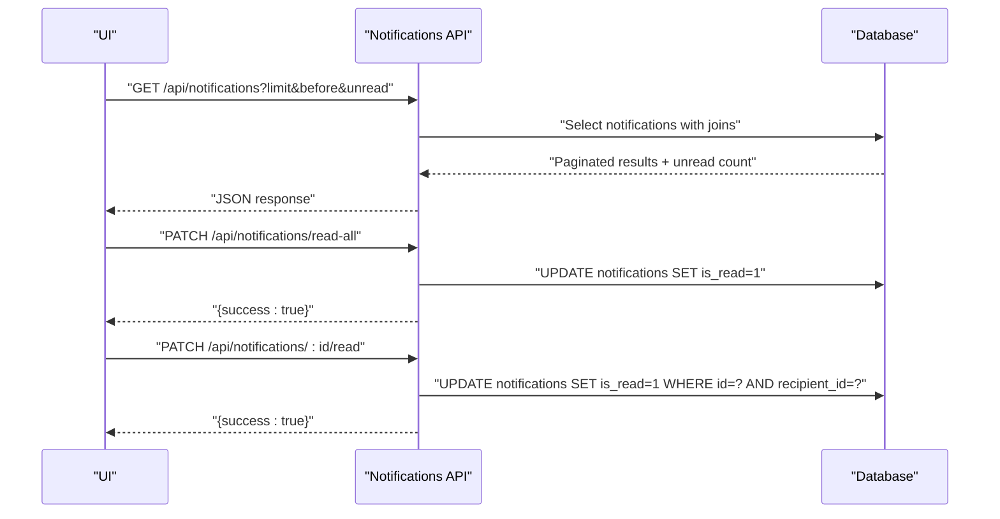
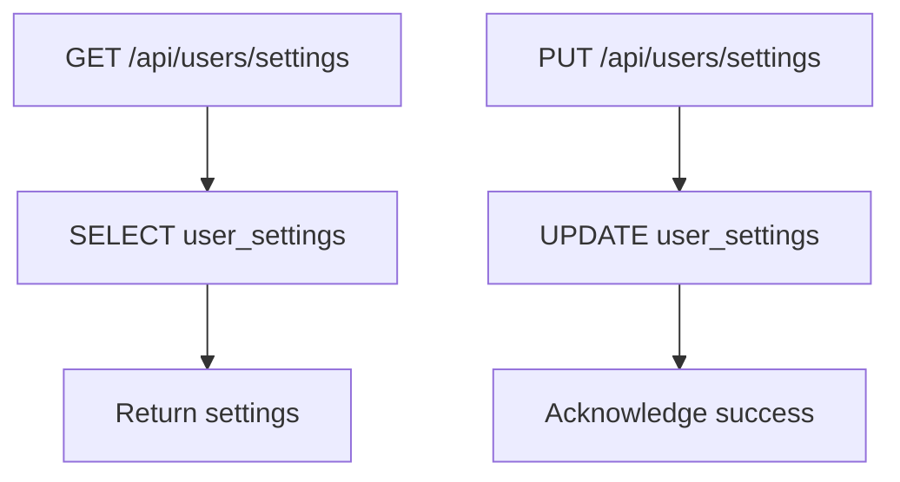
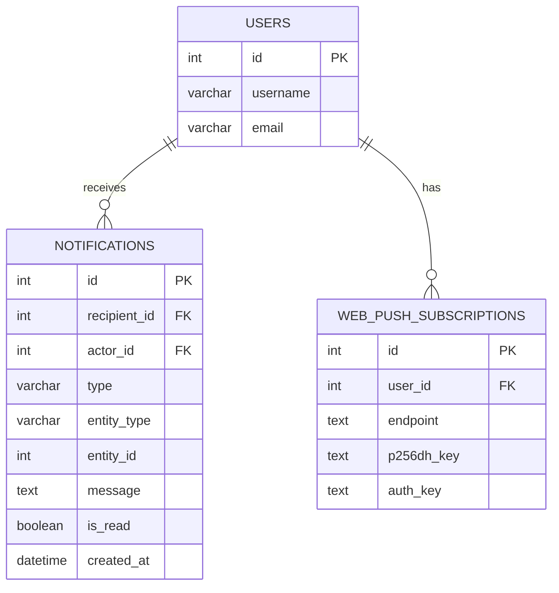
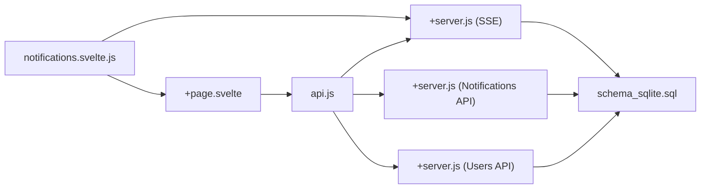

# Live Updates & Notifications

<cite>
**Referenced Files in This Document**
- [+page.svelte](file://frontend/src/routes/notifications/+page.svelte)
- [api.js](file://frontend/src/lib/api.js)
- [notifications.svelte.js](file://frontend/src/lib/stores/notifications.svelte.js)
- [+server.js (SSE)](file://frontend/src/routes/api/sse/+server.js)
- [+server.js (Notifications API)](file://frontend/src/routes/api/notifications/[...path]/+server.js)
- [schema_sqlite.sql](file://schema_sqlite.sql)
- [+server.js (Users API)](file://frontend/src/routes/api/users/[...path]/+server.js)
</cite>

## Table of Contents
1. [Introduction](#introduction)
2. [Project Structure](#project-structure)
3. [Core Components](#core-components)
4. [Architecture Overview](#architecture-overview)
5. [Detailed Component Analysis](#detailed-component-analysis)
6. [Dependency Analysis](#dependency-analysis)
7. [Performance Considerations](#performance-considerations)
8. [Troubleshooting Guide](#troubleshooting-guide)
9. [Conclusion](#conclusion)

## Introduction
This document explains VSocial’s live update and notification delivery system. It covers real-time mechanisms for notifications, messages, and WebRTC signaling using Server-Sent Events (SSE), the notification types stored and delivered, user preference controls, grouping and presentation logic in the UI, and operational safeguards such as deduplication, exponential backoff, and periodic cleanup. It also outlines practical examples for routing, batching, and delivery confirmation, along with strategies for throttling and performance optimization under high-volume scenarios.

## Project Structure
The live updates and notifications system spans three primary areas:
- Frontend UI and store: notification list rendering, grouping, and real-time updates
- SSE endpoint: continuous polling and streaming of new notifications/messages/signals
- Backend APIs: notification retrieval, marking as read, and user settings

**Diagram sources**
- [+page.svelte:1-322](file://frontend/src/routes/notifications/+page.svelte#L1-L322)
- [notifications.svelte.js:1-232](file://frontend/src/lib/stores/notifications.svelte.js#L1-L232)
- [api.js:243-250](file://frontend/src/lib/api.js#L243-L250)
- [+server.js (SSE):1-185](file://frontend/src/routes/api/sse/+server.js#L1-L185)
- [+server.js (Notifications API):1-75](file://frontend/src/routes/api/notifications/[...path]/+server.js#L1-L75)
- [+server.js (Users API):311-325](file://frontend/src/routes/api/users/[...path]/+server.js#L311-L325)
- [schema_sqlite.sql:289-299](file://schema_sqlite.sql#L289-L299)

**Section sources**
- [+page.svelte:1-322](file://frontend/src/routes/notifications/+page.svelte#L1-L322)
- [notifications.svelte.js:1-232](file://frontend/src/lib/stores/notifications.svelte.js#L1-L232)
- [api.js:243-250](file://frontend/src/lib/api.js#L243-L250)
- [+server.js (SSE):1-185](file://frontend/src/routes/api/sse/+server.js#L1-L185)
- [+server.js (Notifications API):1-75](file://frontend/src/routes/api/notifications/[...path]/+server.js#L1-L75)
- [+server.js (Users API):311-325](file://frontend/src/routes/api/users/[...path]/+server.js#L311-L325)
- [schema_sqlite.sql:289-299](file://schema_sqlite.sql#L289-L299)

## Core Components
- Notification UI and grouping:
  - Renders a paginated, filterable list of notifications with per-type grouping within a 1-hour window.
  - Supports marking individual and all notifications as read, with optimistic updates and fallbacks.
- Real-time store and SSE:
  - Establishes an SSE connection with token-based authentication and validates sessions against the database.
  - Receives and deduplicates new notifications, messages, and WebRTC signals.
  - Implements exponential backoff with jitter and caps for reconnection.
  - Periodically syncs initial notifications upon reconnect and cleans up old read notifications.
- Backend APIs:
  - SSE endpoint streams new notifications, messages, and signals at ~2-second intervals.
  - Notifications API supports listing with pagination cursors, marking as read, and bulk read.
  - Users API exposes user settings including notification preferences and profile operations.

**Section sources**
- [+page.svelte:1-322](file://frontend/src/routes/notifications/+page.svelte#L1-L322)
- [notifications.svelte.js:1-232](file://frontend/src/lib/stores/notifications.svelte.js#L1-L232)
- [+server.js (SSE):1-185](file://frontend/src/routes/api/sse/+server.js#L1-L185)
- [+server.js (Notifications API):1-75](file://frontend/src/routes/api/notifications/[...path]/+server.js#L1-L75)
- [+server.js (Users API):311-325](file://frontend/src/routes/api/users/[...path]/+server.js#L311-L325)

## Architecture Overview
The system uses SSE for low-latency, long-lived connections to deliver real-time updates. The frontend maintains a local store that mirrors server-side state, applies grouping and deduplication, and presents a responsive UI. Backend endpoints enforce authentication and authorization, query the database for new items, and return structured payloads.

**Diagram sources**
- [+server.js (SSE):9-185](file://frontend/src/routes/api/sse/+server.js#L9-L185)
- [notifications.svelte.js:35-144](file://frontend/src/lib/stores/notifications.svelte.js#L35-L144)

**Section sources**
- [+server.js (SSE):1-185](file://frontend/src/routes/api/sse/+server.js#L1-L185)
- [notifications.svelte.js:1-232](file://frontend/src/lib/stores/notifications.svelte.js#L1-L232)

## Detailed Component Analysis

### Notification UI and Grouping (+page.svelte)
- Rendering:
  - Loads initial notifications via the API and falls back to dummy data on failure.
  - Provides tabs to filter by type: all, mention, like, comment, follow, system.
- Grouping:
  - Groups multiple notifications of the same type within a 1-hour window.
  - Generates localized grouped messages summarizing counts and actor names.
- Interactions:
  - Marks single or all notifications as read with optimistic updates and local fallbacks.
  - Displays relative timestamps and type-specific icons.

**Diagram sources**
- [+page.svelte:92-144](file://frontend/src/routes/notifications/+page.svelte#L92-L144)

**Section sources**
- [+page.svelte:1-322](file://frontend/src/routes/notifications/+page.svelte#L1-L322)

### Real-Time Store and SSE (notifications.svelte.js)
- Connection lifecycle:
  - Validates token presence and opens an EventSource to the SSE endpoint.
  - Resets reconnect attempts on successful open and triggers an initial sync.
- Event handling:
  - Parses and deduplicates incoming notifications, messages, and RTC signals by ID.
  - Maintains capped queues for new messages and signals to avoid memory growth.
- Reconnection:
  - Uses exponential backoff with jitter and caps at 30 seconds.
  - Stops after a fixed number of attempts and logs guidance to refresh.
- Cleanup:
  - On reconnect, fetches initial notifications and updates unread counts.
  - Clears processed IDs sets to prevent duplicates across sessions.

**Diagram sources**
- [notifications.svelte.js:35-175](file://frontend/src/lib/stores/notifications.svelte.js#L35-L175)
- [+server.js (SSE):63-174](file://frontend/src/routes/api/sse/+server.js#L63-L174)

**Section sources**
- [notifications.svelte.js:1-232](file://frontend/src/lib/stores/notifications.svelte.js#L1-L232)

### SSE Endpoint Implementation (+server.js)
- Authentication and session validation:
  - Reads token from query string, decodes it, and checks session validity in the database.
- Streaming loop:
  - Runs every ~2 seconds, checking for new notifications, messages, and signals.
  - Emits structured events with JSON payloads for each category.
- Cursor management:
  - Tracks last IDs for messages and signals to avoid duplicates and enable incremental sync.
- Maintenance:
  - Periodically deletes old read notifications to keep the table lean.
  - Sends keepalive pings to maintain connection health.

**Diagram sources**
- [+server.js (SSE):9-185](file://frontend/src/routes/api/sse/+server.js#L9-L185)

**Section sources**
- [+server.js (SSE):1-185](file://frontend/src/routes/api/sse/+server.js#L1-L185)

### Notifications API (+server.js)
- Listing:
  - Supports pagination via limit and cursor (before parameter).
  - Optional unread-only filtering.
- Marking as read:
  - Single notification and bulk “read all” endpoints.
- Deletion:
  - Deletes a notification by ID for the authenticated user.

**Diagram sources**
- [+server.js (Notifications API):8-75](file://frontend/src/routes/api/notifications/[...path]/+server.js#L8-L75)

**Section sources**
- [+server.js (Notifications API):1-75](file://frontend/src/routes/api/notifications/[...path]/+server.js#L1-L75)

### Users API and Preferences (+server.js)
- Settings:
  - Retrieves and updates user notification preferences (e.g., email, push, DMs).
- Profile:
  - Updates profile fields and manages avatars and cover images.

**Diagram sources**
- [+server.js (Users API):311-325](file://frontend/src/routes/api/users/[...path]/+server.js#L311-L325)

**Section sources**
- [+server.js (Users API):311-325](file://frontend/src/routes/api/users/[...path]/+server.js#L311-L325)

### Database Model for Notifications (schema_sqlite.sql)
- Core table:
  - notifications: recipient, actor, type, entity reference, message, read flag, timestamps.
- Index:
  - Composite index on recipient, read flag, and created_at for efficient queries.
- Push subscriptions:
  - web_push_subscriptions: user push subscription records for browser push notifications.

**Diagram sources**
- [schema_sqlite.sql:289-299](file://schema_sqlite.sql#L289-L299)
- [schema_sqlite.sql:623-631](file://schema_sqlite.sql#L623-L631)

**Section sources**
- [schema_sqlite.sql:289-299](file://schema_sqlite.sql#L289-L299)
- [schema_sqlite.sql:623-631](file://schema_sqlite.sql#L623-L631)

## Dependency Analysis
- Frontend depends on:
  - API client for HTTP requests to SSE and notifications endpoints.
  - SSE store for real-time updates and connection lifecycle.
  - UI component for rendering and grouping notifications.
- Backend depends on:
  - Database for storing users, notifications, and push subscriptions.
  - Authentication middleware to validate tokens and sessions.
- Coupling and cohesion:
  - SSE endpoint is cohesive around streaming logic and database queries.
  - UI grouping is cohesive around presentation concerns and local state.

**Diagram sources**
- [+page.svelte:1-322](file://frontend/src/routes/notifications/+page.svelte#L1-L322)
- [api.js:243-250](file://frontend/src/lib/api.js#L243-L250)
- [+server.js (SSE):1-185](file://frontend/src/routes/api/sse/+server.js#L1-L185)
- [+server.js (Notifications API):1-75](file://frontend/src/routes/api/notifications/[...path]/+server.js#L1-L75)
- [+server.js (Users API):311-325](file://frontend/src/routes/api/users/[...path]/+server.js#L311-L325)
- [schema_sqlite.sql:289-299](file://schema_sqlite.sql#L289-L299)

**Section sources**
- [+page.svelte:1-322](file://frontend/src/routes/notifications/+page.svelte#L1-L322)
- [api.js:243-250](file://frontend/src/lib/api.js#L243-L250)
- [notifications.svelte.js:1-232](file://frontend/src/lib/stores/notifications.svelte.js#L1-L232)
- [+server.js (SSE):1-185](file://frontend/src/routes/api/sse/+server.js#L1-L185)
- [+server.js (Notifications API):1-75](file://frontend/src/routes/api/notifications/[...path]/+server.js#L1-L75)
- [+server.js (Users API):311-325](file://frontend/src/routes/api/users/[...path]/+server.js#L311-L325)
- [schema_sqlite.sql:289-299](file://schema_sqlite.sql#L289-L299)

## Performance Considerations
- SSE interval tuning:
  - Current interval is ~2 seconds; adjust based on latency vs. throughput trade-offs.
- Deduplication:
  - Maintained via processed ID sets in the store to prevent duplicate renders.
- Queue limits:
  - New messages and signals queues are capped to bound memory usage.
- Pagination:
  - Notifications listing uses cursor-based pagination to reduce payload sizes.
- Cleanup:
  - Old read notifications are periodically removed to keep the table small.
- Backoff:
  - Exponential backoff with jitter prevents thundering herds on reconnection storms.

[No sources needed since this section provides general guidance]

## Troubleshooting Guide
- SSE connection fails:
  - Verify token presence and validity; ensure session exists and is not expired.
  - Check server logs for initialization errors and network interruptions.
- No real-time updates:
  - Confirm the SSE endpoint emits keepalive pings and events are parsed by the store.
  - Inspect deduplication logic and processed ID sets.
- Mark-as-read not reflected:
  - Ensure PATCH endpoints are called and the store updates unread counts locally.
  - Confirm database updates succeed and the UI re-renders.
- High memory usage:
  - Review capped queue sizes for new messages/signals and consider reducing limits.
- Cleanup not happening:
  - Verify periodic maintenance runs and permissions to execute DELETE statements.

**Section sources**
- [notifications.svelte.js:122-139](file://frontend/src/lib/stores/notifications.svelte.js#L122-L139)
- [+server.js (SSE):138-149](file://frontend/src/routes/api/sse/+server.js#L138-L149)
- [+server.js (Notifications API):49-75](file://frontend/src/routes/api/notifications/[...path]/+server.js#L49-L75)

## Conclusion
VSocial’s live updates and notifications system combines a robust SSE pipeline with a resilient frontend store and a pragmatic UI. It delivers real-time notifications, messages, and signaling with strong safeguards for reliability, deduplication, and performance. User preferences are exposed via the Users API, enabling granular control over notification channels. The architecture supports scaling through queue caps, periodic cleanup, and backoff strategies, while the UI provides a friendly grouping and filtering experience.