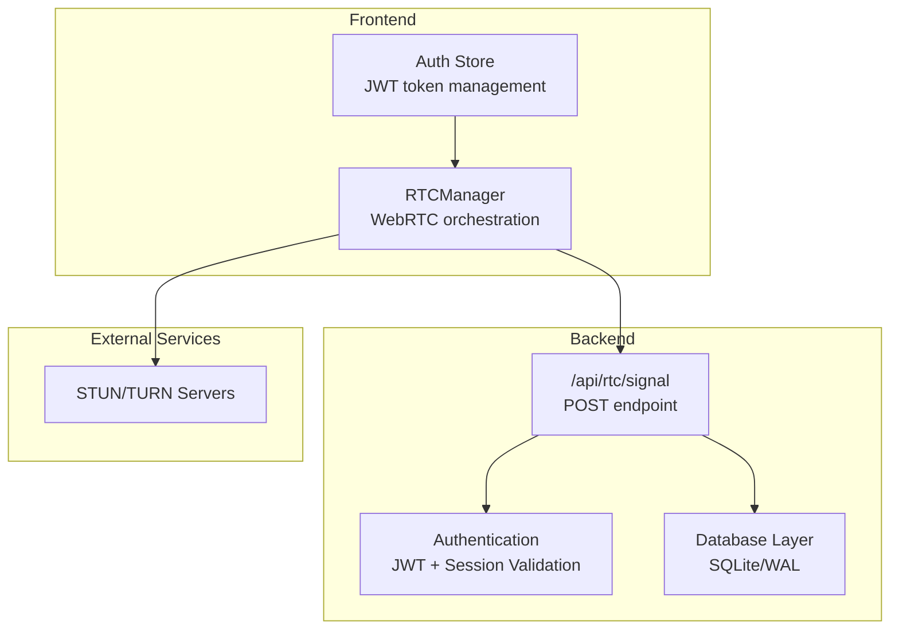
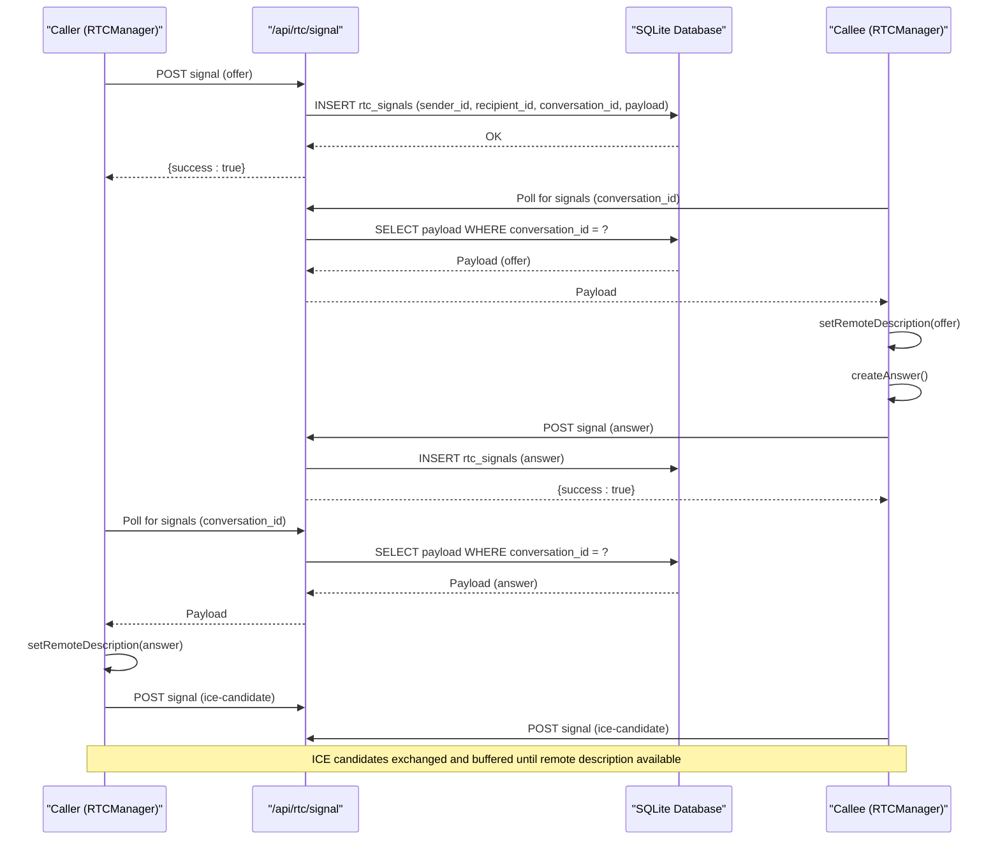
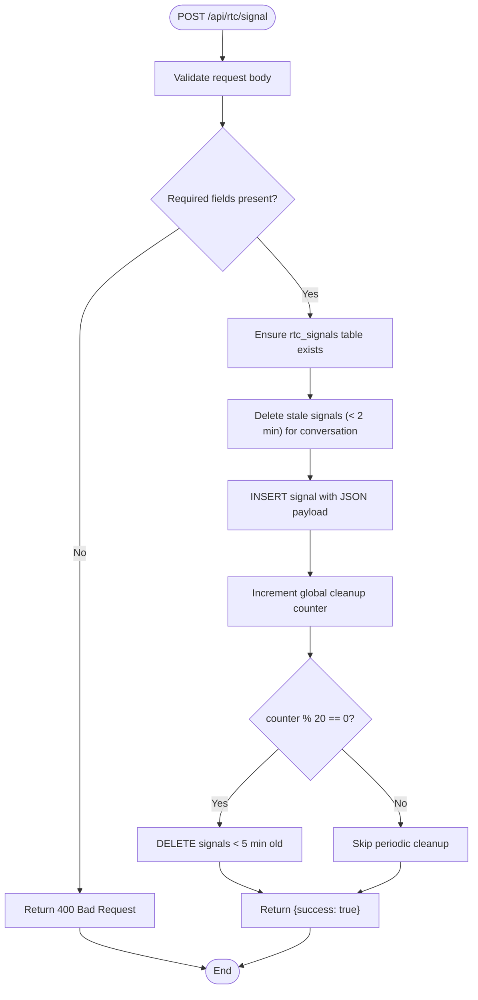
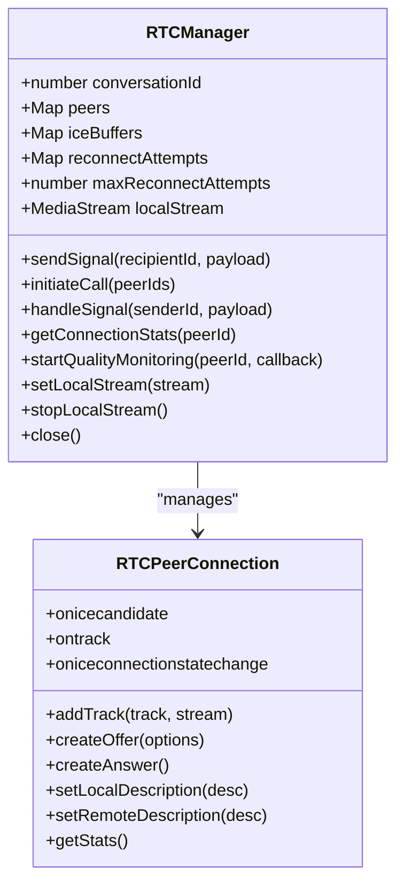
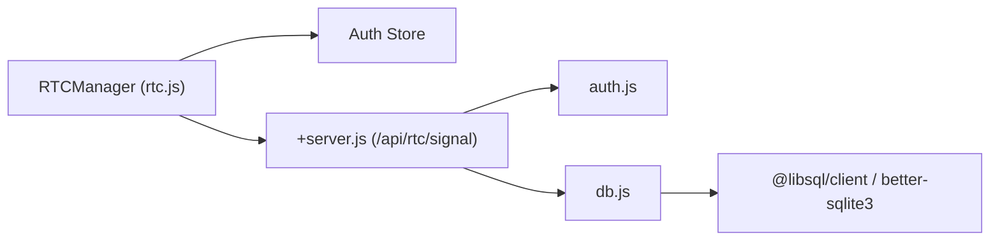

# RTC Signaling System

<cite>
**Referenced Files in This Document**
- [+server.js](file://frontend/src/routes/api/rtc/signal/+server.js)
- [rtc.js](file://frontend/src/lib/rtc.js)
- [db.js](file://frontend/src/lib/server/db.js)
- [auth.js](file://frontend/src/lib/server/auth.js)
- [jwt.js](file://frontend/src/lib/server/jwt.js)
- [hooks.server.js](file://frontend/src/hooks.server.js)
- [schema_sqlite.sql](file://schema_sqlite.sql)
- [001_schema.sql](file://migrations/001_schema.sql)
- [002_phase2.sql](file://migrations/002_phase2.sql)
</cite>

## Table of Contents
1. [Introduction](#introduction)
2. [Project Structure](#project-structure)
3. [Core Components](#core-components)
4. [Architecture Overview](#architecture-overview)
5. [Detailed Component Analysis](#detailed-component-analysis)
6. [Dependency Analysis](#dependency-analysis)
7. [Performance Considerations](#performance-considerations)
8. [Troubleshooting Guide](#troubleshooting-guide)
9. [Conclusion](#conclusion)

## Introduction
This document provides comprehensive documentation for VSocial's Real-time Communication (RTC) signaling system. It explains how voice and video calls are coordinated using a lightweight signaling mechanism built on SQLite, how peer-to-peer connections are established, and how ICE candidates are exchanged. The system implements conversation-based signaling isolation, automatic cleanup strategies, and robust error handling to support scalable concurrent RTC sessions.

## Project Structure
The RTC signaling system spans both the frontend and backend layers:
- Frontend: WebRTC manager handles SDP offers/answers, ICE candidates, and connection lifecycle.
- Backend: A SvelteKit server endpoint validates authentication, persists signals to SQLite, and performs deterministic cleanup.
- Database: SQLite abstraction layer supports both remote and local deployments with WAL mode enabled.
- Authentication: JWT-based session validation ensures secure access to signaling resources.

**Diagram sources**
- [+server.js:1-58](file://frontend/src/routes/api/rtc/signal/+server.js#L1-L58)
- [rtc.js:1-299](file://frontend/src/lib/rtc.js#L1-L299)
- [db.js:1-209](file://frontend/src/lib/server/db.js#L1-L209)
- [auth.js:1-92](file://frontend/src/lib/server/auth.js#L1-L92)

**Section sources**
- [+server.js:1-58](file://frontend/src/routes/api/rtc/signal/+server.js#L1-L58)
- [rtc.js:1-299](file://frontend/src/lib/rtc.js#L1-L299)
- [db.js:1-209](file://frontend/src/lib/server/db.js#L1-L209)
- [auth.js:1-92](file://frontend/src/lib/server/auth.js#L1-L92)

## Core Components
- RTCManager (frontend): Manages peer connections, ICE candidate buffering, offer/answer exchange, and reconnection logic.
- Signal Endpoint (backend): Validates JWT, inserts signaling messages into SQLite, and cleans up stale signals.
- Database Abstraction: Unified async API for @libsql/client and better-sqlite3 with WAL mode and pragmas configured.
- Authentication Utilities: JWT encoding/decoding and bearer token extraction for session validation.

Key responsibilities:
- Conversation isolation: Signals are scoped by conversation_id to prevent cross-conversation leakage.
- Automatic cleanup: Stale signals are pruned to keep the signaling table lean during active calls.
- Scalability: Deterministic cleanup via request counters avoids probabilistic misses.

**Section sources**
- [rtc.js:1-299](file://frontend/src/lib/rtc.js#L1-L299)
- [+server.js:1-58](file://frontend/src/routes/api/rtc/signal/+server.js#L1-L58)
- [db.js:1-209](file://frontend/src/lib/server/db.js#L1-L209)
- [auth.js:1-92](file://frontend/src/lib/server/auth.js#L1-L92)

## Architecture Overview
The signaling flow coordinates between two peers within a conversation:
1. Caller creates an RTCPeerConnection and sends an SDP offer via the signaling endpoint.
2. Callee receives the offer, generates an answer, and responds via the same endpoint.
3. ICE candidates are exchanged incrementally and buffered until remote descriptions are available.
4. After hangup, connections are closed and buffers cleared.

**Diagram sources**
- [+server.js:1-58](file://frontend/src/routes/api/rtc/signal/+server.js#L1-L58)
- [rtc.js:1-299](file://frontend/src/lib/rtc.js#L1-L299)

## Detailed Component Analysis

### Backend Signal Endpoint (+server.js)
Responsibilities:
- Authentication: Validates JWT and checks session validity against user_sessions.
- Signal Storage: Creates rtc_signals table lazily and inserts signals with sender_id, recipient_id, conversation_id, and serialized payload.
- Conversation Isolation: Cleans stale signals for the specific conversation before insertion to prevent accumulation during active calls.
- Automatic Cleanup: Performs deterministic cleanup of old signals every N requests using a global counter to avoid probabilistic misses.

Processing logic:
- Request validation: Ensures recipient_id, conversation_id, and payload are present.
- Lazy table creation: Ensures rtc_signals exists before insert.
- Per-conversation cleanup: Removes signals older than 2 minutes for the given conversation.
- Insertion: Stores the signal payload as JSON.
- Periodic cleanup: Deletes signals older than 5 minutes when the request counter modulo 20 equals zero.

**Diagram sources**
- [+server.js:1-58](file://frontend/src/routes/api/rtc/signal/+server.js#L1-L58)

**Section sources**
- [+server.js:1-58](file://frontend/src/routes/api/rtc/signal/+server.js#L1-L58)

### Frontend RTC Manager (rtc.js)
Responsibilities:
- Peer Management: Maintains RTCPeerConnection instances per peer, ICE candidate buffers, and reconnect attempts.
- Offer/Answer Exchange: Initiates calls by sending offers and responding to incoming offers with answers.
- ICE Candidate Handling: Buffers candidates until remote descriptions are available; flushes buffer upon receiving answer.
- Reconnection Logic: Attempts ICE restarts with exponential backoff and caps attempts per peer.
- Statistics: Provides connection quality metrics (packet loss, jitter, RTT) for monitoring.

Key behaviors:
- STUN/TURN configuration: Uses Google STUN and OpenRelay TURN servers.
- Local stream management: Adds tracks to existing peers to avoid DOM exceptions.
- Hangup handling: Closes connections, clears buffers, and notifies UI.

**Diagram sources**
- [rtc.js:1-299](file://frontend/src/lib/rtc.js#L1-L299)

**Section sources**
- [rtc.js:1-299](file://frontend/src/lib/rtc.js#L1-L299)

### Database Abstraction (db.js)
Capabilities:
- Dual-driver support: @libsql/client (preferred) and better-sqlite3 (fallback).
- Unified async API: prepare().run()/get()/all() returning promises.
- WAL mode: Enables journal_mode=WAL and foreign_keys=ON for local deployments.
- Pragmas: Sets synchronous, busy_timeout, cache_size, and temp_store for performance.
- Transaction support: Wraps transaction boundaries for atomic operations.

Initialization:
- Auto-detects driver availability and logs readiness.
- Supports remote and local modes with different pragma configurations.

**Section sources**
- [db.js:1-209](file://frontend/src/lib/server/db.js#L1-L209)

### Authentication Utilities (auth.js, jwt.js)
- JWT utilities: encodeToken, decodeToken, and getBearerToken extraction.
- Session validation: requireAuth verifies JWT and checks user_sessions for expiration.
- Optional auth: optionalAuth allows graceful fallback when token is missing.
- Admin enforcement: requireAdmin validates administrative roles.

Integration:
- The signal endpoint depends on requireAuth to ensure only authenticated users can send signals.
- Sessions are validated against the database to prevent expired or invalid tokens.

**Section sources**
- [auth.js:1-92](file://frontend/src/lib/server/auth.js#L1-L92)
- [jwt.js:1-45](file://frontend/src/lib/server/jwt.js#L1-L45)

### Database Schema and Indexing
The rtc_signals table is designed for efficient conversation-scoped signaling:
- Columns: id, sender_id, recipient_id, conversation_id, payload (TEXT), created_at (DATETIME).
- Indexing: No explicit index on conversation_id; however, cleanup queries use WHERE conversation_id = ? and created_at comparison.
- Cleanup strategy: Two-tier pruning—per-conversation cleanup before insert and periodic cleanup of older records.

Note: The primary schema files define extensive domain tables, while the signaling table is created lazily by the endpoint.

**Section sources**
- [+server.js:17-27](file://frontend/src/routes/api/rtc/signal/+server.js#L17-L27)
- [schema_sqlite.sql:1-702](file://schema_sqlite.sql#L1-L702)
- [001_schema.sql:1-686](file://migrations/001_schema.sql#L1-L686)
- [002_phase2.sql:1-272](file://migrations/002_phase2.sql#L1-L272)

## Dependency Analysis
The signaling system exhibits low coupling and clear separation of concerns:
- Frontend RTCManager depends on:
  - RTC APIs for peer connections and ICE handling.
  - Auth store for JWT token access.
  - Fetch API to POST signals to the backend.
- Backend endpoint depends on:
  - Authentication utilities for JWT/session validation.
  - Database abstraction for SQL operations.
- Database abstraction depends on:
  - Environment variables for driver selection and connection parameters.
  - Driver-specific implementations (@libsql/client or better-sqlite3).

**Diagram sources**
- [rtc.js:1-299](file://frontend/src/lib/rtc.js#L1-L299)
- [+server.js:1-58](file://frontend/src/routes/api/rtc/signal/+server.js#L1-L58)
- [auth.js:1-92](file://frontend/src/lib/server/auth.js#L1-L92)
- [db.js:1-209](file://frontend/src/lib/server/db.js#L1-L209)

**Section sources**
- [rtc.js:1-299](file://frontend/src/lib/rtc.js#L1-L299)
- [+server.js:1-58](file://frontend/src/routes/api/rtc/signal/+server.js#L1-L58)
- [auth.js:1-92](file://frontend/src/lib/server/auth.js#L1-L92)
- [db.js:1-209](file://frontend/src/lib/server/db.js#L1-L209)

## Performance Considerations
- Deterministic cleanup: The periodic cleanup uses a global counter to avoid probabilistic misses, ensuring predictable resource usage.
- Conversation-scoped pruning: Cleaning signals per conversation reduces contention and improves lookup performance.
- SQLite pragmas: WAL mode, synchronous, cache_size, and temp_store are tuned for better concurrency and responsiveness.
- ICE candidate buffering: Prevents redundant signaling and reduces latency by deferring candidate addition until remote descriptions are ready.
- Reconnection backoff: Exponential backoff limits retries and reduces signaling overhead during transient failures.

Scalability tips:
- Monitor cleanup frequency and adjust modulo threshold based on traffic patterns.
- Consider partitioning or indexing on conversation_id if conversations grow very large.
- Ensure TURN servers are reliable to minimize ICE failure scenarios.

[No sources needed since this section provides general guidance]

## Troubleshooting Guide
Common issues and resolutions:
- Authentication failures:
  - Verify JWT presence and validity; ensure user_sessions record exists and is not expired.
  - Check server logs for detailed error messages from the error handler.
- Signal delivery delays:
  - Confirm conversation_id matches between caller and callee.
  - Ensure clients poll the endpoint at reasonable intervals.
- ICE connectivity problems:
  - Validate STUN/TURN server accessibility.
  - Review ICE candidate buffering and remote description availability.
- Database errors:
  - Check for DB run/get/all errors and review SQL statements.
  - Ensure database initialization completes successfully on startup.

Operational checks:
- Confirm database driver availability and logging output.
- Verify cleanup counter increments and periodic deletions occur.
- Inspect signal payloads for malformed JSON or missing fields.

**Section sources**
- [hooks.server.js:154-178](file://frontend/src/hooks.server.js#L154-L178)
- [auth.js:15-44](file://frontend/src/lib/server/auth.js#L15-L44)
- [+server.js:53-56](file://frontend/src/routes/api/rtc/signal/+server.js#L53-L56)
- [db.js:117-167](file://frontend/src/lib/server/db.js#L117-L167)

## Conclusion
VSocial’s RTC signaling system provides a robust, conversation-scoped mechanism for coordinating voice and video calls. By leveraging SQLite for lightweight persistence, deterministic cleanup strategies, and a well-structured frontend/backend contract, the system scales effectively for concurrent RTC sessions. The modular design enables easy maintenance, clear error handling, and straightforward extensibility for future enhancements.