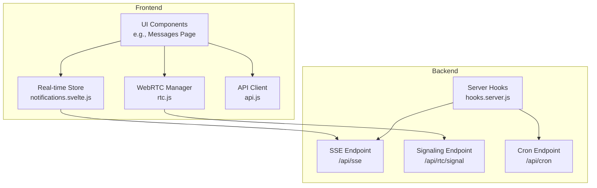
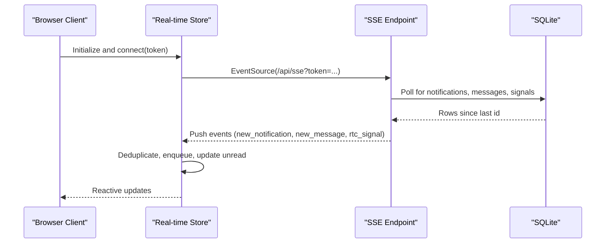
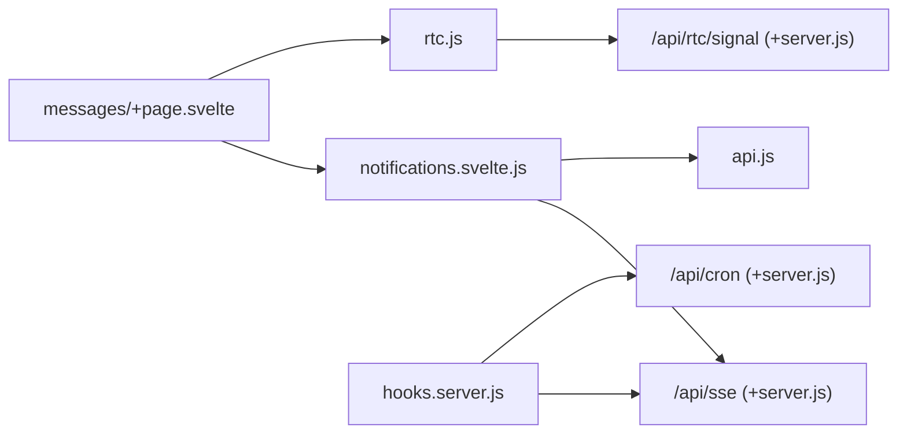

# Real-time Features

<cite>
**Referenced Files in This Document**
- [rtc.js](file://frontend/src/lib/rtc.js)
- [api.js](file://frontend/src/lib/api.js)
- [notifications.svelte.js](file://frontend/src/lib/stores/notifications.svelte.js)
- [sse/+server.js](file://frontend/src/routes/api/sse/+server.js)
- [rtc/signal/+server.js](file://frontend/src/routes/api/rtc/signal/+server.js)
- [cron/+server.js](file://frontend/src/routes/api/cron/+server.js)
- [hooks.server.js](file://frontend/src/hooks.server.js)
- [messages/+page.svelte](file://frontend/src/routes/messages/+page.svelte)
</cite>

## Table of Contents
1. [Introduction](#introduction)
2. [Project Structure](#project-structure)
3. [Core Components](#core-components)
4. [Architecture Overview](#architecture-overview)
5. [Detailed Component Analysis](#detailed-component-analysis)
6. [Dependency Analysis](#dependency-analysis)
7. [Performance Considerations](#performance-considerations)
8. [Troubleshooting Guide](#troubleshooting-guide)
9. [Conclusion](#conclusion)

## Introduction
This document explains VSocial’s real-time capabilities: WebRTC voice/video calls, real-time messaging synchronization via Server-Sent Events (SSE), and scheduled background tasks. It covers WebSocket alternatives (SSE), signaling server mechanics, presence indicators, connection handling, message broadcasting, and robustness strategies such as deduplication, exponential backoff, and periodic cleanup. It also outlines scalability considerations and operational practices for maintaining reliability under load.

## Project Structure
The real-time stack spans the frontend SvelteKit application and backend endpoints:
- Frontend stores and managers orchestrate SSE subscriptions, WebRTC signaling, and UI updates.
- Backend endpoints handle SSE streaming, WebRTC signaling persistence, and cron-triggered maintenance.

**Diagram sources**
- [notifications.svelte.js:1-182](file://frontend/src/lib/stores/notifications.svelte.js#L1-L182)
- [rtc.js:1-299](file://frontend/src/lib/rtc.js#L1-L299)
- [api.js:1-350](file://frontend/src/lib/api.js#L1-L350)
- [sse/+server.js:1-184](file://frontend/src/routes/api/sse/+server.js#L1-L184)
- [rtc/signal/+server.js:1-57](file://frontend/src/routes/api/rtc/signal/+server.js#L1-L57)
- [cron/+server.js:1-31](file://frontend/src/routes/api/cron/+server.js#L1-L31)
- [hooks.server.js:1-179](file://frontend/src/hooks.server.js#L1-L179)

**Section sources**
- [notifications.svelte.js:1-182](file://frontend/src/lib/stores/notifications.svelte.js#L1-L182)
- [rtc.js:1-299](file://frontend/src/lib/rtc.js#L1-L299)
- [api.js:1-350](file://frontend/src/lib/api.js#L1-L350)
- [sse/+server.js:1-184](file://frontend/src/routes/api/sse/+server.js#L1-L184)
- [rtc/signal/+server.js:1-57](file://frontend/src/routes/api/rtc/signal/+server.js#L1-L57)
- [cron/+server.js:1-31](file://frontend/src/routes/api/cron/+server.js#L1-L31)
- [hooks.server.js:1-179](file://frontend/src/hooks.server.js#L1-L179)

## Core Components
- Real-time store: Maintains SSE connection, deduplicates events, queues incoming messages and WebRTC signals, and reconnects with exponential backoff.
- WebRTC manager: Builds peer connections, exchanges SDP/ICE via HTTP signaling, handles ICE failures, and monitors connection quality.
- SSE endpoint: Streams notifications, messages, and WebRTC signals to authenticated clients with periodic cleanup and keepalive.
- Signaling server: Stores signaling messages per conversation and cleans up stale entries.
- Cron system: Runs scheduled maintenance tasks and exposes a protected endpoint for ad-hoc cleanup.

**Section sources**
- [notifications.svelte.js:1-182](file://frontend/src/lib/stores/notifications.svelte.js#L1-L182)
- [rtc.js:1-299](file://frontend/src/lib/rtc.js#L1-L299)
- [sse/+server.js:1-184](file://frontend/src/routes/api/sse/+server.js#L1-L184)
- [rtc/signal/+server.js:1-57](file://frontend/src/routes/api/rtc/signal/+server.js#L1-L57)
- [hooks.server.js:18-103](file://frontend/src/hooks.server.js#L18-L103)
- [cron/+server.js:1-31](file://frontend/src/routes/api/cron/+server.js#L1-L31)

## Architecture Overview
VSocial replaces traditional WebSocket servers with SSE for long-lived, server-initiated streams and HTTP endpoints for bidirectional signaling. WebRTC peers exchange SDP/ICE via HTTP POST to a dedicated signaling route, which persists messages until consumed by recipients. Background tasks are scheduled either at startup or via a cron endpoint.

**Diagram sources**
- [notifications.svelte.js:35-144](file://frontend/src/lib/stores/notifications.svelte.js#L35-L144)
- [sse/+server.js:63-173](file://frontend/src/routes/api/sse/+server.js#L63-L173)

**Section sources**
- [notifications.svelte.js:35-144](file://frontend/src/lib/stores/notifications.svelte.js#L35-L144)
- [sse/+server.js:9-184](file://frontend/src/routes/api/sse/+server.js#L9-L184)

## Detailed Component Analysis

### Real-time Store (SSE)
Responsibilities:
- Establishes and maintains an SSE connection with token-based authentication.
- Receives and deduplicates events for notifications, messages, and WebRTC signals.
- Queues recent items and tracks unread counts.
- Implements exponential backoff with jitter and caps for reconnection attempts.
- Fetches initial notifications upon successful connection.

Key behaviors:
- Event listeners for “connected”, “new_notification”, “new_message”, and “rtc_signal”.
- Deduplication via sets of processed IDs.
- Keepalive ping emission and periodic cleanup of read notifications.

Operational notes:
- Uses a configurable maximum reconnect attempts and capped delay.
- Limits queued items to bounded sizes to control memory usage.

**Section sources**
- [notifications.svelte.js:1-182](file://frontend/src/lib/stores/notifications.svelte.js#L1-L182)

### SSE Endpoint (/api/sse)
Responsibilities:
- Validates token via JWT and session lookup.
- Streams notifications, messages, and WebRTC signals to the authenticated user.
- Periodic polling with a fixed interval and automatic disconnection after a maximum iteration count.
- Emits keepalive pings.
- Cleans up read notifications periodically.

Processing logic:
- Tracks last IDs per category to avoid re-sending previously seen items.
- Queries for new rows since last IDs and enqueues them as SSE events.
- Deletes old read notifications to bound storage growth.

**Section sources**
- [sse/+server.js:1-184](file://frontend/src/routes/api/sse/+server.js#L1-L184)

### WebRTC Signaling Server (/api/rtc/signal)
Responsibilities:
- Accepts signed WebRTC signaling messages (offer/answer/ice/hangup) from authenticated users.
- Persists signaling payloads per conversation with conversation-scoped cleanup.
- Provides deterministic cleanup of stale signals to prevent accumulation.

Processing logic:
- Creates signaling table lazily.
- Deletes signals older than a short window for the target conversation before inserting new ones.
- Performs periodic cleanup of signals older than a longer window using a counter modulo to avoid probabilistic misses.

**Section sources**
- [rtc/signal/+server.js:1-57](file://frontend/src/routes/api/rtc/signal/+server.js#L1-L57)

### WebRTC Manager (rtc.js)
Responsibilities:
- Manages a mesh of RTCPeerConnection instances per conversation.
- Exchanges SDP/ICE via HTTP signaling.
- Buffers ICE candidates until remote description arrives.
- Handles ICE failure/disconnect with ICE restart and exponential backoff.
- Provides connection quality metrics and continuous monitoring.

Key flows:
- Offer/answer exchange with buffered ICE handling.
- ICE candidate buffering and deferred addition.
- Automatic hangup handling and cleanup.
- Stats-based quality assessment and periodic monitoring.

**Section sources**
- [rtc.js:1-299](file://frontend/src/lib/rtc.js#L1-L299)

### Cron System
Two mechanisms:
- Startup-based cron workers (one-time initialization on first request):
  - Publish scheduled posts.
  - Generate “memories” notifications.
  - Clean expired stories.
  - Clean snoozed users.
- Protected cron endpoint:
  - Ad-hoc cleanup of expired stories and user sessions.

Operational notes:
- Workers run on intervals and log outcomes.
- Endpoint requires a shared secret for authorization.

**Section sources**
- [hooks.server.js:18-103](file://frontend/src/hooks.server.js#L18-L103)
- [cron/+server.js:1-31](file://frontend/src/routes/api/cron/+server.js#L1-L31)

### Real-time Messaging Integration
The messages page integrates the real-time store and WebRTC manager:
- Subscribes to SSE for new messages and notifications.
- Initializes WebRTC manager for voice/video calls within a conversation.
- Updates UI state for call modal visibility and remote streams.

**Section sources**
- [messages/+page.svelte:403-436](file://frontend/src/routes/messages/+page.svelte#L403-L436)
- [notifications.svelte.js:1-182](file://frontend/src/lib/stores/notifications.svelte.js#L1-L182)
- [rtc.js:1-299](file://frontend/src/lib/rtc.js#L1-L299)

## Dependency Analysis
High-level dependencies among real-time components:

**Diagram sources**
- [notifications.svelte.js:1-182](file://frontend/src/lib/stores/notifications.svelte.js#L1-L182)
- [sse/+server.js:1-184](file://frontend/src/routes/api/sse/+server.js#L1-L184)
- [rtc.js:1-299](file://frontend/src/lib/rtc.js#L1-L299)
- [rtc/signal/+server.js:1-57](file://frontend/src/routes/api/rtc/signal/+server.js#L1-L57)
- [hooks.server.js:1-179](file://frontend/src/hooks.server.js#L1-L179)
- [cron/+server.js:1-31](file://frontend/src/routes/api/cron/+server.js#L1-L31)
- [messages/+page.svelte:403-436](file://frontend/src/routes/messages/+page.svelte#L403-L436)

**Section sources**
- [notifications.svelte.js:1-182](file://frontend/src/lib/stores/notifications.svelte.js#L1-L182)
- [rtc.js:1-299](file://frontend/src/lib/rtc.js#L1-L299)
- [sse/+server.js:1-184](file://frontend/src/routes/api/sse/+server.js#L1-L184)
- [rtc/signal/+server.js:1-57](file://frontend/src/routes/api/rtc/signal/+server.js#L1-L57)
- [hooks.server.js:1-179](file://frontend/src/hooks.server.js#L1-L179)
- [cron/+server.js:1-31](file://frontend/src/routes/api/cron/+server.js#L1-L31)
- [messages/+page.svelte:403-436](file://frontend/src/routes/messages/+page.svelte#L403-L436)

## Performance Considerations
- SSE polling cadence and limits:
  - Fixed interval polling with bounded runtime to avoid long-lived connections.
  - Keepalive pings reduce premature client disconnect detection.
- Deduplication and bounded queues:
  - Sets track processed IDs; queues are capped to limit memory footprint.
- Signaling cleanup:
  - Conversation-scoped pruning of stale signals reduces DB bloat.
  - Periodic deterministic cleanup avoids probabilistic misses.
- WebRTC resilience:
  - ICE restarts and exponential backoff mitigate transient network issues.
  - Quality monitoring runs at a fixed cadence to avoid excessive overhead.
- Storage hygiene:
  - Read notifications cleaned periodically; expired stories and sessions removed by cron.

[No sources needed since this section provides general guidance]

## Troubleshooting Guide
Common issues and remedies:
- SSE connection drops:
  - The store reconnects with exponential backoff and jitter; verify token validity and session freshness.
  - Inspect server logs for SSE errors and confirm endpoint availability.
- Duplicate events:
  - Deduplication relies on processed ID sets; ensure IDs are unique and stable.
- Stalled WebRTC signaling:
  - Confirm signaling endpoint receives and persists messages; check conversation-scoped cleanup thresholds.
- ICE failures:
  - Monitor ICE state transitions and retries; verify STUN/TURN configuration and network conditions.
- Cron maintenance:
  - Verify cron worker startup and endpoint authorization; inspect logs for scheduled tasks.

**Section sources**
- [notifications.svelte.js:122-139](file://frontend/src/lib/stores/notifications.svelte.js#L122-L139)
- [sse/+server.js:156-162](file://frontend/src/routes/api/sse/+server.js#L156-L162)
- [rtc/signal/+server.js:29-50](file://frontend/src/routes/api/rtc/signal/+server.js#L29-L50)
- [rtc.js:138-167](file://frontend/src/lib/rtc.js#L138-L167)
- [hooks.server.js:18-103](file://frontend/src/hooks.server.js#L18-L103)
- [cron/+server.js:11-13](file://frontend/src/routes/api/cron/+server.js#L11-L13)

## Conclusion
VSocial’s real-time architecture combines SSE for live updates and HTTP endpoints for WebRTC signaling, complemented by a lightweight cron system for maintenance. The design emphasizes robustness through deduplication, bounded queues, deterministic cleanup, and exponential backoff. These patterns enable scalable, resilient real-time experiences with manageable operational overhead.

[No sources needed since this section summarizes without analyzing specific files]