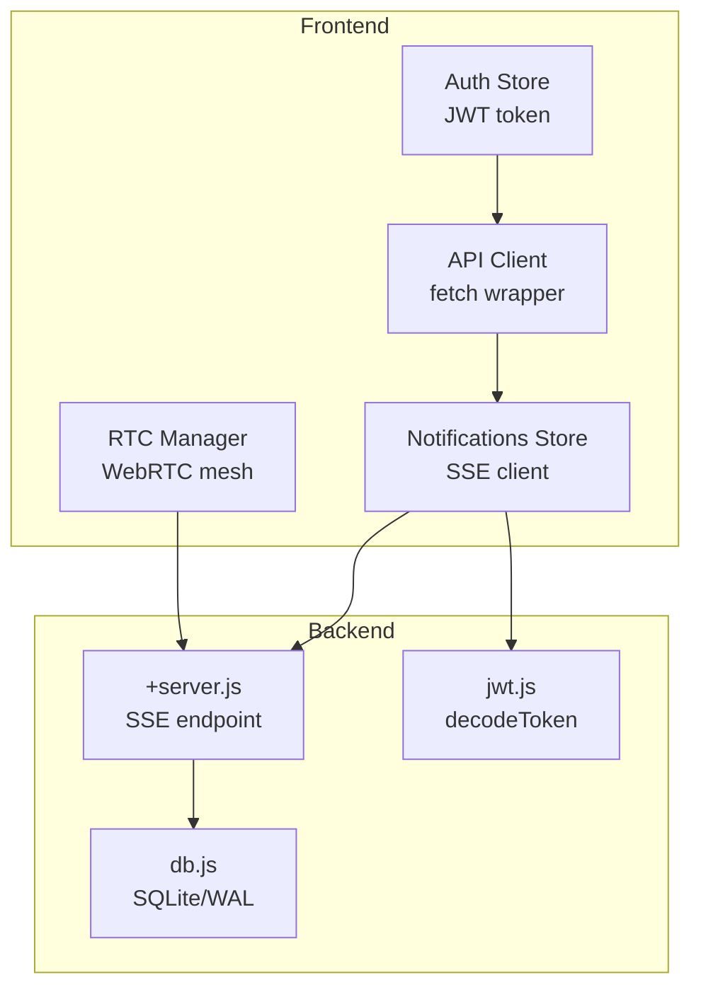
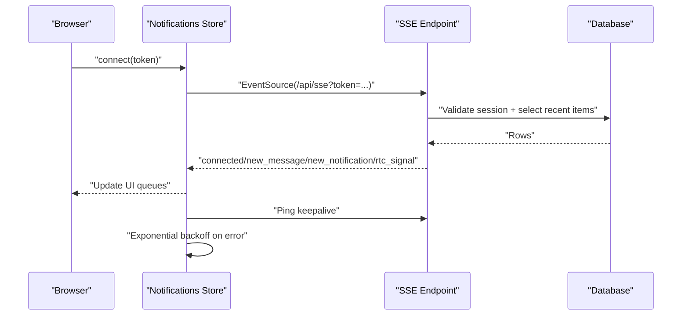
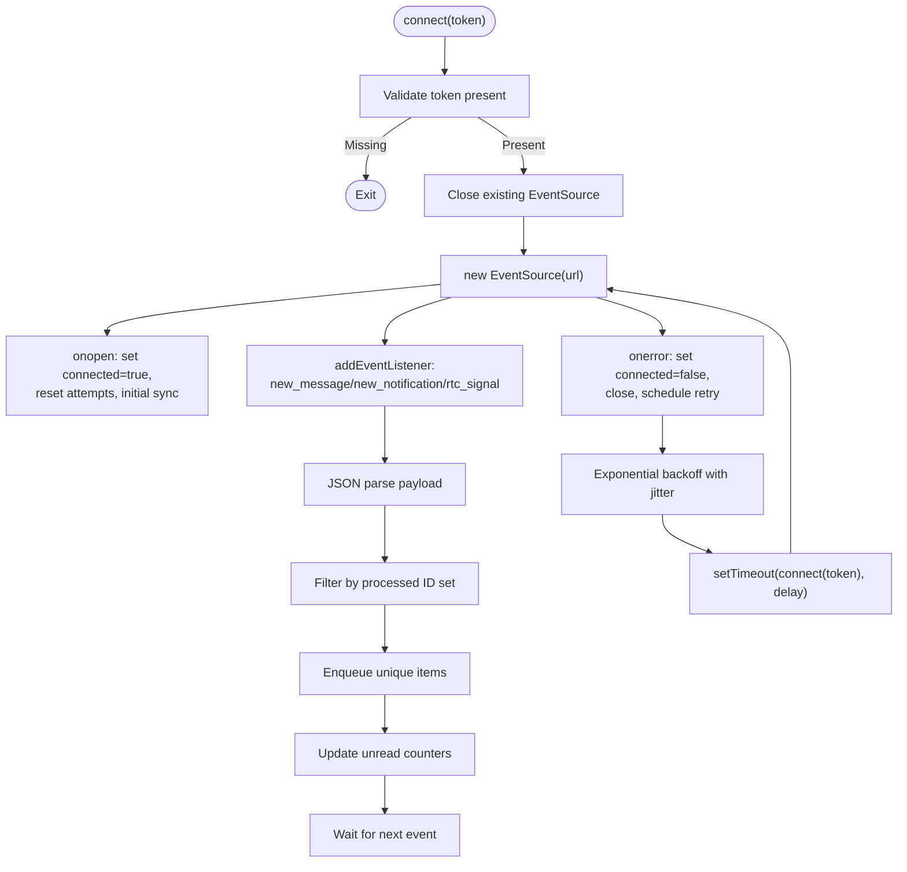
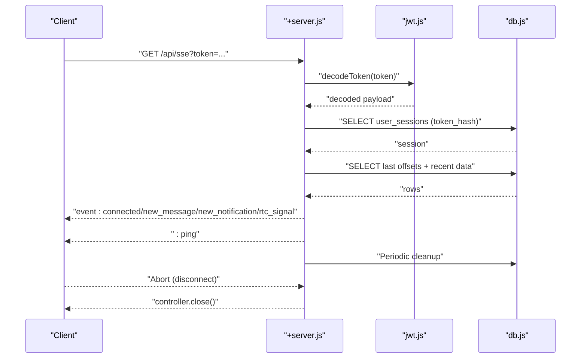
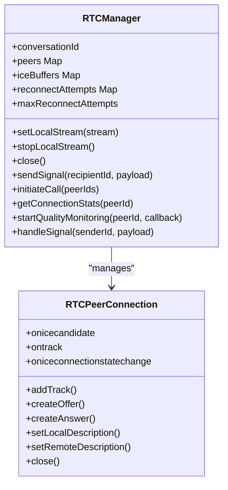
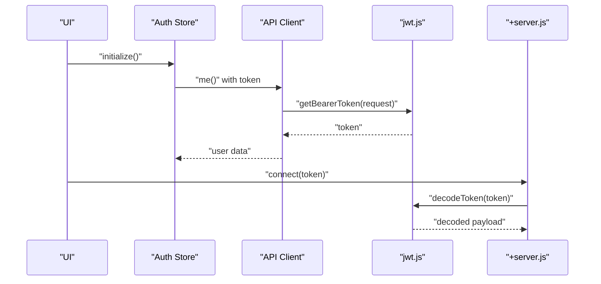
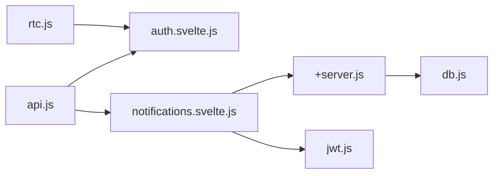

# WebSocket Integration

<cite>
**Referenced Files in This Document**
- [notifications.svelte.js](file://frontend/src/lib/stores/nofitications.svelte.js)
- [+server.js](file://frontend/src/routes/api/sse/+server.js)
- [rtc.js](file://frontend/src/lib/rtc.js)
- [api.js](file://frontend/src/lib/api.js)
- [auth.svelte.js](file://frontend/src/lib/stores/auth.svelte.js)
- [jwt.js](file://frontend/src/lib/server/jwt.js)
- [db.js](file://frontend/src/lib/server/db.js)
</cite>

## Table of Contents
1. [Introduction](#introduction)
2. [Project Structure](#project-structure)
3. [Core Components](#core-components)
4. [Architecture Overview](#architecture-overview)
5. [Detailed Component Analysis](#detailed-component-analysis)
6. [Dependency Analysis](#dependency-analysis)
7. [Performance Considerations](#performance-considerations)
8. [Troubleshooting Guide](#troubleshooting-guide)
9. [Conclusion](#conclusion)

## Introduction
This document explains VSocial’s real-time communication system with a focus on WebSocket-compatible patterns and complementary technologies. While VSocial primarily uses Server-Sent Events (SSE) for real-time notifications, messages, and WebRTC signaling, the document also covers WebRTC mesh networking and provides guidance for integrating WebSocket-based solutions where appropriate. It documents connection establishment, message broadcasting patterns, lifecycle management, security, authentication, and performance optimization for high-concurrency scenarios.

## Project Structure
The real-time stack spans the frontend store layer, the SSE endpoint, and supporting authentication and database utilities:
- Frontend real-time store: manages SSE connection, deduplication, and reconnection
- SSE endpoint: streams notifications, messages, and signaling to clients
- WebRTC manager: handles peer-to-peer media connections and signaling transport
- Authentication and JWT utilities: secure token handling and verification
- Database adapter: unified access to SQLite/WAL for real-time data queries

**Diagram sources**
- [notifications.svelte.js:1-232](file://frontend/src/lib/stores/notifications.svelte.js#L1-L232)
- [+server.js:1-185](file://frontend/src/routes/api/sse/+server.js#L1-L185)
- [rtc.js:1-299](file://frontend/src/lib/rtc.js#L1-L299)
- [api.js:1-350](file://frontend/src/lib/api.js#L1-L350)
- [auth.svelte.js:1-131](file://frontend/src/lib/stores/auth.svelte.js#L1-L131)
- [jwt.js:1-45](file://frontend/src/lib/server/jwt.js#L1-L45)
- [db.js:1-209](file://frontend/src/lib/server/db.js#L1-L209)

**Section sources**
- [notifications.svelte.js:1-232](file://frontend/src/lib/stores/notifications.svelte.js#L1-L232)
- [+server.js:1-185](file://frontend/src/routes/api/sse/+server.js#L1-L185)
- [rtc.js:1-299](file://frontend/src/lib/rtc.js#L1-L299)
- [api.js:1-350](file://frontend/src/lib/api.js#L1-L350)
- [auth.svelte.js:1-131](file://frontend/src/lib/stores/auth.svelte.js#L1-L131)
- [jwt.js:1-45](file://frontend/src/lib/server/jwt.js#L1-L45)
- [db.js:1-209](file://frontend/src/lib/server/db.js#L1-L209)

## Core Components
- Notifications Store (SSE client): Establishes and maintains an SSE connection, parses events, deduplicates, and reconnects with exponential backoff.
- SSE Endpoint: Validates tokens, authenticates sessions, streams notifications, messages, and WebRTC signals, and sends keepalive pings.
- RTC Manager: Manages WebRTC peer connections, ICE candidates, signaling transport via HTTP, and connection quality monitoring.
- API Client: Provides a centralized fetch wrapper with automatic Bearer token injection.
- Auth Store: Initializes from persisted token, exposes user/session state, and integrates with API calls.
- JWT Utilities: Encodes/decodes tokens and extracts Bearer tokens from headers.
- Database Adapter: Unified async API for SQLite/WAL with WAL pragmas and transaction support.

**Section sources**
- [notifications.svelte.js:1-232](file://frontend/src/lib/stores/notifications.svelte.js#L1-L232)
- [+server.js:1-185](file://frontend/src/routes/api/sse/+server.js#L1-L185)
- [rtc.js:1-299](file://frontend/src/lib/rtc.js#L1-L299)
- [api.js:1-350](file://frontend/src/lib/api.js#L1-L350)
- [auth.svelte.js:1-131](file://frontend/src/lib/stores/auth.svelte.js#L1-L131)
- [jwt.js:1-45](file://frontend/src/lib/server/jwt.js#L1-L45)
- [db.js:1-209](file://frontend/src/lib/server/db.js#L1-L209)

## Architecture Overview
The real-time architecture combines SSE for persistent server-to-client streaming and WebRTC for media. SSE handles notifications, chat messages, and signaling transport. WebRTC manages media streams and ICE/DTLS handshakes with STUN/TURN relay support.

**Diagram sources**
- [notifications.svelte.js:35-144](file://frontend/src/lib/stores/notifications.svelte.js#L35-L144)
- [+server.js:9-184](file://frontend/src/routes/api/sse/+server.js#L9-L184)
- [db.js:1-209](file://frontend/src/lib/server/db.js#L1-L209)

## Detailed Component Analysis

### SSE Notifications Store
Responsibilities:
- Establish SSE connection with token in query parameter
- Parse and dispatch events: new_message, new_notification, rtc_signal
- Deduplicate events by ID sets
- Maintain connection state and reconnect with exponential backoff and jitter
- Fetch initial notifications after reconnect

Key behaviors:
- On open: resets reconnect attempts and triggers initial sync
- On error: closes connection, schedules retry with capped delay
- Event handlers enqueue unique items into queues and update unread counts

**Diagram sources**
- [notifications.svelte.js:35-144](file://frontend/src/lib/stores/notifications.svelte.js#L35-L144)

**Section sources**
- [notifications.svelte.js:1-232](file://frontend/src/lib/stores/notifications.svelte.js#L1-L232)

### SSE Endpoint (+server.js)
Responsibilities:
- Validate token presence and decode JWT
- Verify active session against hashed token
- Stream four event types: connected, new_message, new_notification, rtc_signal
- Keepalive ping every tick
- Periodic cleanup of old notifications
- Abort handling to close stream cleanly

Processing logic:
- Compute lastMsgId and lastSignalId offsets per user
- Every 2 seconds: query messages, notifications, and signaling rows
- Enqueue events with structured payloads
- Close stream after ~20 minutes of inactivity

**Diagram sources**
- [+server.js:9-184](file://frontend/src/routes/api/sse/+server.js#L9-L184)
- [jwt.js:26-32](file://frontend/src/lib/server/jwt.js#L26-L32)
- [db.js:1-209](file://frontend/src/lib/server/db.js#L1-L209)

**Section sources**
- [+server.js:1-185](file://frontend/src/routes/api/sse/+server.js#L1-L185)

### WebRTC Mesh Manager (rtc.js)
Responsibilities:
- Manage RTCPeerConnection instances per peer
- ICE candidate buffering until remote description arrives
- Offer/answer exchange and ICE restart on failure
- Local stream track distribution and stats collection
- Quality monitoring with periodic RTP stats

Key patterns:
- ICE state transitions trigger reconnect attempts with exponential backoff
- Stats computed from inbound/outbound RTP reports for packet loss, jitter, and RTT
- Signal transport via HTTP POST to /api/rtc/signal with Bearer token

**Diagram sources**
- [rtc.js:7-299](file://frontend/src/lib/rtc.js#L7-L299)

**Section sources**
- [rtc.js:1-299](file://frontend/src/lib/rtc.js#L1-L299)

### Authentication and Token Handling
- Auth Store persists token in localStorage and cookie, initializes on app boot, and refreshes user info
- API Client injects Authorization: Bearer header automatically
- JWT utilities decode tokens and extract bearer tokens from headers
- SSE endpoint validates token via JWT and checks session expiry

**Diagram sources**
- [auth.svelte.js:22-47](file://frontend/src/lib/stores/auth.svelte.js#L22-L47)
- [api.js:20-46](file://frontend/src/lib/api.js#L20-L46)
- [jwt.js:37-42](file://frontend/src/lib/server/jwt.js#L37-L42)
- [+server.js:19-34](file://frontend/src/routes/api/sse/+server.js#L19-L34)

**Section sources**
- [auth.svelte.js:1-131](file://frontend/src/lib/stores/auth.svelte.js#L1-L131)
- [api.js:1-350](file://frontend/src/lib/api.js#L1-L350)
- [jwt.js:1-45](file://frontend/src/lib/server/jwt.js#L1-L45)
- [+server.js:1-185](file://frontend/src/routes/api/sse/+server.js#L1-L185)

## Dependency Analysis
- Frontend store depends on SSE endpoint and deduplication logic
- SSE endpoint depends on JWT decoding and database adapter
- RTC manager depends on auth store for signaling transport and browser WebRTC APIs
- API client depends on auth store for token propagation

**Diagram sources**
- [notifications.svelte.js:1-232](file://frontend/src/lib/stores/notifications.svelte.js#L1-L232)
- [+server.js:1-185](file://frontend/src/routes/api/sse/+server.js#L1-L185)
- [rtc.js:1-299](file://frontend/src/lib/rtc.js#L1-L299)
- [api.js:1-350](file://frontend/src/lib/api.js#L1-L350)
- [auth.svelte.js:1-131](file://frontend/src/lib/stores/auth.svelte.js#L1-L131)
- [jwt.js:1-45](file://frontend/src/lib/server/jwt.js#L1-L45)
- [db.js:1-209](file://frontend/src/lib/server/db.js#L1-L209)

**Section sources**
- [notifications.svelte.js:1-232](file://frontend/src/lib/stores/notifications.svelte.js#L1-L232)
- [+server.js:1-185](file://frontend/src/routes/api/sse/+server.js#L1-L185)
- [rtc.js:1-299](file://frontend/src/lib/rtc.js#L1-L299)
- [api.js:1-350](file://frontend/src/lib/api.js#L1-L350)
- [auth.svelte.js:1-131](file://frontend/src/lib/stores/auth.svelte.js#L1-L131)
- [jwt.js:1-45](file://frontend/src/lib/server/jwt.js#L1-L45)
- [db.js:1-209](file://frontend/src/lib/server/db.js#L1-L209)

## Performance Considerations
- SSE polling cadence: 2-second intervals with 20-minute auto-disconnect to limit long-lived connections
- Deduplication: Sets track processed IDs to avoid duplicate UI updates
- Buffer limits: Queues capped to recent items (e.g., last 50 messages, last 20 signals)
- Database tuning: WAL mode enabled for SQLite for improved concurrency and durability
- WebRTC ICE restarts: Limited retries with exponential backoff to reduce churn
- Stats sampling: 1 Hz monitoring to balance overhead and insight

[No sources needed since this section provides general guidance]

## Troubleshooting Guide
Common issues and remedies:
- SSE connection drops: exponential backoff with jitter is applied; verify network and server logs
- Duplicate events: deduplication sets ensure uniqueness; confirm IDs are present and consistent
- Session invalidation: SSE validates token hash and expiry; ensure tokens are fresh and cookies are set
- RTC ICE failures: ICE restart attempted up to configured max attempts; check STUN/TURN reachability
- Database timeouts: WAL pragmas configured; ensure DB is initialized and not locked by other processes

**Section sources**
- [notifications.svelte.js:122-139](file://frontend/src/lib/stores/notifications.svelte.js#L122-L139)
- [+server.js:30-34](file://frontend/src/routes/api/sse/+server.js#L30-L34)
- [rtc.js:138-167](file://frontend/src/lib/rtc.js#L138-L167)
- [db.js:124-133](file://frontend/src/lib/server/db.js#L124-L133)

## Conclusion
VSocial’s real-time system leverages SSE for scalable server-to-client streaming of notifications, messages, and signaling, complemented by WebRTC for media. The design emphasizes robustness with deduplication, exponential backoff, and periodic cleanup, while authentication and JWT ensure secure session validation. For WebSocket integration scenarios, the documented patterns—authentication, event handling, and lifecycle management—provide a blueprint for extending the system with bidirectional channels where appropriate.