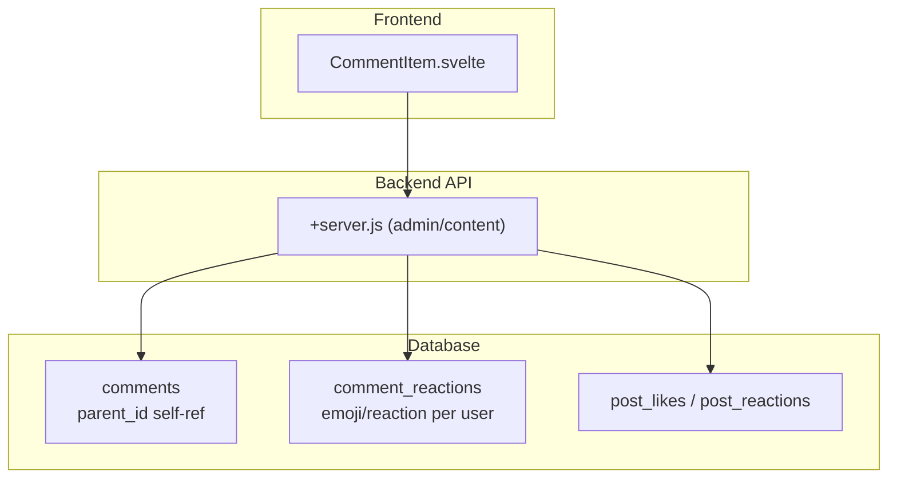
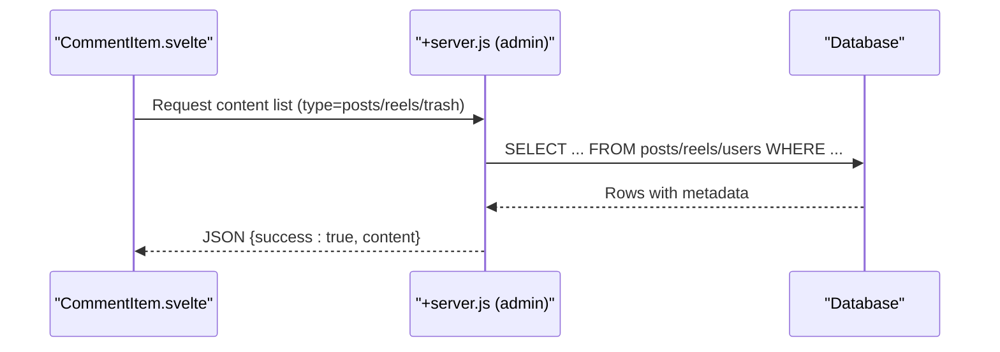
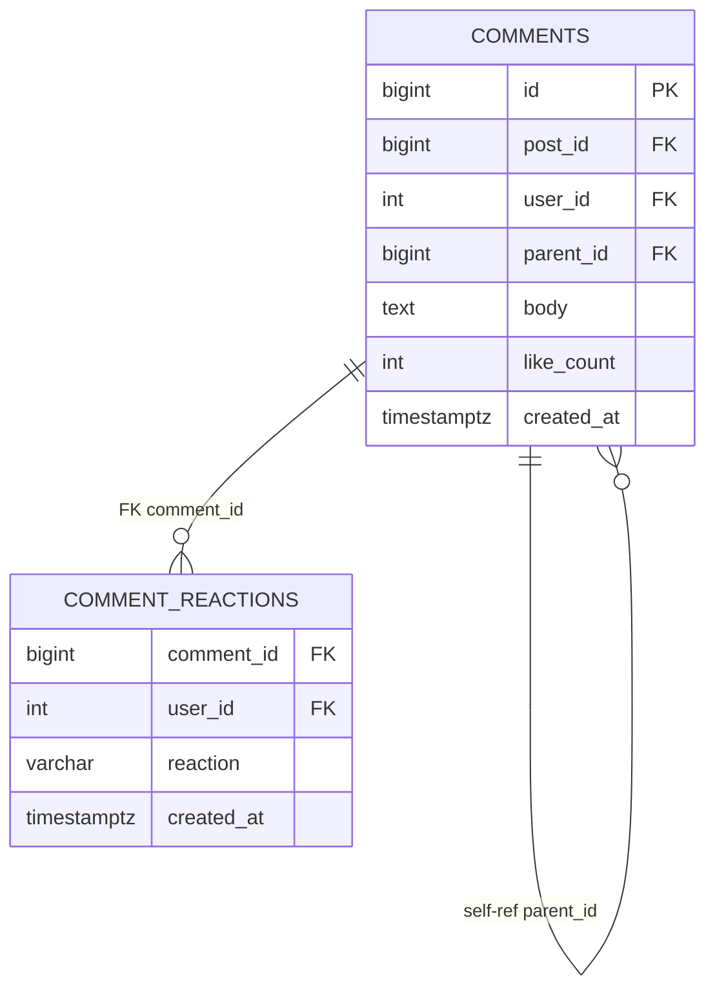
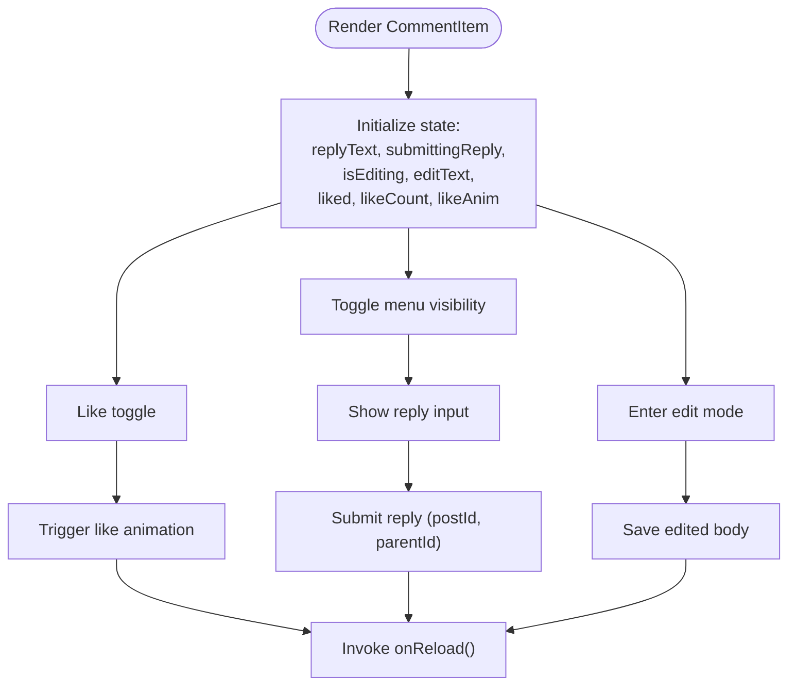
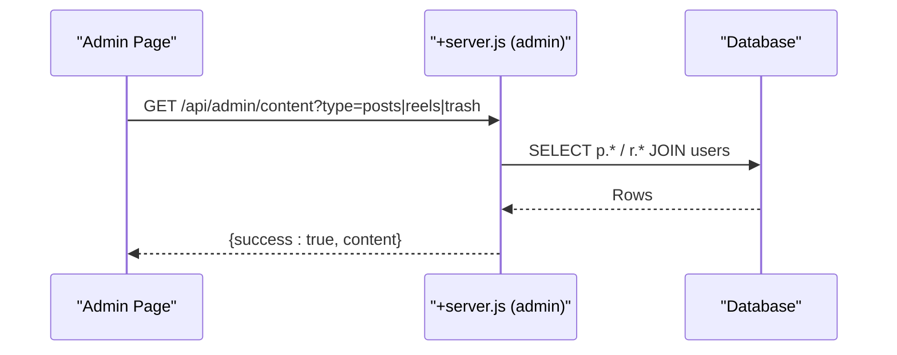
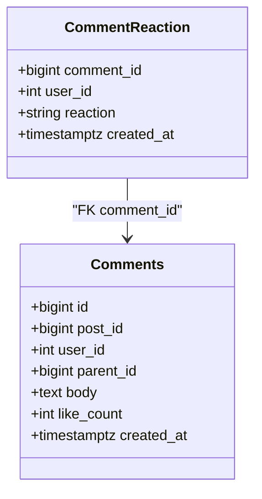
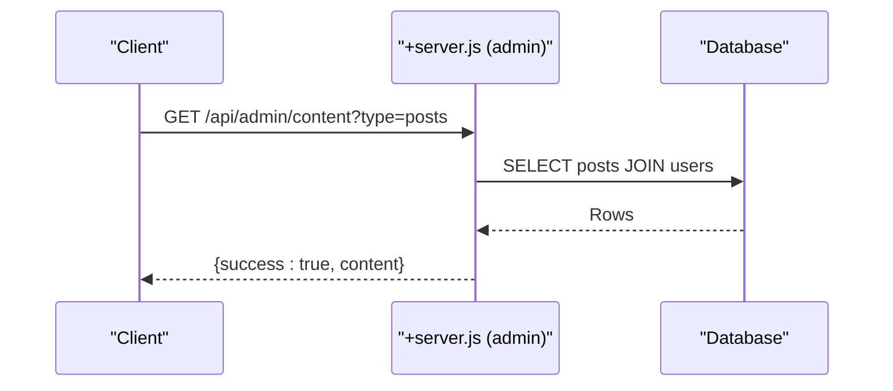
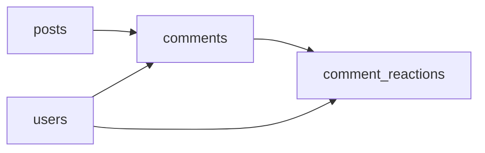

# Comments & Reactions System

<cite>
**Referenced Files in This Document**
- [001_schema.sql](file://migrations/001_schema.sql)
- [002_phase2.sql](file://migrations/002_phase2.sql)
- [schema_sqlite.sql](file://schema_sqlite.sql)
- [update_db.js](file://update_db.js)
- [CommentItem.svelte](file://frontend/src/lib/components/CommentItem.svelte)
- [admin_server.js](file://frontend/src/routes/api/admin/[...path]/+server.js)
- [README.md](file://README.md)
</cite>

## Table of Contents
1. [Introduction](#introduction)
2. [Project Structure](#project-structure)
3. [Core Components](#core-components)
4. [Architecture Overview](#architecture-overview)
5. [Detailed Component Analysis](#detailed-component-analysis)
6. [Dependency Analysis](#dependency-analysis)
7. [Performance Considerations](#performance-considerations)
8. [Troubleshooting Guide](#troubleshooting-guide)
9. [Conclusion](#conclusion)

## Introduction
This document explains VSocial’s comments and reactions system with a focus on:
- Hierarchical comment threads and nested replies
- Reaction types beyond simple likes
- Emoji-based reactions and user-specific tracking
- Moderation, deletion permissions, and content filtering
- API endpoints for comment CRUD, reaction management, and real-time updates
- Examples of threading, analytics, and moderation workflows
- Performance considerations for deep trees and real-time collaboration

## Project Structure
The comments and reactions system spans database schemas, backend API routes, and frontend components:
- Database schemas define comment and reaction tables, indexes, and relationships
- Backend routes expose admin and content APIs used by the frontend
- Frontend components render threaded comments, handle user actions, and manage reactions

**Diagram sources**
- [001_schema.sql:161-178](file://migrations/001_schema.sql#L161-L178)
- [schema_sqlite.sql:157-177](file://schema_sqlite.sql#L157-L177)
- [admin_server.js:83-95](file://frontend/src/routes/api/admin/[...path]/+server.js#L83-L95)
- [CommentItem.svelte:1-41](file://frontend/src/lib/components/CommentItem.svelte#L1-L41)

**Section sources**
- [001_schema.sql:161-178](file://migrations/001_schema.sql#L161-L178)
- [schema_sqlite.sql:157-177](file://schema_sqlite.sql#L157-L177)
- [admin_server.js:83-95](file://frontend/src/routes/api/admin/[...path]/+server.js#L83-L95)
- [CommentItem.svelte:1-41](file://frontend/src/lib/components/CommentItem.svelte#L1-L41)

## Core Components
- Comments table supports hierarchical threading via a parent_id self-reference
- Comment reactions table tracks user-specific reactions (emoji or textual types)
- Post reactions table exists for comparison and potential unified reaction model
- Admin API surfaces content lists and trash for moderation workflows
- Frontend component renders nested comments and handles user interactions

Key schema highlights:
- Comments: id, post_id, user_id, parent_id, body, like_count, deleted_at, created_at
- Comment reactions: composite primary key (comment_id, user_id), reaction field, created_at
- Indexes: comments.post_id with created_at ordering

**Section sources**
- [001_schema.sql:161-178](file://migrations/001_schema.sql#L161-L178)
- [schema_sqlite.sql:157-177](file://schema_sqlite.sql#L157-L177)
- [002_phase2.sql:12-18](file://migrations/002_phase2.sql#L12-L18)

## Architecture Overview
The system integrates frontend rendering with backend APIs and database persistence. Admin endpoints support moderation queries, while the comment component manages user actions such as replying, editing, and reacting.

**Diagram sources**
- [admin_server.js:83-95](file://frontend/src/routes/api/admin/[...path]/+server.js#L83-L95)

**Section sources**
- [admin_server.js:83-95](file://frontend/src/routes/api/admin/[...path]/+server.js#L83-L95)

## Detailed Component Analysis

### Database Schema: Comments and Reactions
The schema defines:
- comments: hierarchical structure with parent_id referencing itself
- comment_reactions: per-user reactions with composite primary key
- Additional indexes for efficient querying by post and creation time

**Diagram sources**
- [001_schema.sql:161-178](file://migrations/001_schema.sql#L161-L178)
- [schema_sqlite.sql:157-177](file://schema_sqlite.sql#L157-L177)

**Section sources**
- [001_schema.sql:161-178](file://migrations/001_schema.sql#L161-L178)
- [schema_sqlite.sql:157-177](file://schema_sqlite.sql#L157-L177)

### Frontend Component: Threaded Comments and Reactions
The CommentItem component:
- Accepts props: comment, postId, onReload callback, depth
- Manages reply visibility, edit mode, and like toggling
- Uses relative timestamps and animates like interactions
- Supports nested replies via recursive component usage

**Diagram sources**
- [CommentItem.svelte:1-41](file://frontend/src/lib/components/CommentItem.svelte#L1-L41)

**Section sources**
- [CommentItem.svelte:1-41](file://frontend/src/lib/components/CommentItem.svelte#L1-L41)

### Admin API: Content Moderation and Trash
Admin endpoints:
- Retrieve recent posts, reels, or trashed posts
- Return structured JSON responses for frontend consumption

**Diagram sources**
- [admin_server.js:83-95](file://frontend/src/routes/api/admin/[...path]/+server.js#L83-L95)

**Section sources**
- [admin_server.js:83-95](file://frontend/src/routes/api/admin/[...path]/+server.js#L83-L95)

### Reaction Types and Emoji Support
- Comments support user-specific reactions tracked in comment_reactions
- Reaction field is generic (varchar) enabling emoji or textual types
- Frontend toggles reactions and updates counts

**Diagram sources**
- [001_schema.sql:173-178](file://migrations/001_schema.sql#L173-L178)
- [schema_sqlite.sql:169-177](file://schema_sqlite.sql#L169-L177)

**Section sources**
- [001_schema.sql:173-178](file://migrations/001_schema.sql#L173-L178)
- [schema_sqlite.sql:169-177](file://schema_sqlite.sql#L169-L177)

### API Endpoints and Workflows
- Admin content listing endpoint supports moderation workflows
- Frontend components coordinate with backend to manage comments and reactions

**Diagram sources**
- [admin_server.js:83-95](file://frontend/src/routes/api/admin/[...path]/+server.js#L83-L95)

**Section sources**
- [admin_server.js:83-95](file://frontend/src/routes/api/admin/[...path]/+server.js#L83-L95)

## Dependency Analysis
- Comments depend on posts and users; parent_id enables hierarchical replies
- Comment reactions depend on comments and users; composite primary key ensures one reaction per user per comment
- Frontend depends on backend admin endpoints for moderation data
- Indexes on post_id and created_at optimize comment retrieval

**Diagram sources**
- [001_schema.sql:161-178](file://migrations/001_schema.sql#L161-L178)
- [schema_sqlite.sql:157-177](file://schema_sqlite.sql#L157-L177)

**Section sources**
- [001_schema.sql:161-178](file://migrations/001_schema.sql#L161-L178)
- [schema_sqlite.sql:157-177](file://schema_sqlite.sql#L157-L177)

## Performance Considerations
- Indexing: comments.post_id with created_at ordering accelerates thread loading
- Pagination: limit and order by created_at for deep trees
- Lazy loading: load replies on demand (expand/collapse)
- Real-time updates: SSE or WebSocket can push new replies and reaction changes
- Deletion: soft delete with deleted_at allows recovery and audit trails

[No sources needed since this section provides general guidance]

## Troubleshooting Guide
- Database initialization: ensure comment_reactions table exists; a script creates it if missing
- Admin content queries: verify type parameter (posts, reels, trash) and permissions
- Frontend rendering: confirm props (comment, postId, onReload) and depth for nested comments

**Section sources**
- [update_db.js:1-13](file://update_db.js#L1-L13)
- [admin_server.js:83-95](file://frontend/src/routes/api/admin/[...path]/+server.js#L83-L95)
- [CommentItem.svelte:1-41](file://frontend/src/lib/components/CommentItem.svelte#L1-L41)

## Conclusion
VSocial’s comments and reactions system provides a robust foundation for threaded discussions and emoji-based reactions. The schema supports hierarchical replies, user-specific reactions, and moderation workflows. Frontend components integrate with backend APIs to deliver responsive interactions, while indexing and pagination help maintain performance at scale.