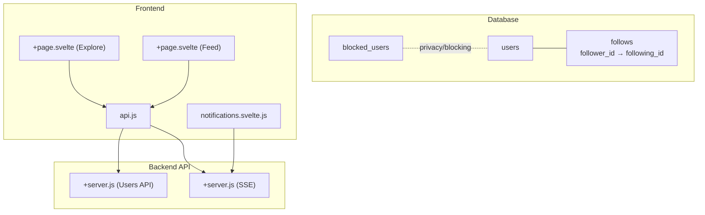
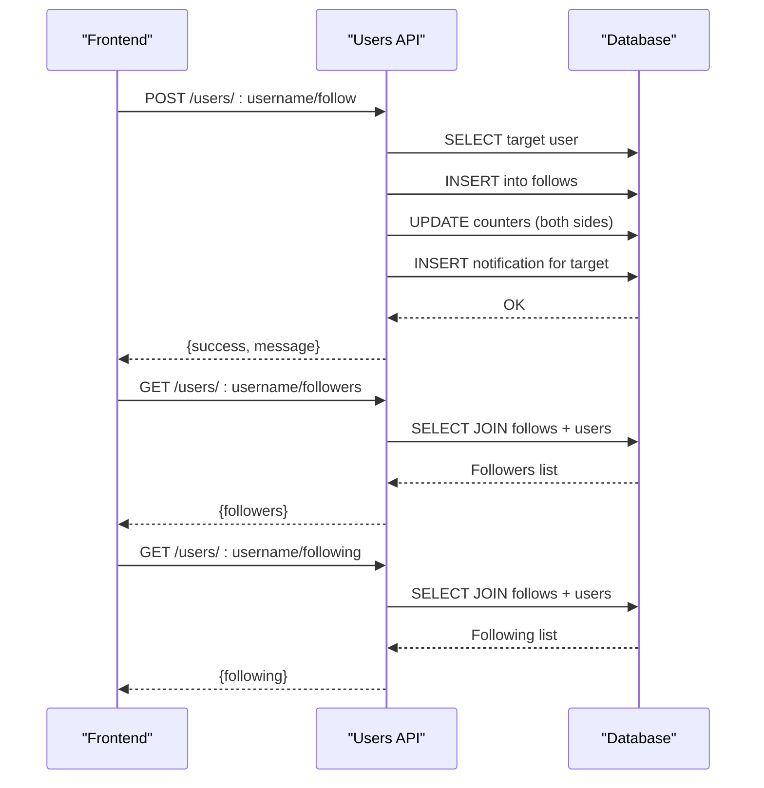
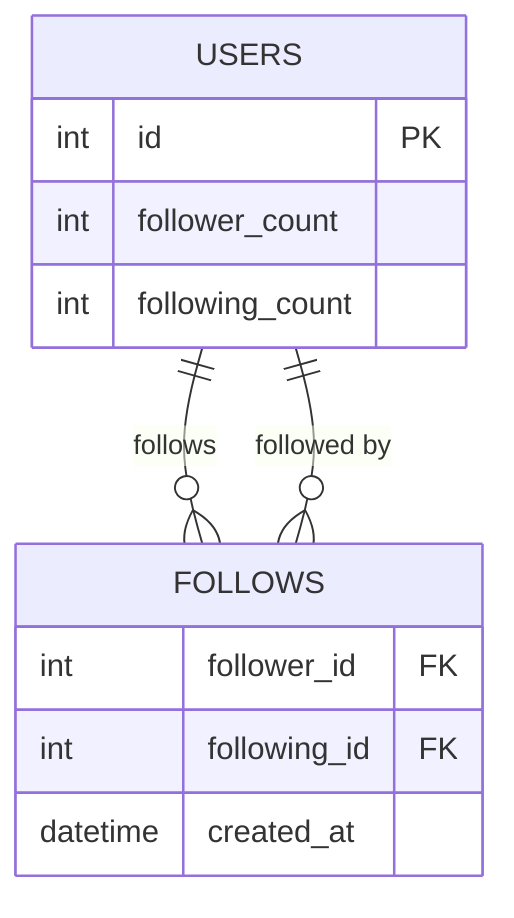
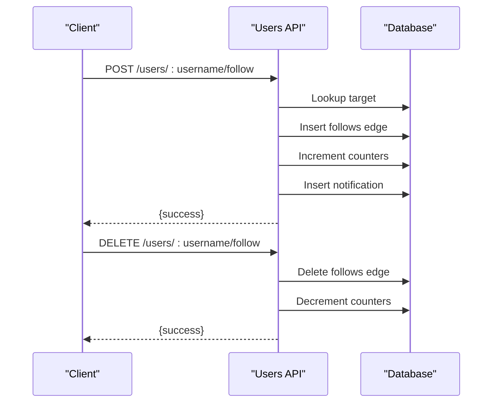
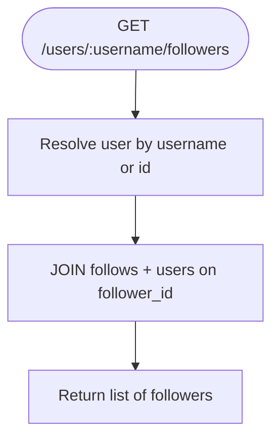
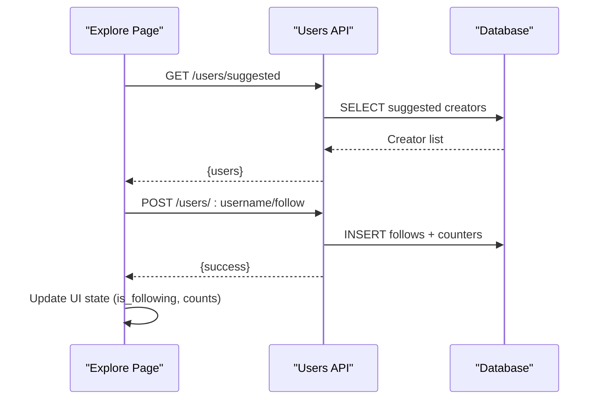
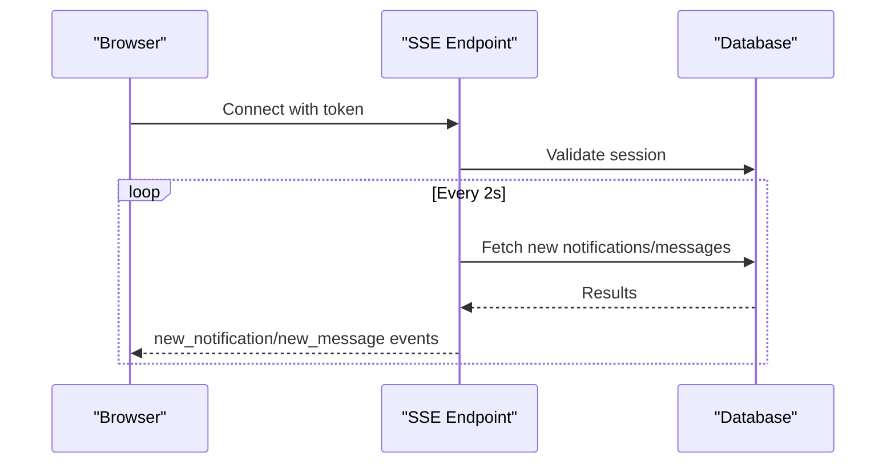
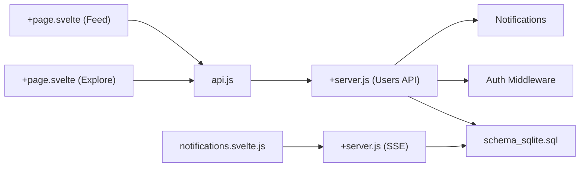

# Following & Followers System

<cite>
**Referenced Files in This Document**
- [schema_sqlite.sql](file://schema_sqlite.sql)
- [001_schema.sql](file://migrations/001_schema.sql)
- [002_phase2.sql](file://migrations/002_phase2.sql)
- [+server.js (Users API)](file://frontend/src/routes/api/users/[...path]/+server.js)
- [api.js](file://frontend/src/lib/api.js)
- [+page.svelte (Explore)](file://frontend/src/routes/explore/+page.svelte)
- [+page.svelte (Feed)](file://frontend/src/routes/feed/+page.svelte)
- [+server.js (SSE)](file://frontend/src/routes/api/sse/+server.js)
- [notifications.svelte.js](file://frontend/src/lib/stores/notifications.svelte.js)
</cite>

## Table of Contents
1. [Introduction](#introduction)
2. [Project Structure](#project-structure)
3. [Core Components](#core-components)
4. [Architecture Overview](#architecture-overview)
5. [Detailed Component Analysis](#detailed-component-analysis)
6. [Dependency Analysis](#dependency-analysis)
7. [Performance Considerations](#performance-considerations)
8. [Troubleshooting Guide](#troubleshooting-guide)
9. [Conclusion](#conclusion)

## Introduction
This document explains VSocial’s social graph system with a focus on following and followers management. It covers the underlying data model, bidirectional relationships, privacy controls, and the APIs used to manage relationships. It also documents real-time updates, suggested follows, and privacy-preserving query patterns. The goal is to help developers and operators implement, extend, and maintain the social graph safely and efficiently.

## Project Structure
The social graph spans database schema, backend API endpoints, and frontend integrations:
- Database schema defines the follows table and supporting indexes.
- Backend exposes REST endpoints for follow/unfollow, retrieving followers/following lists, and suggested creators.
- Frontend integrates these endpoints into Explore, Profile, and Feed experiences.
- Real-time updates are delivered via Server-Sent Events (SSE) for notifications and messages.

**Diagram sources**
- [schema_sqlite.sql:95-101](file://schema_sqlite.sql#L95-L101)
- [+server.js (Users API):47-193](file://frontend/src/routes/api/users/[...path]/+server.js#L47-L193)
- [+server.js (SSE):9-184](file://frontend/src/routes/api/sse/+server.js#L9-L184)
- [api.js:134-164](file://frontend/src/lib/api.js#L134-L164)
- [+page.svelte (Explore):1-142](file://frontend/src/routes/explore/+page.svelte#L1-L142)
- [notifications.svelte.js:1-182](file://frontend/src/lib/stores/notifications.svelte.js#L1-L182)

**Section sources**
- [schema_sqlite.sql:95-101](file://schema_sqlite.sql#L95-L101)
- [+server.js (Users API):47-193](file://frontend/src/routes/api/users/[...path]/+server.js#L47-L193)
- [api.js:134-164](file://frontend/src/lib/api.js#L134-L164)
- [+page.svelte (Explore):1-142](file://frontend/src/routes/explore/+page.svelte#L1-L142)
- [+page.svelte (Feed):382-503](file://frontend/src/routes/feed/+page.svelte#L382-L503)
- [+server.js (SSE):9-184](file://frontend/src/routes/api/sse/+server.js#L9-L184)
- [notifications.svelte.js:1-182](file://frontend/src/lib/stores/notifications.svelte.js#L1-L182)

## Core Components
- Social graph model: A directed follows table with a composite primary key to prevent duplicate edges and enforce one-way relationships.
- Indexing: An index on following_id accelerates follower enumeration.
- Counters: Per-user counters track follower and following counts for quick UI rendering.
- Blocking: A separate blocked_users table prevents visibility and interaction.
- Endpoints:
  - POST /api/users/:username/follow to follow a user.
  - DELETE /api/users/:username/follow to unfollow.
  - GET /api/users/:username/followers to list followers.
  - GET /api/users/:username/following to list followed profiles.
  - GET /api/users/suggested for suggested creators.
- Real-time updates: SSE delivers notifications and messages to clients.

**Section sources**
- [schema_sqlite.sql:36-37](file://schema_sqlite.sql#L36-L37)
- [schema_sqlite.sql:95-101](file://schema_sqlite.sql#L95-L101)
- [+server.js (Users API):114-132](file://frontend/src/routes/api/users/[...path]/+server.js#L114-L132)
- [+server.js (Users API):202-220](file://frontend/src/routes/api/users/[...path]/+server.js#L202-L220)
- [+server.js (Users API):266-278](file://frontend/src/routes/api/users/[...path]/+server.js#L266-L278)
- [+server.js (Users API):69-74](file://frontend/src/routes/api/users/[...path]/+server.js#L69-L74)
- [+server.js (SSE):85-117](file://frontend/src/routes/api/sse/+server.js#L85-L117)

## Architecture Overview
The social graph is a directed acyclic relationship model optimized for fast fan-out queries. The backend validates permissions, updates counters, and emits notifications. Frontend components consume these endpoints and optionally subscribe to SSE streams for real-time updates.

**Diagram sources**
- [+server.js (Users API):202-220](file://frontend/src/routes/api/users/[...path]/+server.js#L202-L220)
- [+server.js (Users API):114-132](file://frontend/src/routes/api/users/[...path]/+server.js#L114-L132)
- [+server.js (Users API):266-278](file://frontend/src/routes/api/users/[...path]/+server.js#L266-L278)

## Detailed Component Analysis

### Relationship Model and Bidirectionality
- The follows table stores directed edges: follower_id → following_id.
- Composite primary key ensures uniqueness and prevents cycles in the social graph.
- Index on following_id supports efficient follower enumeration.
- Counters on users table enable fast display of follower/following counts.

**Diagram sources**
- [schema_sqlite.sql:13-48](file://schema_sqlite.sql#L13-L48)
- [schema_sqlite.sql:95-101](file://schema_sqlite.sql#L95-L101)

**Section sources**
- [schema_sqlite.sql:95-101](file://schema_sqlite.sql#L95-L101)
- [schema_sqlite.sql:36-37](file://schema_sqlite.sql#L36-L37)

### Follow/Unfollow Endpoints
- POST /api/users/:username/follow:
  - Validates target existence and self-follow protection.
  - Inserts a new follow edge if not present.
  - Updates both follower and following counters.
  - Emits a notification to the target user.
- DELETE /api/users/:username/follow:
  - Removes the follow edge if present.
  - Decrements counters safely with lower bounds.

**Diagram sources**
- [+server.js (Users API):202-220](file://frontend/src/routes/api/users/[...path]/+server.js#L202-L220)
- [+server.js (Users API):266-278](file://frontend/src/routes/api/users/[...path]/+server.js#L266-L278)

**Section sources**
- [+server.js (Users API):202-220](file://frontend/src/routes/api/users/[...path]/+server.js#L202-L220)
- [+server.js (Users API):266-278](file://frontend/src/routes/api/users/[...path]/+server.js#L266-L278)

### Retrieving Followers and Following Lists
- GET /api/users/:username/followers:
  - Returns a list of users who follow the given profile.
- GET /api/users/:username/following:
  - Returns a list of profiles the given user follows.
- Both endpoints join the follows table with users to enrich results.

**Diagram sources**
- [+server.js (Users API):114-122](file://frontend/src/routes/api/users/[...path]/+server.js#L114-L122)
- [+server.js (Users API):124-132](file://frontend/src/routes/api/users/[...path]/+server.js#L124-L132)

**Section sources**
- [+server.js (Users API):114-132](file://frontend/src/routes/api/users/[...path]/+server.js#L114-L132)

### Suggested Follows and Social Discovery
- GET /api/users/suggested:
  - Returns a small set of suggested virtual creators for discovery.
- Explore page:
  - Integrates suggested creators and allows one-tap follow/unfollow actions.
  - Updates local UI state immediately upon success.

**Diagram sources**
- [+server.js (Users API):69-74](file://frontend/src/routes/api/users/[...path]/+server.js#L69-L74)
- [+page.svelte (Explore):417-435](file://frontend/src/routes/feed/+page.svelte#L417-L435)

**Section sources**
- [+server.js (Users API):69-74](file://frontend/src/routes/api/users/[...path]/+server.js#L69-L74)
- [+page.svelte (Explore):417-435](file://frontend/src/routes/feed/+page.svelte#L417-L435)

### Privacy Implications and Blocking
- Blocked users:
  - A dedicated table prevents visibility and interaction.
  - While not directly queried in the users API shown here, blocking is part of the broader privacy domain and should be considered when serving lists or notifications.
- Profile visibility:
  - The users table includes a privacy_level field indicating profile visibility settings.

**Section sources**
- [schema_sqlite.sql:41](file://schema_sqlite.sql#L41)
- [002_phase2.sql:55-62](file://migrations/002_phase2.sql#L55-L62)

### Real-Time Updates and Notifications
- SSE endpoint:
  - Provides a persistent connection to push new notifications and messages to clients.
  - Includes keepalive pings and periodic cleanup of old notifications.
- Frontend store:
  - Manages connection lifecycle, deduplication, and exponential backoff on reconnect.

**Diagram sources**
- [+server.js (SSE):9-184](file://frontend/src/routes/api/sse/+server.js#L9-L184)
- [notifications.svelte.js:35-144](file://frontend/src/lib/stores/notifications.svelte.js#L35-L144)

**Section sources**
- [+server.js (SSE):85-117](file://frontend/src/routes/api/sse/+server.js#L85-L117)
- [notifications.svelte.js:1-182](file://frontend/src/lib/stores/notifications.svelte.js#L1-L182)

## Dependency Analysis
- Backend depends on:
  - Database schema for follows and counters.
  - Authentication middleware to authorize requests.
  - Notification subsystem for follow events.
- Frontend depends on:
  - API client for typed endpoints.
  - SSE store for real-time updates.
  - Explore and Feed pages for social discovery UX.

**Diagram sources**
- [+server.js (Users API):47-193](file://frontend/src/routes/api/users/[...path]/+server.js#L47-L193)
- [schema_sqlite.sql:95-101](file://schema_sqlite.sql#L95-L101)
- [api.js:134-164](file://frontend/src/lib/api.js#L134-L164)
- [+page.svelte (Explore):1-142](file://frontend/src/routes/explore/+page.svelte#L1-L142)
- [+page.svelte (Feed):382-503](file://frontend/src/routes/feed/+page.svelte#L382-L503)
- [+server.js (SSE):9-184](file://frontend/src/routes/api/sse/+server.js#L9-L184)
- [notifications.svelte.js:1-182](file://frontend/src/lib/stores/notifications.svelte.js#L1-L182)

**Section sources**
- [+server.js (Users API):47-193](file://frontend/src/routes/api/users/[...path]/+server.js#L47-L193)
- [schema_sqlite.sql:95-101](file://schema_sqlite.sql#L95-L101)
- [api.js:134-164](file://frontend/src/lib/api.js#L134-L164)
- [+page.svelte (Explore):1-142](file://frontend/src/routes/explore/+page.svelte#L1-L142)
- [+page.svelte (Feed):382-503](file://frontend/src/routes/feed/+page.svelte#L382-L503)
- [+server.js (SSE):9-184](file://frontend/src/routes/api/sse/+server.js#L9-L184)
- [notifications.svelte.js:1-182](file://frontend/src/lib/stores/notifications.svelte.js#L1-L182)

## Performance Considerations
- Indexing:
  - Ensure the index on following_id remains present to accelerate follower queries.
- Counter maintenance:
  - Keep follower_count and following_count updated on follow/unfollow to avoid expensive COUNT queries.
- Pagination:
  - Use page and limit parameters for large lists to reduce payload sizes.
- SSE polling interval:
  - The 2-second interval balances responsiveness and server load; adjust based on traffic.
- Deduplication:
  - Frontend stores deduplicate events to avoid UI thrashing.

[No sources needed since this section provides general guidance]

## Troubleshooting Guide
- Follow endpoints return “Already following” or “Not following”:
  - Verify the presence of the follow edge and that the user is not following themselves.
- Followers/Following lists missing expected users:
  - Confirm the index on following_id is intact and that the target user exists.
- SSE connection errors:
  - Check token validity and session expiration; the SSE handler validates sessions and closes stale streams.
- Real-time notifications not appearing:
  - Inspect the SSE store’s reconnection logic and event parsing; ensure deduplication sets are initialized.

**Section sources**
- [+server.js (Users API):208-210](file://frontend/src/routes/api/users/[...path]/+server.js#L208-L210)
- [+server.js (Users API):271-272](file://frontend/src/routes/api/users/[...path]/+server.js#L271-L272)
- [+server.js (Users API):114-132](file://frontend/src/routes/api/users/[...path]/+server.js#L114-L132)
- [+server.js (SSE):18-34](file://frontend/src/routes/api/sse/+server.js#L18-L34)
- [notifications.svelte.js:122-139](file://frontend/src/lib/stores/notifications.svelte.js#L122-L139)

## Conclusion
VSocial’s social graph is modeled as a simple, robust directed relationship with strong indexing and counter maintenance. The API provides straightforward endpoints for managing follows and retrieving lists, while the Explore and Feed experiences integrate discovery and one-tap actions. Real-time updates via SSE keep users engaged, and privacy controls like blocking are part of the broader privacy domain. Together, these components form a scalable foundation for building social features safely and efficiently.