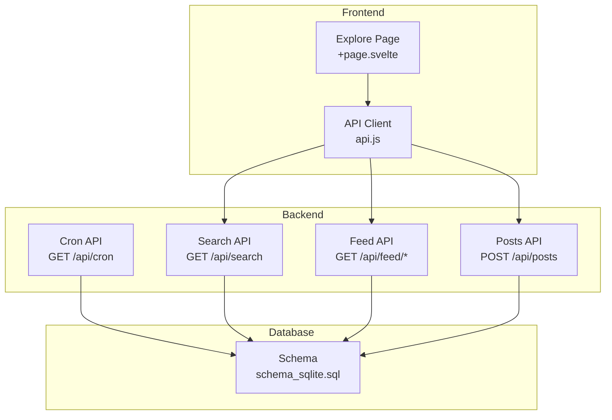
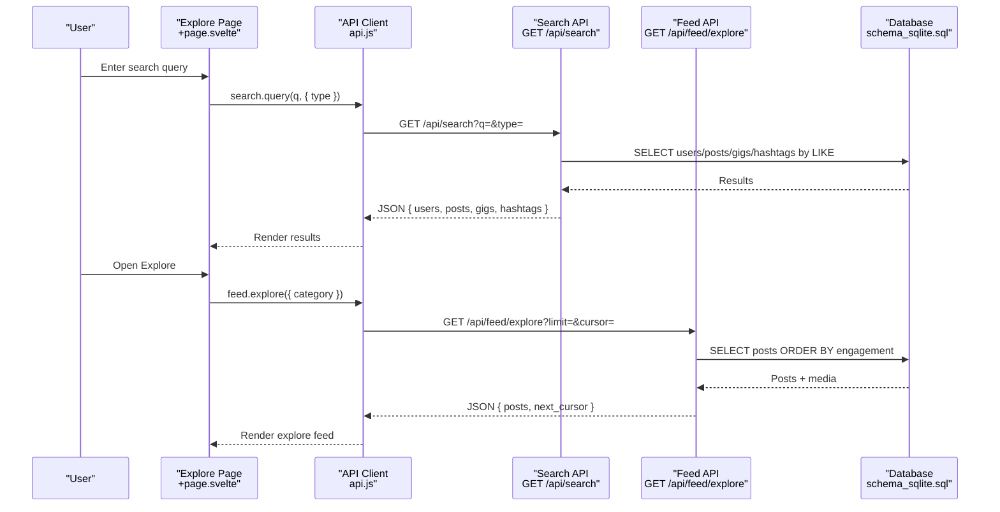
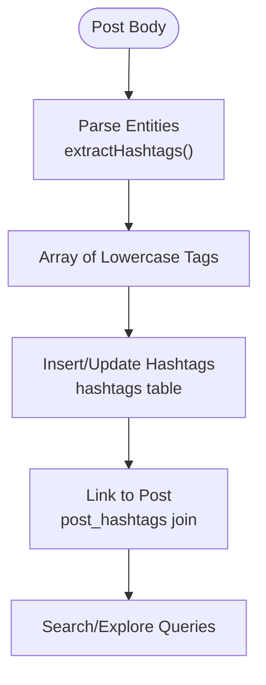
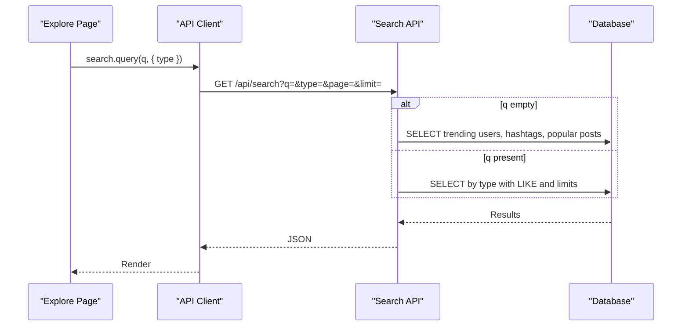
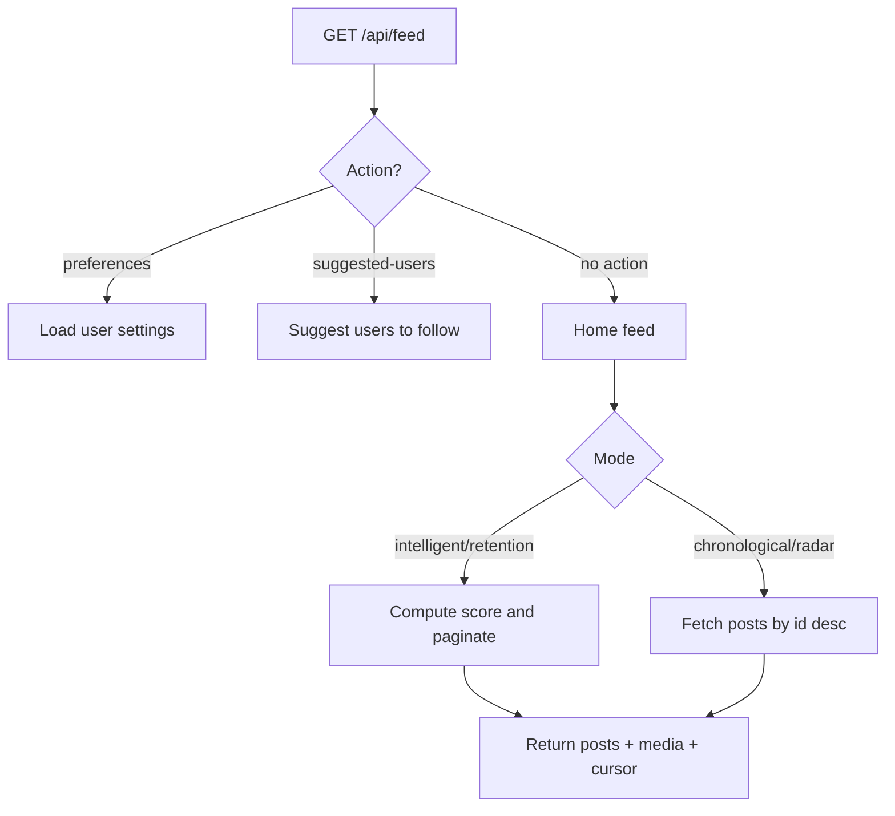
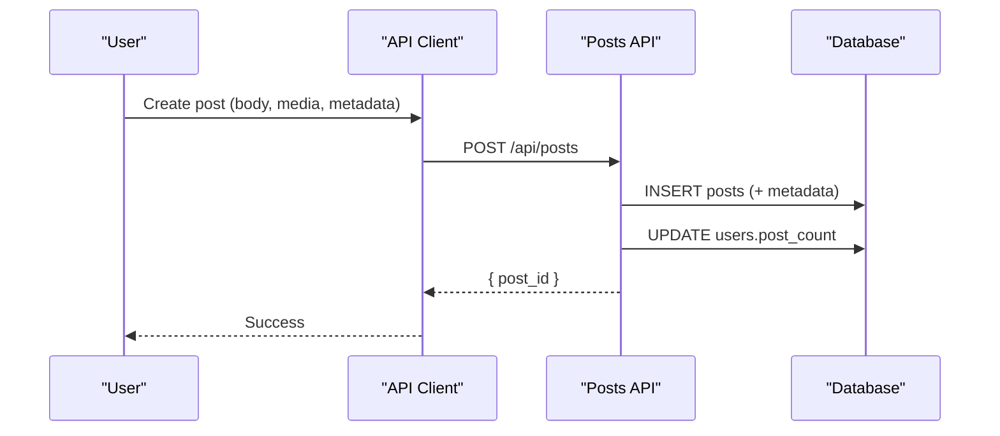
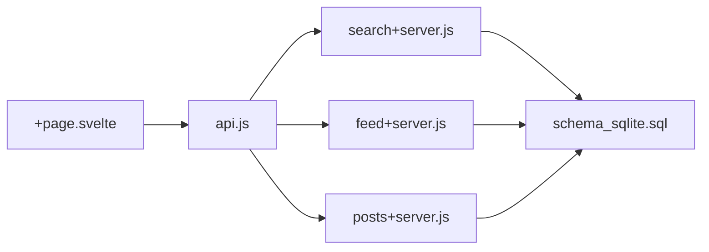

# Hashtags & Content Discovery

<cite>
**Referenced Files in This Document**
- [search+server.js](file://frontend/src/routes/api/search/+server.js)
- [schema_sqlite.sql](file://schema_sqlite.sql)
- [db.js](file://frontend/src/lib/server/db.js)
- [auth.js](file://frontend/src/lib/server/auth.js)
- [+page.svelte](file://frontend/src/routes/explore/+page.svelte)
- [api.js](file://frontend/src/lib/api.js)
- [feed+server.js](file://frontend/src/routes/api/feed/[...path]/+server.js)
- [entities.js](file://frontend/src/lib/server/entities.js)
- [posts+server.js](file://frontend/src/routes/api/posts/[...path]/+server.js)
- [cron+server.js](file://frontend/src/routes/api/cron/+server.js)
</cite>

## Table of Contents
1. [Introduction](#introduction)
2. [Project Structure](#project-structure)
3. [Core Components](#core-components)
4. [Architecture Overview](#architecture-overview)
5. [Detailed Component Analysis](#detailed-component-analysis)
6. [Dependency Analysis](#dependency-analysis)
7. [Performance Considerations](#performance-considerations)
8. [Troubleshooting Guide](#troubleshooting-guide)
9. [Conclusion](#conclusion)

## Introduction
This document explains VSocial’s hashtag system and content discovery mechanisms. It covers how hashtags are parsed from content, indexed in the database, and surfaced through search and discovery features. It also documents the recommendation engine powering the personalized feed, the trending hashtag mechanism, and the search API surface for users, posts, hashtags, and marketplace items. Practical examples illustrate hashtag usage patterns, content categorization, and discovery workflows. Finally, it outlines performance considerations for search indexing, real-time trend computation, and content relevance ranking, along with safety filters for family-friendly discovery.

## Project Structure
The hashtag and discovery features span three layers:
- Frontend UI: Explore page and API client orchestration
- Backend API: Search, feed, posts, and cron endpoints
- Database: Schema and indexes supporting hashtag indexing and trending

**Diagram sources**
- [search+server.js:8-60](file://frontend/src/routes/api/search/+server.js#L8-L60)
- [feed+server.js:47-217](file://frontend/src/routes/api/feed/[...path]/+server.js#L47-L217)
- [posts+server.js:96-205](file://frontend/src/routes/api/posts/[...path]/+server.js#L96-L205)
- [cron+server.js:5-31](file://frontend/src/routes/api/cron/+server.js#L5-L31)
- [schema_sqlite.sql:186-191](file://schema_sqlite.sql#L186-L191)

**Section sources**
- [search+server.js:8-60](file://frontend/src/routes/api/search/+server.js#L8-L60)
- [feed+server.js:47-217](file://frontend/src/routes/api/feed/[...path]/+server.js#L47-L217)
- [posts+server.js:96-205](file://frontend/src/routes/api/posts/[...path]/+server.js#L96-L205)
- [cron+server.js:5-31](file://frontend/src/routes/api/cron/+server.js#L5-L31)
- [schema_sqlite.sql:186-191](file://schema_sqlite.sql#L186-L191)

## Core Components
- Hashtag parsing and indexing
  - Content parsing converts #hashtags into links and extracts raw tags for indexing.
  - Posts are stored with optional metadata; hashtag indexing is handled by the parsing layer and database schema.
- Search API
  - Supports text search across users, posts, gigs, and hashtags with pagination and type filtering.
  - On empty query, returns trending users, trending hashtags, and popular posts.
- Feed API
  - Personalized home feed with configurable weights for interests, interactions, social signals, popularity, recency, and diversity.
  - Explore feed returns public posts ordered by engagement.
- Cron maintenance
  - Periodic cleanup of expired stories and sessions; trending computation is not implemented in the provided code.

**Section sources**
- [entities.js:16-45](file://frontend/src/lib/server/entities.js#L16-L45)
- [search+server.js:8-60](file://frontend/src/routes/api/search/+server.js#L8-L60)
- [feed+server.js:47-217](file://frontend/src/routes/api/feed/[...path]/+server.js#L47-L217)
- [cron+server.js:5-31](file://frontend/src/routes/api/cron/+server.js#L5-L31)

## Architecture Overview
The system integrates UI-driven search and discovery with backend APIs and a relational schema optimized for hashtag and content queries.

**Diagram sources**
- [+page.svelte:44-89](file://frontend/src/routes/explore/+page.svelte#L44-L89)
- [api.js:324-330](file://frontend/src/lib/api.js#L324-L330)
- [search+server.js:8-60](file://frontend/src/routes/api/search/+server.js#L8-L60)
- [feed+server.js:74-107](file://frontend/src/routes/api/feed/[...path]/+server.js#L74-L107)
- [schema_sqlite.sql:186-191](file://schema_sqlite.sql#L186-L191)

## Detailed Component Analysis

### Hashtag Parsing and Indexing
- Parsing
  - Entities parser detects #hashtags and converts them into discoverable links.
  - Extract function returns normalized lowercase tags from post bodies.
- Indexing
  - Database defines a dedicated hashtags table with counts and timestamps.
  - Posts schema includes a separate post_hashtags join table for many-to-many relationships.
  - Additional trending_hashtags table exists in the PostgreSQL migration, but the SQLite schema uses a simpler hashtags table.

**Diagram sources**
- [entities.js:47-50](file://frontend/src/lib/server/entities.js#L47-L50)
- [schema_sqlite.sql:186-191](file://schema_sqlite.sql#L186-L191)

**Section sources**
- [entities.js:16-45](file://frontend/src/lib/server/entities.js#L16-L45)
- [entities.js:47-50](file://frontend/src/lib/server/entities.js#L47-L50)
- [schema_sqlite.sql:186-191](file://schema_sqlite.sql#L186-L191)

### Search API: Text, Hashtags, Users, and Marketplace
- Endpoint
  - GET /api/search?q=&type=all|users|posts|gigs|hashtags&page=&limit=
- Behavior
  - Empty query returns trending users, trending hashtags, and popular posts.
  - Type-specific queries:
    - Users: supports authenticated “is_following” detection.
    - Posts: public content search.
    - Gigs: open listings search with tag parsing.
    - Hashtags: tag search with post count ordering.
- Pagination
  - Pages are bounded (min 1, max 30) with offset-based pagination.

**Diagram sources**
- [search+server.js:8-60](file://frontend/src/routes/api/search/+server.js#L8-L60)

**Section sources**
- [search+server.js:8-60](file://frontend/src/routes/api/search/+server.js#L8-L60)

### Feed API: Personalized Home and Explore
- Personalized Home
  - Requires authentication; loads user preferences (weights and algorithm mode).
  - Modes:
    - Chronological/Radar: strict chronological mixing.
    - Intelligent: weighted scoring across social, popularity, recency, and diversity.
    - Retention: TikTok-style heavy emphasis on popularity and diversity.
  - Pagination uses cursors derived from engagement or score thresholds.
- Explore
  - Public feed sorted by engagement descending with cursor-based pagination.

**Diagram sources**
- [feed+server.js:47-217](file://frontend/src/routes/api/feed/[...path]/+server.js#L47-L217)

**Section sources**
- [feed+server.js:47-217](file://frontend/src/routes/api/feed/[...path]/+server.js#L47-L217)

### Posts API: Creation and Metadata
- Creation
  - Accepts body, privacy, mood, scheduled publishing, and optional poll/location metadata.
  - Stores metadata separately to avoid altering visible content.
- Media association
  - Links uploaded media to posts via post_media table.

**Diagram sources**
- [posts+server.js:119-205](file://frontend/src/routes/api/posts/[...path]/+server.js#L119-L205)

**Section sources**
- [posts+server.js:119-205](file://frontend/src/routes/api/posts/[...path]/+server.js#L119-L205)

### Trending Hashtags and Real-Time Calculation
- Current state
  - Hashtags table maintains counts; search endpoint orders by post_count.
  - No explicit trending computation endpoint is present in the provided code.
- Recommended approach
  - Implement a periodic job (e.g., hourly) to compute trend_score deltas and update trending_hashtags.
  - Expose GET /api/search/trending with top N hashtags by recency-weighted score.

[No sources needed since this section proposes future implementation not present in the codebase]

### Content Moderation and Family-Friendly Discovery
- Safety filters
  - No explicit family-friendly category filtering is implemented in the provided code.
  - Recommendation: add content classification flags and category filters to feed and search endpoints.
- Privacy and visibility
  - Posts marked private are excluded from public feeds and search results.
  - Authentication is required for feed preferences and actions.

**Section sources**
- [search+server.js:41-43](file://frontend/src/routes/api/search/+server.js#L41-L43)
- [feed+server.js:120-150](file://frontend/src/routes/api/feed/[...path]/+server.js#L120-L150)

## Dependency Analysis
Key dependencies and relationships:
- Explore page depends on API client for search and feed.
- Search API depends on database tables for users, posts, gigs, and hashtags.
- Feed API depends on user settings and posts/media tables.
- Posts API depends on media storage and notifications.

**Diagram sources**
- [+page.svelte:44-89](file://frontend/src/routes/explore/+page.svelte#L44-L89)
- [api.js:324-330](file://frontend/src/lib/api.js#L324-L330)
- [search+server.js:8-60](file://frontend/src/routes/api/search/+server.js#L8-L60)
- [feed+server.js:47-217](file://frontend/src/routes/api/feed/[...path]/+server.js#L47-L217)
- [posts+server.js:96-205](file://frontend/src/routes/api/posts/[...path]/+server.js#L96-L205)
- [schema_sqlite.sql:186-191](file://schema_sqlite.sql#L186-L191)

**Section sources**
- [+page.svelte:44-89](file://frontend/src/routes/explore/+page.svelte#L44-L89)
- [api.js:324-330](file://frontend/src/lib/api.js#L324-L330)
- [search+server.js:8-60](file://frontend/src/routes/api/search/+server.js#L8-L60)
- [feed+server.js:47-217](file://frontend/src/routes/api/feed/[...path]/+server.js#L47-L217)
- [posts+server.js:96-205](file://frontend/src/routes/api/posts/[...path]/+server.js#L96-L205)
- [schema_sqlite.sql:186-191](file://schema_sqlite.sql#L186-L191)

## Performance Considerations
- Search indexing
  - Use LIKE with leading wildcards for text search; consider adding GIN trigram indexes for scalable full-text search.
  - Limit search result sets and enforce bounds on page size.
- Engagement-based feeds
  - Compute scores server-side; avoid heavy client-side sorting.
  - Use cursor-based pagination to minimize offset overhead.
- Media retrieval
  - Batch fetch media per post to reduce round trips.
- Database tuning
  - Enable WAL mode and appropriate pragmas for SQLite.
  - Keep indexes aligned with frequent query patterns (e.g., posts by user, engagement order).

[No sources needed since this section provides general guidance]

## Troubleshooting Guide
- Authentication errors
  - Feed and preference endpoints require a valid bearer token; missing or expired tokens cause 401 responses.
- Empty search results
  - Without a query, the search endpoint returns trending lists; with a query, ensure type matches supported values.
- Pagination anomalies
  - Verify cursor format and numeric boundaries; malformed cursors can break pagination.

**Section sources**
- [auth.js:15-44](file://frontend/src/lib/server/auth.js#L15-L44)
- [search+server.js:8-23](file://frontend/src/routes/api/search/+server.js#L8-L23)
- [feed+server.js:167-171](file://frontend/src/routes/api/feed/[...path]/+server.js#L167-L171)

## Conclusion
VSocial’s hashtag and discovery system centers on robust parsing, a flexible search API, and a configurable feed algorithm. The current implementation provides hashtag-aware search and engagement-driven discovery, with room to expand real-time trending and safety filters. By optimizing database indexes, refining the recommendation scoring, and introducing moderation controls, the platform can scale discovery while maintaining a safe, engaging experience.