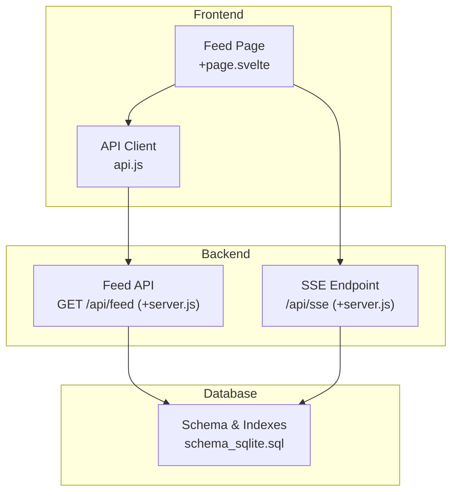
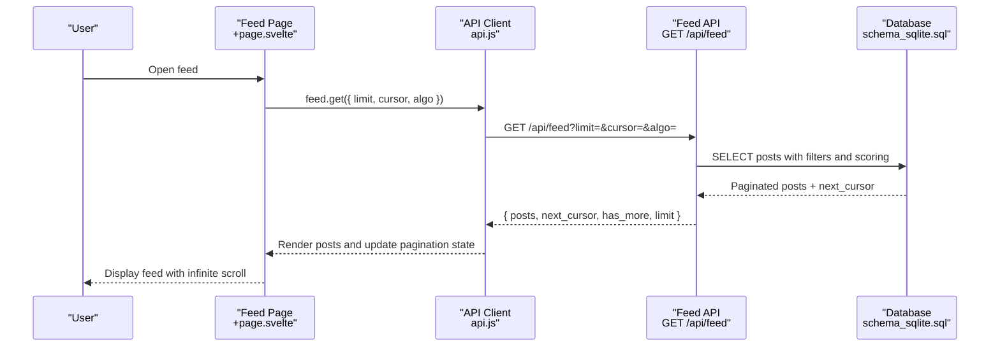
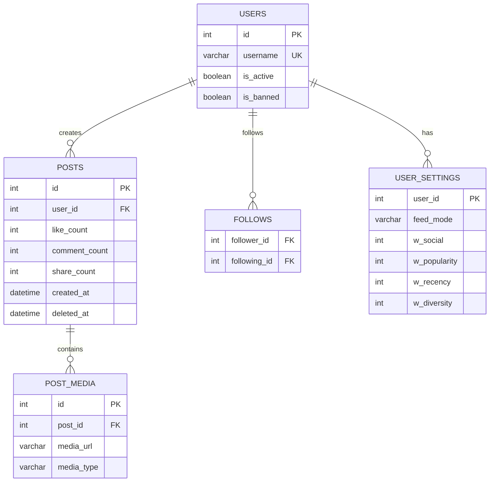

# Feed Algorithm & Pagination

<cite>
**Referenced Files in This Document**
- [feed/+server.js](file://frontend/src/routes/api/feed/[...path]+server.js)
- [api.js](file://frontend/src/lib/api.js)
- [feed/+page.svelte](file://frontend/src/routes/feed/+page.svelte)
- [schema_sqlite.sql](file://schema_sqlite.sql)
- [sse/+server.js](file://frontend/src/routes/api/sse/+server.js)
- [notifications.svelte.js](file://frontend/src/lib/stores/notifications.svelte.js)
</cite>

## Table of Contents
1. [Introduction](#introduction)
2. [Project Structure](#project-structure)
3. [Core Components](#core-components)
4. [Architecture Overview](#architecture-overview)
5. [Detailed Component Analysis](#detailed-component-analysis)
6. [Dependency Analysis](#dependency-analysis)
7. [Performance Considerations](#performance-considerations)
8. [Troubleshooting Guide](#troubleshooting-guide)
9. [Conclusion](#conclusion)

## Introduction
This document explains the feed algorithm and pagination system powering the home feed, explore feed, and related personalization features. It covers timeline generation logic, user following relationships, content ranking criteria, cursor-based pagination, parameter handling, performance optimizations, refresh mechanisms, real-time updates, infinite scrolling behavior, privacy considerations, and scalability strategies. It also documents feed API usage, pagination parameters, response formats, and operational guidance for large user networks.

## Project Structure
The feed system spans three layers:
- Frontend UI and API client: fetches feed data, manages pagination state, and renders posts.
- Backend API: computes personalized feeds, applies filters, and returns paginated results.
- Database schema: defines tables, indexes, and relationships used by the feed algorithm.

**Diagram sources**
- [feed/+page.svelte](file://frontend/src/routes/feed/+page.svelte)
- [api.js](file://frontend/src/lib/api.js)
- [feed/+server.js](file://frontend/src/routes/api/feed/[...path]+server.js)
- [sse/+server.js](file://frontend/src/routes/api/sse/+server.js)
- [schema_sqlite.sql](file://schema_sqlite.sql)

**Section sources**
- [feed/+page.svelte](file://frontend/src/routes/feed/+page.svelte)
- [api.js](file://frontend/src/lib/api.js)
- [feed/+server.js](file://frontend/src/routes/api/feed/[...path]+server.js)
- [schema_sqlite.sql](file://schema_sqlite.sql)

## Core Components
- Feed API: Implements home feed, explore feed, preferences retrieval/update, and suggested users.
- Frontend feed page: Handles pagination state, infinite scroll, algorithm toggle, and rendering.
- API client: Centralized HTTP client with auth and error handling.
- Database schema: Defines users, posts, follows, user_settings, and indexes enabling efficient queries.

Key capabilities:
- Personalized home feed with two modes: intelligent (weighted scoring) and chronological/radar.
- Explore feed sorted by popularity.
- Cursor-based pagination with deterministic ordering.
- Preferences endpoint to tune weights and algorithm mode.
- Real-time updates via SSE for notifications and live events.

**Section sources**
- [feed/+server.js](file://frontend/src/routes/api/feed/[...path]+server.js)
- [api.js](file://frontend/src/lib/api.js)
- [feed/+page.svelte](file://frontend/src/routes/feed/+page.svelte)
- [schema_sqlite.sql](file://schema_sqlite.sql)

## Architecture Overview
The feed pipeline integrates frontend UI, backend API, and database:

**Diagram sources**
- [feed/+page.svelte](file://frontend/src/routes/feed/+page.svelte)
- [api.js](file://frontend/src/lib/api.js)
- [feed/+server.js](file://frontend/src/routes/api/feed/[...path]+server.js)
- [schema_sqlite.sql](file://schema_sqlite.sql)

## Detailed Component Analysis

### Feed Algorithm Modes and Ranking Criteria
The backend supports multiple feed modes:
- Chronological/Radar: Strict reverse-chronological mix of followed users and trending recent posts.
- Intelligent: Weighted scoring combining social relevance, popularity, recency, and diversity.
- Retention: Similar to intelligent but tuned toward engagement and discovery.

Scoring formula (intelligent/retention):
- Social weight: Boost for posts by followed users.
- Popularity weight: Normalized engagement (likes, comments, shares).
- Recency weight: Age-based decay factor.
- Diversity weight: Random jitter to surface varied content.

Pagination cursor:
- For intelligent/retention: Composite cursor encoding score and post id.
- For radar/chronological: Numeric id cursor.

Explore feed:
- Reverse-chronological ordering by likes count with id tiebreaker.

Privacy and visibility:
- Deleted posts are excluded.
- Content visibility respects platform privacy defaults (not enforced in feed query).

**Section sources**
- [feed/+server.js](file://frontend/src/routes/api/feed/[...path]+server.js)
- [schema_sqlite.sql](file://schema_sqlite.sql)

### Cursor-Based Pagination Implementation
- Home feed pagination:
  - Intelligent/Retention: Cursor is a composite string "score_id".
  - Radar/Chronological: Cursor is numeric post id.
- Explore feed pagination:
  - Cursor is "like_count_id", ordering by likes desc with id tiebreaker.
- Parameter handling:
  - limit: bounded between 1 and 50.
  - cursor: optional; omitted on first page.
- Response shape:
  - posts: array of post objects.
  - next_cursor: present when more results exist.
  - has_more: boolean indicating availability of additional pages.
  - limit: effective limit used.

Frontend pagination:
- Maintains cursor state and merges new posts with existing ones.
- Resets pagination when switching algorithm modes.

**Section sources**
- [feed/+page.svelte](file://frontend/src/routes/feed/+page.svelte)
- [feed/+server.js](file://frontend/src/routes/api/feed/[...path]+server.js)

### API Endpoints and Usage
Endpoints:
- GET /api/feed
  - Purpose: Personalized home feed.
  - Query params: limit, cursor, algo (intelligent or chronological).
  - Response: { posts, next_cursor, has_more, limit }.
- GET /api/feed/explore
  - Purpose: Public explore feed.
  - Query params: limit, cursor.
  - Response: { posts, next_cursor, has_more, limit }.
- GET /api/feed/preferences
  - Purpose: Retrieve current user preferences.
  - Response: { preferences: { algorithm, weights } }.
- PUT /api/feed/preferences
  - Purpose: Update algorithm mode and weights.
  - Request body: { algorithm, weights }.
- GET /api/feed/suggested-users
  - Purpose: Discover users to follow.

Frontend usage:
- feed.get(params) builds query string and fetches home feed.
- feed.explore(params) fetches explore feed.
- feed.preferences.get()/update() manage personalization.

**Section sources**
- [feed/+server.js](file://frontend/src/routes/api/feed/[...path]+server.js)
- [api.js](file://frontend/src/lib/api.js)

### Real-Time Updates and Infinite Scrolling
Real-time:
- SSE endpoint validates token and streams events to connected clients.
- Notifications store maintains a persistent SSE connection with exponential backoff and deduplication.

Infinite scrolling:
- Frontend loads more posts when nearing the end of the list.
- Uses cursor-based pagination to avoid gaps or duplicates.
- Algorithm toggle triggers a reset with fresh cursor.

**Section sources**
- [sse/+server.js](file://frontend/src/routes/api/sse/+server.js)
- [notifications.svelte.js](file://frontend/src/lib/stores/notifications.svelte.js)
- [feed/+page.svelte](file://frontend/src/routes/feed/+page.svelte)

### Privacy Considerations and Content Visibility
- Feed excludes deleted posts.
- Platform privacy fields exist in schema (e.g., user privacy_level, post privacy), but the feed query does not apply visibility filters.
- Recommendations: Apply per-user privacy checks at query time if visibility rules change.

**Section sources**
- [feed/+server.js](file://frontend/src/routes/api/feed/[...path]+server.js)
- [schema_sqlite.sql](file://schema_sqlite.sql)

## Dependency Analysis
The feed system depends on:
- Database tables: posts, users, follows, user_settings, post_media.
- Indexes: posts by user and created_at, follows by following_id, stories by expiry, reels by user and created_at, notifications by recipient and created_at.

**Diagram sources**
- [schema_sqlite.sql](file://schema_sqlite.sql)

**Section sources**
- [schema_sqlite.sql](file://schema_sqlite.sql)

## Performance Considerations
- Cursor-based pagination avoids OFFSET for large datasets, ensuring constant-time paging.
- Aggressive indexing on frequently filtered and ordered columns improves query performance.
- Weighted scoring uses computed expressions; keep weights normalized and limits reasonable to avoid heavy scans.
- Media joins are batched to minimize round trips.
- Recommendations:
  - Monitor slow queries and add composite indexes as needed.
  - Consider materialized aggregates for extremely popular queries.
  - Cache lightweight user preference reads if traffic is high.
  - Use CDN for media assets and signed URLs for secure delivery.

[No sources needed since this section provides general guidance]

## Troubleshooting Guide
Common issues and resolutions:
- Empty or stale feed:
  - Verify cursor handling and ensure next_cursor is passed on subsequent requests.
  - Confirm algorithm mode and weights are persisted via preferences endpoint.
- Unexpected pagination gaps:
  - Ensure cursor format matches the mode (numeric for chronological, "score_id" for intelligent/retention).
  - Check limit bounds (1–50) and presence of deleted posts.
- Authentication errors:
  - Confirm bearer token is present and valid; SSE requires a valid session token.
- Real-time updates not arriving:
  - Inspect SSE connection state and backoff behavior; verify token validity and session expiry.

**Section sources**
- [feed/+page.svelte](file://frontend/src/routes/feed/+page.svelte)
- [feed/+server.js](file://frontend/src/routes/api/feed/[...path]+server.js)
- [sse/+server.js](file://frontend/src/routes/api/sse/+server.js)

## Conclusion
The feed system combines flexible algorithm modes, robust cursor-based pagination, and real-time capabilities to deliver a scalable and responsive user experience. By leveraging SQLite’s performance characteristics, strategic indexing, and efficient query patterns, it supports large user networks while maintaining simplicity and transparency. Evolving the algorithm and weights through user preferences enables continuous personalization without opaque filtering.