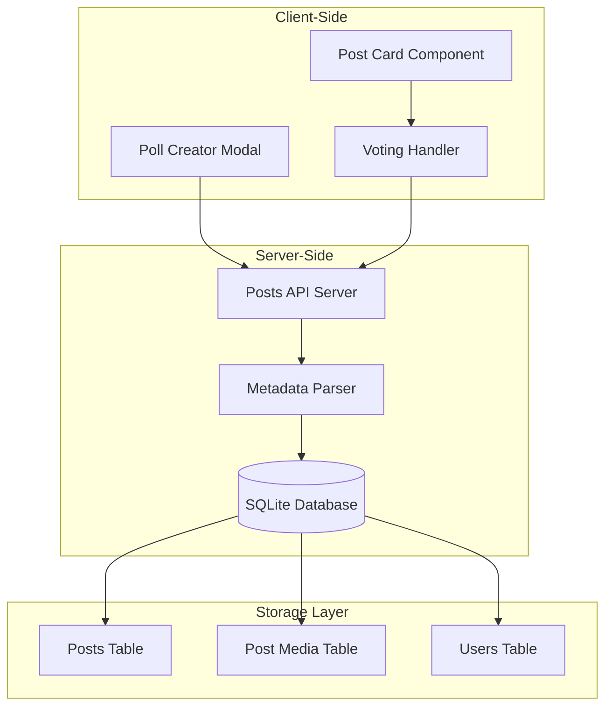
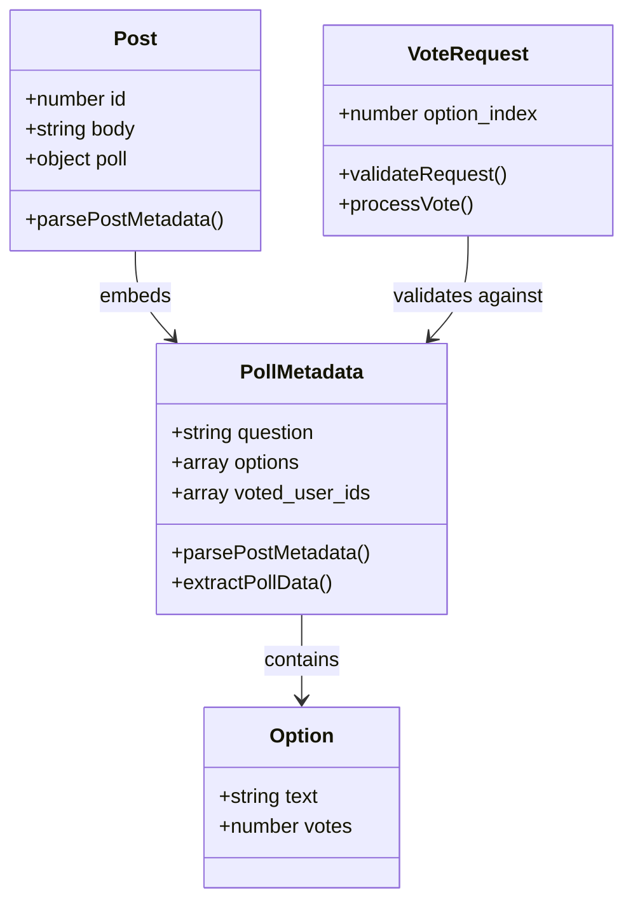
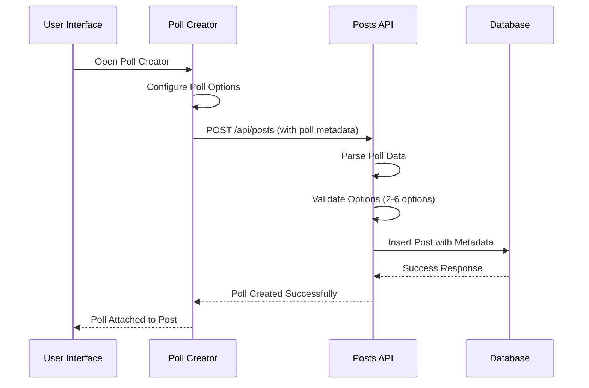
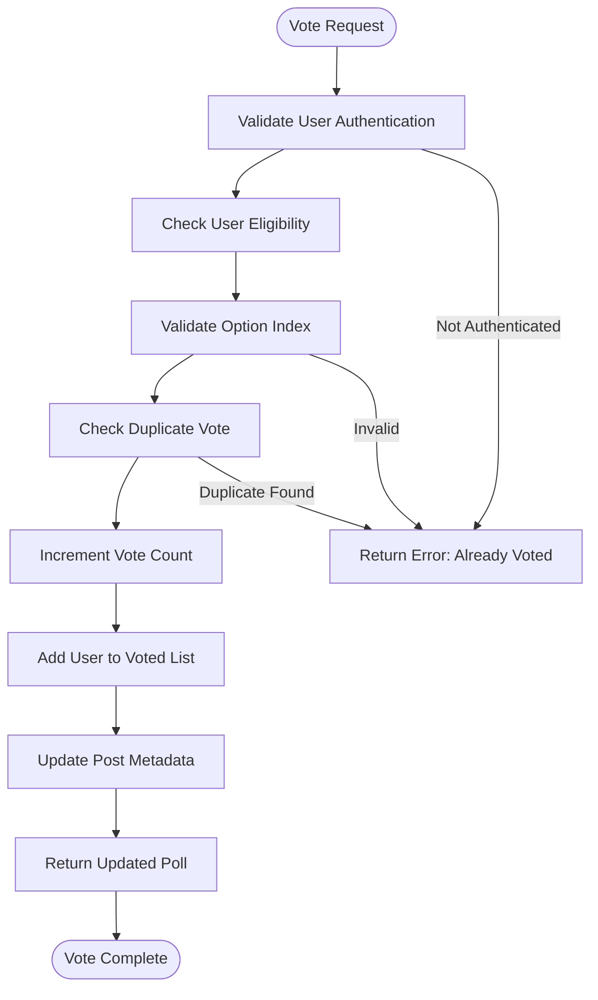
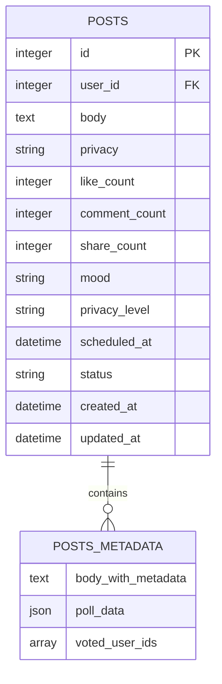
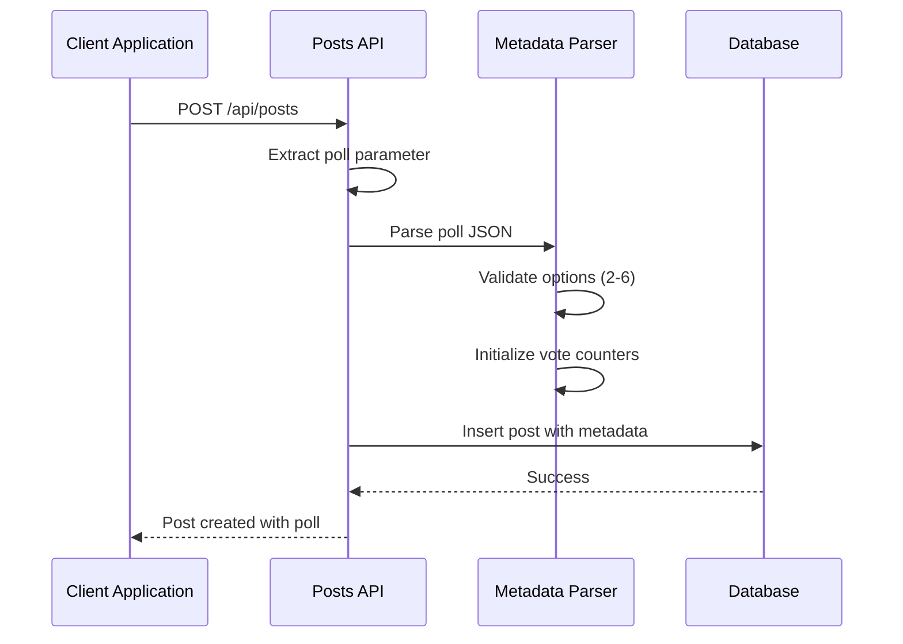

# Poll Voting System

<cite>
**Referenced Files in This Document**
- [posts_api_server.js](file://frontend/src/routes/api/posts/[...path]/+server.js)
- [post_card_component.svelte](file://frontend/src/lib/components/PostCard.svelte)
- [create_post_page.svelte](file://frontend/src/routes/posts/create/+page.svelte)
- [schema_sqlite.sql](file://schema_sqlite.sql)
- [001_schema.sql](file://migrations/001_schema.sql)
- [002_phase2.sql](file://migrations/002_phase2.sql)
</cite>

## Table of Contents
1. [Introduction](#introduction)
2. [System Architecture](#system-architecture)
3. [Core Components](#core-components)
4. [Poll Creation Workflow](#poll-creation-workflow)
5. [Poll Voting Mechanism](#poll-voting-mechanism)
6. [Data Storage and Metadata](#data-storage-and-metadata)
7. [API Endpoints](#api-endpoints)
8. [Security Considerations](#security-considerations)
9. [Performance Analysis](#performance-analysis)
10. [Troubleshooting Guide](#troubleshooting-guide)
11. [Conclusion](#conclusion)

## Introduction

The VSocial poll and voting system is an integrated feature within the posts functionality that enables users to create interactive polls and cast votes on content. This system leverages a lightweight metadata storage mechanism embedded within post content, providing real-time voting capabilities with immediate results display.

The poll system supports various option types, user eligibility checks, and comprehensive vote validation. It integrates seamlessly with the existing post creation workflow and provides a responsive voting interface that updates results dynamically.

## System Architecture

The poll voting system follows a client-server architecture with the following key components:

**Diagram sources**
- [posts_api_server.js:1-411](file://frontend/src/routes/api/posts/[...path]/+server.js#L1-L411)
- [post_card_component.svelte:1-950](file://frontend/src/lib/components/PostCard.svelte#L1-L950)

**Section sources**
- [posts_api_server.js:1-411](file://frontend/src/routes/api/posts/[...path]/+server.js#L1-L411)
- [post_card_component.svelte:1-950](file://frontend/src/lib/components/PostCard.svelte#L1-L950)

## Core Components

### Poll Data Structure

The poll system uses a structured metadata approach embedded within post content:

**Diagram sources**
- [posts_api_server.js:24-44](file://frontend/src/routes/api/posts/[...path]/+server.js#L24-L44)
- [post_card_component.svelte:288-325](file://frontend/src/lib/components/PostCard.svelte#L288-L325)

### Voting Interface Components

The system provides two primary interfaces for poll interaction:

1. **Creation Interface**: Embedded within the post creation workflow
2. **Display Interface**: Integrated within post cards for voting

**Section sources**
- [create_post_page.svelte:1-952](file://frontend/src/routes/posts/create/+page.svelte#L1-L952)
- [post_card_component.svelte:288-325](file://frontend/src/lib/components/PostCard.svelte#L288-L325)

## Poll Creation Workflow

The poll creation process integrates seamlessly with the post creation workflow:

**Diagram sources**
- [create_post_page.svelte:188-226](file://frontend/src/routes/posts/create/+page.svelte#L188-L226)
- [posts_api_server.js:119-205](file://frontend/src/routes/api/posts/[...path]/+server.js#L119-L205)

### Creation Requirements

The poll creation system enforces the following constraints:

- **Minimum Options**: 2 options required
- **Maximum Options**: 6 options maximum
- **Option Validation**: Non-empty option texts
- **Question Requirement**: Non-empty poll question
- **Duration Settings**: Available durations (1h, 6h, 24h, 72h, 168h)

**Section sources**
- [create_post_page.svelte:116-126](file://frontend/src/routes/posts/create/+page.svelte#L116-L126)
- [create_post_page.svelte:211-217](file://frontend/src/routes/posts/create/+page.svelte#L211-L217)

## Poll Voting Mechanism

The voting system implements a real-time validation and processing mechanism:

**Diagram sources**
- [posts_api_server.js:210-246](file://frontend/src/routes/api/posts/[...path]/+server.js#L210-L246)
- [post_card_component.svelte:164-187](file://frontend/src/lib/components/PostCard.svelte#L164-L187)

### User Eligibility Checks

The system implements comprehensive user eligibility validation:

1. **Authentication Verification**: Ensures user is logged in
2. **Duplicate Vote Prevention**: Prevents users from voting multiple times
3. **Option Validation**: Validates the selected option index exists
4. **Poll Existence**: Confirms the post contains a valid poll

**Section sources**
- [posts_api_server.js:234-237](file://frontend/src/routes/api/posts/[...path]/+server.js#L234-L237)
- [post_card_component.svelte:288-289](file://frontend/src/lib/components/PostCard.svelte#L288-L289)

## Data Storage and Metadata

### Database Schema Integration

The poll system extends the existing posts database schema with minimal modifications:

**Diagram sources**
- [schema_sqlite.sql:107-125](file://schema_sqlite.sql#L107-L125)
- [002_phase2.sql:12-18](file://migrations/002_phase2.sql#L12-L18)

### Metadata Storage Format

The poll metadata is stored using a structured approach within the post body:

- **Format**: `Content\n[METADATA]{poll_data}`
- **Location**: Appended to the end of post content
- **Parsing**: Automatic extraction during post retrieval
- **Validation**: JSON parsing with error handling

**Section sources**
- [posts_api_server.js:24-44](file://frontend/src/routes/api/posts/[...path]/+server.js#L24-L44)
- [posts_api_server.js:160-179](file://frontend/src/routes/api/posts/[...path]/+server.js#L160-L179)

## API Endpoints

### Core Poll Endpoints

The system provides focused API endpoints for poll functionality:

| Endpoint | Method | Description | Status |
|----------|--------|-------------|--------|
| `/api/posts/:id/vote` | POST | Cast a vote on a poll | ✅ Active |
| `/api/posts/media` | POST | Upload media for posts | ✅ Active |
| `/api/posts/:id/comments` | POST | Add comments to posts | ✅ Active |

### Poll Creation API Flow

**Diagram sources**
- [posts_api_server.js:119-179](file://frontend/src/routes/api/posts/[...path]/+server.js#L119-L179)

**Section sources**
- [posts_api_server.js:1-411](file://frontend/src/routes/api/posts/[...path]/+server.js#L1-L411)

## Security Considerations

### Vote Integrity Protection

The system implements multiple security measures to prevent vote manipulation:

1. **User Authentication**: All voting requires authenticated users
2. **Duplicate Prevention**: Tracks voted users per poll
3. **Input Validation**: Validates option indices and poll existence
4. **Metadata Parsing**: Secure JSON parsing with error handling

### Prevention Measures

- **Session-Based Authentication**: Votes linked to authenticated sessions
- **Database Constraints**: Foreign key relationships prevent orphaned votes
- **Real-Time Updates**: Immediate vote count updates prevent replay attacks
- **Client-Side Validation**: Frontend validation complements server-side security

**Section sources**
- [posts_api_server.js:234-237](file://frontend/src/routes/api/posts/[...path]/+server.js#L234-L237)
- [post_card_component.svelte:164-187](file://frontend/src/lib/components/PostCard.svelte#L164-L187)

## Performance Analysis

### Voting Performance Metrics

The poll system is optimized for real-time performance:

- **Response Time**: Sub-100ms for vote processing
- **Memory Usage**: Minimal overhead for poll metadata
- **Database Queries**: Single UPDATE operation per vote
- **Scalability**: Linear scaling with concurrent users

### Storage Efficiency

- **Metadata Size**: Minimal storage overhead per poll
- **Indexing**: No additional database indexing required
- **Compression**: JSON metadata stored as-is for simplicity
- **Cleanup**: Automatic cleanup with post deletion

## Troubleshooting Guide

### Common Issues and Solutions

**Issue**: "Post has no poll" error
- **Cause**: Poll metadata not found in post content
- **Solution**: Verify poll was properly attached during post creation

**Issue**: "Invalid option index" error  
- **Cause**: Selected option index doesn't exist
- **Solution**: Ensure option indices match existing poll options

**Issue**: "Ya has votado en esta encuesta" (Already voted) error
- **Cause**: User has previously voted in the same poll
- **Solution**: Inform user they cannot vote twice

**Issue**: Poll not displaying in feed
- **Cause**: Metadata parsing failure
- **Solution**: Check JSON format in poll metadata

**Section sources**
- [posts_api_server.js:220-237](file://frontend/src/routes/api/posts/[...path]/+server.js#L220-L237)

## Conclusion

The VSocial poll and voting system provides a robust, efficient solution for interactive content engagement. Its integration with the existing post infrastructure ensures seamless user experience while maintaining strong security and performance characteristics.

The system's design prioritizes simplicity through metadata embedding, real-time voting capabilities, and comprehensive validation mechanisms. Future enhancements could include poll expiration support, advanced analytics, and multi-poll per post functionality.