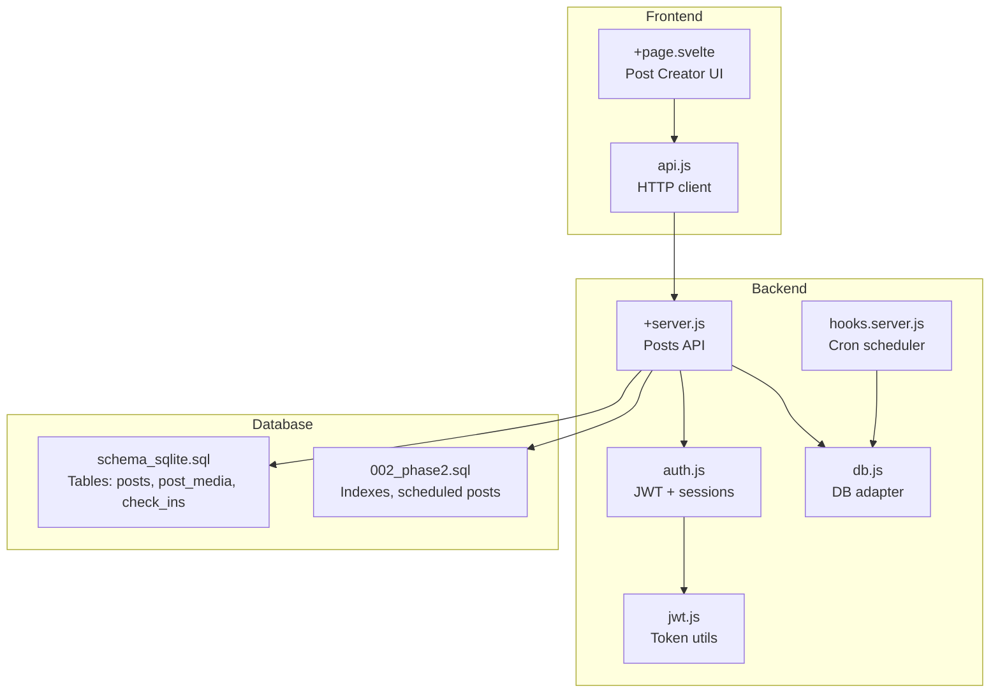
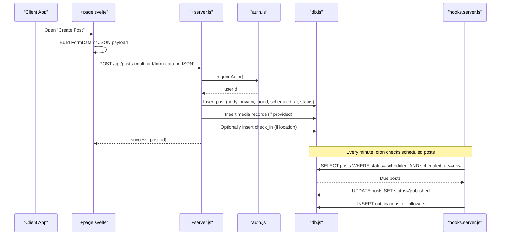
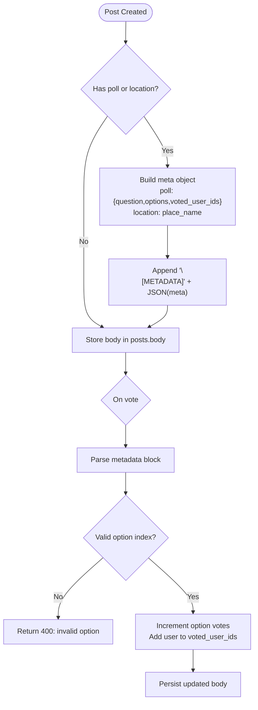
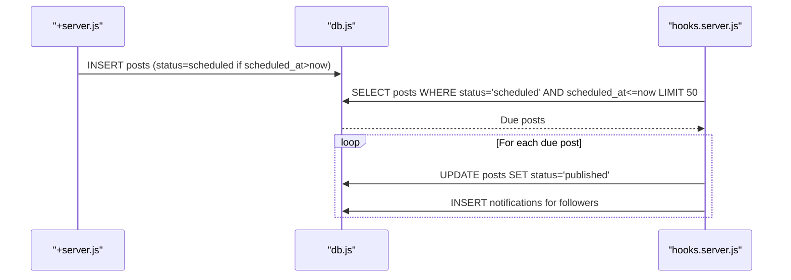
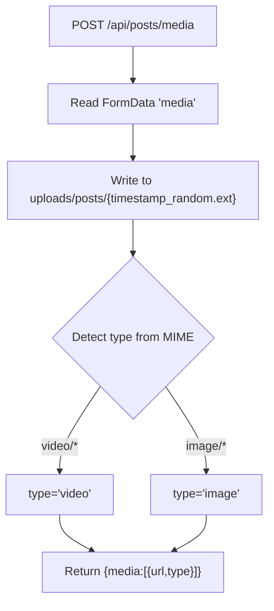
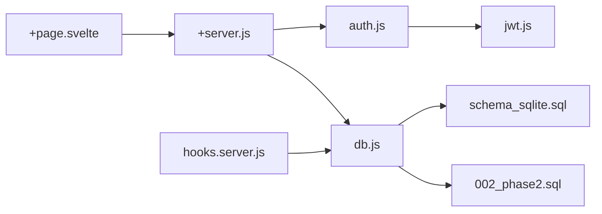

# Post Creation & Management

<cite>
**Referenced Files in This Document**
- [schema_sqlite.sql](file://schema_sqlite.sql)
- [002_phase2.sql](file://migrations/002_phase2.sql)
- [+server.js](file://frontend/src/routes/api/posts/[...path]/+server.js)
- [db.js](file://frontend/src/lib/server/db.js)
- [auth.js](file://frontend/src/lib/server/auth.js)
- [jwt.js](file://frontend/src/lib/server/jwt.js)
- [hooks.server.js](file://frontend/src/hooks.server.js)
- [+page.svelte](file://frontend/src/routes/posts/create/+page.svelte)
- [api.js](file://frontend/src/lib/api.js)
</cite>

## Table of Contents
1. [Introduction](#introduction)
2. [Project Structure](#project-structure)
3. [Core Components](#core-components)
4. [Architecture Overview](#architecture-overview)
5. [Detailed Component Analysis](#detailed-component-analysis)
6. [Dependency Analysis](#dependency-analysis)
7. [Performance Considerations](#performance-considerations)
8. [Troubleshooting Guide](#troubleshooting-guide)
9. [Conclusion](#conclusion)

## Introduction
This document describes the post creation and management subsystem of the Vsocial platform. It covers the complete lifecycle from creation to deletion, including soft-delete semantics, scheduling, media handling, privacy controls, and metadata parsing for polls and location tags. It also documents multipart/form-data and JSON request handling, validation rules, error responses, and practical examples for common workflows.

## Project Structure
The post subsystem spans the frontend SvelteKit application and the backend server endpoints. The database schema defines the persistence model, while cron jobs manage scheduled post publishing. The frontend provides a rich UI for composing posts with text, media, polls, location tags, and scheduling.

**Diagram sources**
- [+server.js:1-411](file://frontend/src/routes/api/posts/[...path]/+server.js#L1-L411)
- [db.js:1-209](file://frontend/src/lib/server/db.js#L1-L209)
- [auth.js:1-92](file://frontend/src/lib/server/auth.js#L1-L92)
- [jwt.js:1-45](file://frontend/src/lib/server/jwt.js#L1-L45)
- [hooks.server.js:1-179](file://frontend/src/hooks.server.js#L1-L179)
- [schema_sqlite.sql:107-125](file://schema_sqlite.sql#L107-L125)
- [002_phase2.sql:12-18](file://migrations/002_phase2.sql#L12-L18)

**Section sources**
- [+server.js:1-411](file://frontend/src/routes/api/posts/[...path]/+server.js#L1-L411)
- [db.js:1-209](file://frontend/src/lib/server/db.js#L1-L209)
- [auth.js:1-92](file://frontend/src/lib/server/auth.js#L1-L92)
- [jwt.js:1-45](file://frontend/src/lib/server/jwt.js#L1-L45)
- [hooks.server.js:1-179](file://frontend/src/hooks.server.js#L1-L179)
- [schema_sqlite.sql:107-125](file://schema_sqlite.sql#L107-L125)
- [002_phase2.sql:12-18](file://migrations/002_phase2.sql#L12-L18)

## Core Components
- Posts API: Handles creation, updates, deletion, restoration, reactions, comments, and specialized actions (like, share, save, vote).
- Media upload: Dedicated endpoint for uploading images/videos and returning URLs.
- Metadata parsing: Embeds poll and location metadata inside the post body using a special marker.
- Scheduling: Stores scheduled_at and status for delayed publication; cron publishes eligible posts.
- Privacy and visibility: Supports privacy levels and privacy_level fields.
- Soft delete: Uses deleted_at timestamps to hide posts without permanent removal.

**Section sources**
- [+server.js:96-205](file://frontend/src/routes/api/posts/[...path]/+server.js#L96-L205)
- [+server.js:101-117](file://frontend/src/routes/api/posts/[...path]/+server.js#L101-L117)
- [+server.js:210-246](file://frontend/src/routes/api/posts/[...path]/+server.js#L210-L246)
- [schema_sqlite.sql:107-125](file://schema_sqlite.sql#L107-L125)
- [002_phase2.sql:12-18](file://migrations/002_phase2.sql#L12-L18)

## Architecture Overview
The post lifecycle integrates frontend composition, backend validation and persistence, and background scheduling.

**Diagram sources**
- [+page.svelte:188-226](file://frontend/src/routes/posts/create/+page.svelte#L188-L226)
- [+server.js:96-205](file://frontend/src/routes/api/posts/[...path]/+server.js#L96-L205)
- [auth.js:15-44](file://frontend/src/lib/server/auth.js#L15-L44)
- [db.js:1-209](file://frontend/src/lib/server/db.js#L1-L209)
- [hooks.server.js:18-46](file://frontend/src/hooks.server.js#L18-L46)

## Detailed Component Analysis

### Posts API Endpoints and Workflows
- POST /api/posts
  - Accepts multipart/form-data or JSON.
  - Validates presence of either body or media_urls.
  - Parses metadata from body when present.
  - Supports privacy, mood, scheduled_at, location_name, and poll.
  - On success, inserts post, increments user.post_count, and optionally notifies followers.
- POST /api/posts/media
  - Uploads media files, writes to uploads/posts, and returns media URLs with types.
- GET /api/posts/:id
  - Retrieves a single post, parses embedded metadata, and attaches media.
- PUT /api/posts/:id
  - Updates post body for authorized user.
- DELETE /api/posts/:id
  - Soft-deletes post by setting deleted_at.
- POST /api/posts/:id/restore
  - Restores a soft-deleted post for the owner.
- POST /api/posts/:id/like, /api/posts/:id/share, /api/posts/:id/save
  - Manages engagement and saves.
- POST /api/posts/:id/comments, GET /api/posts/:id/comments
  - Manages comments and counts.
- POST /api/posts/:id/vote
  - Processes poll votes embedded in post metadata.

Validation and error handling:
- 400 for missing content/body/media, invalid poll metadata, invalid option index, duplicate votes.
- 401 for missing/invalid/expired tokens.
- 403 for admin-only operations.
- 404 for not found or unauthorized.
- 500 for internal errors.

**Section sources**
- [+server.js:96-205](file://frontend/src/routes/api/posts/[...path]/+server.js#L96-L205)
- [+server.js:101-117](file://frontend/src/routes/api/posts/[...path]/+server.js#L101-L117)
- [+server.js:207-327](file://frontend/src/routes/api/posts/[...path]/+server.js#L207-L327)
- [+server.js:330-358](file://frontend/src/routes/api/posts/[...path]/+server.js#L330-L358)
- [+server.js:360-410](file://frontend/src/routes/api/posts/[...path]/+server.js#L360-L410)

### Request Handling: multipart/form-data vs JSON
- multipart/form-data
  - Fields: body/content, media_urls (ignored), privacy, mood, scheduled_at, location_name, poll (JSON string).
  - Media upload handled separately via POST /api/posts/media.
- JSON
  - Fields: body/content, media_urls (array of {url, type}), privacy, mood, scheduled_at, location_name, poll (object).
  - Used by the frontend when sending composed posts.

Security and validation:
- requireAuth ensures a valid, non-expired session token.
- Content validation prevents empty posts when no media is attached.
- Poll metadata is parsed safely; invalid JSON or indices trigger errors.

**Section sources**
- [+server.js:124-144](file://frontend/src/routes/api/posts/[...path]/+server.js#L124-L144)
- [+server.js:187-189](file://frontend/src/routes/api/posts/[...path]/+server.js#L187-L189)
- [auth.js:15-44](file://frontend/src/lib/server/auth.js#L15-L44)

### Metadata Parsing: Polls and Location Tags
- Embedded metadata format
  - Body text is appended with a special marker and a JSON object containing poll and/or location.
  - Example: body + "\n[METADATA]" + JSON.stringify(meta).
- Poll parsing
  - On vote, the endpoint locates the metadata block, validates option_index, and updates vote counts and voter list.
- Location tagging
  - When location_name is provided, a check-in record is inserted for the user.

**Diagram sources**
- [+server.js:159-179](file://frontend/src/routes/api/posts/[...path]/+server.js#L159-L179)
- [+server.js:219-243](file://frontend/src/routes/api/posts/[...path]/+server.js#L219-L243)

**Section sources**
- [+server.js:24-44](file://frontend/src/routes/api/posts/[...path]/+server.js#L24-L44)
- [+server.js:159-179](file://frontend/src/routes/api/posts/[...path]/+server.js#L159-L179)
- [+server.js:210-246](file://frontend/src/routes/api/posts/[...path]/+server.js#L210-L246)

### Scheduling and Cron Publishing
- Status transitions
  - If scheduled_at is in the future, status becomes "scheduled".
  - Otherwise, scheduled_at is cleared.
- Cron behavior
  - Every minute, cron selects up to 50 posts whose scheduled_at is due and sets status to "published".
  - Sends notifications to followers for newly published scheduled posts.

**Diagram sources**
- [+server.js:148-157](file://frontend/src/routes/api/posts/[...path]/+server.js#L148-L157)
- [hooks.server.js:23-42](file://frontend/src/hooks.server.js#L23-L42)

**Section sources**
- [+server.js:148-157](file://frontend/src/routes/api/posts/[...path]/+server.js#L148-L157)
- [hooks.server.js:18-46](file://frontend/src/hooks.server.js#L18-L46)

### Soft Delete and Restoration
- Deletion
  - DELETE /api/posts/:id sets deleted_at to current timestamp and decrements user.post_count.
- Restoration
  - POST /api/posts/:id/restore clears deleted_at and increments user.post_count for the post owner.
- Retrieval
  - GET /api/posts/:id excludes deleted posts (deleted_at IS NULL).

**Section sources**
- [+server.js:399-409](file://frontend/src/routes/api/posts/[...path]/+server.js#L399-L409)
- [+server.js:302-310](file://frontend/src/routes/api/posts/[...path]/+server.js#L302-L310)

### Media Upload Handling and Storage
- Endpoint: POST /api/posts/media
- Behavior:
  - Reads multipart/form-data field "media".
  - Writes file to uploads/posts with randomized filename.
  - Determines media type from MIME (image/video).
  - Returns JSON with media URL and type.
- Storage:
  - Directory managed by getUploadsDir('posts').
  - Returned URL is a relative path under /uploads/posts.

**Diagram sources**
- [+server.js:101-117](file://frontend/src/routes/api/posts/[...path]/+server.js#L101-L117)
- [db.js:202-206](file://frontend/src/lib/server/db.js#L202-L206)

**Section sources**
- [+server.js:101-117](file://frontend/src/routes/api/posts/[...path]/+server.js#L101-L117)
- [db.js:202-206](file://frontend/src/lib/server/db.js#L202-L206)

### Privacy Settings and Visibility
- Fields:
  - privacy: used during creation/update.
  - privacy_level: persisted in posts.
- Indexes:
  - Additional indexes on posts for scheduled and status filtering improve query performance for feeds and moderation.

**Section sources**
- [+server.js:121-144](file://frontend/src/routes/api/posts/[...path]/+server.js#L121-L144)
- [schema_sqlite.sql:107-125](file://schema_sqlite.sql#L107-L125)
- [002_phase2.sql:12-18](file://migrations/002_phase2.sql#L12-L18)

### Engagement and Comments
- Like/Unlike: Updates post_reactions and post.like_count; sends notifications to owners.
- Share: Increments post.share_count.
- Save/Unsave: Manages saved_posts.
- Comments: CRUD on comments with parent_id support; updates post.comment_count and sends notifications.

**Section sources**
- [+server.js:248-300](file://frontend/src/routes/api/posts/[...path]/+server.js#L248-L300)
- [+server.js:330-358](file://frontend/src/routes/api/posts/[...path]/+server.js#L330-L358)
- [+server.js:360-410](file://frontend/src/routes/api/posts/[...path]/+server.js#L360-L410)

### Frontend Composition and Examples
- UI composition:
  - Text editor, emoji picker, GIF insertion, poll builder, location selector, scheduling panel, media drag-and-drop.
- Practical examples:
  - Creating a text post with privacy set to "public" or "followers".
  - Uploading media via multipart/form-data and attaching media_urls in JSON.
  - Scheduling a post for a future datetime.
  - Adding a poll with question and options; voting on it.
  - Tagging a location by selecting from curated suggestions or entering a custom name.

**Section sources**
- [+page.svelte:188-226](file://frontend/src/routes/posts/create/+page.svelte#L188-L226)
- [api.js:108-131](file://frontend/src/lib/api.js#L108-L131)

## Dependency Analysis
- Authentication and authorization
  - requireAuth validates Bearer tokens against stored sessions and expiration.
  - Decoding uses JWT utilities.
- Database abstraction
  - Unified wrapper supports @libsql/client and better-sqlite3 with identical async API.
- Cron scheduling
  - Periodic tasks manage scheduled posts and cleanup.

**Diagram sources**
- [+page.svelte:1-952](file://frontend/src/routes/posts/create/+page.svelte#L1-L952)
- [+server.js:1-411](file://frontend/src/routes/api/posts/[...path]/+server.js#L1-L411)
- [auth.js:1-92](file://frontend/src/lib/server/auth.js#L1-L92)
- [jwt.js:1-45](file://frontend/src/lib/server/jwt.js#L1-L45)
- [db.js:1-209](file://frontend/src/lib/server/db.js#L1-L209)
- [schema_sqlite.sql:107-125](file://schema_sqlite.sql#L107-L125)
- [002_phase2.sql:12-18](file://migrations/002_phase2.sql#L12-L18)
- [hooks.server.js:1-179](file://frontend/src/hooks.server.js#L1-L179)

**Section sources**
- [auth.js:15-44](file://frontend/src/lib/server/auth.js#L15-L44)
- [jwt.js:19-42](file://frontend/src/lib/server/jwt.js#L19-L42)
- [db.js:31-112](file://frontend/src/lib/server/db.js#L31-L112)
- [hooks.server.js:18-46](file://frontend/src/hooks.server.js#L18-L46)

## Performance Considerations
- Media uploads
  - Writing to filesystem synchronously can block; consider streaming or asynchronous writes for high throughput.
  - Limit upload sizes via system settings and enforce on the server.
- Database operations
  - Transactions can wrap multi-statement writes (e.g., insert post + media + notifications) to reduce overhead.
  - Indexes on posts.scheduled_at and posts.status improve cron and feed queries.
- Background processing
  - Cron runs every minute; batch processing is already limited to 50 posts per cycle.
- Caching
  - Consider caching frequently accessed post metadata and media lists for read-heavy feeds.

[No sources needed since this section provides general guidance]

## Troubleshooting Guide
Common issues and resolutions:
- Authentication failures
  - Ensure Authorization: Bearer header is present and valid; sessions expire after configured TTL.
- Empty post errors
  - Provide either body/content or media_urls; otherwise, the API returns 400.
- Poll vote errors
  - Verify the post contains valid metadata; ensure option_index is within bounds and user hasn't voted yet.
- Scheduled post not publishing
  - Confirm scheduled_at is in the future and cron is running; check logs for cron execution.
- Media upload failures
  - Verify uploads/posts directory exists and is writable; check file type detection logic.

**Section sources**
- [auth.js:15-44](file://frontend/src/lib/server/auth.js#L15-L44)
- [+server.js:146-157](file://frontend/src/routes/api/posts/[...path]/+server.js#L146-L157)
- [+server.js:210-246](file://frontend/src/routes/api/posts/[...path]/+server.js#L210-L246)
- [hooks.server.js:23-42](file://frontend/src/hooks.server.js#L23-L42)
- [+server.js:101-117](file://frontend/src/routes/api/posts/[...path]/+server.js#L101-L117)

## Conclusion
The post creation and management subsystem provides a robust foundation for social content creation with strong support for media, scheduling, privacy, and engagement features. The modular design separates concerns between frontend composition, backend validation and persistence, and background scheduling. By following the documented workflows and validations, developers can implement reliable post experiences across diverse content types and use cases.