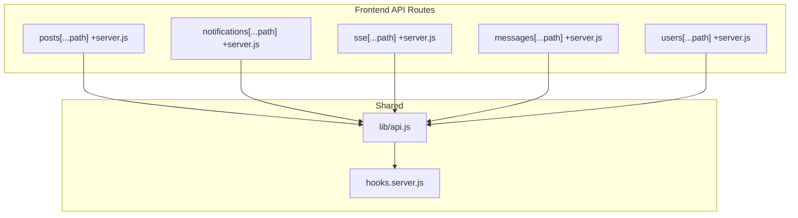
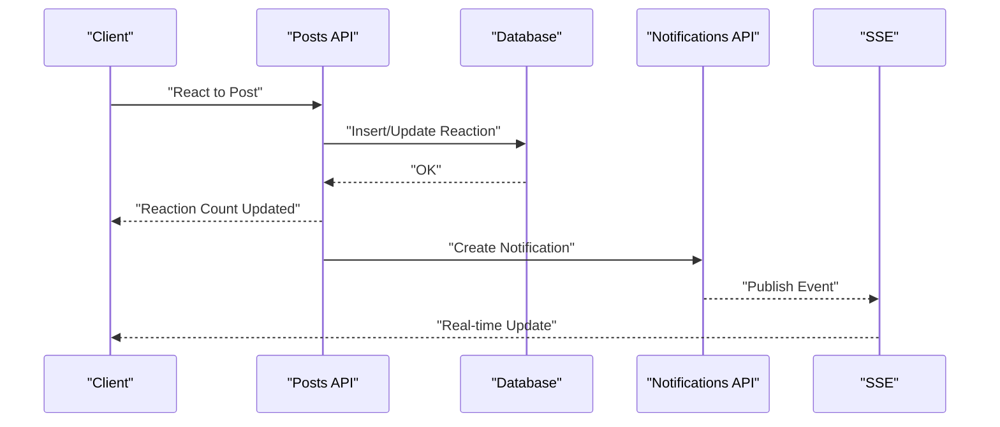
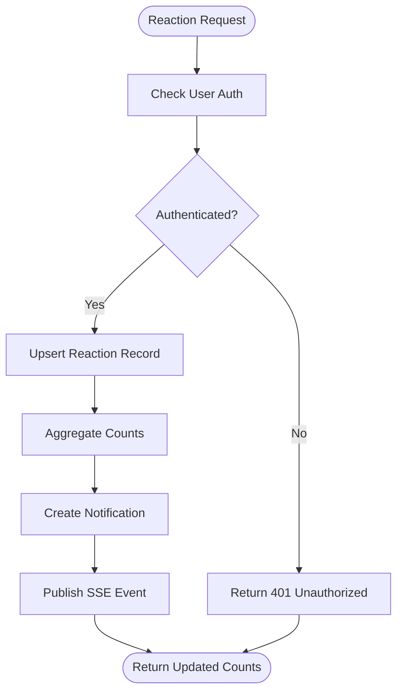
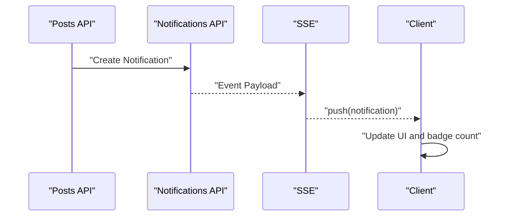
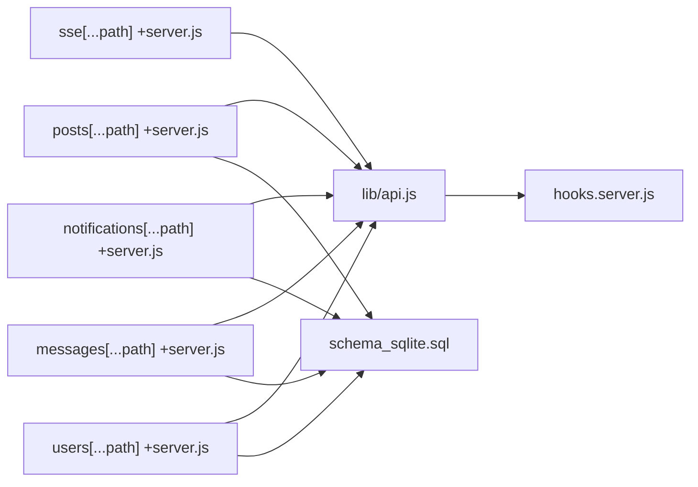

# Post Interactions & Reactions

<cite>
**Referenced Files in This Document**
- [posts +server.js](file://frontend/src/routes/api/posts%5B...path%5D/+server.js)
- [notifications +server.js](file://frontend/src/routes/api/notifications%5B...path%5D/+server.js)
- [sse +server.js](file://frontend/src/routes/api/sse%5B...path%5D/+server.js)
- [messages +server.js](file://frontend/src/routes/api/messages%5B...path%5D/+server.js)
- [users +server.js](file://frontend/src/routes/api/users%5B...path%5D/+server.js)
- [api.js](file://frontend/src/lib/api.js)
- [hooks.server.js](file://frontend/src/hooks.server.js)
- [schema_sqlite.sql](file://schema_sqlite.sql)
- [001_schema.sql](file://migrations/001_schema.sql)
- [002_phase2.sql](file://migrations/002_phase2.sql)
</cite>

## Table of Contents
1. [Introduction](#introduction)
2. [Project Structure](#project-structure)
3. [Core Components](#core-components)
4. [Architecture Overview](#architecture-overview)
5. [Detailed Component Analysis](#detailed-component-analysis)
6. [Dependency Analysis](#dependency-analysis)
7. [Performance Considerations](#performance-considerations)
8. [Troubleshooting Guide](#troubleshooting-guide)
9. [Conclusion](#conclusion)
10. [Appendices](#appendices)

## Introduction
This document describes the post interaction and reaction systems, including like/unlike, custom reaction types, reaction counting, notifications, real-time updates, comment integration (including hierarchical replies and comment reactions), and save/unsave functionality. It also documents the APIs for interactions, authentication requirements, and provides diagrams and examples for workflows.

## Project Structure
The backend API surface relevant to interactions is primarily implemented in SvelteKit server routes under the frontend/src/routes/api directory. Key areas include:
- Posts API for creating, updating, retrieving, and interacting with posts
- Notifications API for fetching and managing user notifications
- SSE endpoint for real-time event delivery
- Messages API for user-to-user messaging
- Users API for profile and relationship queries
- Shared client API helpers and server hooks

**Diagram sources**
- [posts +server.js](file://frontend/src/routes/api/posts%5B...path%5D/+server.js)
- [notifications +server.js](file://frontend/src/routes/api/notifications%5B...path%5D/+server.js)
- [sse +server.js](file://frontend/src/routes/api/sse%5B...path%5D/+server.js)
- [messages +server.js](file://frontend/src/routes/api/messages%5B...path%5D/+server.js)
- [users +server.js](file://frontend/src/routes/api/users%5B...path%5D/+server.js)
- [api.js](file://frontend/src/lib/api.js)
- [hooks.server.js](file://frontend/src/hooks.server.js)

**Section sources**
- [posts +server.js](file://frontend/src/routes/api/posts%5B...path%5D/+server.js)
- [notifications +server.js](file://frontend/src/routes/api/notifications%5B...path%5D/+server.js)
- [sse +server.js](file://frontend/src/routes/api/sse%5B...path%5D/+server.js)
- [messages +server.js](file://frontend/src/routes/api/messages%5B...path%5D/+server.js)
- [users +server.js](file://frontend/src/routes/api/users%5B...path%5D/+server.js)
- [api.js](file://frontend/src/lib/api.js)
- [hooks.server.js](file://frontend/src/hooks.server.js)

## Core Components
- Posts API: Handles post retrieval, creation, and interaction endpoints (likes, reactions, saves)
- Notifications API: Retrieves and manages user notifications
- SSE API: Provides server-sent events for real-time updates
- Messages API: Supports user-to-user messaging
- Users API: Provides user-related queries and relationships
- Client API helpers: Encapsulate HTTP requests and authentication
- Server hooks: Centralize authentication and request preprocessing

**Section sources**
- [posts +server.js](file://frontend/src/routes/api/posts%5B...path%5D/+server.js)
- [notifications +server.js](file://frontend/src/routes/api/notifications%5B...path%5D/+server.js)
- [sse +server.js](file://frontend/src/routes/api/sse%5B...path%5D/+server.js)
- [messages +server.js](file://frontend/src/routes/api/messages%5B...path%5D/+server.js)
- [users +server.js](file://frontend/src/routes/api/users%5B...path%5D/+server.js)
- [api.js](file://frontend/src/lib/api.js)
- [hooks.server.js](file://frontend/src/hooks.server.js)

## Architecture Overview
The interaction system integrates client-side API calls with server-side route handlers. Real-time updates are delivered via SSE, while notifications are stored and retrieved through dedicated endpoints. Comments and reactions are modeled in the database schema and exposed through the posts API.

**Diagram sources**
- [posts +server.js](file://frontend/src/routes/api/posts%5B...path%5D/+server.js)
- [notifications +server.js](file://frontend/src/routes/api/notifications%5B...path%5D/+server.js)
- [sse +server.js](file://frontend/src/routes/api/sse%5B...path%5D/+server.js)
- [schema_sqlite.sql](file://schema_sqlite.sql)

## Detailed Component Analysis

### Posts Interaction Endpoints
The Posts API exposes endpoints for retrieving posts, creating posts, and performing interactions such as likes, reactions, and saves. Authentication is enforced via server hooks.

Key responsibilities:
- Validate and parse incoming requests
- Enforce authentication and permissions
- Interact with the database for reactions, saves, and counts
- Trigger notifications and SSE events for real-time updates

Representative endpoint categories:
- GET /api/posts - Retrieve posts with optional filters and pagination
- POST /api/posts - Create a new post
- POST /api/posts/[id]/like | /unlike - Toggle like state
- POST /api/posts/[id]/reaction - Add or change a custom reaction
- POST /api/posts/[id]/save | /unsave - Bookmark/unbookmark a post
- GET /api/posts/[id] - Get a single post with counts and reactions

Authentication:
- Requires a valid session or token verified by server hooks

Response patterns:
- Standardized JSON responses with metadata for counts and pagination

**Section sources**
- [posts +server.js](file://frontend/src/routes/api/posts%5B...path%5D/+server.js)
- [hooks.server.js](file://frontend/src/hooks.server.js)

### Reaction Types and Counting
Custom reaction types are supported. Reactions are stored per post and user, enabling fine-grained interaction tracking. Counting mechanisms aggregate:
- Total reactions per type
- Unique reactors per type
- Current user’s reaction state

Workflow highlights:
- On reaction submission, the system checks existing user reaction
- If present, it updates or removes the reaction depending on the requested action
- Aggregates counts and returns updated totals

**Diagram sources**
- [posts +server.js](file://frontend/src/routes/api/posts%5B...path%5D/+server.js)
- [notifications +server.js](file://frontend/src/routes/api/notifications%5B...path%5D/+server.js)
- [sse +server.js](file://frontend/src/routes/api/sse%5B...path%5D/+server.js)

**Section sources**
- [posts +server.js](file://frontend/src/routes/api/posts%5B...path%5D/+server.js)

### Comment System Integration
Comments are integrated with posts and support hierarchical threading. Reply functionality is implemented through parent-child relationships. Comment reactions mirror post reactions.

Endpoints:
- GET /api/posts/[id]/comments - Retrieve comments tree with replies
- POST /api/posts/[id]/comments - Create a new comment or reply
- POST /api/comments/[id]/reaction - React to a comment
- DELETE /api/comments/[id] - Remove a comment (if authorized)

Data model relationships:
- Comments belong to a post and optionally to another comment (reply)
- Each comment supports reactions and counts

**Section sources**
- [posts +server.js](file://frontend/src/routes/api/posts%5B...path%5D/+server.js)
- [schema_sqlite.sql](file://schema_sqlite.sql)

### Save/Unsave Functionality
Save/unsave toggles a user’s bookmarking of a post. Internally tracked via a user-post association.

Behavior:
- Toggle bookmark state on repeated requests
- Update counters and return current state

**Section sources**
- [posts +server.js](file://frontend/src/routes/api/posts%5B...path%5D/+server.js)

### Notifications and Real-Time Updates
Notifications are generated for:
- New reactions on posts or comments
- Replies to comments
- Direct messages

Real-time delivery:
- SSE endpoint streams events to subscribed clients
- Clients listen and update UI without polling

**Diagram sources**
- [notifications +server.js](file://frontend/src/routes/api/notifications%5B...path%5D/+server.js)
- [sse +server.js](file://frontend/src/routes/api/sse%5B...path%5D/+server.js)

**Section sources**
- [notifications +server.js](file://frontend/src/routes/api/notifications%5B...path%5D/+server.js)
- [sse +server.js](file://frontend/src/routes/api/sse%5B...path%5D/+server.js)

### User-to-User Notifications and Messaging
Direct interactions include:
- Mention-based notifications
- Message threads
- Relationship-based visibility controls

Messaging endpoints:
- GET /api/messages - List conversations
- GET /api/messages/[id] - Fetch messages in a thread
- POST /api/messages - Send a new message
- POST /api/messages/[id]/read - Mark as read

**Section sources**
- [messages +server.js](file://frontend/src/routes/api/messages%5B...path%5D/+server.js)
- [users +server.js](file://frontend/src/routes/api/users%5B...path%5D/+server.js)

## Dependency Analysis
The client API module centralizes HTTP calls and authentication. Server hooks enforce authentication across all API routes. The database schema defines relationships among posts, comments, reactions, and notifications.

**Diagram sources**
- [api.js](file://frontend/src/lib/api.js)
- [hooks.server.js](file://frontend/src/hooks.server.js)
- [posts +server.js](file://frontend/src/routes/api/posts%5B...path%5D/+server.js)
- [notifications +server.js](file://frontend/src/routes/api/notifications%5B...path%5D/+server.js)
- [sse +server.js](file://frontend/src/routes/api/sse%5B...path%5D/+server.js)
- [messages +server.js](file://frontend/src/routes/api/messages%5B...path%5D/+server.js)
- [users +server.js](file://frontend/src/routes/api/users%5B...path%5D/+server.js)
- [schema_sqlite.sql](file://schema_sqlite.sql)

**Section sources**
- [api.js](file://frontend/src/lib/api.js)
- [hooks.server.js](file://frontend/src/hooks.server.js)
- [posts +server.js](file://frontend/src/routes/api/posts%5B...path%5D/+server.js)
- [notifications +server.js](file://frontend/src/routes/api/notifications%5B...path%5D/+server.js)
- [sse +server.js](file://frontend/src/routes/api/sse%5B...path%5D/+server.js)
- [messages +server.js](file://frontend/src/routes/api/messages%5B...path%5D/+server.js)
- [users +server.js](file://frontend/src/routes/api/users%5B...path%5D/+server.js)
- [schema_sqlite.sql](file://schema_sqlite.sql)

## Performance Considerations
- Indexes on foreign keys (post_id, user_id) and reaction type improve query performance
- Batch updates for reaction counts reduce write contention
- Pagination for notifications and comments prevents large payloads
- SSE connection pooling minimizes overhead for real-time updates
- Caching hot paths (e.g., recent post counts) reduces database load
- Asynchronous notification creation decouples UI responsiveness from persistence latency

[No sources needed since this section provides general guidance]

## Troubleshooting Guide
Common issues and resolutions:
- 401 Unauthorized: Ensure authentication cookie/token is present and valid
- 403 Forbidden: Verify user permissions for actions (e.g., deleting a comment)
- 404 Not Found: Confirm resource IDs (post/comment/user) exist
- Duplicate reactions: The system deduplicates per user per post; subsequent requests toggle state
- SSE disconnections: Reconnect logic should re-subscribe to channels and fetch missed events

**Section sources**
- [hooks.server.js](file://frontend/src/hooks.server.js)
- [posts +server.js](file://frontend/src/routes/api/posts%5B...path%5D/+server.js)
- [notifications +server.js](file://frontend/src/routes/api/notifications%5B...path%5D/+server.js)
- [sse +server.js](file://frontend/src/routes/api/sse%5B...path%5D/+server.js)

## Conclusion
The post interaction and reaction system provides robust like/unlike, custom reaction types, hierarchical comments, and save/unsave functionality. Notifications and SSE enable timely, real-time updates. The modular API design and shared client/server utilities simplify maintenance and extension.

[No sources needed since this section summarizes without analyzing specific files]

## Appendices

### API Reference Summary

- Authentication
  - All endpoints require a valid session or token validated by server hooks

- Posts
  - GET /api/posts
    - Query params: filters, pagination
    - Response: paginated posts with counts and reactions
  - POST /api/posts
    - Body: post content
    - Response: created post
  - POST /api/posts/[id]/like
    - Response: updated like count
  - POST /api/posts/[id]/unlike
    - Response: updated like count
  - POST /api/posts/[id]/reaction
    - Body: reaction type
    - Response: updated reaction counts
  - POST /api/posts/[id]/save
    - Response: saved state
  - POST /api/posts/[id]/unsave
    - Response: saved state
  - GET /api/posts/[id]
    - Response: post with counts and reactions

- Comments
  - GET /api/posts/[id]/comments
    - Response: comments tree
  - POST /api/posts/[id]/comments
    - Body: content, parent_id (optional)
    - Response: created comment
  - POST /api/comments/[id]/reaction
    - Body: reaction type
    - Response: updated reaction counts
  - DELETE /api/comments/[id]
    - Response: deletion confirmation

- Notifications
  - GET /api/notifications
    - Response: paginated notifications
  - POST /api/notifications/[id]/read
    - Response: read confirmation

- SSE
  - GET /api/sse
    - Response: stream of events

- Messages
  - GET /api/messages
  - GET /api/messages/[id]
  - POST /api/messages
  - POST /api/messages/[id]/read

- Users
  - GET /api/users/[username]
  - GET /api/users/[username]/posts

[No sources needed since this section provides general guidance]

### Example Workflows

- Like/Unlike a Post
  - Client calls POST /api/posts/[id]/like or /unlike
  - Server updates counts and returns new totals
  - SSE publishes update to subscribers

- Add a Custom Reaction
  - Client calls POST /api/posts/[id]/reaction with reaction type
  - Server upserts reaction and recalculates counts
  - Notification created for post owner if configured

- Thread a Reply
  - Client calls POST /api/posts/[id]/comments with parent_id
  - Server creates child comment and returns updated tree

- Save/Unsave a Post
  - Client calls POST /api/posts/[id]/save or /unsave
  - Server toggles bookmark and returns state

[No sources needed since this section provides general guidance]