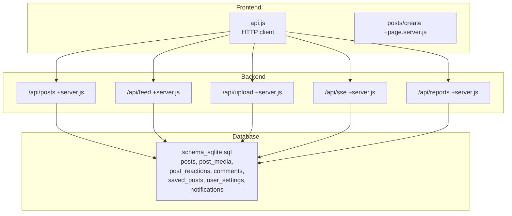
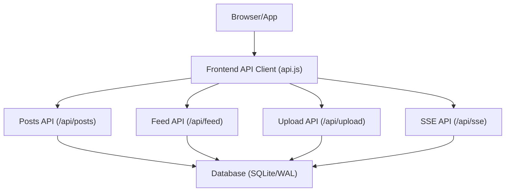
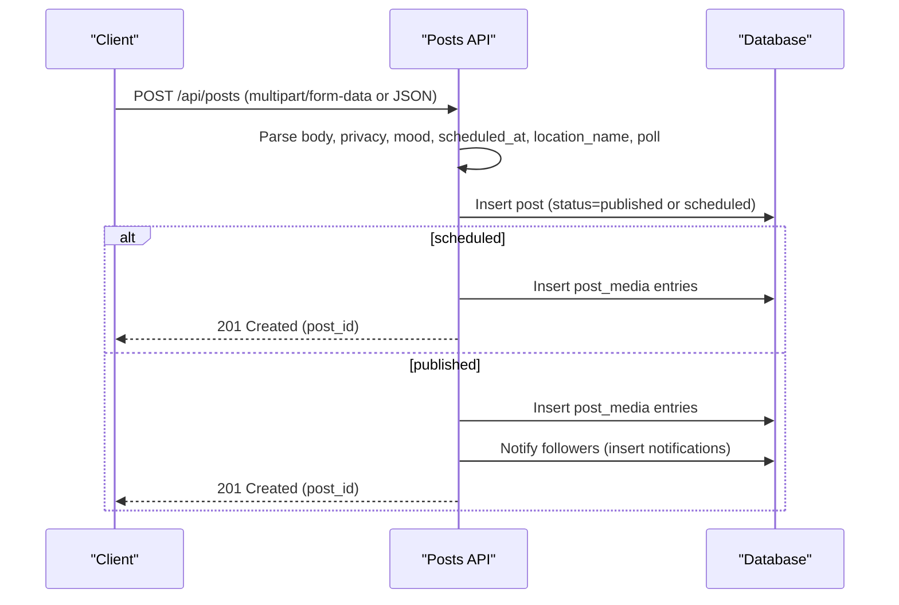
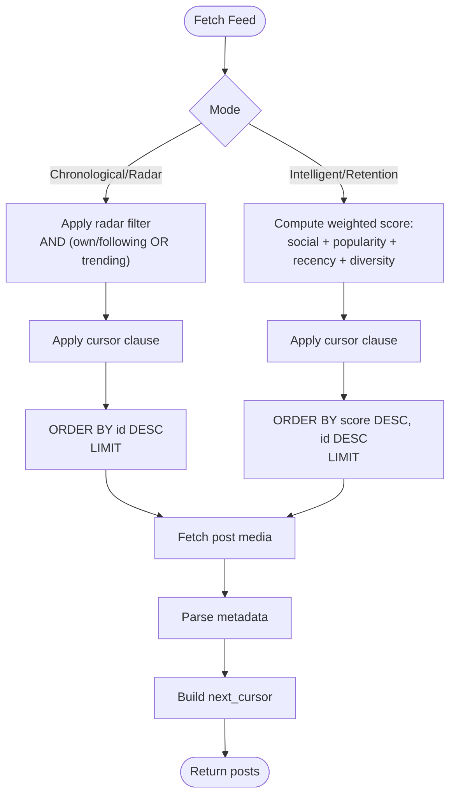
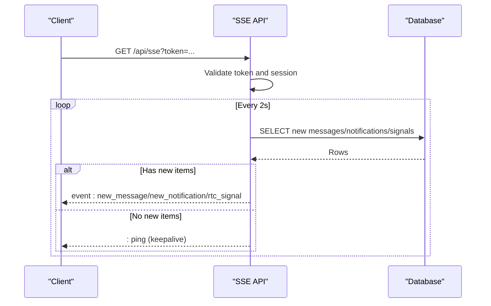
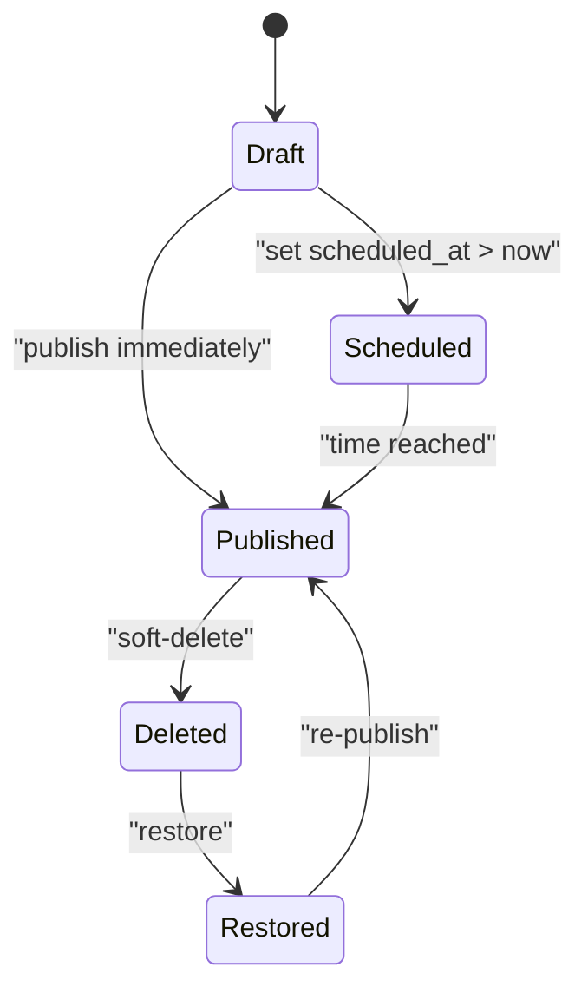
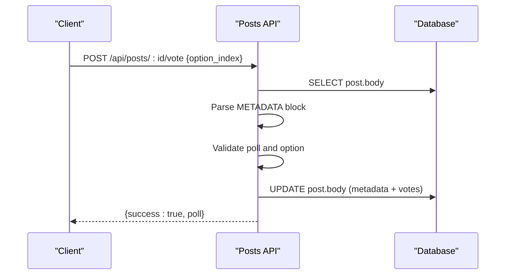
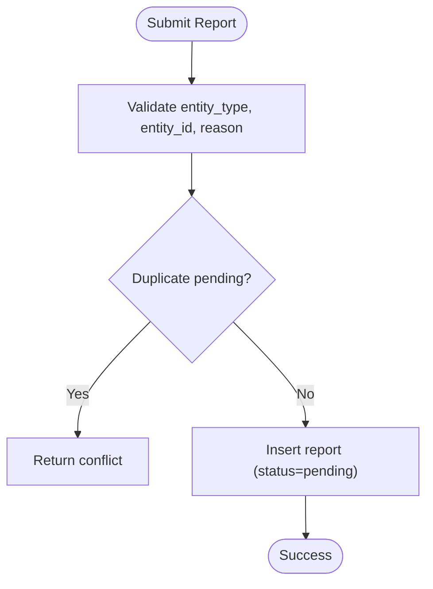
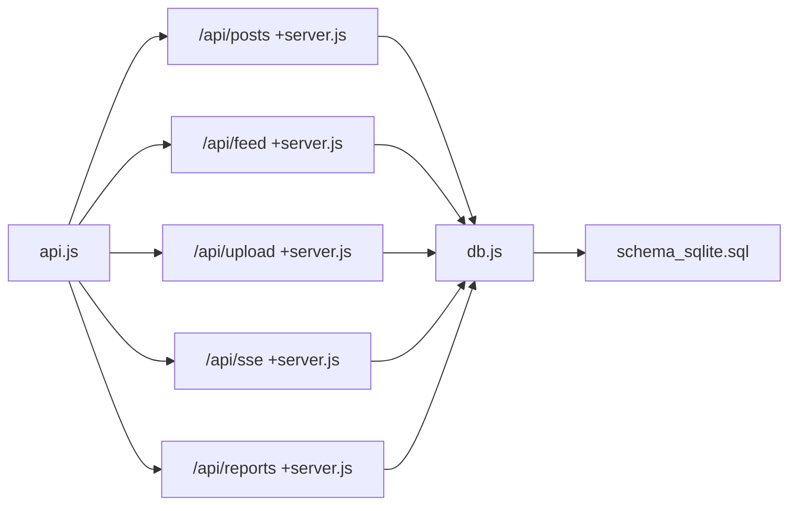

# Posts & Timeline System

<cite>
**Referenced Files in This Document**
- [posts +server.js](file://frontend/src/routes/api/posts/[...path]/+server.js)
- [feed +server.js](file://frontend/src/routes/api/feed/[...path]/+server.js)
- [schema_sqlite.sql](file://schema_sqlite.sql)
- [sse +server.js](file://frontend/src/routes/api/sse/+server.js)
- [upload +server.js](file://frontend/src/routes/api/upload/+server.js)
- [api.js](file://frontend/src/lib/api.js)
- [db.js](file://frontend/src/lib/server/db.js)
- [posts create +page.server.js](file://frontend/src/routes/posts/create/+page.server.js)
- [reports +server.js](file://frontend/src/routes/api/reports/+server.js)
</cite>

## Table of Contents
1. [Introduction](#introduction)
2. [Project Structure](#project-structure)
3. [Core Components](#core-components)
4. [Architecture Overview](#architecture-overview)
5. [Detailed Component Analysis](#detailed-component-analysis)
6. [Dependency Analysis](#dependency-analysis)
7. [Performance Considerations](#performance-considerations)
8. [Troubleshooting Guide](#troubleshooting-guide)
9. [Conclusion](#conclusion)
10. [Appendices](#appendices)

## Introduction
This document explains VSocial’s posts and timeline system comprehensively. It covers the end-to-end post creation workflow (including media uploads, scheduling, privacy controls, and metadata handling such as polls and location), the feed algorithm (including cursor-based pagination and real-time updates), post lifecycle management (creation, updates, deletion, restoration), and moderation features. Practical examples illustrate content creation with different content types, privacy settings, and scheduling scenarios. Guidance is also provided for performance optimizations and moderation workflows.

## Project Structure
The posts and timeline system spans backend API endpoints, database schema, and frontend API clients. Key areas:
- Backend APIs: posts, feed, upload, SSE, reports
- Database schema: posts, post_media, post_reactions, comments, saved_posts, user_settings, notifications
- Frontend API client: centralized HTTP client for all API calls
- Utilities: database adapter supporting two drivers

**Diagram sources**
- [posts +server.js:1-411](file://frontend/src/routes/api/posts/[...path]/+server.js#L1-L411)
- [feed +server.js:1-239](file://frontend/src/routes/api/feed/[...path]/+server.js#L1-L239)
- [upload +server.js:1-44](file://frontend/src/routes/api/upload/+server.js#L1-L44)
- [sse +server.js:1-185](file://frontend/src/routes/api/sse/+server.js#L1-L185)
- [reports +server.js:1-39](file://frontend/src/routes/api/reports/+server.js#L1-L39)
- [schema_sqlite.sql:107-184](file://schema_sqlite.sql#L107-L184)

**Section sources**
- [posts +server.js:1-411](file://frontend/src/routes/api/posts/[...path]/+server.js#L1-L411)
- [feed +server.js:1-239](file://frontend/src/routes/api/feed/[...path]/+server.js#L1-L239)
- [upload +server.js:1-44](file://frontend/src/routes/api/upload/+server.js#L1-L44)
- [sse +server.js:1-185](file://frontend/src/routes/api/sse/+server.js#L1-L185)
- [reports +server.js:1-39](file://frontend/src/routes/api/reports/+server.js#L1-L39)
- [schema_sqlite.sql:107-184](file://schema_sqlite.sql#L107-L184)

## Core Components
- Posts API: Handles post creation, media upload, CRUD, reactions (like/share/save), comments, voting, and soft-deletion/restoration.
- Feed API: Returns personalized home feed, explore feed, and feed preferences; supports cursor-based pagination.
- Upload API: Validates and persists generic files to disk.
- SSE API: Provides real-time events for notifications and messages.
- Reports API: Enables users to submit content reports.
- Frontend API Client: Centralized client for all backend calls.
- Database Adapter: Unified interface supporting @libsql/client and better-sqlite3.

**Section sources**
- [posts +server.js:1-411](file://frontend/src/routes/api/posts/[...path]/+server.js#L1-L411)
- [feed +server.js:1-239](file://frontend/src/routes/api/feed/[...path]/+server.js#L1-L239)
- [upload +server.js:1-44](file://frontend/src/routes/api/upload/+server.js#L1-L44)
- [sse +server.js:1-185](file://frontend/src/routes/api/sse/+server.js#L1-L185)
- [reports +server.js:1-39](file://frontend/src/routes/api/reports/+server.js#L1-L39)
- [api.js:108-131](file://frontend/src/lib/api.js#L108-L131)
- [db.js:117-167](file://frontend/src/lib/server/db.js#L117-L167)

## Architecture Overview
The system uses a layered architecture:
- Presentation layer: SvelteKit routes and API endpoints
- Application layer: Route handlers implementing business logic
- Persistence layer: SQLite via libSQL or better-sqlite3 with WAL mode
- Realtime layer: Server-Sent Events for notifications and messages

**Diagram sources**
- [api.js:1-350](file://frontend/src/lib/api.js#L1-L350)
- [posts +server.js:1-411](file://frontend/src/routes/api/posts/[...path]/+server.js#L1-L411)
- [feed +server.js:1-239](file://frontend/src/routes/api/feed/[...path]/+server.js#L1-L239)
- [upload +server.js:1-44](file://frontend/src/routes/api/upload/+server.js#L1-L44)
- [sse +server.js:1-185](file://frontend/src/routes/api/sse/+server.js#L1-L185)
- [db.js:117-167](file://frontend/src/lib/server/db.js#L117-L167)

## Detailed Component Analysis

### Posts API: Endpoints and Workflows
Endpoints covered:
- POST /api/posts — Create post (supports multipart/form-data and JSON)
- POST /api/posts/media — Upload media
- GET /api/posts/:id — Retrieve post with parsed metadata
- PUT /api/posts/:id — Update post body
- DELETE /api/posts/:id — Soft-delete post
- POST /api/posts/:id/restore — Restore deleted post
- POST /api/posts/:id/like — Like/Change reaction
- DELETE /api/posts/:id/like — Unlike
- POST /api/posts/:id/share — Increment share count
- POST /api/posts/:id/save — Save post
- DELETE /api/posts/:id/save — Unsave post
- POST /api/posts/:id/comments — Add comment
- GET /api/posts/:id/comments — List comments
- PUT /api/posts/:id/comments/:commentId — Update comment
- DELETE /api/posts/:id/comments/:commentId — Soft-delete comment
- POST /api/posts/:id/comments/:commentId/like — Like comment
- DELETE /api/posts/:id/comments/:commentId/like — Unlike comment
- POST /api/posts/:id/vote — Poll vote

Key behaviors:
- Media upload: Accepts multipart/form-data; writes to uploads directory and returns URLs
- Metadata handling: Embeds structured metadata after the post body delimiter
- Privacy and scheduling: Respects privacy setting and scheduled publishing
- Notifications: Triggers notifications for likes, comments, and new posts to followers
- Soft-delete: Uses deleted_at timestamps; queries exclude deleted posts

**Diagram sources**
- [posts +server.js:119-205](file://frontend/src/routes/api/posts/[...path]/+server.js#L119-L205)

**Section sources**
- [posts +server.js:1-411](file://frontend/src/routes/api/posts/[...path]/+server.js#L1-L411)

### Feed Algorithm: Home, Explore, Preferences, Pagination
Endpoints:
- GET /api/feed — Home feed with configurable algorithm and weights
- GET /api/feed/explore — Explore feed ordered by popularity
- GET /api/feed/preferences — Get feed preferences
- PUT /api/feed/preferences — Update feed preferences

Algorithm modes:
- Chronological/Radar: Strict chronological mixing following and trending
- Intelligent: Weighted scoring combining social, popularity, recency, and diversity
- Retention: TikTok-style heavy emphasis on popularity and diversity

Pagination:
- Cursor-based pagination using composite cursors (score_id or like_count_id)
- Limits enforced between 1 and 50

**Diagram sources**
- [feed +server.js:120-214](file://frontend/src/routes/api/feed/[...path]/+server.js#L120-L214)

**Section sources**
- [feed +server.js:1-239](file://frontend/src/routes/api/feed/[...path]/+server.js#L1-L239)

### Real-Time Updates: SSE
The SSE endpoint streams:
- New messages
- New notifications
- WebRTC signals (if available)

It validates sessions via JWT token hash and maintains a keepalive mechanism.

**Diagram sources**
- [sse +server.js:1-185](file://frontend/src/routes/api/sse/+server.js#L1-L185)

**Section sources**
- [sse +server.js:1-185](file://frontend/src/routes/api/sse/+server.js#L1-L185)

### Post Lifecycle Management
Lifecycle stages:
- Creation: Insert post, optionally schedule, attach media, notify followers
- Update: Modify post body atomically
- Soft-delete: Mark deleted_at; counts decremented on user
- Restore: Clear deleted_at and increment post_count
- Comments: CRUD with soft-delete semantics
- Reactions: Like/share/save with counters and user state

**Diagram sources**
- [posts +server.js:148-205](file://frontend/src/routes/api/posts/[...path]/+server.js#L148-L205)
- [posts +server.js:399-410](file://frontend/src/routes/api/posts/[...path]/+server.js#L399-L410)

**Section sources**
- [posts +server.js:1-411](file://frontend/src/routes/api/posts/[...path]/+server.js#L1-L411)

### Poll Voting System
Polls are embedded in post metadata. Voting:
- Validates existence of poll and option index
- Prevents duplicate votes per user
- Updates metadata and increments vote count

**Diagram sources**
- [posts +server.js:210-246](file://frontend/src/routes/api/posts/[...path]/+server.js#L210-L246)

**Section sources**
- [posts +server.js:210-246](file://frontend/src/routes/api/posts/[...path]/+server.js#L210-L246)

### Content Moderation Features
Users can report posts, comments, users, and reels. Reports:
- Require entity_type and entity_id
- Enforce minimum reason length
- Prevent duplicate pending reports

**Diagram sources**
- [reports +server.js:10-31](file://frontend/src/routes/api/reports/+server.js#L10-L31)

**Section sources**
- [reports +server.js:1-39](file://frontend/src/routes/api/reports/+server.js#L1-L39)

### Practical Examples

#### Example 1: Create a text post with a poll and location
- Endpoint: POST /api/posts
- Body (JSON): content, poll (question/options), location_name
- Behavior: Embeds metadata, inserts post, notifies followers if published

**Section sources**
- [posts +server.js:119-205](file://frontend/src/routes/api/posts/[...path]/+server.js#L119-L205)

#### Example 2: Create a post with media and privacy settings
- Upload media: POST /api/posts/media (multipart/form-data)
- Create post: POST /api/posts (privacy, media_urls[])
- Behavior: Stores media references and publishes immediately

**Section sources**
- [posts +server.js:101-117](file://frontend/src/routes/api/posts/[...path]/+server.js#L101-L117)
- [posts +server.js:119-205](file://frontend/src/routes/api/posts/[...path]/+server.js#L119-L205)

#### Example 3: Schedule a post for future publishing
- Set scheduled_at to a future timestamp
- Behavior: Post remains draft until time reached; then becomes published

**Section sources**
- [posts +server.js:148-157](file://frontend/src/routes/api/posts/[...path]/+server.js#L148-L157)

#### Example 4: Vote on a poll in an existing post
- Endpoint: POST /api/posts/:id/vote
- Body: option_index
- Behavior: Validates and records vote; updates metadata

**Section sources**
- [posts +server.js:210-246](file://frontend/src/routes/api/posts/[...path]/+server.js#L210-L246)

#### Example 5: Report inappropriate content
- Endpoint: POST /api/reports
- Body: entity_type, entity_id, reason
- Behavior: Prevents duplicates and creates a pending report

**Section sources**
- [reports +server.js:10-31](file://frontend/src/routes/api/reports/+server.js#L10-L31)

## Dependency Analysis
- Posts API depends on:
  - Database adapter for SQL operations
  - Authentication middleware for user context
  - File system for media uploads
- Feed API depends on:
  - User settings for algorithm and weights
  - Cursor parsing and composite ordering
- SSE API depends on:
  - Session validation and periodic polling
- Frontend API client depends on:
  - Base URL and bearer token injection

**Diagram sources**
- [api.js:1-350](file://frontend/src/lib/api.js#L1-L350)
- [posts +server.js:1-411](file://frontend/src/routes/api/posts/[...path]/+server.js#L1-L411)
- [feed +server.js:1-239](file://frontend/src/routes/api/feed/[...path]/+server.js#L1-L239)
- [upload +server.js:1-44](file://frontend/src/routes/api/upload/+server.js#L1-L44)
- [sse +server.js:1-185](file://frontend/src/routes/api/sse/+server.js#L1-L185)
- [reports +server.js:1-39](file://frontend/src/routes/api/reports/+server.js#L1-L39)
- [db.js:117-167](file://frontend/src/lib/server/db.js#L117-L167)
- [schema_sqlite.sql:107-184](file://schema_sqlite.sql#L107-L184)

**Section sources**
- [api.js:1-350](file://frontend/src/lib/api.js#L1-L350)
- [db.js:117-167](file://frontend/src/lib/server/db.js#L117-L167)
- [schema_sqlite.sql:107-184](file://schema_sqlite.sql#L107-L184)

## Performance Considerations
- Database tuning:
  - WAL mode enabled for improved concurrency
  - Foreign keys and busy timeout configured
  - Cache and temp storage tuned for performance
- Indexes:
  - posts(user_id, created_at DESC) supports user timelines
  - comments(post_id, created_at) supports comment threads
- Pagination:
  - Cursor-based pagination reduces offset overhead
  - Limits enforced to prevent oversized queries
- Metadata parsing:
  - Minimal parsing overhead; only when needed
- SSE:
  - Keepalive pings reduce connection churn
- Recommendations:
  - Use composite cursors consistently
  - Prefer selective projections (columns) in queries
  - Batch media fetches per page
  - Monitor long-running queries and add missing indexes if needed

**Section sources**
- [db.js:120-167](file://frontend/src/lib/server/db.js#L120-L167)
- [feed +server.js:120-214](file://frontend/src/routes/api/feed/[...path]/+server.js#L120-L214)
- [posts +server.js:46-53](file://frontend/src/routes/api/posts/[...path]/+server.js#L46-L53)

## Troubleshooting Guide
Common issues and resolutions:
- Authentication failures:
  - Ensure Authorization header is present for protected endpoints
- Invalid or expired token for SSE:
  - Regenerate token and reconnect SSE
- Duplicate report submissions:
  - Reports API prevents duplicate pending reports
- Poll vote errors:
  - Verify post has poll metadata and option index is valid
- Media upload errors:
  - Confirm MIME type is allowed and file size under limit
- Soft-delete inconsistencies:
  - Ensure deleted_at filtering is applied in queries

**Section sources**
- [reports +server.js:10-31](file://frontend/src/routes/api/reports/+server.js#L10-L31)
- [posts +server.js:210-246](file://frontend/src/routes/api/posts/[...path]/+server.js#L210-L246)
- [upload +server.js:17-44](file://frontend/src/routes/api/upload/+server.js#L17-L44)
- [sse +server.js:9-34](file://frontend/src/routes/api/sse/+server.js#L9-L34)

## Conclusion
VSocial’s posts and timeline system integrates robust post creation, flexible feed algorithms, real-time updates, and moderation capabilities. The modular design separates concerns across APIs, while the unified database adapter ensures portability. Cursor-based pagination and database tuning support scalability. The frontend API client simplifies integration for client applications.

## Appendices

### API Reference Summary
- Posts
  - POST /api/posts — Create post
  - POST /api/posts/media — Upload media
  - GET /api/posts/:id — Get post
  - PUT /api/posts/:id — Update post
  - DELETE /api/posts/:id — Soft-delete post
  - POST /api/posts/:id/restore — Restore post
  - POST /api/posts/:id/like — Like/Change reaction
  - DELETE /api/posts/:id/like — Unlike
  - POST /api/posts/:id/share — Share
  - POST /api/posts/:id/save — Save
  - DELETE /api/posts/:id/save — Unsave
  - POST /api/posts/:id/comments — Add comment
  - GET /api/posts/:id/comments — List comments
  - PUT /api/posts/:id/comments/:commentId — Update comment
  - DELETE /api/posts/:id/comments/:commentId — Soft-delete comment
  - POST /api/posts/:id/comments/:commentId/like — Like comment
  - DELETE /api/posts/:id/comments/:commentId/like — Unlike comment
  - POST /api/posts/:id/vote — Poll vote
- Feed
  - GET /api/feed — Home feed
  - GET /api/feed/explore — Explore feed
  - GET /api/feed/preferences — Get preferences
  - PUT /api/feed/preferences — Update preferences
- Upload
  - POST /api/upload — Generic file upload
- SSE
  - GET /api/sse — Real-time notifications/messages
- Reports
  - POST /api/reports — Submit report
  - GET /api/reports — List user reports

**Section sources**
- [posts +server.js:1-411](file://frontend/src/routes/api/posts/[...path]/+server.js#L1-L411)
- [feed +server.js:1-239](file://frontend/src/routes/api/feed/[...path]/+server.js#L1-L239)
- [upload +server.js:1-44](file://frontend/src/routes/api/upload/+server.js#L1-L44)
- [sse +server.js:1-185](file://frontend/src/routes/api/sse/+server.js#L1-L185)
- [reports +server.js:1-39](file://frontend/src/routes/api/reports/+server.js#L1-L39)