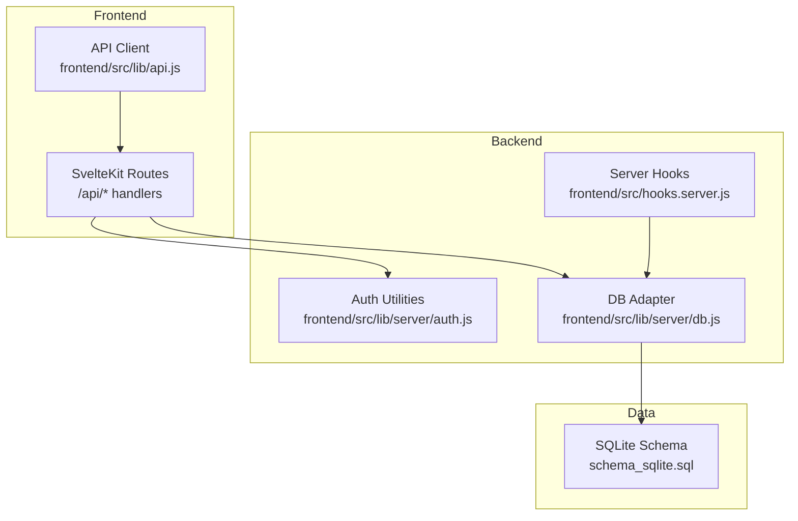
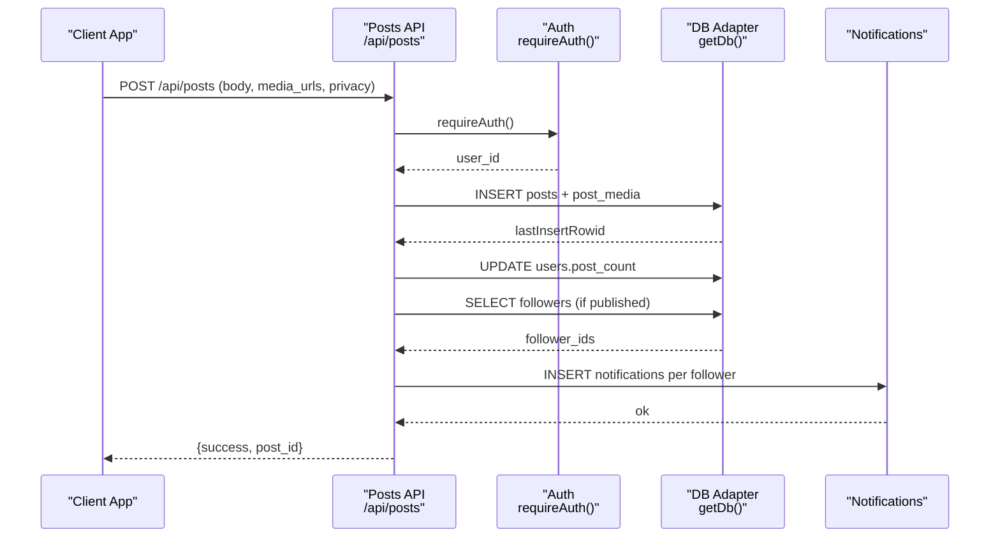
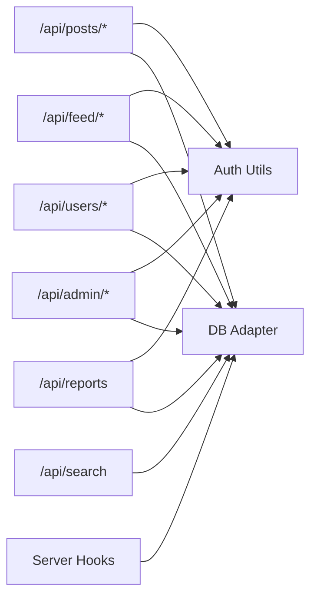

# Social Core Features

<cite>
**Referenced Files in This Document**
- [README.md](file://README.md)
- [schema_sqlite.sql](file://schema_sqlite.sql)
- [frontend/src/lib/server/db.js](file://frontend/src/lib/server/db.js)
- [frontend/src/lib/server/auth.js](file://frontend/src/lib/server/auth.js)
- [frontend/src/hooks.server.js](file://frontend/src/hooks.server.js)
- [frontend/src/lib/api.js](file://frontend/src/lib/api.js)
- [frontend/src/routes/api/posts/[...path]/+server.js](file://frontend/src/routes/api/posts/[...path]/+server.js)
- [frontend/src/routes/api/feed/[...path]/+server.js](file://frontend/src/routes/api/feed/[...path]/+server.js)
- [frontend/src/routes/api/users/[...path]/+server.js](file://frontend/src/routes/api/users/[...path]/+server.js)
- [frontend/src/routes/api/search/+server.js](file://frontend/src/routes/api/search/+server.js)
- [frontend/src/routes/api/admin/[...path]/+server.js](file://frontend/src/routes/api/admin/[...path]/+server.js)
- [frontend/src/routes/api/reports/+server.js](file://frontend/src/routes/api/reports/+server.js)
- [frontend/src/routes/posts/create/+page.server.js](file://frontend/src/routes/posts/create/+page.server.js)
</cite>

## Table of Contents
1. [Introduction](#introduction)
2. [Project Structure](#project-structure)
3. [Core Components](#core-components)
4. [Architecture Overview](#architecture-overview)
5. [Detailed Component Analysis](#detailed-component-analysis)
6. [Dependency Analysis](#dependency-analysis)
7. [Performance Considerations](#performance-considerations)
8. [Troubleshooting Guide](#troubleshooting-guide)
9. [Conclusion](#conclusion)
10. [Appendices](#appendices)

## Introduction
This document describes VSocial’s social core features and APIs: posts, timelines/feed, comments and reactions, following/followers, content discovery, and moderation. It explains endpoint definitions, authentication, request/response patterns, and data models. Practical examples and diagrams illustrate workflows and system behavior.

## Project Structure
The social core is implemented in SvelteKit backend routes under frontend/src/routes/api, with a shared database abstraction and authentication utilities. The frontend exposes a centralized API client for client-server communication.



**Diagram sources**
- [frontend/src/lib/api.js:1-350](file://frontend/src/lib/api.js#L1-L350)
- [frontend/src/lib/server/auth.js:1-92](file://frontend/src/lib/server/auth.js#L1-L92)
- [frontend/src/lib/server/db.js:1-209](file://frontend/src/lib/server/db.js#L1-L209)
- [frontend/src/hooks.server.js:1-179](file://frontend/src/hooks.server.js#L1-L179)
- [schema_sqlite.sql:1-702](file://schema_sqlite.sql#L1-L702)

**Section sources**
- [README.md:1-112](file://README.md#L1-L112)
- [frontend/src/lib/api.js:1-350](file://frontend/src/lib/api.js#L1-L350)
- [frontend/src/lib/server/db.js:1-209](file://frontend/src/lib/server/db.js#L1-L209)
- [frontend/src/lib/server/auth.js:1-92](file://frontend/src/lib/server/auth.js#L1-L92)
- [frontend/src/hooks.server.js:1-179](file://frontend/src/hooks.server.js#L1-L179)
- [schema_sqlite.sql:1-702](file://schema_sqlite.sql#L1-L702)

## Core Components
- Posts: CRUD, media upload, scheduling, polls, and engagement metrics.
- Timeline/Feed: Home feed with intelligent/radar modes and explore feed.
- Comments and Reactions: Nested comments, per-comment reactions, and post reactions.
- Following/Followers: Follow/unfollow, user profiles, and suggestions.
- Discovery: Search across users, posts, gigs, and hashtags.
- Moderation: Reporting, admin dashboards, and content management.

**Section sources**
- [frontend/src/routes/api/posts/[...path]/+server.js:1-411](file://frontend/src/routes/api/posts/[...path]/+server.js#L1-L411)
- [frontend/src/routes/api/feed/[...path]/+server.js:1-239](file://frontend/src/routes/api/feed/[...path]/+server.js#L1-L239)
- [frontend/src/routes/api/users/[...path]/+server.js:1-347](file://frontend/src/routes/api/users/[...path]/+server.js#L1-L347)
- [frontend/src/routes/api/search/+server.js:1-61](file://frontend/src/routes/api/search/+server.js#L1-L61)
- [frontend/src/routes/api/reports/+server.js:1-39](file://frontend/src/routes/api/reports/+server.js#L1-L39)
- [schema_sqlite.sql:107-184](file://schema_sqlite.sql#L107-L184)

## Architecture Overview
End-to-end flow for creating a post and notifying followers:



**Diagram sources**
- [frontend/src/routes/api/posts/[...path]/+server.js:96-205](file://frontend/src/routes/api/posts/[...path]/+server.js#L96-L205)
- [frontend/src/lib/server/auth.js:15-44](file://frontend/src/lib/server/auth.js#L15-L44)
- [frontend/src/lib/server/db.js:169-172](file://frontend/src/lib/server/db.js#L169-L172)

## Detailed Component Analysis

### Posts API
Endpoints:
- POST /api/posts — Create post (supports multipart/form-data and JSON)
- POST /api/posts/media — Upload media
- GET /api/posts/:id — Retrieve post (parses metadata and attaches media)
- PUT /api/posts/:id — Update post body
- DELETE /api/posts/:id — Soft-delete post
- POST /api/posts/:id/restore — Restore deleted post (own author)
- POST /api/posts/:id/like — Like/unlike post
- POST /api/posts/:id/share — Increment share count
- POST /api/posts/:id/save — Save post
- DELETE /api/posts/:id/save — Unsave post
- GET /api/posts/:id/comments — List comments with “user_has_liked” for authenticated users
- POST /api/posts/:id/comments — Add comment
- PUT /api/posts/:id/comments/:commentId — Update comment
- DELETE /api/posts/:id/comments/:commentId — Soft-delete comment (author or post owner)
- POST /api/posts/:id/comments/:commentId/like — Like a comment
- DELETE /api/posts/:id/comments/:commentId/like — Unlike a comment
- POST /api/posts/:id/vote — Vote in poll embedded in post metadata

Authentication:
- requireAuth(request) for mutating actions; optionalAuth(request) for reading comments.

Request/Response examples:
- Create post (JSON):
  - Request: { body, media_urls[], privacy, mood, scheduled_at, location_name, poll }
  - Response: { success, post_id }
- Like post:
  - Request: {}
  - Response: { success, message }
- Add comment:
  - Request: { body, parent_id }
  - Response: { success, message }

Error handling:
- 400 for invalid input (e.g., empty content, missing fields)
- 401 for missing/expired/invalid tokens
- 403 for insufficient privileges
- 404 for not found
- 500 for server errors

**Section sources**
- [frontend/src/routes/api/posts/[...path]/+server.js:1-411](file://frontend/src/routes/api/posts/[...path]/+server.js#L1-L411)
- [frontend/src/lib/server/auth.js:15-44](file://frontend/src/lib/server/auth.js#L15-L44)

### Timeline/Feed API
Endpoints:
- GET /api/feed — Home feed (paginated)
- GET /api/feed/explore — Explore feed (public posts)
- GET /api/feed/preferences — Get feed preferences
- PUT /api/feed/preferences — Update feed preferences
- GET /api/feed/suggested-users — Suggested users to follow

Algorithms:
- Mode selection: radar, chronological, intelligent, retention.
- Intelligent/Retention scoring factors:
  - Social weight: following author
  - Popularity weight: engagement counts
  - Recency weight: freshness
  - Diversity weight: randomized inclusion of trending posts
- Pagination cursors:
  - Home: numeric id-based cursor
  - Explore: like_count_id-based cursor
  - Intelligent: score_id-based cursor

Request/Response examples:
- Home feed:
  - Query: { cursor, limit }
  - Response: { posts[], next_cursor, limit, has_more }
- Preferences:
  - GET: { preferences: { algorithm, weights } }
  - PUT: { success, message }

**Section sources**
- [frontend/src/routes/api/feed/[...path]/+server.js:1-239](file://frontend/src/routes/api/feed/[...path]/+server.js#L1-L239)

### Users API
Endpoints:
- GET /api/users/me — Own profile
- GET /api/users/suggested — Suggested virtual users
- GET /api/users/search — Search users
- GET /api/users/settings — User settings
- GET /api/users/:username — Profile info (with is_following for logged-in viewers)
- GET /api/users/:username/followers — Followers list
- GET /api/users/:username/following — Following list
- GET /api/users/:username/posts — User posts (supports status: active/deleted)
- POST /api/users/:username/follow — Follow
- POST /api/users/:username/unfollow — Unfollow
- POST /api/users/avatar — Upload avatar
- POST /api/users/cover — Upload cover
- PUT /api/users/profile — Update profile fields
- PUT /api/users/settings — Update settings
- PATCH /api/users/notifications/read-all — Mark all notifications read
- PATCH /api/users/notifications/:id/read — Mark specific notification read

Authentication:
- requireAuth(request) for protected actions.

**Section sources**
- [frontend/src/routes/api/users/[...path]/+server.js:1-347](file://frontend/src/routes/api/users/[...path]/+server.js#L1-L347)

### Search API
Endpoints:
- GET /api/search — Query search across users, posts, gigs, hashtags; or trending lists when query is empty

Behavior:
- Optional authentication to include is_following for users.
- Supports type filters: all, users, posts, gigs, hashtags.
- Paginates results.

**Section sources**
- [frontend/src/routes/api/search/+server.js:1-61](file://frontend/src/routes/api/search/+server.js#L1-L61)

### Reports API
Endpoints:
- POST /api/reports — Create a report (post, comment, user, reel)
- GET /api/reports — List user’s own reports

Validation:
- Requires entity_type, entity_id, and reason length >= 5.
- Prevents duplicate pending reports for the same entity.

**Section sources**
- [frontend/src/routes/api/reports/+server.js:1-39](file://frontend/src/routes/api/reports/+server.js#L1-L39)

### Moderation API (Admin)
Endpoints:
- GET /api/admin/dashboard — Stats and recent reports
- GET /api/admin/users — List users (supports search)
- GET /api/admin/reports — List reports by status
- GET /api/admin/content — List posts/reels/trash
- GET /api/admin/settings — System settings
- POST /api/admin/users/:id/ban — Ban user
- POST /api/admin/users/:id/unban — Unban user
- POST /api/admin/reports/:id — Resolve report (optionally delete content)
- POST /api/admin/settings/toggle — Toggle system setting
- PUT /api/admin/settings — Bulk update settings
- PUT /api/admin/users/:id — Update user fields and roles
- DELETE /api/admin/reports/:id — Remove report
- DELETE /api/admin/content/post/:id — Soft-delete post
- DELETE /api/admin/content/reel/:id — Hard-delete reel
- DELETE /api/admin/content/trash/:id — Hard-delete post from trash

**Section sources**
- [frontend/src/routes/api/admin/[...path]/+server.js:1-260](file://frontend/src/routes/api/admin/[...path]/+server.js#L1-L260)

### Data Models and Relationships
Core tables and keys:
- users: id, username, email, display_name, avatar_url, cover_url, roles, counters, privacy, timestamps
- posts: id, user_id, body, privacy, engagement counts, scheduling/status, timestamps
- post_reactions: post_id, user_id, reaction
- comments: id, post_id, user_id, parent_id, body, timestamps
- comment_reactions: comment_id, user_id, reaction
- saved_posts: user_id, post_id
- follows: follower_id, following_id, timestamps
- notifications: recipient_id, actor_id, type, entity references, timestamps
- user_settings: user_id, feed preferences, notification toggles, language/theme
- reports: reporter_id, entity_type/id, reason, status, timestamps
- check_ins: user_id, coordinates, place_name, note, timestamps

```mermaid
erDiagram
USERS {
int id PK
varchar username UK
varchar email UK
varchar display_name
varchar avatar_url
varchar cover_url
boolean is_verified
int follower_count
int following_count
int post_count
datetime created_at
datetime last_seen_at
}
POSTS {
int id PK
int user_id FK
text body
varchar privacy
int like_count
int comment_count
int share_count
datetime scheduled_at
varchar status
datetime deleted_at
datetime created_at
datetime updated_at
}
POST_MEDIA {
int id PK
int post_id FK
varchar media_url
varchar media_type
datetime created_at
}
POST_REACTIONS {
int post_id FK
int user_id FK
varchar reaction
datetime created_at
}
COMMENTS {
int id PK
int post_id FK
int user_id FK
int parent_id FK
text body
int like_count
datetime deleted_at
datetime created_at
}
COMMENT_REACTIONS {
int comment_id FK
int user_id FK
varchar reaction
datetime created_at
}
SAVED_POSTS {
int user_id FK
int post_id FK
datetime saved_at
}
FOLLOWS {
int follower_id FK
int following_id FK
datetime created_at
}
NOTIFICATIONS {
int id PK
int recipient_id FK
int actor_id FK
varchar type
varchar entity_type
int entity_id
text message
boolean is_read
datetime created_at
}
USER_SETTINGS {
int user_id PK FK
varchar feed_mode
int w_interests
int w_interactions
int w_social
int w_popularity
int w_recency
int w_diversity
datetime updated_at
}
REPORTS {
int id PK
int reporter_id FK
varchar entity_type
int entity_id
text reason
varchar status
datetime created_at
}
CHECK_INS {
int id PK
int user_id FK
float latitude
float longitude
varchar place_name
text note
datetime created_at
}
USERS ||--o{ POSTS : "creates"
POSTS ||--o{ POST_MEDIA : "contains"
POSTS ||--o{ POST_REACTIONS : "receives"
USERS ||--o{ POST_REACTIONS : "reactions"
POSTS ||--o{ COMMENTS : "has"
USERS ||--o{ COMMENTS : "writes"
COMMENTS ||--o{ COMMENT_REACTIONS : "receives"
USERS ||--o{ COMMENT_REACTIONS : "reactions"
USERS ||--o{ SAVED_POSTS : "saves"
POSTS ||--o{ SAVED_POSTS : "saved_by"
USERS ||--o{ FOLLOWS : "follows"
USERS ||--o{ FOLLOWS : "followed_by"
USERS ||--o{ NOTIFICATIONS : "receives"
USERS ||--o{ USER_SETTINGS : "configured"
USERS ||--o{ REPORTS : "files"
POSTS ||--o{ REPORTS : "reported_as"
USERS ||--o{ CHECK_INS : "check-ins"
```

**Diagram sources**
- [schema_sqlite.sql:13-184](file://schema_sqlite.sql#L13-L184)

**Section sources**
- [schema_sqlite.sql:13-184](file://schema_sqlite.sql#L13-L184)

### Authentication and Session Management
- requireAuth(request): validates bearer token against user_sessions and expiry.
- optionalAuth(request): returns user_id or null.
- createSession(userId, request): creates a hashed token and stores session.
- requireAdmin(request): ensures admin role.

Security headers and global error handling are applied in hooks.

**Section sources**
- [frontend/src/lib/server/auth.js:15-92](file://frontend/src/lib/server/auth.js#L15-L92)
- [frontend/src/hooks.server.js:105-179](file://frontend/src/hooks.server.js#L105-L179)

### Content Discovery and Hashtag System
- Search API supports users, posts, gigs, hashtags with pagination.
- Hashtags table tracks tag_name and post_count.
- Posts may embed metadata (e.g., poll, location) parsed by posts API.

**Section sources**
- [frontend/src/routes/api/search/+server.js:1-61](file://frontend/src/routes/api/search/+server.js#L1-L61)
- [frontend/src/routes/api/posts/[...path]/+server.js:24-44](file://frontend/src/routes/api/posts/[...path]/+server.js#L24-L44)
- [schema_sqlite.sql:186-191](file://schema_sqlite.sql#L186-L191)

### Social Graph Management
- Follow/Unfollow updates counters and inserts notifications.
- Followers/Following endpoints return paginated lists.
- Suggestions use follower_count ordering and virtual user filtering.

**Section sources**
- [frontend/src/routes/api/users/[...path]/+server.js:202-281](file://frontend/src/routes/api/users/[...path]/+server.js#L202-L281)
- [schema_sqlite.sql:95-100](file://schema_sqlite.sql#L95-L100)

### Practical Examples

- Create a post with media and schedule:
  - Endpoint: POST /api/posts
  - Body: { content/body, media_urls[], privacy, scheduled_at }
  - Response: { success, post_id }

- Like a post:
  - Endpoint: POST /api/posts/:id/like
  - Body: {}
  - Response: { success, message }

- Comment on a post:
  - Endpoint: POST /api/posts/:id/comments
  - Body: { content/body, parent_id }
  - Response: { success, message }

- Follow a user:
  - Endpoint: POST /api/users/:username/follow
  - Response: { success, message }

- Get home feed with pagination:
  - Endpoint: GET /api/feed?cursor=&limit=
  - Response: { posts[], next_cursor, limit, has_more }

- Search users:
  - Endpoint: GET /api/search?type=users&q=alice&limit=10
  - Response: { users[], query, type }

- Report inappropriate content:
  - Endpoint: POST /api/reports
  - Body: { entity_type: "post", entity_id: 123, reason: "..." }
  - Response: { success, message }

**Section sources**
- [frontend/src/routes/api/posts/[...path]/+server.js:96-205](file://frontend/src/routes/api/posts/[...path]/+server.js#L96-L205)
- [frontend/src/routes/api/users/[...path]/+server.js:202-220](file://frontend/src/routes/api/users/[...path]/+server.js#L202-L220)
- [frontend/src/routes/api/feed/[...path]/+server.js:120-214](file://frontend/src/routes/api/feed/[...path]/+server.js#L120-L214)
- [frontend/src/routes/api/search/+server.js:25-59](file://frontend/src/routes/api/search/+server.js#L25-L59)
- [frontend/src/routes/api/reports/+server.js:10-31](file://frontend/src/routes/api/reports/+server.js#L10-L31)

## Dependency Analysis
- API routes depend on:
  - Authentication utilities for token validation
  - Database adapter for SQL operations
  - Shared API client for frontend integration
- Database adapter auto-selects @libsql/client or better-sqlite3 with WAL and PRAGMAs configured.
- Server hooks initialize DB, set security headers, and start cron jobs.



**Diagram sources**
- [frontend/src/routes/api/posts/[...path]/+server.js:17-22](file://frontend/src/routes/api/posts/[...path]/+server.js#L17-L22)
- [frontend/src/routes/api/feed/[...path]/+server.js:9-11](file://frontend/src/routes/api/feed/[...path]/+server.js#L9-L11)
- [frontend/src/routes/api/users/[...path]/+server.js:10-14](file://frontend/src/routes/api/users/[...path]/+server.js#L10-L14)
- [frontend/src/routes/api/search/+server.js:4-6](file://frontend/src/routes/api/search/+server.js#L4-L6)
- [frontend/src/routes/api/admin/[...path]/+server.js:4-6](file://frontend/src/routes/api/admin/[...path]/+server.js#L4-L6)
- [frontend/src/routes/api/reports/+server.js:6-8](file://frontend/src/routes/api/reports/+server.js#L6-L8)
- [frontend/src/hooks.server.js:5-14](file://frontend/src/hooks.server.js#L5-L14)

**Section sources**
- [frontend/src/lib/server/db.js:117-167](file://frontend/src/lib/server/db.js#L117-L167)
- [frontend/src/lib/server/auth.js:15-92](file://frontend/src/lib/server/auth.js#L15-L92)
- [frontend/src/hooks.server.js:105-179](file://frontend/src/hooks.server.js#L105-L179)

## Performance Considerations
- Indexes:
  - posts(user_id, created_at DESC), comments(post_id, created_at), notifications(recipient_id, is_read, created_at DESC), follows(following_id), stories(expires_at).
- Pagination:
  - Cursor-based pagination avoids OFFSET for large datasets.
- Scoring:
  - Intelligent feed uses composite scoring with weights; avoid heavy joins by selecting only needed fields.
- Media:
  - Store minimal metadata and URLs; keep uploads directory organized.
- Concurrency:
  - Use transactions for atomic operations (e.g., follow/unfollow updates).
- Caching:
  - Consider in-memory caches for frequent reads (e.g., user profiles) with invalidation on updates.

[No sources needed since this section provides general guidance]

## Troubleshooting Guide
Common issues and resolutions:
- 401 Unauthorized:
  - Ensure Authorization: Bearer <token> header is present and valid.
- 403 Forbidden:
  - Verify admin role for admin endpoints.
- 404 Not Found:
  - Confirm resource exists and belongs to the requesting user for mutation endpoints.
- 409 Conflict (reports):
  - Duplicate pending reports are prevented; wait until resolved.
- Database errors:
  - Global error handler returns structured 500 responses; check server logs for SQL errors.

Operational tasks:
- Scheduled posts publish automatically via cron worker.
- Expired stories cleaned periodically.
- Daily “Memories” notifications generated at midnight.

**Section sources**
- [frontend/src/lib/server/auth.js:15-92](file://frontend/src/lib/server/auth.js#L15-L92)
- [frontend/src/routes/api/reports/+server.js:23-25](file://frontend/src/routes/api/reports/+server.js#L23-L25)
- [frontend/src/hooks.server.js:154-179](file://frontend/src/hooks.server.js#L154-L179)
- [frontend/src/hooks.server.js:18-103](file://frontend/src/hooks.server.js#L18-L103)

## Conclusion
VSocial’s social core provides a robust foundation for posts, timelines, comments, reactions, following, discovery, and moderation. The modular API design, strong authentication, and database-first schema enable scalable growth while maintaining simplicity for developers and users.

[No sources needed since this section summarizes without analyzing specific files]

## Appendices

### API Reference Summary

- Posts
  - POST /api/posts — Create post
  - POST /api/posts/media — Upload media
  - GET /api/posts/:id — Get post
  - PUT /api/posts/:id — Update post
  - DELETE /api/posts/:id — Soft-delete post
  - POST /api/posts/:id/restore — Restore post
  - POST /api/posts/:id/like — Like post
  - DELETE /api/posts/:id/like — Unlike post
  - POST /api/posts/:id/share — Share post
  - POST /api/posts/:id/save — Save post
  - DELETE /api/posts/:id/save — Unsave post
  - GET /api/posts/:id/comments — List comments
  - POST /api/posts/:id/comments — Add comment
  - PUT /api/posts/:id/comments/:commentId — Update comment
  - DELETE /api/posts/:id/comments/:commentId — Soft-delete comment
  - POST /api/posts/:id/comments/:commentId/like — Like comment
  - DELETE /api/posts/:id/comments/:commentId/like — Unlike comment
  - POST /api/posts/:id/vote — Vote in poll

- Feed
  - GET /api/feed — Home feed
  - GET /api/feed/explore — Explore feed
  - GET /api/feed/preferences — Get preferences
  - PUT /api/feed/preferences — Update preferences
  - GET /api/feed/suggested-users — Suggested users

- Users
  - GET /api/users/me — Own profile
  - GET /api/users/suggested — Suggested virtual users
  - GET /api/users/search — Search users
  - GET /api/users/settings — Settings
  - GET /api/users/:username — Profile
  - GET /api/users/:username/followers — Followers
  - GET /api/users/:username/following — Following
  - GET /api/users/:username/posts — User posts
  - POST /api/users/:username/follow — Follow
  - POST /api/users/:username/unfollow — Unfollow
  - POST /api/users/avatar — Upload avatar
  - POST /api/users/cover — Upload cover
  - PUT /api/users/profile — Update profile
  - PUT /api/users/settings — Update settings
  - PATCH /api/users/notifications/read-all — Mark all read
  - PATCH /api/users/notifications/:id/read — Mark one read

- Search
  - GET /api/search — Query search or trending

- Reports
  - POST /api/reports — Create report
  - GET /api/reports — List reports

- Admin
  - GET /api/admin/dashboard — Stats
  - GET /api/admin/users — List users
  - GET /api/admin/reports — List reports
  - GET /api/admin/content — List content
  - GET /api/admin/settings — Settings
  - POST /api/admin/users/:id/ban — Ban
  - POST /api/admin/users/:id/unban — Unban
  - POST /api/admin/reports/:id — Resolve report
  - POST /api/admin/settings/toggle — Toggle setting
  - PUT /api/admin/settings — Update settings
  - PUT /api/admin/users/:id — Update user
  - DELETE /api/admin/reports/:id — Remove report
  - DELETE /api/admin/content/post/:id — Soft-delete post
  - DELETE /api/admin/content/reel/:id — Hard-delete reel
  - DELETE /api/admin/content/trash/:id — Hard-delete from trash

**Section sources**
- [frontend/src/routes/api/posts/[...path]/+server.js:1-16](file://frontend/src/routes/api/posts/[...path]/+server.js#L1-L16)
- [frontend/src/routes/api/feed/[...path]/+server.js:1-8](file://frontend/src/routes/api/feed/[...path]/+server.js#L1-L8)
- [frontend/src/routes/api/users/[...path]/+server.js:1-9](file://frontend/src/routes/api/users/[...path]/+server.js#L1-L9)
- [frontend/src/routes/api/search/+server.js:1-3](file://frontend/src/routes/api/search/+server.js#L1-L3)
- [frontend/src/routes/api/reports/+server.js:1-5](file://frontend/src/routes/api/reports/+server.js#L1-L5)
- [frontend/src/routes/api/admin/[...path]/+server.js:1-4](file://frontend/src/routes/api/admin/[...path]/+server.js#L1-L4)