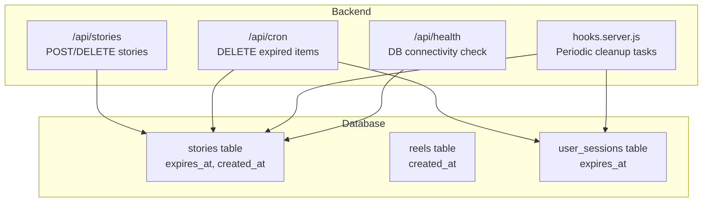
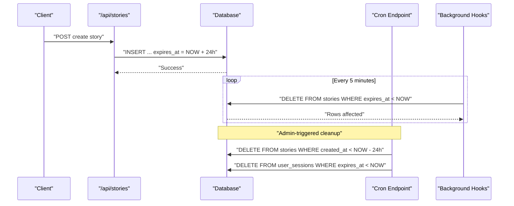
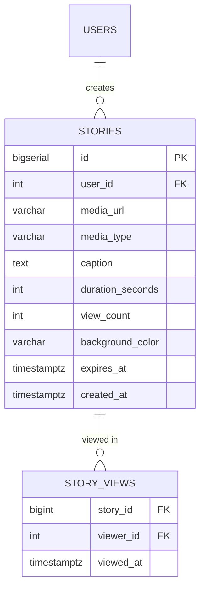
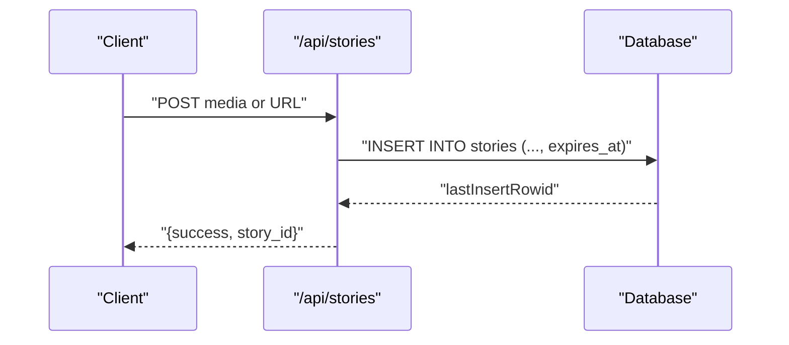
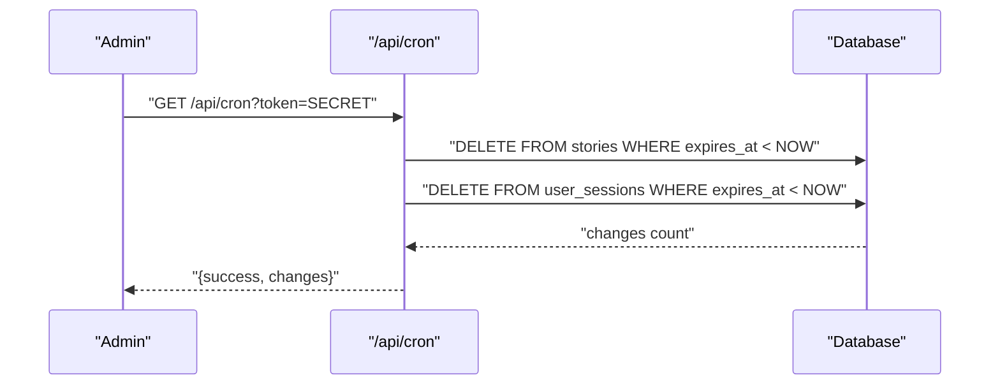
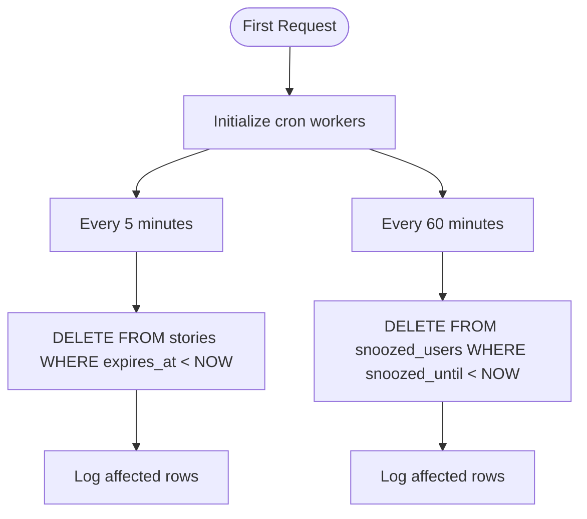
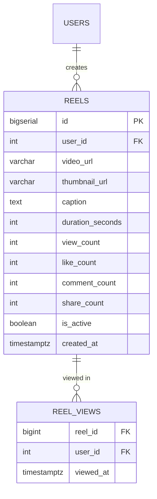
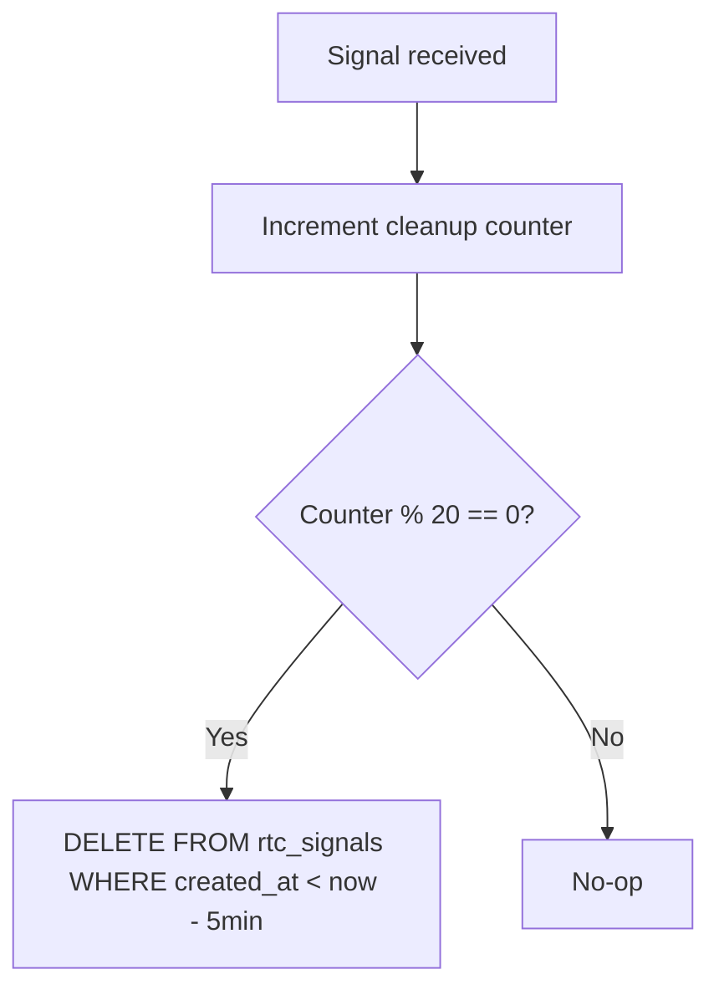
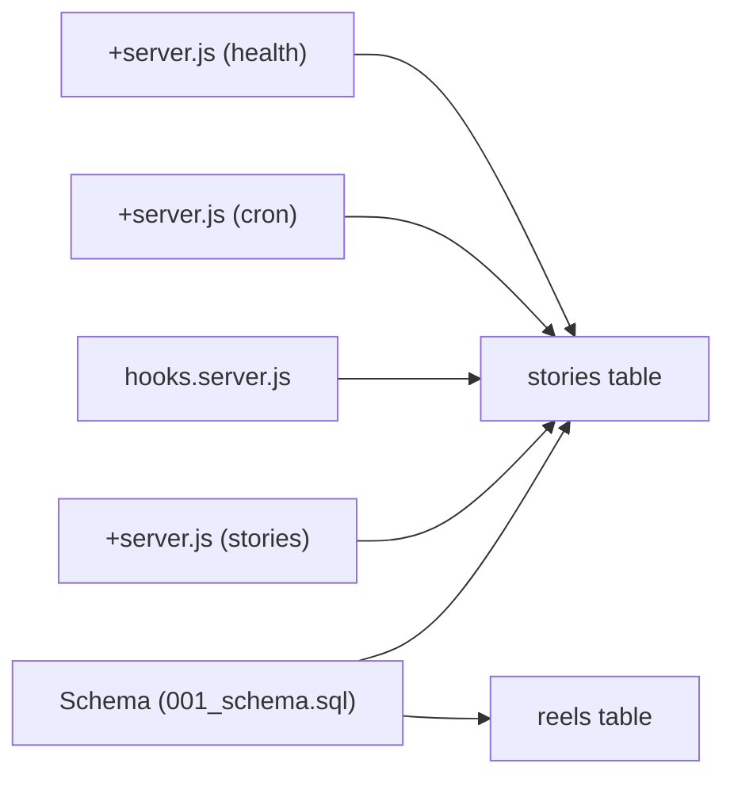

# Ephemeral Content Expiration

<cite>
**Referenced Files in This Document**
- [001_schema.sql](file://migrations/001_schema.sql)
- [002_phase2.sql](file://migrations/002_phase2.sql)
- [schema_sqlite.sql](file://schema_sqlite.sql)
- [+server.js (cron)](file://frontend/src/routes/api/cron/+server.js)
- [+server.js (health)](file://frontend/src/routes/api/health/+server.js)
- [+server.js (stories)](file://frontend/src/routes/api/stories/[...path]/+server.js)
- [hooks.server.js](file://frontend/src/hooks.server.js)
- [+server.js (rtc signal)](file://frontend/src/routes/api/rtc/signal/+server.js)
</cite>

## Table of Contents
1. [Introduction](#introduction)
2. [Project Structure](#project-structure)
3. [Core Components](#core-components)
4. [Architecture Overview](#architecture-overview)
5. [Detailed Component Analysis](#detailed-component-analysis)
6. [Dependency Analysis](#dependency-analysis)
7. [Performance Considerations](#performance-considerations)
8. [Troubleshooting Guide](#troubleshooting-guide)
9. [Conclusion](#conclusion)

## Introduction
This document explains VSocial's ephemeral content expiration system with a focus on stories and reels. It details how timestamps govern automatic cleanup, the database schema supporting expiration, background job scheduling, and operational safeguards. It also covers privacy and storage implications, edge cases, and monitoring mechanisms.

## Project Structure
The ephemeral expiration system spans:
- Database schema defining TTL columns and indexes
- Backend API endpoints for creating stories
- Background cron jobs for periodic cleanup
- Health checks for monitoring database connectivity

**Diagram sources**
- [001_schema.sql:210-231](file://migrations/001_schema.sql#L210-L231)
- [+server.js (cron):17-27](file://frontend/src/routes/api/cron/+server.js#L17-L27)
- [+server.js (health):11-18](file://frontend/src/routes/api/health/+server.js#L11-L18)
- [+server.js (stories):77-81](file://frontend/src/routes/api/stories/[...path]/+server.js#L77-L81)
- [hooks.server.js:79-90](file://frontend/src/hooks.server.js#L79-L90)

**Section sources**
- [001_schema.sql:208-277](file://migrations/001_schema.sql#L208-L277)
- [+server.js (cron):1-31](file://frontend/src/routes/api/cron/+server.js#L1-L31)
- [+server.js (health):1-22](file://frontend/src/routes/api/health/+server.js#L1-L22)
- [+server.js (stories):63-98](file://frontend/src/routes/api/stories/[...path]/+server.js#L63-L98)
- [hooks.server.js:79-103](file://frontend/src/hooks.server.js#L79-L103)

## Core Components
- Stories table with TTL: The stories table defines an expiration column and indexes optimized for active content retrieval and cleanup.
- Reels table: Reels are long-lived and do not use a dedicated TTL column; expiration is not part of the schema for reels.
- Cron cleanup: Two mechanisms remove expired content:
  - Scheduled cleanup via a dedicated API endpoint protected by a shared secret
  - Periodic cleanup via background intervals in hooks
- Creation endpoints: Stories creation sets an expiration timestamp; deletion endpoints allow manual removal.

Key implementation references:
- Stories schema and indexes: [001_schema.sql:210-231](file://migrations/001_schema.sql#L210-L231)
- Cron endpoint for cleanup: [+server.js (cron):17-27](file://frontend/src/routes/api/cron/+server.js#L17-L27)
- Hooks-based cleanup: [hooks.server.js:79-90](file://frontend/src/hooks.server.js#L79-L90)
- Stories creation with TTL: [+server.js (stories):77-81](file://frontend/src/routes/api/stories/[...path]/+server.js#L77-L81)

**Section sources**
- [001_schema.sql:210-231](file://migrations/001_schema.sql#L210-L231)
- [+server.js (cron):17-27](file://frontend/src/routes/api/cron/+server.js#L17-L27)
- [hooks.server.js:79-90](file://frontend/src/hooks.server.js#L79-L90)
- [+server.js (stories):77-81](file://frontend/src/routes/api/stories/[...path]/+server.js#L77-L81)

## Architecture Overview
The expiration lifecycle integrates schema-level defaults, application-level creation, and automated cleanup:

**Diagram sources**
- [+server.js (stories):77-81](file://frontend/src/routes/api/stories/[...path]/+server.js#L77-L81)
- [hooks.server.js:79-90](file://frontend/src/hooks.server.js#L79-L90)
- [+server.js (cron):17-27](file://frontend/src/routes/api/cron/+server.js#L17-L27)
- [001_schema.sql:219](file://migrations/001_schema.sql#L219)

## Detailed Component Analysis

### Stories Schema and Indexes
- Expiration column: The stories table includes an expiration timestamp set to 24 hours from creation.
- Active content indexing: An index filters active stories using the expiration column.
- View tracking: A separate table records per-user story views.

**Diagram sources**
- [001_schema.sql:210-231](file://migrations/001_schema.sql#L210-L231)

**Section sources**
- [001_schema.sql:210-231](file://migrations/001_schema.sql#L210-L231)

### Stories Creation Endpoint
- Accepts uploaded media or external URLs and inserts a story record with a 24-hour TTL.
- Returns the newly created story identifier.

**Diagram sources**
- [+server.js (stories):77-81](file://frontend/src/routes/api/stories/[...path]/+server.js#L77-L81)

**Section sources**
- [+server.js (stories):63-98](file://frontend/src/routes/api/stories/[...path]/+server.js#L63-L98)

### Cron-Based Cleanup
- Protected endpoint: Requires a shared secret via Authorization header or token query parameter.
- Deletes expired stories using the expiration timestamp.
- Also cleans expired user sessions.

**Diagram sources**
- [+server.js (cron):5-31](file://frontend/src/routes/api/cron/+server.js#L5-L31)

**Section sources**
- [+server.js (cron):1-31](file://frontend/src/routes/api/cron/+server.js#L1-L31)

### Hooks-Based Periodic Cleanup
- Starts on first request and runs at fixed intervals:
  - Expired stories cleanup every 5 minutes
  - Expired snoozed user records hourly
- Uses database queries to remove expired rows and logs results.

**Diagram sources**
- [hooks.server.js:79-103](file://frontend/src/hooks.server.js#L79-L103)

**Section sources**
- [hooks.server.js:79-103](file://frontend/src/hooks.server.js#L79-L103)

### Reels Expiration Behavior
- Reels do not define an expiration column in the schema.
- Views are tracked via a partitioned table keyed by view timestamp.

**Diagram sources**
- [001_schema.sql:237-277](file://migrations/001_schema.sql#L237-L277)

**Section sources**
- [001_schema.sql:237-277](file://migrations/001_schema.sql#L237-L277)

### RTC Signal Cleanup (Related Pattern)
- Demonstrates a similar cleanup pattern for transient signaling data with a time-based threshold.

**Diagram sources**
- [+server.js (rtc signal):43-50](file://frontend/src/routes/api/rtc/signal/+server.js#L43-L50)

**Section sources**
- [+server.js (rtc signal):43-57](file://frontend/src/routes/api/rtc/signal/+server.js#L43-L57)

## Dependency Analysis
- Database schema defines TTL semantics for stories and indexes for efficient filtering.
- Application endpoints depend on the schema for insertion and rely on cleanup routines for maintenance.
- Cron endpoint and hooks both depend on database connectivity; health endpoint validates connectivity.

**Diagram sources**
- [001_schema.sql:210-277](file://migrations/001_schema.sql#L210-L277)
- [+server.js (stories):77-81](file://frontend/src/routes/api/stories/[...path]/+server.js#L77-L81)
- [hooks.server.js:79-90](file://frontend/src/hooks.server.js#L79-L90)
- [+server.js (cron):17-27](file://frontend/src/routes/api/cron/+server.js#L17-L27)
- [+server.js (health):11-18](file://frontend/src/routes/api/health/+server.js#L11-L18)

**Section sources**
- [001_schema.sql:210-277](file://migrations/001_schema.sql#L210-L277)
- [+server.js (stories):77-81](file://frontend/src/routes/api/stories/[...path]/+server.js#L77-L81)
- [hooks.server.js:79-90](file://frontend/src/hooks.server.js#L79-L90)
- [+server.js (cron):17-27](file://frontend/src/routes/api/cron/+server.js#L17-L27)
- [+server.js (health):11-18](file://frontend/src/routes/api/health/+server.js#L11-L18)

## Performance Considerations
- Indexes on expiration columns enable fast filtering for cleanup operations.
- Partitioning of view tables (e.g., reels) can improve write performance for high-volume scenarios.
- Cleanup frequency balances resource usage against stale data retention; adjust intervals based on traffic.
- Queries use time-based thresholds; ensure proper timezone handling and consider UTC for consistency.

[No sources needed since this section provides general guidance]

## Troubleshooting Guide
- Unauthorized cron access: Verify the shared secret is configured and passed via Authorization header or token parameter.
- Database connectivity failures: Use the health endpoint to confirm database availability; degraded status indicates connection issues.
- Missing expired content: Confirm cleanup intervals are running and that the expiration column is being evaluated correctly.
- Manual overrides: Use the stories deletion endpoint to remove content immediately; cron and hooks operate automatically but can be triggered externally.

Common references:
- Cron authorization and cleanup: [+server.js (cron):5-31](file://frontend/src/routes/api/cron/+server.js#L5-L31)
- Health check: [+server.js (health):11-18](file://frontend/src/routes/api/health/+server.js#L11-L18)
- Stories deletion: [+server.js (stories):86-98](file://frontend/src/routes/api/stories/[...path]/+server.js#L86-L98)

**Section sources**
- [+server.js (cron):5-31](file://frontend/src/routes/api/cron/+server.js#L5-L31)
- [+server.js (health):11-18](file://frontend/src/routes/api/health/+server.js#L11-L18)
- [+server.js (stories):86-98](file://frontend/src/routes/api/stories/[...path]/+server.js#L86-L98)

## Conclusion
VSocial’s ephemeral content system centers on a 24-hour TTL for stories enforced by schema defaults, indexes, and automated cleanup. Two complementary mechanisms—admin-triggered cron and periodic hooks—ensure stale content is removed reliably. While reels do not include a TTL column, the overall design maintains privacy by limiting exposure windows, optimizes storage through timely cleanup, and supports robust monitoring via health checks.