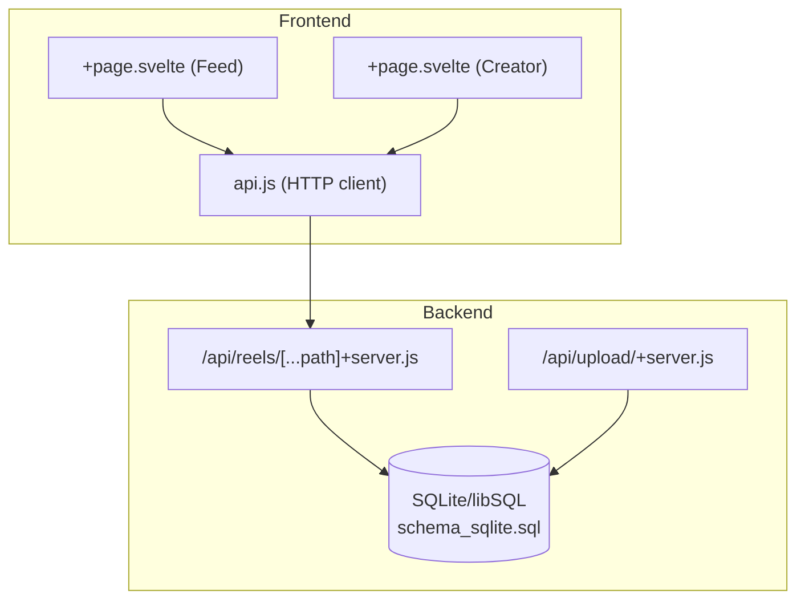
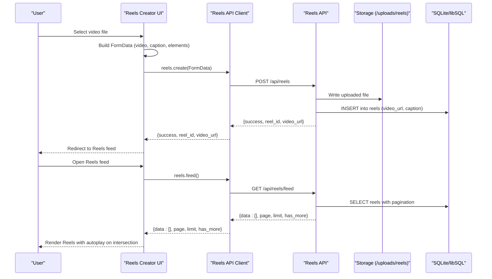
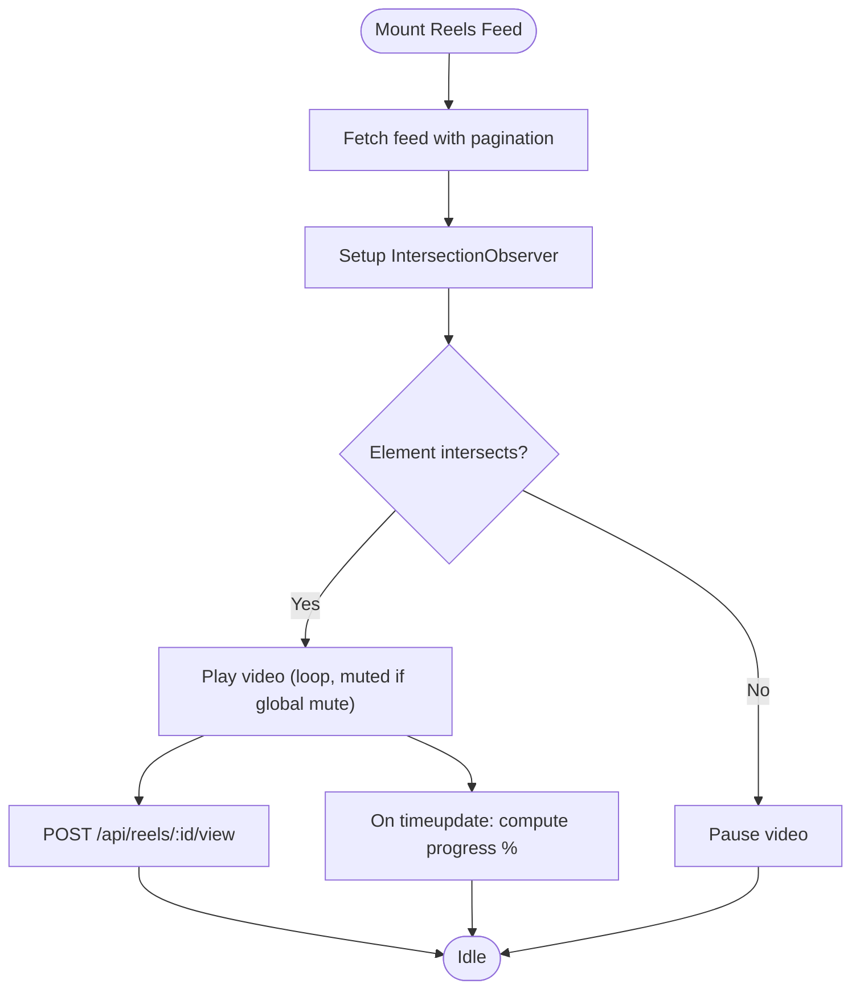
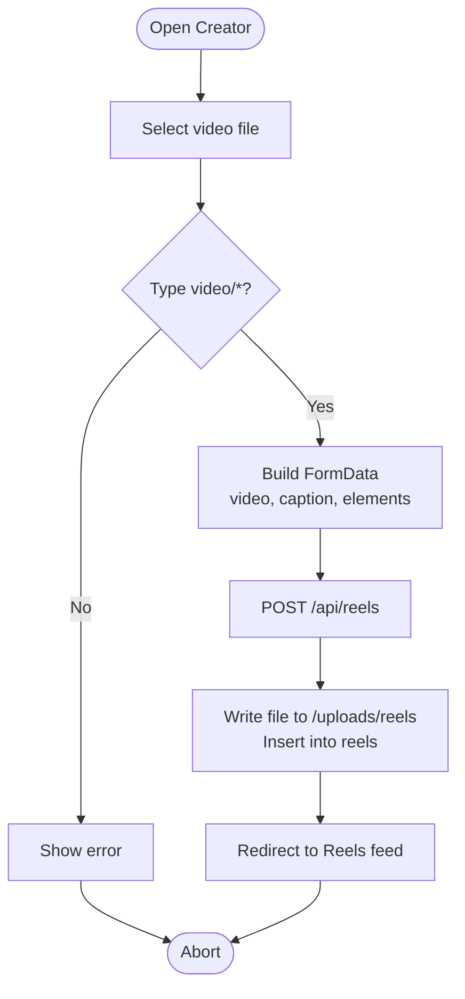
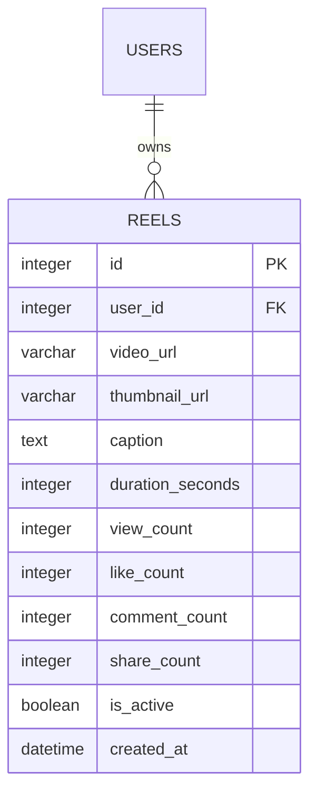
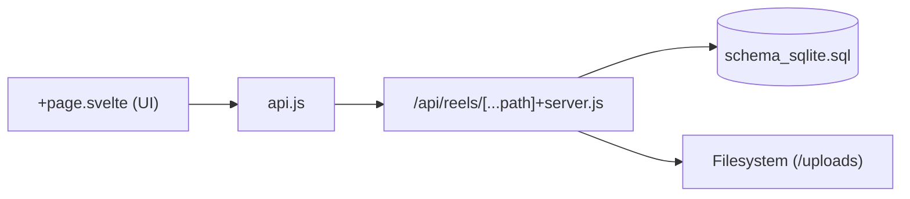

# Reels System

<cite>
**Referenced Files in This Document**
- [reels+page.svelte](file://frontend/src/routes/reels/+page.svelte)
- [reels-create+page.svelte](file://frontend/src/routes/reels/create/+page.svelte)
- [api.js](file://frontend/src/lib/api.js)
- [reels-api+server.js](file://frontend/src/routes/api/reels/[...path]+server.js)
- [schema_sqlite.sql](file://schema_sqlite.sql)
- [001_schema.sql](file://migrations/001_schema.sql)
- [upload-api+server.js](file://frontend/src/routes/api/upload/+server.js)
</cite>

## Table of Contents
1. [Introduction](#introduction)
2. [Project Structure](#project-structure)
3. [Core Components](#core-components)
4. [Architecture Overview](#architecture-overview)
5. [Detailed Component Analysis](#detailed-component-analysis)
6. [Dependency Analysis](#dependency-analysis)
7. [Performance Considerations](#performance-considerations)
8. [Troubleshooting Guide](#troubleshooting-guide)
9. [Conclusion](#conclusion)

## Introduction
This document describes VSocial’s Reels system for video content sharing. It covers the end-to-end workflow from video upload and local editing to playback, engagement features, and backend persistence. It also documents the API endpoints, data model, and technical considerations for video processing, storage, and streaming.

## Project Structure
The Reels system spans frontend UI components and SvelteKit server routes:
- Frontend UI: Reels feed and creation experiences
- API client: Unified HTTP client for backend calls
- Backend API: Reels endpoints for feed, creation, likes, views, and comments
- Database: Schema and migrations defining the reels domain

**Diagram sources**
- [reels+page.svelte:33-43](file://frontend/src/routes/reels/+page.svelte#L33-L43)
- [reels-create+page.svelte:1-3](file://frontend/src/routes/reels/create/+page.svelte#L1-L3)
- [api.js:179-197](file://frontend/src/lib/api.js#L179-L197)
- [reels-api+server.js:10-45](file://frontend/src/routes/api/reels/[...path]+server.js#L10-L45)
- [schema_sqlite.sql:215-229](file://schema_sqlite.sql#L215-L229)

**Section sources**
- [reels+page.svelte:1-690](file://frontend/src/routes/reels/+page.svelte#L1-L690)
- [reels-create+page.svelte:1-728](file://frontend/src/routes/reels/create/+page.svelte#L1-L728)
- [api.js:179-197](file://frontend/src/lib/api.js#L179-L197)
- [reels-api+server.js:1-124](file://frontend/src/routes/api/reels/[...path]+server.js#L1-L124)
- [schema_sqlite.sql:215-229](file://schema_sqlite.sql#L215-L229)

## Core Components
- Reels Feed UI: Loads and streams Reels with automatic playback and engagement actions
- Reels Creator UI: Local editing (filters, overlays, speed) and upload via multipart/form-data
- Reels API Client: Typed endpoints for feed, create, like/unlike, view, comments
- Backend Reels API: Authentication-required endpoints for feed, creation, likes, views, comments
- Database Schema: Defines reels table and related counters and timestamps

Key responsibilities:
- Feed: Pagination, user-liked detection, view counting
- Creator: Builds FormData payload with video, caption, and aesthetic elements
- API: Validates uploads, persists metadata, and manages engagement metrics

**Section sources**
- [reels+page.svelte:33-84](file://frontend/src/routes/reels/+page.svelte#L33-L84)
- [reels-create+page.svelte:98-125](file://frontend/src/routes/reels/create/+page.svelte#L98-L125)
- [api.js:179-197](file://frontend/src/lib/api.js#L179-L197)
- [reels-api+server.js:16-45](file://frontend/src/routes/api/reels/[...path]+server.js#L16-L45)

## Architecture Overview
End-to-end flow from upload to playback:

**Diagram sources**
- [reels-create+page.svelte:98-125](file://frontend/src/routes/reels/create/+page.svelte#L98-L125)
- [api.js:179-197](file://frontend/src/lib/api.js#L179-L197)
- [reels-api+server.js:55-69](file://frontend/src/routes/api/reels/[...path]+server.js#L55-L69)
- [schema_sqlite.sql:215-229](file://schema_sqlite.sql#L215-L229)

## Detailed Component Analysis

### Reels Feed Playback and Engagement
- Loads reels with pagination and user-liked detection
- Uses IntersectionObserver to start/stop playback per reel
- Supports mute toggle, like with optimistic UI, and comment modal
- Records view events on visibility

**Diagram sources**
- [reels+page.svelte:33-84](file://frontend/src/routes/reels/+page.svelte#L33-L84)
- [reels+page.svelte:289-300](file://frontend/src/routes/reels/+page.svelte#L289-L300)

**Section sources**
- [reels+page.svelte:33-84](file://frontend/src/routes/reels/+page.svelte#L33-L84)
- [reels+page.svelte:289-300](file://frontend/src/routes/reels/+page.svelte#L289-L300)

### Reels Creation Workflow
- Validates file type (video/*), builds FormData
- Collects aesthetic elements: text overlay, stickers, music, filters, speed
- Sends multipart/form-data to backend for upload and persistence

**Diagram sources**
- [reels-create+page.svelte:68-78](file://frontend/src/routes/reels/create/+page.svelte#L68-L78)
- [reels-create+page.svelte:104-116](file://frontend/src/routes/reels/create/+page.svelte#L104-L116)
- [reels-api+server.js:55-69](file://frontend/src/routes/api/reels/[...path]+server.js#L55-L69)

**Section sources**
- [reels-create+page.svelte:68-125](file://frontend/src/routes/reels/create/+page.svelte#L68-L125)
- [reels-api+server.js:55-69](file://frontend/src/routes/api/reels/[...path]+server.js#L55-L69)

### API Endpoints
- GET /api/reels/feed?page&limit
  - Returns paginated reels with user-liked flag
- GET /api/reels/:id
  - Returns a single reel with user metadata
- POST /api/reels
  - Upload video via multipart/form-data (video, caption, optional elements)
- POST /api/reels/:id/like
  - Toggle like for a reel
- POST /api/reels/:id/view
  - Increment view counter
- POST /api/reels/:id/comments
  - Add a comment (supports nested replies via parent_id)
- GET /api/reels/:id/comments
  - List comments ordered by creation time

Notes:
- All endpoints require authentication
- Comments use a unified comments table with post_id stored as negative reel id (-reelId)

**Section sources**
- [reels-api+server.js:16-45](file://frontend/src/routes/api/reels/[...path]+server.js#L16-L45)
- [reels-api+server.js:74-99](file://frontend/src/routes/api/reels/[...path]+server.js#L74-L99)

### Data Model
Reels table definition and indices:

**Diagram sources**
- [schema_sqlite.sql:215-229](file://schema_sqlite.sql#L215-L229)

Additional notes:
- Migration defines reels with BIGSERIAL id and additional indices for popularity
- Comments are stored in a shared comments table; reel comments are identified by negative post_id

**Section sources**
- [schema_sqlite.sql:215-229](file://schema_sqlite.sql#L215-L229)
- [001_schema.sql:237-277](file://migrations/001_schema.sql#L237-L277)

### Frontend API Client
Centralized HTTP client with:
- Token injection for authenticated requests
- Dedicated upload helper for multipart/form-data
- Reels module exposing typed endpoints for feed, create, like/unlike, view, comments

Usage highlights:
- reels.create(fd) sends FormData to POST /api/reels
- reels.feed() GET /api/reels/feed with query params
- reels.comments.list(id) GET /api/reels/:id/comments

**Section sources**
- [api.js:17-46](file://frontend/src/lib/api.js#L17-L46)
- [api.js:58-74](file://frontend/src/lib/api.js#L58-L74)
- [api.js:179-197](file://frontend/src/lib/api.js#L179-L197)

## Dependency Analysis
- UI depends on the Reels API client for all backend interactions
- Reels API client depends on SvelteKit’s Request/Response and fetch
- Backend Reels API depends on:
  - Authentication middleware (requireAuth)
  - Database access (getDb)
  - File system for uploads (writeFileSync, getUploadsDir)
- Database schema defines foreign keys and indices for performance

**Diagram sources**
- [reels+page.svelte:33-43](file://frontend/src/routes/reels/+page.svelte#L33-L43)
- [api.js:179-197](file://frontend/src/lib/api.js#L179-L197)
- [reels-api+server.js:5-8](file://frontend/src/routes/api/reels/[...path]+server.js#L5-L8)

**Section sources**
- [reels+page.svelte:33-43](file://frontend/src/routes/reels/+page.svelte#L33-L43)
- [api.js:179-197](file://frontend/src/lib/api.js#L179-L197)
- [reels-api+server.js:5-8](file://frontend/src/routes/api/reels/[...path]+server.js#L5-L8)

## Performance Considerations
- Feed pagination: limit and offset queries prevent large payloads
- IntersectionObserver: only visible videos play, reducing CPU/GPU usage
- Global mute: default muted playback avoids autoplay blocking and resource contention
- Local editing: filters and overlays are applied client-side; server-side processing is minimal
- Storage: writes occur synchronously; consider asynchronous processing for transcoding and thumbnails in production

[No sources needed since this section provides general guidance]

## Troubleshooting Guide
Common issues and resolutions:
- Authentication errors
  - Symptom: 401 Unauthorized on API calls
  - Cause: Missing or invalid token
  - Resolution: Ensure user is logged in; verify Authorization header presence
- No video file provided
  - Symptom: 400 Bad Request during upload
  - Cause: FormData missing “video” field
  - Resolution: Verify file input binding and FormData append calls
- File type not allowed
  - Symptom: 400 Bad Request with invalid MIME type
  - Cause: Non-video file selected
  - Resolution: Restrict input to video/* and validate type
- Comment empty
  - Symptom: 400 Bad Request on comment creation
  - Cause: Empty body
  - Resolution: Ensure content is trimmed and present before POST
- Reel not found
  - Symptom: 404 Not Found
  - Cause: Invalid id or soft-deleted record
  - Resolution: Confirm id and is_active flag

**Section sources**
- [reels-api+server.js:59-59](file://frontend/src/routes/api/reels/[...path]+server.js#L59-L59)
- [reels-api+server.js:95-95](file://frontend/src/routes/api/reels/[...path]+server.js#L95-L95)
- [reels-api+server.js:33-34](file://frontend/src/routes/api/reels/[...path]+server.js#L33-L34)

## Conclusion
VSocial’s Reels system provides a streamlined vertical video experience with:
- Intuitive creation UI supporting overlays, filters, and speed adjustments
- Efficient feed playback with intersection-based rendering
- A compact backend API for upload, engagement, and comments
- A clear schema enabling scalability and future enhancements

For production hardening, consider adding:
- Transcoding and thumbnail generation
- CDN-backed media delivery
- Duration and size limits enforcement
- Captions and music integration at the backend
- Interactive elements (polls, mentions) persisted consistently