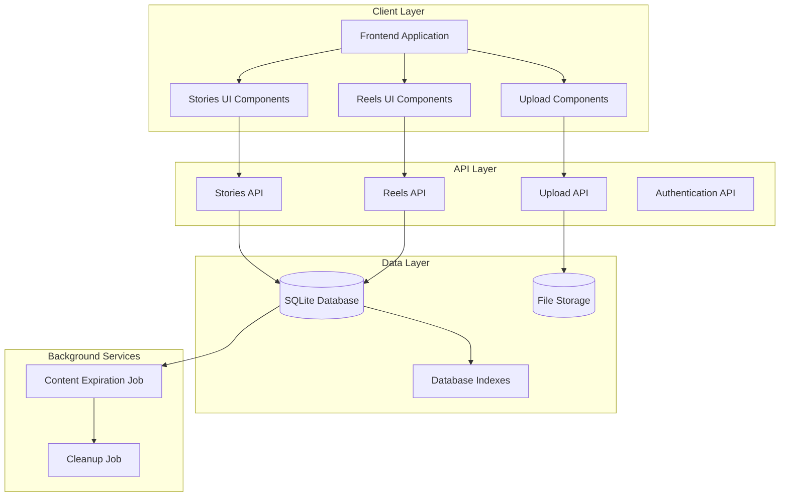
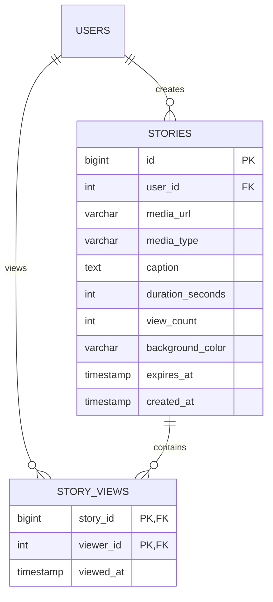
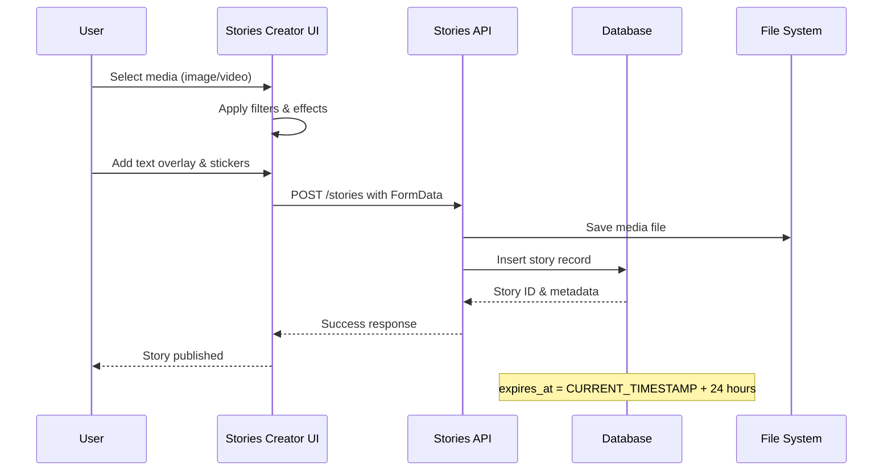
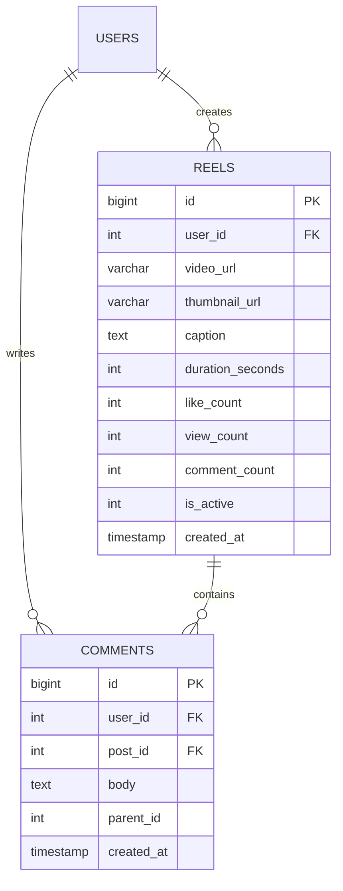
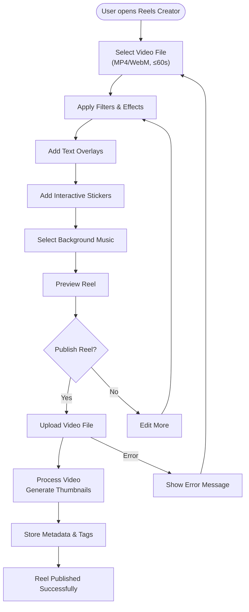
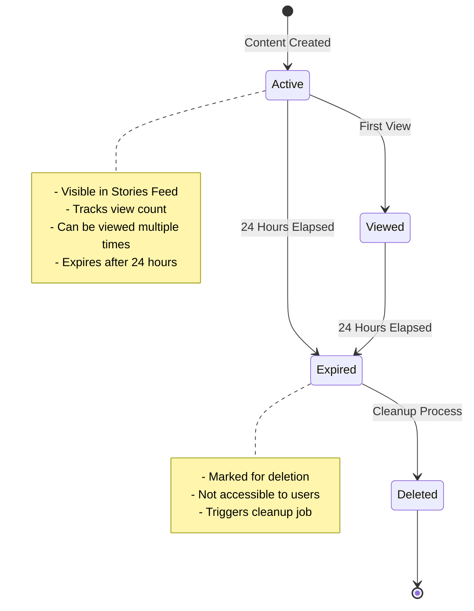
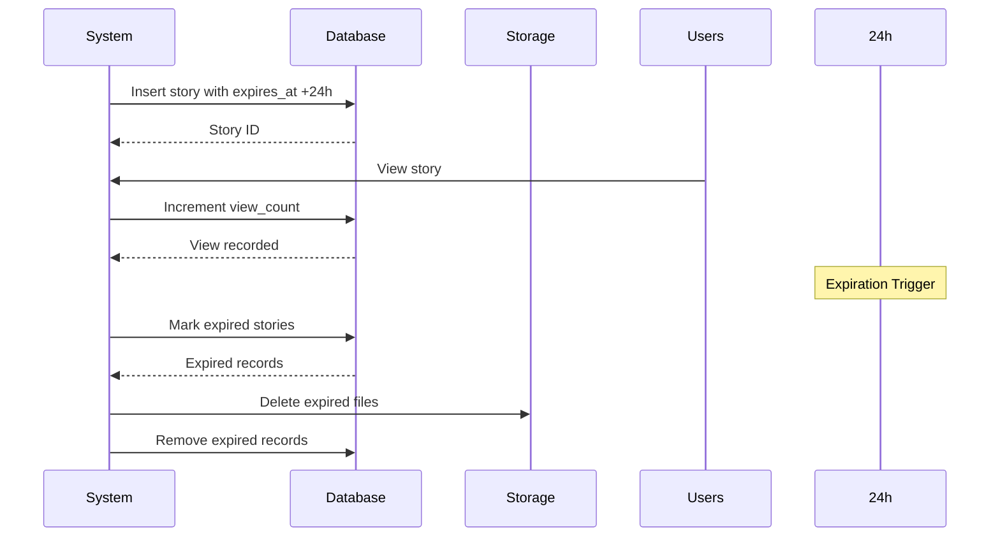
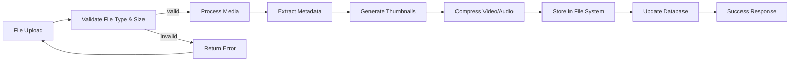
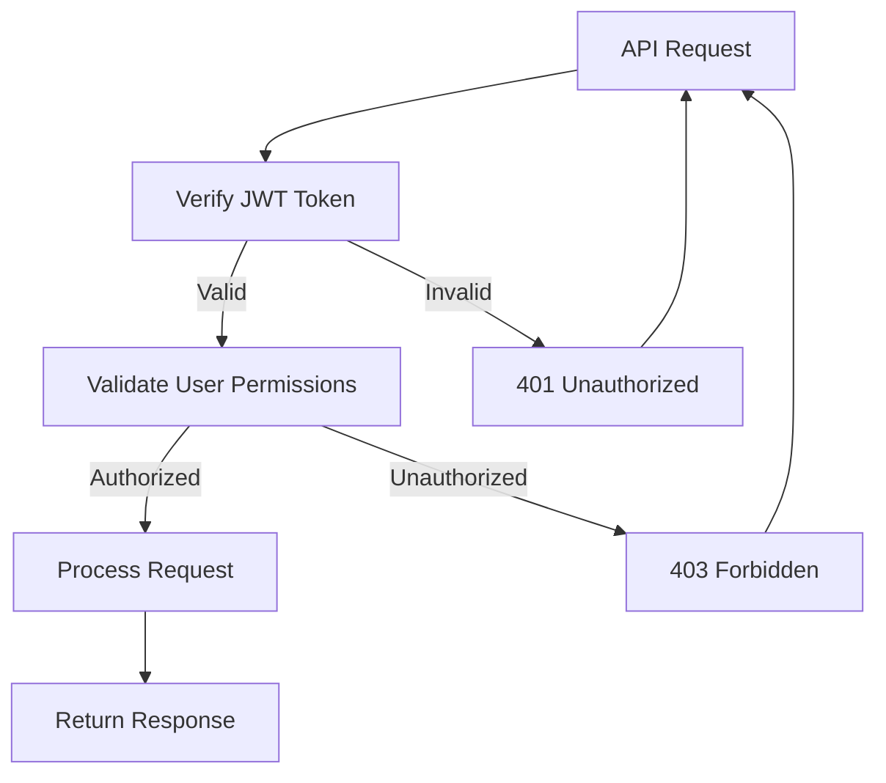

# Stories & Reels System

<cite>
**Referenced Files in This Document**
- [001_schema.sql](file://migrations/001_schema.sql)
- [api.js](file://frontend/src/lib/api.js)
- [db.js](file://frontend/src/lib/server/db.js)
- [+server.js (Reels API)](file://frontend/src/routes/api/reels/[...path]+server.js)
- [+server.js (Upload API)](file://frontend/src/routes/api/upload/+server.js)
- [+page.svelte (Stories Creator)](file://frontend/build/server/chunks/_page.svelte-BPXtk4--.js)
- [+page.svelte (Reels Feed)](file://frontend/build/server/chunks/_page.svelte-Box_tR9K.js)
- [+page.svelte (Reels Creator)](file://frontend/build/server/chunks/_page.svelte-CNe1GLkT.js)
- [+page.server.js (Stories Create Page)](file://frontend/build/server/chunks/23-BFLkqwLE.js)
- [+page.server.js (Reels Create Page)](file://frontend/build/server/chunks/19-DJGvELDy.js)
</cite>

## Table of Contents
1. [Introduction](#introduction)
2. [System Architecture](#system-architecture)
3. [Stories System](#stories-system)
4. [Reels System](#reels-system)
5. [Ephemeral Content Management](#ephemeral-content-management)
6. [Media Processing Pipeline](#media-processing-pipeline)
7. [Storage & Delivery](#storage--delivery)
8. [API Endpoints](#api-endpoints)
9. [Technical Implementation Details](#technical-implementation-details)
10. [Performance Considerations](#performance-considerations)
11. [Troubleshooting Guide](#troubleshooting-guide)
12. [Conclusion](#conclusion)

## Introduction

VSocial's Stories and Reels system provides ephemeral content capabilities for virtual creator communities. The platform supports two primary content formats: Stories (24-hour ephemeral posts) and Reels (short-form vertical videos). This system enables creators to share temporary content with their followers while maintaining privacy and automatic content lifecycle management.

The implementation combines client-side SvelteKit components with server-side APIs, utilizing SQLite for data persistence and local file storage for media assets. The system emphasizes real-time interactions, automatic content expiration, and seamless user experiences across mobile and desktop platforms.

## System Architecture



**Diagram sources**
- [db.js:117-167](file://frontend/src/lib/server/db.js#L117-L167)
- [+server.js (Reels API):1-95](file://frontend/src/routes/api/reels/[...path]+server.js#L1-L95)

## Stories System

### Data Model & Schema

The Stories system utilizes a dedicated schema optimized for ephemeral content with automatic expiration:



**Diagram sources**
- [001_schema.sql:210-231](file://migrations/001_schema.sql#L210-L231)

### Stories Features

The Stories system provides comprehensive ephemeral content functionality:

- **24-Hour Expiration**: Automatic content removal after 24 hours
- **Multi-Media Support**: Images, videos, and mixed media stories
- **Interactive Elements**: Text overlays, stickers, and interactive components
- **Privacy Controls**: Verified creator badges and follower-only visibility
- **Analytics Tracking**: View counting and engagement metrics

### Stories Creation Workflow



**Diagram sources**
- [+page.svelte (Stories Creator):1-180](file://frontend/build/server/chunks/_page.svelte-BPXtk4--.js#L1-L180)
- [+server.js (Reels API):54-70](file://frontend/src/routes/api/reels/[...path]+server.js#L54-L70)

**Section sources**
- [001_schema.sql:210-224](file://migrations/001_schema.sql#L210-L224)
- [+page.svelte (Stories Creator):1-180](file://frontend/build/server/chunks/_page.svelte-BPXtk4--.js#L1-L180)

## Reels System

### Data Model & Schema

The Reels system extends the Stories infrastructure with video-specific optimizations:



**Diagram sources**
- [001_schema.sql:237-255](file://migrations/001_schema.sql#L237-L255)

### Reels Features

The Reels system provides advanced video content capabilities:

- **Vertical Video Format**: Optimized for mobile viewing (9:16 aspect ratio)
- **Video Processing**: Automatic encoding and thumbnail generation
- **Interactive Comments**: Threaded comment system with replies
- **Like System**: Real-time engagement tracking
- **Discovery Feed**: Algorithm-driven content recommendation

### Reels Creation Workflow



**Diagram sources**
- [+page.svelte (Reels Creator):1-200](file://frontend/build/server/chunks/_page.svelte-CNe1GLkT.js#L1-L200)

**Section sources**
- [001_schema.sql:237-255](file://migrations/001_schema.sql#L237-L255)
- [+page.svelte (Reels Creator):1-200](file://frontend/build/server/chunks/_page.svelte-CNe1GLkT.js#L1-L200)

## Ephemeral Content Management

### Expiration Policy

The system implements strict ephemeral content policies:



**Diagram sources**
- [001_schema.sql:219](file://migrations/001_schema.sql#L219)

### Content Lifecycle



**Diagram sources**
- [001_schema.sql:219](file://migrations/001_schema.sql#L219)

**Section sources**
- [001_schema.sql:210-231](file://migrations/001_schema.sql#L210-L231)

## Media Processing Pipeline

### Upload & Validation

The media processing pipeline ensures content quality and security:



**Diagram sources**
- [+server.js (Upload API):17-43](file://frontend/src/routes/api/upload/+server.js#L17-L43)

### Supported Formats & Constraints

| Media Type | Supported Formats | Maximum Size | Duration Limits |
|------------|-------------------|--------------|-----------------|
| Images | JPG, PNG, WebP, GIF | 50MB | N/A |
| Audio | MP3, OGG, M4A, WebM | 50MB | N/A |
| Videos | MP4, WebM | 50MB | 60 seconds |

**Section sources**
- [+server.js (Upload API):11-15](file://frontend/src/routes/api/upload/+server.js#L11-L15)
- [+server.js (Upload API):21-26](file://frontend/src/routes/api/upload/+server.js#L21-L26)

## Storage & Delivery

### File Organization

The system organizes media files in a structured hierarchy:

```
uploads/
├── stories/
│   ├── story_1699123456789.jpg
│   ├── story_1699123567890.mp4
│   └── ...
├── reels/
│   ├── reel_1699123456789.mp4
│   ├── reel_1699123567890.webm
│   └── ...
├── avatars/
├── covers/
└── posts/
```

### CDN Integration Strategy

For production deployments, consider implementing CDN integration:

- **Static Asset Optimization**: Serve media files through CDN for global distribution
- **Edge Caching**: Cache frequently accessed content at edge locations
- **Compression**: Enable automatic compression (GZIP/Brotli) for reduced bandwidth
- **Image Optimization**: Dynamic resizing and format conversion based on client capabilities

## API Endpoints

### Stories API Endpoints

| Endpoint | Method | Description | Authentication |
|----------|--------|-------------|----------------|
| `/stories/feed` | GET | Get stories feed | Required |
| `/stories` | POST | Create new story | Required |
| `/stories/:id/view` | POST | Record story view | Required |
| `/stories/:id` | DELETE | Delete story | Required |

### Reels API Endpoints

| Endpoint | Method | Description | Authentication |
|----------|--------|-------------|----------------|
| `/reels/feed` | GET | Get reels feed | Required |
| `/reels` | POST | Create new reel | Required |
| `/reels/:id` | GET | Get reel details | Required |
| `/reels/:id/like` | POST | Like reel | Required |
| `/reels/:id/like` | DELETE | Unlike reel | Required |
| `/reels/:id/view` | POST | Record view | Required |
| `/reels/:id/comments` | GET | List comments | Required |
| `/reels/:id/comments` | POST | Create comment | Required |

**Section sources**
- [api.js:169-197](file://frontend/src/lib/api.js#L169-L197)
- [+server.js (Reels API):10-45](file://frontend/src/routes/api/reels/[...path]+server.js#L10-L45)

## Technical Implementation Details

### Database Design Optimizations

The schema includes strategic indexes for optimal query performance:

```sql
-- Indexes for Stories
CREATE INDEX idx_stories_user ON stories(user_id, expires_at);
CREATE INDEX idx_stories_active ON stories(expires_at) 
WHERE expires_at > CURRENT_TIMESTAMP;

-- Indexes for Reels  
CREATE INDEX idx_reels_active ON reels(is_active, created_at);
CREATE INDEX idx_reels_user ON reels(user_id, created_at);
```

### Authentication & Authorization

All media operations require user authentication:



**Diagram sources**
- [+server.js (Reels API):51](file://frontend/src/routes/api/reels/[...path]+server.js#L51)

### Error Handling & Validation

The system implements comprehensive error handling:

- **File Validation**: MIME type checking and size limits
- **Authentication**: Token verification and session validation
- **Database Transactions**: Atomic operations for data consistency
- **Cleanup Procedures**: Automated cleanup for expired content

**Section sources**
- [+server.js (Upload API):17-43](file://frontend/src/routes/api/upload/+server.js#L17-L43)
- [+server.js (Reels API):54-95](file://frontend/src/routes/api/reels/[...path]+server.js#L54-L95)

## Performance Considerations

### Database Optimization

- **Connection Pooling**: Efficient database connection management
- **Query Optimization**: Indexed queries for frequent operations
- **Transaction Management**: Batch operations for improved throughput
- **Memory Management**: Proper resource cleanup and garbage collection

### Media Processing Optimization

- **Asynchronous Processing**: Non-blocking file operations
- **Parallel Processing**: Concurrent media encoding tasks
- **Resource Limits**: Controlled memory and CPU usage
- **Caching Strategies**: Intelligent caching for frequently accessed content

### Scalability Patterns

- **Horizontal Scaling**: Load balancing across multiple instances
- **Database Sharding**: Partitioning for large datasets
- **CDN Distribution**: Global content delivery network
- **Microservice Architecture**: Modular service boundaries

## Troubleshooting Guide

### Common Issues & Solutions

**Stories Not Appearing**
- Verify 24-hour expiration hasn't occurred
- Check user follows relationship
- Confirm story is marked as active

**Reels Upload Failures**
- Validate file format and size constraints
- Check browser compatibility for video codecs
- Verify sufficient disk space availability

**Performance Issues**
- Monitor database query performance
- Check CDN connectivity and caching
- Review server resource utilization

### Debugging Tools

- **Database Queries**: Monitor slow queries and optimize indexes
- **File System**: Track storage usage and cleanup processes
- **API Logs**: Analyze request/response patterns
- **User Analytics**: Monitor engagement and retention metrics

**Section sources**
- [db.js:117-167](file://frontend/src/lib/server/db.js#L117-L167)

## Conclusion

VSocial's Stories and Reels system provides a comprehensive ephemeral content platform designed specifically for virtual creator communities. The implementation balances real-time interactivity with robust content lifecycle management, ensuring optimal user experiences while maintaining system performance and data integrity.

Key strengths include the 24-hour expiration model that encourages fresh content, comprehensive media processing capabilities, and scalable architecture supporting both Stories and Reels functionality. The system's modular design facilitates future enhancements while maintaining backward compatibility and operational reliability.

The combination of SQLite for data persistence, local file storage for media assets, and SvelteKit for the frontend creates a cohesive platform that delivers engaging ephemeral content experiences across diverse device capabilities and network conditions.