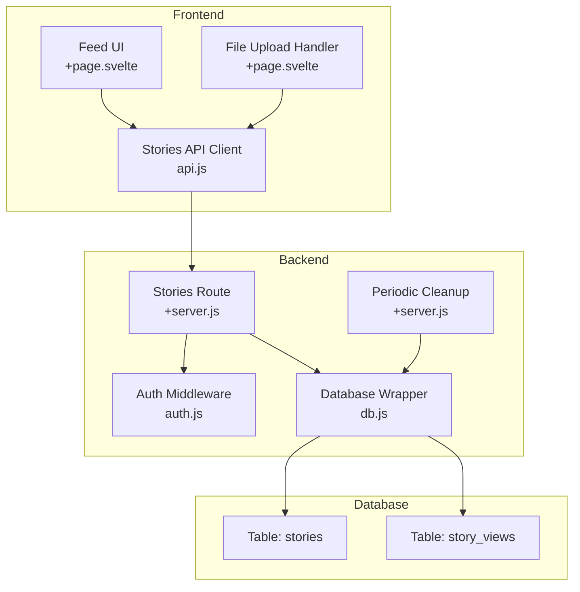
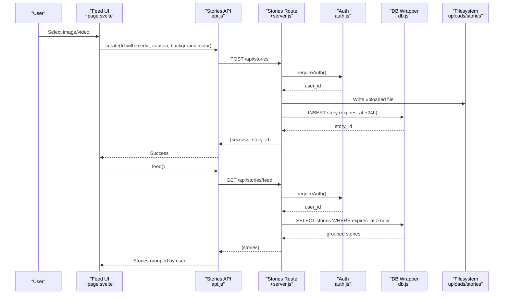
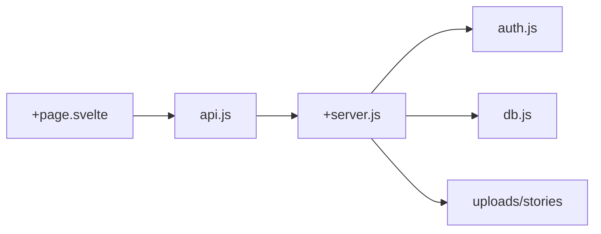

# Stories Management

<cite>
**Referenced Files in This Document**
- [+server.js](file://frontend/src/routes/api/stories/[...path]/+server.js)
- [api.js](file://frontend/src/lib/api.js)
- [db.js](file://frontend/src/lib/server/db.js)
- [auth.js](file://frontend/src/lib/server/auth.js)
- [+page.svelte](file://frontend/src/routes/feed/+page.svelte)
- [001_schema.sql](file://migrations/001_schema.sql)
- [+server.js](file://frontend/src/routes/api/cron/+server.js)
</cite>

## Table of Contents
1. [Introduction](#introduction)
2. [Project Structure](#project-structure)
3. [Core Components](#core-components)
4. [Architecture Overview](#architecture-overview)
5. [Detailed Component Analysis](#detailed-component-analysis)
6. [Dependency Analysis](#dependency-analysis)
7. [Performance Considerations](#performance-considerations)
8. [Troubleshooting Guide](#troubleshooting-guide)
9. [Conclusion](#conclusion)

## Introduction
This document explains VSocial’s ephemeral stories management system. It covers the complete lifecycle of stories: creation via multipart/form-data, retrieval through a grouped feed, and deletion by owners. It also documents expiration policies (24-hour TTL), media type handling (image/video), background color customization, and view tracking. Practical examples demonstrate creating stories with file uploads, captions, and background colors, along with backend implementation details for storage, validation, and database schema.

## Project Structure
Stories functionality spans three layers:
- Frontend API client and routes for user interactions
- Backend server endpoints for CRUD operations and feed aggregation
- Database schema and periodic cleanup for ephemeral content

**Diagram sources**
- [+server.js:1-98](file://frontend/src/routes/api/stories/[...path]/+server.js#L1-L98)
- [api.js:169-174](file://frontend/src/lib/api.js#L169-L174)
- [db.js:169-172](file://frontend/src/lib/server/db.js#L169-L172)
- [auth.js:15-44](file://frontend/src/lib/server/auth.js#L15-L44)
- [001_schema.sql:210-231](file://migrations/001_schema.sql#L210-L231)
- [+server.js:17-27](file://frontend/src/routes/api/cron/+server.js#L17-L27)

**Section sources**
- [+server.js:1-98](file://frontend/src/routes/api/stories/[...path]/+server.js#L1-L98)
- [api.js:169-174](file://frontend/src/lib/api.js#L169-L174)
- [db.js:169-172](file://frontend/src/lib/server/db.js#L169-L172)
- [auth.js:15-44](file://frontend/src/lib/server/auth.js#L15-L44)
- [001_schema.sql:210-231](file://migrations/001_schema.sql#L210-L231)
- [+server.js:17-27](file://frontend/src/routes/api/cron/+server.js#L17-L27)

## Core Components
- Stories API route: Implements GET /api/stories/feed, POST /api/stories, and DELETE /api/stories/:id.
- Stories API client: Provides convenience methods for feed, create, view, and delete.
- Authentication middleware: Enforces bearer token validation and session checks.
- Database wrapper: Unified async interface supporting @libsql/client and better-sqlite3.
- Database schema: Defines stories and story_views tables with TTL and indexing.
- Periodic cleanup: Removes expired stories automatically.

**Section sources**
- [+server.js:11-98](file://frontend/src/routes/api/stories/[...path]/+server.js#L11-L98)
- [api.js:169-174](file://frontend/src/lib/api.js#L169-L174)
- [auth.js:15-44](file://frontend/src/lib/server/auth.js#L15-L44)
- [db.js:169-172](file://frontend/src/lib/server/db.js#L169-L172)
- [001_schema.sql:210-231](file://migrations/001_schema.sql#L210-L231)
- [+server.js:79-90](file://frontend/src/routes/api/cron/+server.js#L79-L90)

## Architecture Overview
The stories system integrates frontend UI, API client, server route handlers, authentication, and database persistence. Expiration is enforced both at query-time and via a background job.

**Diagram sources**
- [+server.js:11-98](file://frontend/src/routes/api/stories/[...path]/+server.js#L11-L98)
- [api.js:169-174](file://frontend/src/lib/api.js#L169-L174)
- [auth.js:15-44](file://frontend/src/lib/server/auth.js#L15-L44)
- [db.js:169-172](file://frontend/src/lib/server/db.js#L169-L172)

## Detailed Component Analysis

### Stories API Route
Implements:
- GET /api/stories/feed: Returns grouped stories for active users, filtered by expiration.
- POST /api/stories: Creates a story from multipart/form-data or JSON payload.
- POST /api/stories/:id/view: Increments view count (placeholder for future view tracking).
- DELETE /api/stories/:id: Deletes a story owned by the authenticated user.

Key behaviors:
- Authentication enforced via bearer token.
- File upload handling supports images and videos; filename sanitized and stored under uploads/stories.
- Default TTL set to 24 hours on creation.
- Background color defaults to a cyan palette when not provided.

**Section sources**
- [+server.js:11-98](file://frontend/src/routes/api/stories/[...path]/+server.js#L11-L98)

### Stories API Client
Provides:
- stories.feed(): GET /api/stories/feed
- stories.create(fd): POST /api/stories with multipart/form-data
- stories.view(id): POST /api/stories/:id/view
- stories.delete(id): DELETE /api/stories/:id

**Section sources**
- [api.js:169-174](file://frontend/src/lib/api.js#L169-L174)

### Authentication Middleware
Ensures:
- Presence of a valid bearer token.
- Session validity and non-expiration.
- Token hash lookup against persisted sessions.

**Section sources**
- [auth.js:15-44](file://frontend/src/lib/server/auth.js#L15-L44)

### Database Schema and Indexing
Stories table:
- Columns: id, user_id, media_url, media_type, caption, duration_seconds, view_count, background_color, expires_at, created_at.
- Default TTL: expires_at defaults to +24 hours.
- Indexes: user_id + expires_at, and a partial index on expires_at for active stories.

Story views table:
- Tracks per-user view records with timestamps.

**Section sources**
- [001_schema.sql:210-231](file://migrations/001_schema.sql#L210-L231)

### Periodic Cleanup
A cron job removes expired stories and stale sessions:
- Every 5 minutes: deletes stories where expires_at < now.
- Daily: cleans up expired sessions.

**Section sources**
- [+server.js:79-90](file://frontend/src/routes/api/cron/+server.js#L79-L90)

### Frontend Story Creation and Viewing
Creation:
- File input prompts for optional caption and appends background_color.
- Uses multipart/form-data to upload media.

Viewing:
- Modal overlay displays stories grouped by user.
- Progress bars reflect per-item duration (default 5 seconds).
- Navigation moves between items in the selected user’s story stack.

**Section sources**
- [+page.svelte:344-363](file://frontend/src/routes/feed/+page.svelte#L344-L363)
- [+page.svelte:365-415](file://frontend/src/routes/feed/+page.svelte#L365-L415)

## Dependency Analysis
Stories route depends on:
- Authentication middleware for user identity.
- Database wrapper for SQL operations.
- Filesystem utilities for uploads.

**Diagram sources**
- [+server.js:1-98](file://frontend/src/routes/api/stories/[...path]/+server.js#L1-L98)
- [auth.js:15-44](file://frontend/src/lib/server/auth.js#L15-L44)
- [db.js:202-206](file://frontend/src/lib/server/db.js#L202-L206)
- [api.js:169-174](file://frontend/src/lib/api.js#L169-L174)
- [+page.svelte:344-363](file://frontend/src/routes/feed/+page.svelte#L344-L363)

**Section sources**
- [+server.js:1-98](file://frontend/src/routes/api/stories/[...path]/+server.js#L1-L98)
- [auth.js:15-44](file://frontend/src/lib/server/auth.js#L15-L44)
- [db.js:202-206](file://frontend/src/lib/server/db.js#L202-L206)
- [api.js:169-174](file://frontend/src/lib/api.js#L169-L174)
- [+page.svelte:344-363](file://frontend/src/routes/feed/+page.svelte#L344-L363)

## Performance Considerations
- Query filtering: Stories are fetched with an expiration filter to avoid stale content.
- Indexing: Composite index on user_id and expires_at optimizes feed retrieval.
- Cleanup cadence: Periodic removal of expired stories prevents accumulation.
- File storage: Local filesystem writes occur synchronously during upload; consider asynchronous processing for high throughput.

[No sources needed since this section provides general guidance]

## Troubleshooting Guide
Common issues and resolutions:
- Unauthorized access: Ensure a valid bearer token is present and session is active.
- Missing media file: multipart/form-data requires a media field; otherwise, creation fails.
- Incorrect content type: Non-multipart JSON expects media_url, media_type, caption, and background_color.
- Deletion errors: Only the story owner can delete; unauthorized attempts return not found.
- Expired stories: Stories older than 24 hours are excluded from feeds and cleaned up periodically.

**Section sources**
- [+server.js:48-83](file://frontend/src/routes/api/stories/[...path]/+server.js#L48-L83)
- [+server.js:86-98](file://frontend/src/routes/api/stories/[...path]/+server.js#L86-L98)
- [auth.js:15-44](file://frontend/src/lib/server/auth.js#L15-L44)
- [+server.js:79-90](file://frontend/src/routes/api/cron/+server.js#L79-L90)

## Conclusion
VSocial’s stories system provides a robust, ephemeral content pipeline with strong authentication, flexible media ingestion, and automatic lifecycle management. The combination of schema-level TTL, backend filtering, and periodic cleanup ensures timely removal of expired content while enabling creators to publish rich, customizable stories.