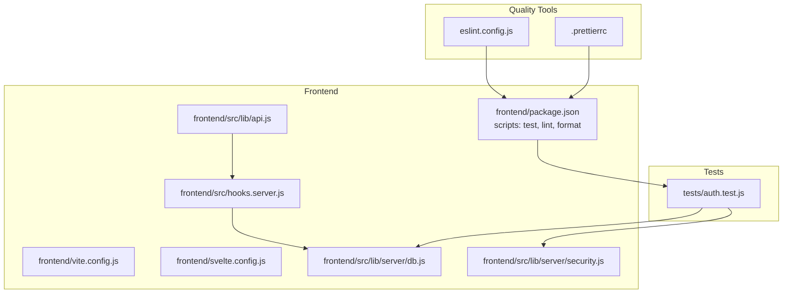
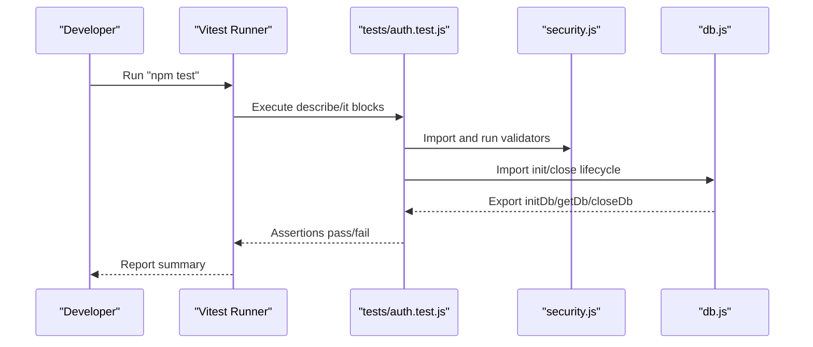
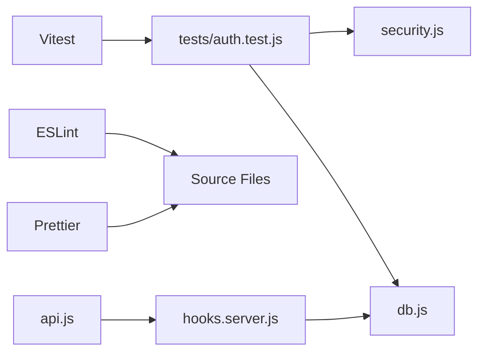

# Testing & Code Quality

<cite>
**Referenced Files in This Document**
- [frontend/package.json](file://frontend/package.json)
- [eslint.config.js](file://eslint.config.js)
- [frontend/.prettierrc](file://frontend/.prettierrc)
- [tests/auth.test.js](file://tests/auth.test.js)
- [frontend/vite.config.js](file://frontend/vite.config.js)
- [frontend/svelte.config.js](file://frontend/svelte.config.js)
- [frontend/src/lib/api.js](file://frontend/src/lib/api.js)
- [frontend/src/hooks.server.js](file://frontend/src/hooks.server.js)
- [frontend/src/lib/server/db.js](file://frontend/src/lib/server/db.js)
- [frontend/src/lib/server/security.js](file://frontend/src/lib/server/security.js)
</cite>

## Table of Contents
1. [Introduction](#introduction)
2. [Project Structure](#project-structure)
3. [Core Components](#core-components)
4. [Architecture Overview](#architecture-overview)
5. [Detailed Component Analysis](#detailed-component-analysis)
6. [Dependency Analysis](#dependency-analysis)
7. [Performance Considerations](#performance-considerations)
8. [Troubleshooting Guide](#troubleshooting-guide)
9. [Conclusion](#conclusion)
10. [Appendices](#appendices)

## Introduction
This document describes VSocial’s testing strategy and code quality practices. It covers unit testing with Vitest, test organization patterns, mocking strategies, and the enforcement of code quality via ESLint and Prettier. It also outlines best practices for testing Svelte components, API endpoints, and database operations, along with practical examples, continuous integration considerations, and code coverage measurement. Additional guidance is provided for performance, security, and accessibility testing, as well as debugging and troubleshooting methodologies.

## Project Structure
The testing and quality tooling spans several areas:
- Frontend build and test scripts are defined in the frontend package manifest.
- Linting and formatting are configured via ESLint flat config and Prettier.
- Unit tests reside under the repository root tests folder and exercise server utilities and database initialization.
- SvelteKit server hooks orchestrate database initialization, cron scheduling, and global error handling.
- A centralized API client module encapsulates HTTP requests and error handling for frontend integration.

**Diagram sources**
- [frontend/package.json:1-49](file://frontend/package.json#L1-L49)
- [frontend/vite.config.js:1-14](file://frontend/vite.config.js#L1-L14)
- [frontend/svelte.config.js:1-19](file://frontend/svelte.config.js#L1-L19)
- [frontend/src/lib/api.js:1-350](file://frontend/src/lib/api.js#L1-L350)
- [frontend/src/hooks.server.js:1-179](file://frontend/src/hooks.server.js#L1-L179)
- [frontend/src/lib/server/db.js:1-209](file://frontend/src/lib/server/db.js#L1-L209)
- [frontend/src/lib/server/security.js:1-54](file://frontend/src/lib/server/security.js#L1-L54)
- [eslint.config.js:1-29](file://eslint.config.js#L1-L29)
- [frontend/.prettierrc:1-20](file://frontend/.prettierrc#L1-L20)
- [tests/auth.test.js:1-47](file://tests/auth.test.js#L1-L47)

**Section sources**
- [frontend/package.json:1-49](file://frontend/package.json#L1-L49)
- [eslint.config.js:1-29](file://eslint.config.js#L1-L29)
- [frontend/.prettierrc:1-20](file://frontend/.prettierrc#L1-L20)
- [tests/auth.test.js:1-47](file://tests/auth.test.js#L1-L47)
- [frontend/vite.config.js:1-14](file://frontend/vite.config.js#L1-L14)
- [frontend/svelte.config.js:1-19](file://frontend/svelte.config.js#L1-L19)
- [frontend/src/lib/api.js:1-350](file://frontend/src/lib/api.js#L1-L350)
- [frontend/src/hooks.server.js:1-179](file://frontend/src/hooks.server.js#L1-L179)
- [frontend/src/lib/server/db.js:1-209](file://frontend/src/lib/server/db.js#L1-L209)
- [frontend/src/lib/server/security.js:1-54](file://frontend/src/lib/server/security.js#L1-L54)

## Core Components
- Vitest-based unit tests: The repository defines test commands and includes Vitest in devDependencies. Tests currently cover security utilities and database connection lifecycle.
- ESLint flat config: Provides recommended rulesets for JS and Svelte, sets browser and Node globals, configures Svelte parser options, and ignores build artifacts.
- Prettier configuration: Enforces formatting style, integrates with Svelte and Tailwind plugins, and targets the Svelte parser for Svelte files.
- SvelteKit server hooks: Initialize the database on startup, enforce security headers, guard setup/install routes, and provide a global error handler.
- Database abstraction: A unified wrapper around two drivers (@libsql/client and better-sqlite3) exposes async prepare/run/get/all/exec and transaction semantics.
- API client: Centralized HTTP client with auth token injection, JSON parsing, and error normalization for frontend integration.

**Section sources**
- [frontend/package.json:14-16](file://frontend/package.json#L14-L16)
- [tests/auth.test.js:1-47](file://tests/auth.test.js#L1-L47)
- [eslint.config.js:1-29](file://eslint.config.js#L1-L29)
- [frontend/.prettierrc:1-20](file://frontend/.prettierrc#L1-L20)
- [frontend/src/hooks.server.js:1-179](file://frontend/src/hooks.server.js#L1-L179)
- [frontend/src/lib/server/db.js:1-209](file://frontend/src/lib/server/db.js#L1-L209)
- [frontend/src/lib/api.js:1-350](file://frontend/src/lib/api.js#L1-L350)

## Architecture Overview
The testing and quality pipeline integrates with SvelteKit’s runtime and build system. Tests rely on Vitest and can leverage mocking capabilities provided by the test framework. Linting and formatting are enforced via CLI scripts. The server hooks coordinate database initialization and global error handling, while the API client encapsulates HTTP interactions.

**Diagram sources**
- [frontend/package.json:14-16](file://frontend/package.json#L14-L16)
- [tests/auth.test.js:1-47](file://tests/auth.test.js#L1-L47)
- [frontend/src/lib/server/security.js:1-54](file://frontend/src/lib/server/security.js#L1-L54)
- [frontend/src/lib/server/db.js:1-209](file://frontend/src/lib/server/db.js#L1-L209)

## Detailed Component Analysis

### Unit Testing with Vitest
- Test commands: The frontend package defines test and watch commands for Vitest.
- Test organization: Tests are colocated under the tests directory and import server utilities and database helpers.
- Example coverage: Current tests validate security utilities and database connectivity using Vitest’s lifecycle hooks.

Practical example references:
- Security utilities tests: [tests/auth.test.js:5-25](file://tests/auth.test.js#L5-L25)
- Database connection tests: [tests/auth.test.js:27-46](file://tests/auth.test.js#L27-L46)

Mocking strategies:
- Use Vitest spies and mocks to isolate external dependencies (e.g., database client, network calls).
- For database operations, mock the unified wrapper returned by getDb to simulate success/failure scenarios.
- For API endpoints, mock the centralized API client to simulate HTTP responses and errors.

Best practices:
- Keep tests focused and deterministic; use beforeEach/beforeAll/afterEach/afterAll to manage state.
- Prefer small, descriptive assertions and avoid testing implementation details; focus on observable behavior.
- Use Vitest’s built-in matchers and utilities to assert equality, exceptions, and timing.

**Section sources**
- [frontend/package.json:14-16](file://frontend/package.json#L14-L16)
- [tests/auth.test.js:1-47](file://tests/auth.test.js#L1-L47)

### Code Quality Tools: ESLint and Prettier
- ESLint configuration:
  - Uses flat config with recommended base and Svelte plugin configurations.
  - Enables browser and Node globals.
  - Configures Svelte parser for Svelte files.
  - Ignores build and node_modules directories.
- Prettier configuration:
  - Uses tabs, single quotes, no trailing commas, width 100.
  - Integrates Svelte and Tailwind plugins.
  - Applies Svelte parser to Svelte files and references a Tailwind stylesheet.

Usage:
- Linting: npm run lint
- Formatting: npm run format

**Section sources**
- [eslint.config.js:1-29](file://eslint.config.js#L1-L29)
- [frontend/.prettierrc:1-20](file://frontend/.prettierrc#L1-L20)
- [frontend/package.json:12-13](file://frontend/package.json#L12-L13)

### Svelte Components Testing Best Practices
- Use Testing Library for Svelte to render components and assert DOM behavior.
- Mock stores and server functions imported by components.
- Test user interactions and state transitions; avoid testing private implementation details.
- For component lifecycle and hydration, test in isolation with minimal props.

[No sources needed since this section provides general guidance]

### API Endpoints Testing Best Practices
- Endpoint tests should validate request parsing, authorization, rate limiting, and error handling.
- Use supertest-style HTTP assertions to verify status codes, headers, and response bodies.
- Simulate database failures and network errors to ensure robust error handling.
- For SvelteKit endpoints, test both GET and POST handlers, including file uploads.

[No sources needed since this section provides general guidance]

### Database Operations Testing Best Practices
- Use a separate test database or in-memory mode to avoid affecting production data.
- Wrap tests in transactions and roll them back to keep state clean.
- Validate SQL correctness and error propagation by asserting thrown errors and logged messages.
- Test both drivers (@libsql/client and better-sqlite3) if feasible, or at least simulate driver behavior.

**Section sources**
- [frontend/src/lib/server/db.js:1-209](file://frontend/src/lib/server/db.js#L1-L209)

### Continuous Integration and Code Coverage
- CI setup: Configure GitHub Actions or similar to run npm ci, lint, format checks, and tests on pull requests and pushes.
- Code coverage: Integrate a coverage reporter with Vitest to measure statement, branch, function, and line coverage. Publish coverage reports to a service if desired.
- Pre-commit hooks: Use Husky with lint-staged to run linters and formatters on staged files before commits.

[No sources needed since this section provides general guidance]

### Security Testing Considerations
- Input validation and sanitization: Verify that invalid inputs are rejected and sanitized appropriately.
- Rate limiting: Test that repeated requests trigger rate limit responses.
- Authentication and authorization: Ensure protected endpoints require valid tokens and enforce permissions.
- Content Security Policy: Confirm security headers are set in server hooks.

**Section sources**
- [frontend/src/lib/server/security.js:1-54](file://frontend/src/lib/server/security.js#L1-L54)
- [frontend/src/hooks.server.js:105-147](file://frontend/src/hooks.server.js#L105-L147)

### Accessibility Testing Approaches
- Use axe-core or similar tools to scan rendered pages and components for accessibility violations.
- Automate checks in CI using headless browser testing.
- Review color contrast, semantic markup, keyboard navigation, and screen reader compatibility.

[No sources needed since this section provides general guidance]

### Debugging Techniques and Troubleshooting Methodology
- Server-side errors: The global error handler logs structured errors and returns generic messages to clients. Inspect logs for stack traces and request metadata.
- Database initialization: Ensure initDb runs during server startup and that environment variables are set correctly.
- API client errors: Normalize HTTP errors into JavaScript Error objects with status/data for easier handling.
- Local development: Use Vite’s dev server and Vitest watch mode to iterate quickly on tests and fixes.

**Section sources**
- [frontend/src/hooks.server.js:154-178](file://frontend/src/hooks.server.js#L154-L178)
- [frontend/src/lib/server/db.js:117-167](file://frontend/src/lib/server/db.js#L117-L167)
- [frontend/src/lib/api.js:20-46](file://frontend/src/lib/api.js#L20-L46)

## Dependency Analysis
The testing and quality toolchain depends on:
- Vitest for unit testing and mocking.
- ESLint and Prettier for code quality enforcement.
- SvelteKit server hooks for runtime behavior and error handling.
- The database abstraction for consistent data access across drivers.

**Diagram sources**
- [tests/auth.test.js:1-47](file://tests/auth.test.js#L1-L47)
- [frontend/src/lib/server/security.js:1-54](file://frontend/src/lib/server/security.js#L1-L54)
- [frontend/src/lib/server/db.js:1-209](file://frontend/src/lib/server/db.js#L1-L209)
- [frontend/src/hooks.server.js:1-179](file://frontend/src/hooks.server.js#L1-L179)
- [frontend/src/lib/api.js:1-350](file://frontend/src/lib/api.js#L1-L350)

**Section sources**
- [tests/auth.test.js:1-47](file://tests/auth.test.js#L1-L47)
- [frontend/src/lib/server/security.js:1-54](file://frontend/src/lib/server/security.js#L1-L54)
- [frontend/src/lib/server/db.js:1-209](file://frontend/src/lib/server/db.js#L1-L209)
- [frontend/src/hooks.server.js:1-179](file://frontend/src/hooks.server.js#L1-L179)
- [frontend/src/lib/api.js:1-350](file://frontend/src/lib/api.js#L1-L350)

## Performance Considerations
- Measure endpoint latency and throughput using Vitest benchmarks or external tools.
- Profile database queries and optimize slow statements; prefer prepared statements and indexes.
- Minimize unnecessary computations in server hooks and reduce synchronous I/O.

[No sources needed since this section provides general guidance]

## Troubleshooting Guide
Common issues and resolutions:
- Database not initialized: Ensure initDb is called during server startup and environment variables are present.
- Rate limit exceeded: Adjust rate limit thresholds or reset identifiers in tests.
- API errors: Inspect normalized error objects for status and data fields.
- Formatting/linting failures: Run npm run format and npm run lint to auto-fix and validate.

**Section sources**
- [frontend/src/lib/server/db.js:117-167](file://frontend/src/lib/server/db.js#L117-L167)
- [frontend/src/lib/server/security.js:12-33](file://frontend/src/lib/server/security.js#L12-L33)
- [frontend/src/lib/api.js:38-46](file://frontend/src/lib/api.js#L38-L46)
- [frontend/package.json:12-13](file://frontend/package.json#L12-L13)

## Conclusion
VSocial’s testing and code quality practices center on Vitest for unit tests, ESLint and Prettier for consistent code standards, and SvelteKit server hooks for runtime reliability. By following the outlined patterns—clear test organization, mocking strategies, and robust error handling—you can maintain high-quality, reliable code. Extending coverage to Svelte components, API endpoints, and database operations will further strengthen the system’s stability and maintainability.

[No sources needed since this section summarizes without analyzing specific files]

## Appendices
- Example test references:
  - Security utilities: [tests/auth.test.js:5-25](file://tests/auth.test.js#L5-L25)
  - Database lifecycle: [tests/auth.test.js:27-46](file://tests/auth.test.js#L27-L46)
- API client usage patterns:
  - Request wrapper and helpers: [frontend/src/lib/api.js:20-56](file://frontend/src/lib/api.js#L20-L56)
  - Auth endpoints: [frontend/src/lib/api.js:79-85](file://frontend/src/lib/api.js#L79-L85)
  - Feed endpoints: [frontend/src/lib/api.js:90-103](file://frontend/src/lib/api.js#L90-L103)
  - Posts endpoints: [frontend/src/lib/api.js:108-131](file://frontend/src/lib/api.js#L108-L131)
  - Users endpoints: [frontend/src/lib/api.js:136-164](file://frontend/src/lib/api.js#L136-L164)
  - Stories endpoints: [frontend/src/lib/api.js:169-174](file://frontend/src/lib/api.js#L169-L174)
  - Reels endpoints: [frontend/src/lib/api.js:179-197](file://frontend/src/lib/api.js#L179-L197)
  - Messages endpoints: [frontend/src/lib/api.js:202-217](file://frontend/src/lib/api.js#L202-L217)
  - Marketplace endpoints: [frontend/src/lib/api.js:222-238](file://frontend/src/lib/api.js#L222-L238)
  - Notifications endpoints: [frontend/src/lib/api.js:243-250](file://frontend/src/lib/api.js#L243-L250)
  - Admin endpoints: [frontend/src/lib/api.js:255-287](file://frontend/src/lib/api.js#L255-L287)
  - Wallet endpoints: [frontend/src/lib/api.js:292-302](file://frontend/src/lib/api.js#L292-L302)
  - Gigs endpoints: [frontend/src/lib/api.js:307-319](file://frontend/src/lib/api.js#L307-L319)
  - Search endpoints: [frontend/src/lib/api.js:324-330](file://frontend/src/lib/api.js#L324-L330)
  - Market endpoints: [frontend/src/lib/api.js:335-342](file://frontend/src/lib/api.js#L335-L342)
  - Health endpoint: [frontend/src/lib/api.js:347](file://frontend/src/lib/api.js#L347)

**Section sources**
- [tests/auth.test.js:1-47](file://tests/auth.test.js#L1-L47)
- [frontend/src/lib/api.js:1-350](file://frontend/src/lib/api.js#L1-L350)