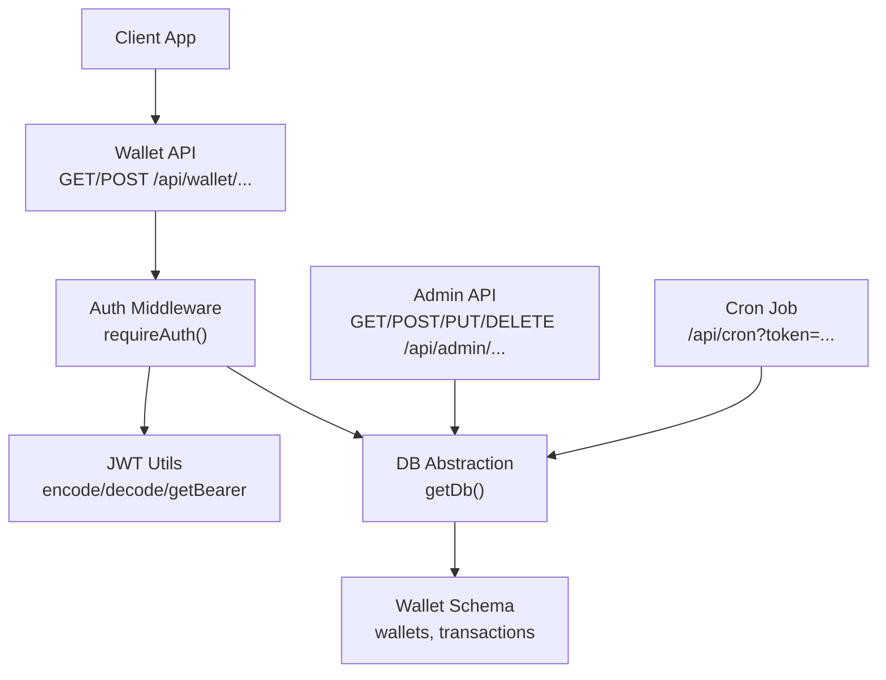
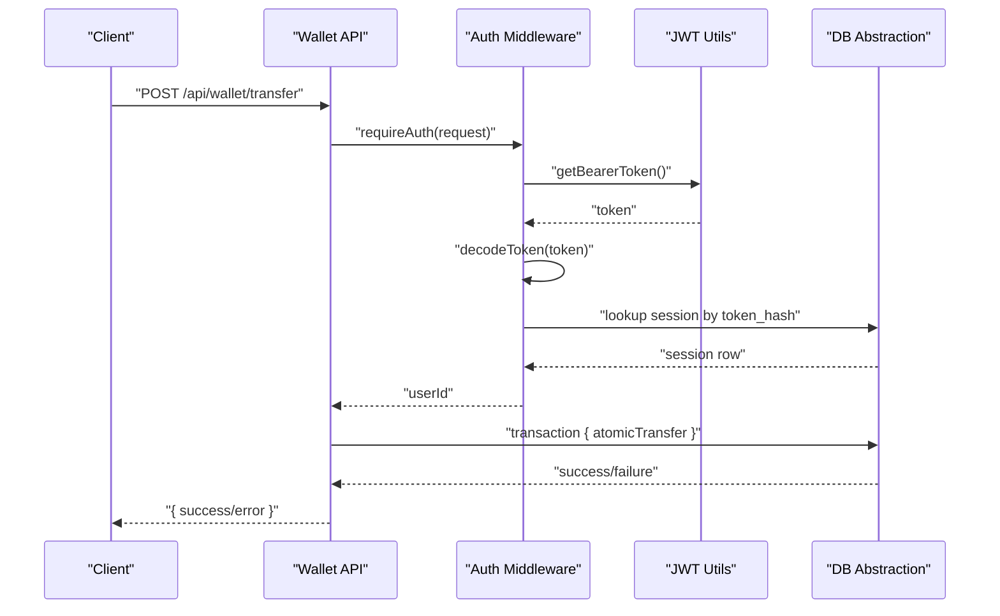
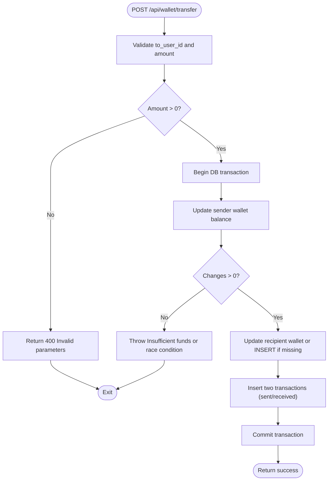
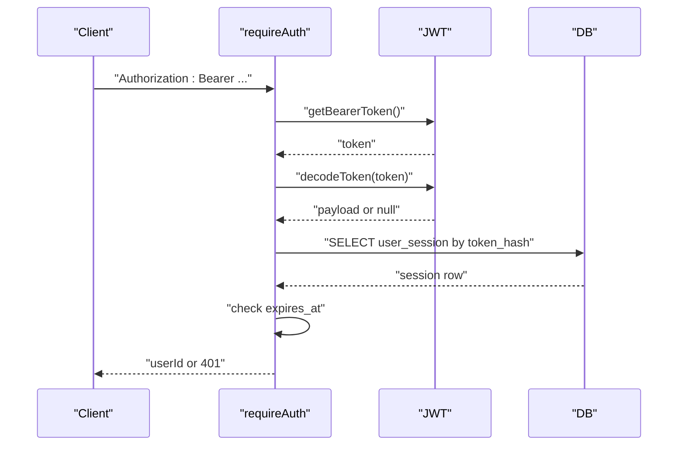
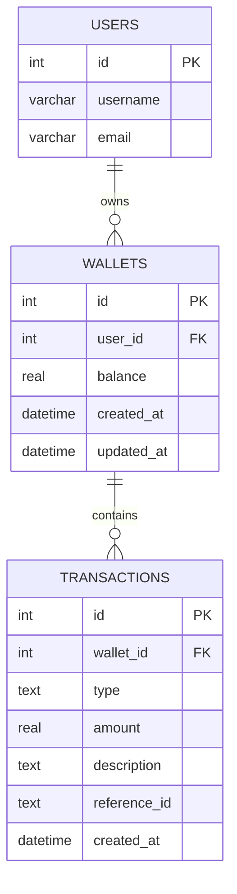
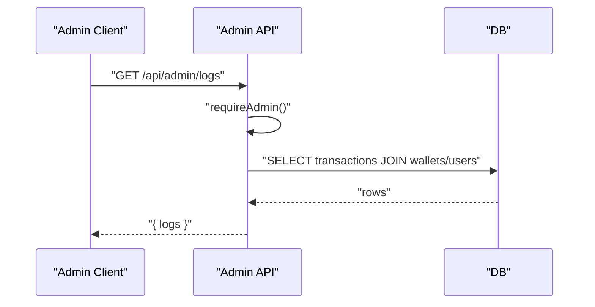
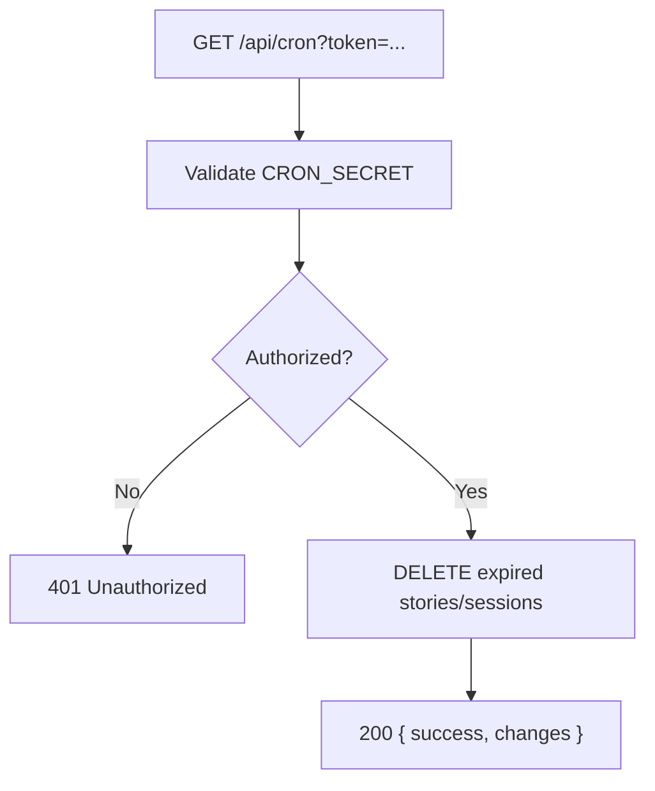
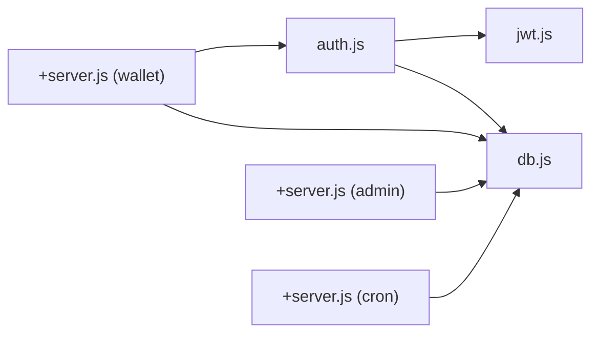

# Financial Security & Compliance

<cite>
**Referenced Files in This Document**
- [wallet +server.js](file://frontend/src/routes/api/wallet/[...path]/+server.js)
- [auth.js](file://frontend/src/lib/server/auth.js)
- [jwt.js](file://frontend/src/lib/server/jwt.js)
- [db.js](file://frontend/src/lib/server/db.js)
- [schema_sqlite.sql](file://schema_sqlite.sql)
- [001_schema.sql](file://migrations/001_schema.sql)
- [+server.js (admin)](file://frontend/src/routes/api/admin/[...path]/+server.js)
- [+server.js (cron)](file://frontend/src/routes/api/cron/+server.js)
</cite>

## Table of Contents
1. [Introduction](#introduction)
2. [Project Structure](#project-structure)
3. [Core Components](#core-components)
4. [Architecture Overview](#architecture-overview)
5. [Detailed Component Analysis](#detailed-component-analysis)
6. [Dependency Analysis](#dependency-analysis)
7. [Performance Considerations](#performance-considerations)
8. [Security Measures](#security-measures)
9. [Regulatory Compliance](#regulatory-compliance)
10. [Data Retention & Audit Trails](#data-retention--audit-trails)
11. [Backup & Disaster Recovery](#backup--disaster-recovery)
12. [Troubleshooting Guide](#troubleshooting-guide)
13. [Conclusion](#conclusion)

## Introduction
This document details the financial security and regulatory compliance posture for VSocial’s wallet system. It covers fraud prevention, transaction monitoring, user verification, financial data protection, secure API endpoints, KYC/AML alignment, audit trails, data retention, and disaster recovery. The analysis is grounded in the repository’s wallet API, authentication, database schema, and administrative controls.

## Project Structure
The wallet system is implemented as a SvelteKit server route backed by a database abstraction layer. Authentication relies on JWT with bearer tokens and server-side session storage. Administrative dashboards and maintenance tasks (e.g., cron cleanup) complement operational controls.

**Diagram sources**
- [wallet +server.js:1-113](file://frontend/src/routes/api/wallet/[...path]/+server.js#L1-L113)
- [auth.js:15-44](file://frontend/src/lib/server/auth.js#L15-L44)
- [jwt.js:19-42](file://frontend/src/lib/server/jwt.js#L19-L42)
- [db.js:169-172](file://frontend/src/lib/server/db.js#L169-L172)
- [schema_sqlite.sql:344-371](file://schema_sqlite.sql#L344-L371)
- [+server.js (admin):1-260](file://frontend/src/routes/api/admin/[...path]/+server.js#L1-L260)
- [+server.js (cron):1-32](file://frontend/src/routes/api/cron/+server.js#L1-L32)

**Section sources**
- [wallet +server.js:1-113](file://frontend/src/routes/api/wallet/[...path]/+server.js#L1-L113)
- [auth.js:1-92](file://frontend/src/lib/server/auth.js#L1-L92)
- [jwt.js:1-45](file://frontend/src/lib/server/jwt.js#L1-L45)
- [db.js:1-209](file://frontend/src/lib/server/db.js#L1-L209)
- [schema_sqlite.sql:344-371](file://schema_sqlite.sql#L344-L371)
- [+server.js (admin):1-260](file://frontend/src/routes/api/admin/[...path]/+server.js#L1-L260)
- [+server.js (cron):1-32](file://frontend/src/routes/api/cron/+server.js#L1-L32)

## Core Components
- Wallet API: Provides balance retrieval, transaction history, transfers, tips, deposits, and withdrawals. Atomic transfer logic ensures consistency and prevents race conditions.
- Authentication: Enforces bearer token authentication, validates sessions against the database, and supports admin checks.
- JWT Utilities: Encodes/decodes tokens and extracts Bearer tokens from headers.
- Database Abstraction: Unified async interface supporting @libsql/client and better-sqlite3 with transaction support and PRAGMAs for durability.
- Schema: Defines wallet and transaction tables with indexes and constraints.
- Admin API: Offers dashboard stats, user management, content moderation, and transaction logs.
- Cron: Periodic cleanup of expired stories and sessions.

**Section sources**
- [wallet +server.js:8-30](file://frontend/src/routes/api/wallet/[...path]/+server.js#L8-L30)
- [auth.js:15-44](file://frontend/src/lib/server/auth.js#L15-L44)
- [jwt.js:19-42](file://frontend/src/lib/server/jwt.js#L19-L42)
- [db.js:31-113](file://frontend/src/lib/server/db.js#L31-L113)
- [schema_sqlite.sql:344-371](file://schema_sqlite.sql#L344-L371)
- [+server.js (admin):14-124](file://frontend/src/routes/api/admin/[...path]/+server.js#L14-L124)
- [+server.js (cron):5-31](file://frontend/src/routes/api/cron/+server.js#L5-L31)

## Architecture Overview
The wallet API is protected by middleware requiring a valid, non-expired session token stored in the database. Transactions are executed atomically within a database transaction block to maintain ACID properties. Administrative controls and cron jobs support ongoing operations and hygiene.

**Diagram sources**
- [wallet +server.js:55-81](file://frontend/src/routes/api/wallet/[...path]/+server.js#L55-L81)
- [auth.js:15-44](file://frontend/src/lib/server/auth.js#L15-L44)
- [jwt.js:37-42](file://frontend/src/lib/server/jwt.js#L37-L42)
- [db.js:60-73](file://frontend/src/lib/server/db.js#L60-L73)

## Detailed Component Analysis

### Wallet API: Atomic Transfers and Transaction Logging
- Atomic transfer function executes sender deduction and recipient credit/update within a single transaction block, preventing partial writes and race conditions.
- Transaction records capture type, amount, description, and reference identifiers for auditability.
- Deposit and withdrawal operations enforce amount limits and update balances atomically while logging entries.

**Diagram sources**
- [wallet +server.js:8-30](file://frontend/src/routes/api/wallet/[...path]/+server.js#L8-L30)
- [wallet +server.js:62-81](file://frontend/src/routes/api/wallet/[...path]/+server.js#L62-L81)

**Section sources**
- [wallet +server.js:8-30](file://frontend/src/routes/api/wallet/[...path]/+server.js#L8-L30)
- [wallet +server.js:62-109](file://frontend/src/routes/api/wallet/[...path]/+server.js#L62-L109)

### Authentication and Session Management
- requireAuth extracts the Bearer token, decodes it, hashes it, and validates against stored sessions with expiration checks.
- Sessions include IP address and user agent for risk assessment and revocation capability.
- createSession generates a JWT, hashes it, and persists metadata with a fixed expiry.

**Diagram sources**
- [auth.js:15-44](file://frontend/src/lib/server/auth.js#L15-L44)
- [jwt.js:37-42](file://frontend/src/lib/server/jwt.js#L37-L42)
- [db.js:169-172](file://frontend/src/lib/server/db.js#L169-L172)

**Section sources**
- [auth.js:15-74](file://frontend/src/lib/server/auth.js#L15-L74)
- [jwt.js:19-42](file://frontend/src/lib/server/jwt.js#L19-L42)
- [db.js:60-73](file://frontend/src/lib/server/db.js#L60-L73)

### Database Schema for Wallets and Transactions
- Wallets table maintains per-user balances with timestamps.
- Transactions table captures all wallet movements with types, amounts, descriptions, and optional references.
- Indexes on user_id and created_at improve query performance for transaction lists.

**Diagram sources**
- [schema_sqlite.sql:355-371](file://schema_sqlite.sql#L355-L371)

**Section sources**
- [schema_sqlite.sql:355-371](file://schema_sqlite.sql#L355-L371)

### Admin Controls and Logs
- Admin API exposes endpoints for dashboard metrics, user management, content moderation, system settings, transaction logs, and recent activity.
- Logs endpoint queries recent wallet transactions with user context for oversight.

**Diagram sources**
- [+server.js (admin):106-114](file://frontend/src/routes/api/admin/[...path]/+server.js#L106-L114)

**Section sources**
- [+server.js (admin):106-114](file://frontend/src/routes/api/admin/[...path]/+server.js#L106-L114)

### Cron Maintenance
- Cron endpoint enforces authorization via a shared secret and performs periodic cleanup of expired stories and sessions.

**Diagram sources**
- [+server.js (cron):5-31](file://frontend/src/routes/api/cron/+server.js#L5-L31)

**Section sources**
- [+server.js (cron):5-31](file://frontend/src/routes/api/cron/+server.js#L5-L31)

## Dependency Analysis
- Wallet API depends on authentication middleware and database abstraction.
- Authentication depends on JWT utilities and database sessions.
- Database abstraction supports both @libsql/client and better-sqlite3 with identical async API.
- Admin API and cron rely on the same database abstraction.

**Diagram sources**
- [wallet +server.js:4-6](file://frontend/src/routes/api/wallet/[...path]/+server.js#L4-L6)
- [auth.js:6-7](file://frontend/src/lib/server/auth.js#L6-L7)
- [jwt.js:5-6](file://frontend/src/lib/server/jwt.js#L5-L6)
- [db.js:9-14](file://frontend/src/lib/server/db.js#L9-L14)
- [+server.js (admin):4-6](file://frontend/src/routes/api/admin/[...path]/+server.js#L4-L6)
- [+server.js (cron):3-3](file://frontend/src/routes/api/cron/+server.js#L3-L3)

**Section sources**
- [wallet +server.js:4-6](file://frontend/src/routes/api/wallet/[...path]/+server.js#L4-L6)
- [auth.js:6-7](file://frontend/src/lib/server/auth.js#L6-L7)
- [jwt.js:5-6](file://frontend/src/lib/server/jwt.js#L5-L6)
- [db.js:9-14](file://frontend/src/lib/server/db.js#L9-L14)
- [+server.js (admin):4-6](file://frontend/src/routes/api/admin/[...path]/+server.js#L4-L6)
- [+server.js (cron):3-3](file://frontend/src/routes/api/cron/+server.js#L3-L3)

## Performance Considerations
- WAL mode and PRAGMAs are configured for durability and concurrency.
- Indexes on user_id and created_at optimize transaction queries.
- Transactions are executed atomically to avoid partial failures and reduce retries.
- Admin dashboard and logs queries use LIMIT clauses to bound result sets.

[No sources needed since this section provides general guidance]

## Security Measures
- Authentication and Authorization
  - Bearer token extraction and verification occur in middleware; sessions are stored hashed and expire after a fixed period.
  - Admin endpoints enforce elevated privileges before allowing sensitive actions.
- Secure API Endpoints
  - All financial operations are guarded by requireAuth; unauthorized requests receive 401 responses.
  - Admin endpoints require admin-level roles.
- Financial Data Protection
  - Wallet balances and transaction records are persisted in the database; no plaintext sensitive data is exposed in API responses beyond minimal context.
  - Session metadata (IP, user agent) is stored to aid forensic analysis and revocation.
- Encryption
  - No encryption-at-rest or encryption-in-transit logic is present in the wallet or auth modules. Transport security should be enforced by deployment (e.g., TLS termination at reverse proxy/load balancer).
- Least Privilege and Separation of Duties
  - Admin actions are separated from user-facing endpoints; dedicated admin routes manage users, content, and settings.
- Auditability
  - Transaction logs and session records enable reconstruction of user activity timelines.

**Section sources**
- [auth.js:15-44](file://frontend/src/lib/server/auth.js#L15-L44)
- [auth.js:79-89](file://frontend/src/lib/server/auth.js#L79-L89)
- [wallet +server.js:32-53](file://frontend/src/routes/api/wallet/[...path]/+server.js#L32-L53)
- [+server.js (admin):8-126](file://frontend/src/routes/api/admin/[...path]/+server.js#L8-L126)
- [db.js:124-133](file://frontend/src/lib/server/db.js#L124-L133)
- [schema_sqlite.sql:355-371](file://schema_sqlite.sql#L355-L371)

## Regulatory Compliance
- KYC/AML Alignment
  - The schema includes a verified flag on users and admin controls for banning/unbanning users. While explicit KYC fields are not present in the wallet domain, the platform supports user verification and role-based restrictions suitable for KYC/AML frameworks.
- Transaction Reporting
  - Transaction logs are available via the Admin API for oversight and potential reporting to compliance teams.
- Audit Trail Preservation
  - Wallet and transaction tables preserve creation timestamps and user references, enabling audit reconstruction.
- Data Retention
  - The schema does not define automatic retention policies; administrators can manage retention via database maintenance and archival strategies.

**Section sources**
- [schema_sqlite.sql:13-48](file://schema_sqlite.sql#L13-L48)
- [schema_sqlite.sql:344-371](file://schema_sqlite.sql#L344-L371)
- [+server.js (admin):106-114](file://frontend/src/routes/api/admin/[...path]/+server.js#L106-L114)

## Data Retention & Audit Trails
- Retention Policies
  - No automated retention policies are defined in the schema or code. Administrators can implement retention via external scripts or database maintenance tasks.
- Audit Trails
  - Wallet and transaction tables include created_at timestamps and user references. Admin logs endpoint surfaces recent transactions for review.

**Section sources**
- [schema_sqlite.sql:344-371](file://schema_sqlite.sql#L344-L371)
- [+server.js (admin):106-114](file://frontend/src/routes/api/admin/[...path]/+server.js#L106-L114)

## Backup & Disaster Recovery
- Database Initialization and Durability
  - The database abstraction enables WAL mode and PRAGMAs for improved durability and concurrency. Local deployments benefit from WAL; remote deployments rely on driver defaults.
- Recommendations
  - Schedule regular backups of the SQLite/WAL database file and maintain offsite copies.
  - Test restoration procedures periodically and validate transaction log integrity post-restore.

**Section sources**
- [db.js:124-133](file://frontend/src/lib/server/db.js#L124-L133)
- [db.js:148-153](file://frontend/src/lib/server/db.js#L148-L153)

## Troubleshooting Guide
- 401 Unauthorized on Wallet Calls
  - Verify Authorization header contains a valid Bearer token; ensure the token is not expired and corresponds to an existing, non-expired session.
- Insufficient Funds or Race Condition
  - The atomic transfer throws an error when the sender lacks sufficient balance or a concurrent update occurs; retry after verifying balance.
- Admin Access Denied
  - Confirm the requester has admin or super_admin role; otherwise, 403 is returned.
- Cron Unauthorized
  - Ensure the CRON_SECRET environment variable matches the token parameter or Authorization header.

**Section sources**
- [auth.js:15-44](file://frontend/src/lib/server/auth.js#L15-L44)
- [wallet +server.js:8-30](file://frontend/src/routes/api/wallet/[...path]/+server.js#L8-L30)
- [wallet +server.js:55-111](file://frontend/src/routes/api/wallet/[...path]/+server.js#L55-L111)
- [+server.js (admin):79-89](file://frontend/src/routes/api/admin/[...path]/+server.js#L79-L89)
- [+server.js (cron):5-13](file://frontend/src/routes/api/cron/+server.js#L5-L13)

## Conclusion
VSocial’s wallet system employs robust authentication, atomic transaction logic, and administrative oversight to safeguard financial operations. While explicit KYC/AML fields and encryption-at-rest are not present, the platform’s session management, audit-ready tables, and admin controls provide a strong foundation for compliance. Administrators should implement retention policies, encryption-in-transit at the deployment boundary, and disaster recovery procedures to meet financial service standards.