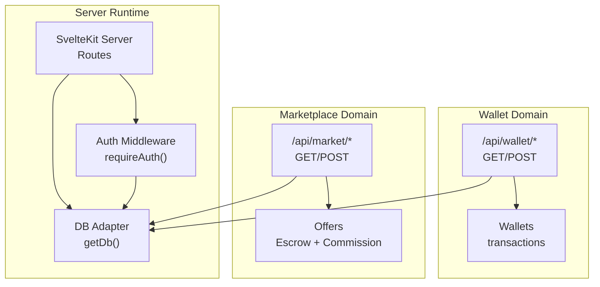
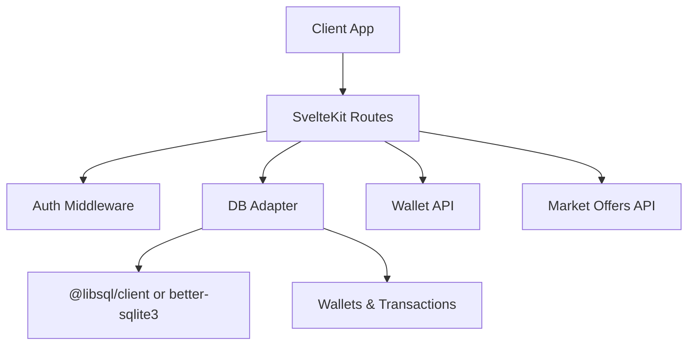
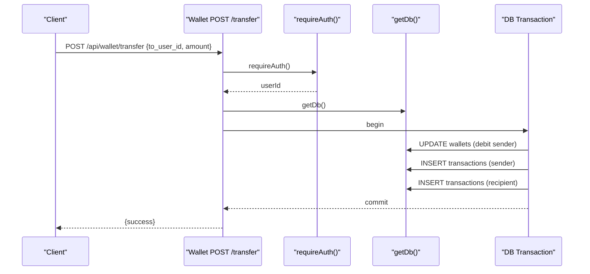
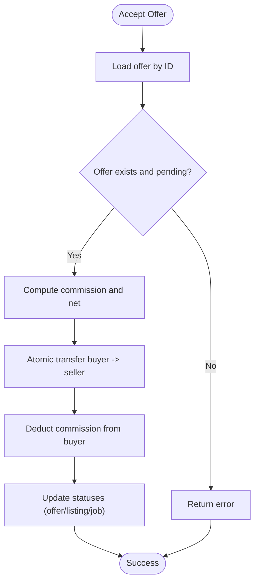
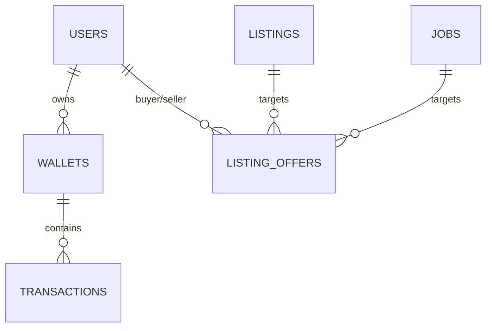
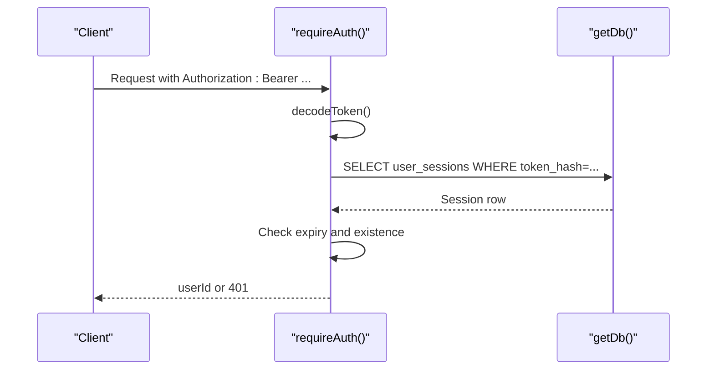
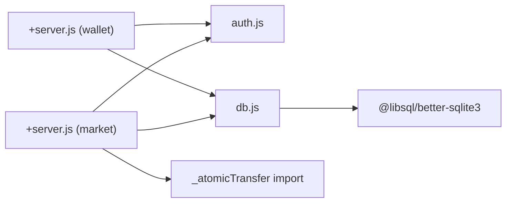

# Payment Integration

<cite>
**Referenced Files in This Document**
- [wallet +server.js](file://frontend/src/routes/api/wallet/[...path]/+server.js)
- [market +server.js](file://frontend/src/routes/api/market/[...path]/+server.js)
- [db.js](file://frontend/src/lib/server/db.js)
- [auth.js](file://frontend/src/lib/server/auth.js)
- [jwt.js](file://frontend/src/lib/server/jwt.js)
- [schema_sqlite.sql](file://schema_sqlite.sql)
- [001_schema.sql](file://migrations/001_schema.sql)
- [002_phase2.sql](file://migrations/002_phase2.sql)
- [cron +server.js](file://frontend/src/routes/api/cron/+server.js)
</cite>

## Table of Contents
1. [Introduction](#introduction)
2. [Project Structure](#project-structure)
3. [Core Components](#core-components)
4. [Architecture Overview](#architecture-overview)
5. [Detailed Component Analysis](#detailed-component-analysis)
6. [Dependency Analysis](#dependency-analysis)
7. [Performance Considerations](#performance-considerations)
8. [Troubleshooting Guide](#troubleshooting-guide)
9. [Conclusion](#conclusion)
10. [Appendices](#appendices)

## Introduction
This document describes the payment integration and external processor connectivity for the platform. It focuses on the internal wallet and transfer mechanisms, outlines how to integrate external payment processors, and documents configuration, endpoints, callbacks, security, and operational workflows such as refunds, chargebacks, disputes, and webhooks.

Key capabilities currently present:
- Internal wallet and transaction ledger
- Peer-to-peer transfers and tips
- Deposit and withdrawal flows
- Marketplace offers with escrow-like mechanics and platform commission
- Atomic transfers and database transactions
- Authentication and authorization for protected endpoints

What is missing in the current codebase:
- External payment gateway integration (e.g., Stripe, Adyen)
- Webhook handlers for payment status updates
- Refund, chargeback, and dispute workflows
- PCI compliance safeguards for card data
- Retry mechanisms for payment failures

## Project Structure
The payment-related logic is primarily implemented in the wallet API and the marketplace offers API, backed by a shared database adapter and authentication middleware.

**Diagram sources**
- [wallet +server.js:32-111](file://frontend/src/routes/api/wallet/[...path]/+server.js#L32-L111)
- [market +server.js:53-133](file://frontend/src/routes/api/market/[...path]/+server.js#L53-L133)
- [db.js:169-172](file://frontend/src/lib/server/db.js#L169-L172)
- [auth.js:15-44](file://frontend/src/lib/server/auth.js#L15-L44)

**Section sources**
- [wallet +server.js:1-113](file://frontend/src/routes/api/wallet/[...path]/+server.js#L1-L113)
- [market +server.js:1-134](file://frontend/src/routes/api/market/[...path]/+server.js#L1-L134)
- [db.js:1-209](file://frontend/src/lib/server/db.js#L1-L209)
- [auth.js:1-92](file://frontend/src/lib/server/auth.js#L1-L92)

## Core Components
- Wallet API: Provides endpoints for retrieving balances, transaction history, peer-to-peer transfers, tips, deposits, and withdrawals. Uses atomic database transactions to maintain consistency.
- Marketplace Offers API: Implements offer submission and acceptance with an internal transfer mechanism and a platform commission recorded in the transaction ledger.
- Database Adapter: Wraps either a remote libSQL client or a local SQLite driver behind a unified async API and supports transactions.
- Authentication: Enforces bearer token-based authentication and validates sessions against the database.

**Section sources**
- [wallet +server.js:8-30](file://frontend/src/routes/api/wallet/[...path]/+server.js#L8-L30)
- [wallet +server.js:32-111](file://frontend/src/routes/api/wallet/[...path]/+server.js#L32-L111)
- [market +server.js:90-124](file://frontend/src/routes/api/market/[...path]/+server.js#L90-L124)
- [db.js:31-113](file://frontend/src/lib/server/db.js#L31-L113)
- [auth.js:15-44](file://frontend/src/lib/server/auth.js#L15-L44)

## Architecture Overview
The system uses a layered approach:
- Presentation: SvelteKit route handlers under /api
- Application: Route handlers orchestrate business logic and call the DB adapter
- Persistence: Unified DB adapter supporting transactions and two drivers

**Diagram sources**
- [wallet +server.js:55-111](file://frontend/src/routes/api/wallet/[...path]/+server.js#L55-L111)
- [market +server.js:53-133](file://frontend/src/routes/api/market/[...path]/+server.js#L53-L133)
- [db.js:117-167](file://frontend/src/lib/server/db.js#L117-L167)
- [schema_sqlite.sql:355-371](file://schema_sqlite.sql#L355-L371)

## Detailed Component Analysis

### Wallet API
Endpoints and behaviors:
- GET /api/wallet
  - Returns current user’s wallet balance and recent transactions
  - Pagination supported via page and limit query parameters
- POST /api/wallet/transfer
  - Transfers funds between users atomically
  - Validates amount and non-negative balance
- POST /api/wallet/tip
  - Sends a tip to another user with self-transfer prevention
- POST /api/wallet/deposit
  - Credits user wallet up to configured limits
- POST /api/wallet/withdraw
  - Deducts from user wallet with sufficient balance checks

Atomic transfer logic:
- Uses a database transaction to debit the sender and credit the recipient
- Inserts mirrored transaction records for both parties with a reference identifier
- Ensures race conditions are mitigated by checking balance prior to update

**Diagram sources**
- [wallet +server.js:62-70](file://frontend/src/routes/api/wallet/[...path]/+server.js#L62-L70)
- [wallet +server.js:8-30](file://frontend/src/routes/api/wallet/[...path]/+server.js#L8-L30)
- [auth.js:15-44](file://frontend/src/lib/server/auth.js#L15-L44)
- [db.js:60-72](file://frontend/src/lib/server/db.js#L60-L72)

**Section sources**
- [wallet +server.js:32-111](file://frontend/src/routes/api/wallet/[...path]/+server.js#L32-L111)
- [wallet +server.js:8-30](file://frontend/src/routes/api/wallet/[...path]/+server.js#L8-L30)

### Marketplace Offers API
Offer lifecycle:
- Submit offer: Validates item ownership, amount, and user balance
- Accept offer: Performs an atomic transfer from buyer to seller minus platform commission
- Reject offer: Updates offer status to rejected

**Diagram sources**
- [market +server.js:90-124](file://frontend/src/routes/api/market/[...path]/+server.js#L90-L124)

**Section sources**
- [market +server.js:53-133](file://frontend/src/routes/api/market/[...path]/+server.js#L53-L133)

### Database Model for Payments
Tables involved:
- wallets: per-user balance and timestamps
- transactions: transaction records linked to wallets
- wallet_transactions: alternative transaction table (schema variant)
- listing_offers: marketplace offers with amounts and statuses

**Diagram sources**
- [schema_sqlite.sql:355-371](file://schema_sqlite.sql#L355-L371)
- [001_schema.sql:364-402](file://migrations/001_schema.sql#L364-L402)
- [002_phase2.sql:266-272](file://migrations/002_phase2.sql#L266-L272)

**Section sources**
- [schema_sqlite.sql:344-371](file://schema_sqlite.sql#L344-L371)
- [001_schema.sql:394-403](file://migrations/001_schema.sql#L394-L403)
- [002_phase2.sql:266-272](file://migrations/002_phase2.sql#L266-L272)

### Authentication and Authorization
- requireAuth extracts Bearer token from Authorization header, decodes it, and validates the session against user_sessions
- Sessions include IP, user agent, and expiration
- Admin enforcement is available via requireAdmin

**Diagram sources**
- [auth.js:15-44](file://frontend/src/lib/server/auth.js#L15-L44)
- [jwt.js:37-42](file://frontend/src/lib/server/jwt.js#L37-L42)

**Section sources**
- [auth.js:15-44](file://frontend/src/lib/server/auth.js#L15-L44)
- [jwt.js:1-45](file://frontend/src/lib/server/jwt.js#L1-L45)

## Dependency Analysis
- Wallet API depends on:
  - requireAuth for protection
  - getDb for database access
  - _atomicTransfer for safe money movement
- Marketplace Offers API depends on:
  - requireAuth for protection
  - getDb for database access
  - _atomicTransfer imported from wallet API
- Database Adapter supports:
  - @libsql/client (preferred) and better-sqlite3 (fallback)
  - Transactions with rollback on errors

**Diagram sources**
- [wallet +server.js:5-6](file://frontend/src/routes/api/wallet/[...path]/+server.js#L5-L6)
- [market +server.js:6-7](file://frontend/src/routes/api/market/[...path]/+server.js#L6-L7)
- [db.js:120-167](file://frontend/src/lib/server/db.js#L120-L167)

**Section sources**
- [wallet +server.js:5-6](file://frontend/src/routes/api/wallet/[...path]/+server.js#L5-L6)
- [market +server.js:6-7](file://frontend/src/routes/api/market/[...path]/+server.js#L6-L7)
- [db.js:117-167](file://frontend/src/lib/server/db.js#L117-L167)

## Performance Considerations
- Transactions: All monetary operations occur inside database transactions to ensure ACID properties and prevent race conditions.
- Indexes: Wallet and transaction queries leverage indexes on user_id and created_at to keep pagination efficient.
- Drivers: The adapter supports both remote libSQL and local SQLite with WAL mode enabled for concurrency and durability.
- Concurrency: Busy timeout and PRAGMAs are set to improve reliability under contention.

[No sources needed since this section provides general guidance]

## Troubleshooting Guide
Common issues and resolutions:
- Insufficient funds
  - Symptom: Transfer/withdraw fails with insufficient balance
  - Resolution: Verify wallet balance and ensure the operation respects the user’s available balance
- Invalid parameters
  - Symptom: 400 error on transfer/tip/deposit/withdraw
  - Resolution: Validate amount > 0 and required fields are present
- Unauthorized access
  - Symptom: 401/403 on protected endpoints
  - Resolution: Ensure a valid Bearer token is provided and session is active
- Session expired
  - Symptom: 401 after token verification
  - Resolution: Re-authenticate and obtain a new token; sessions expire after a fixed period
- Transaction conflicts
  - Symptom: Race condition detected during transfer
  - Resolution: Retry the operation; the atomic transfer ensures idempotent safety

**Section sources**
- [wallet +server.js:62-111](file://frontend/src/routes/api/wallet/[...path]/+server.js#L62-L111)
- [auth.js:15-44](file://frontend/src/lib/server/auth.js#L15-L44)

## Conclusion
The platform provides a robust internal wallet and transfer system with atomic operations and strong authentication. To enable external payment processing, the existing wallet and marketplace APIs can serve as integration points for third-party gateways, while maintaining audit trails and user balances. Future enhancements should focus on webhook handling, PCI-compliant integrations, and formalized refund/chargeback/dispute workflows.

[No sources needed since this section summarizes without analyzing specific files]

## Appendices

### Payment Gateway Integration Guidance
- Payment Initiation
  - Introduce a new endpoint to create a payment intent/session with the external processor
  - Store intent metadata (reference_id, user_id, amount) in a payments table
- Callback Handling
  - Add a webhook endpoint to receive processor events (payment_succeeded, payment_failed, chargeback, refund)
  - Validate signatures and map events to internal payment records
  - Update wallet and transaction records accordingly
- Retry Mechanisms
  - Implement exponential backoff for transient failures
  - Track retry attempts and escalate unresolved failures to manual review
- Security and Compliance
  - Never store sensitive cardholder data
  - Use PCI SAQ A guidelines; tokenize card data via the processor
  - Encrypt sensitive fields at rest and in transit
- Refunds, Chargebacks, Disputes
  - Map processor events to internal refund/hold actions
  - Maintain immutable audit logs for disputes and reversals

[No sources needed since this section provides general guidance]

### Endpoint Reference
- GET /api/wallet
  - Description: Retrieve wallet balance and paginated transactions
  - Auth: Required
- POST /api/wallet/transfer
  - Description: Send money to another user
  - Auth: Required
- POST /api/wallet/tip
  - Description: Send a tip to another user
  - Auth: Required
- POST /api/wallet/deposit
  - Description: Credit wallet balance (limits apply)
  - Auth: Required
- POST /api/wallet/withdraw
  - Description: Debit wallet balance (requires sufficient funds)
  - Auth: Required
- GET /api/market/offers
  - Description: List offers for the current user
  - Auth: Required
- POST /api/market/offers
  - Description: Submit a new offer
  - Auth: Required
- POST /api/market/offers/accept/:id
  - Description: Accept an offer (escrow and commission)
  - Auth: Required
- POST /api/market/offers/reject/:id
  - Description: Reject an offer
  - Auth: Required

**Section sources**
- [wallet +server.js:32-111](file://frontend/src/routes/api/wallet/[...path]/+server.js#L32-L111)
- [market +server.js:9-51](file://frontend/src/routes/api/market/[...path]/+server.js#L9-L51)
- [market +server.js:53-133](file://frontend/src/routes/api/market/[...path]/+server.js#L53-L133)

### Cron and Maintenance
- Scheduled cleanup of expired sessions and old stories
- Can be extended to reconcile payment intents or process deferred tasks

**Section sources**
- [cron +server.js:1-32](file://frontend/src/routes/api/cron/+server.js#L1-L32)