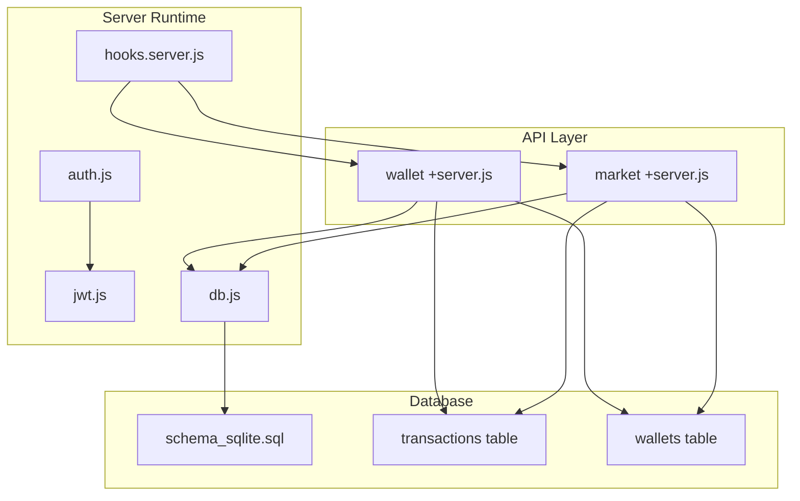
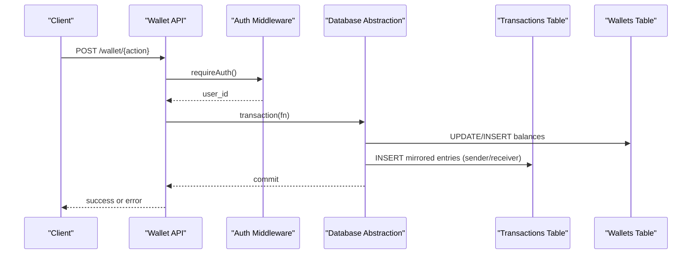
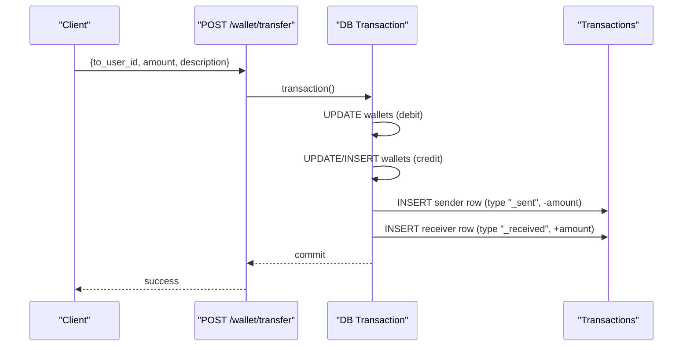
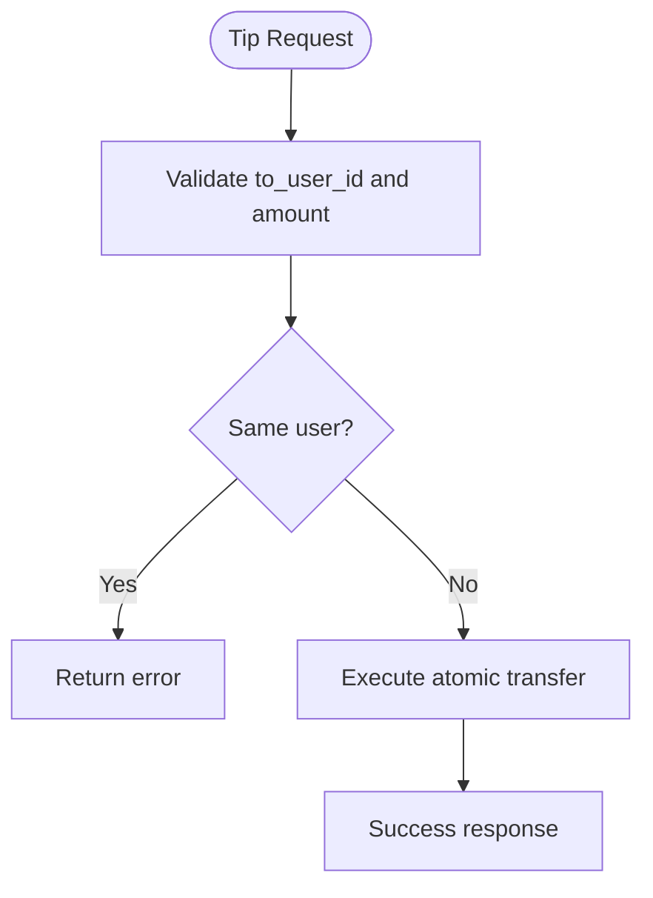
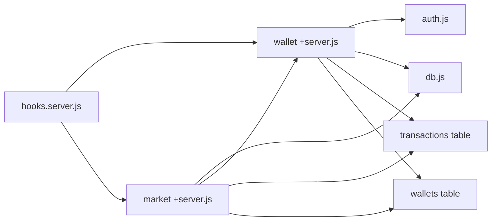

# Transaction Processing

<cite>
**Referenced Files in This Document**
- [schema_sqlite.sql](file://schema_sqlite.sql)
- [wallet +server.js](file://frontend/src/routes/api/wallet/[...path]/+server.js)
- [market +server.js](file://frontend/src/routes/api/market/[...path]/+server.js)
- [db.js](file://frontend/src/lib/server/db.js)
- [auth.js](file://frontend/src/lib/server/auth.js)
- [jwt.js](file://frontend/src/lib/server/jwt.js)
- [hooks.server.js](file://frontend/src/hooks.server.js)
- [001_schema.sql](file://migrations/001_schema.sql)
- [002_phase2.sql](file://migrations/002_phase2.sql)
</cite>

## Table of Contents
1. [Introduction](#introduction)
2. [Project Structure](#project-structure)
3. [Core Components](#core-components)
4. [Architecture Overview](#architecture-overview)
5. [Detailed Component Analysis](#detailed-component-analysis)
6. [Dependency Analysis](#dependency-analysis)
7. [Performance Considerations](#performance-considerations)
8. [Troubleshooting Guide](#troubleshooting-guide)
9. [Conclusion](#conclusion)
10. [Appendices](#appendices)

## Introduction
This document describes VSocial’s transaction processing system with a focus on wallet operations and financial records. It covers the supported transaction types (transfers, tips, deposits, withdrawals), the dual-entry recording mechanism, categorization and descriptions, reference tracking, error handling, audit trail maintenance, limits and validations, security measures, schema and indexing, historical data management, and rollback/reconciliation processes.

## Project Structure
The transaction system spans several modules:
- Wallet API endpoints for transfers, tips, deposits, and withdrawals
- Marketplace integration that performs atomic transfers and platform fee recording
- Database abstraction layer with transaction primitives
- Authentication middleware for endpoint protection
- Database schema defining wallets, transactions, and supporting indexes

**Diagram sources**
- [hooks.server.js:1-179](file://frontend/src/hooks.server.js#L1-L179)
- [auth.js:1-92](file://frontend/src/lib/server/auth.js#L1-L92)
- [jwt.js:1-45](file://frontend/src/lib/server/jwt.js#L1-L45)
- [db.js:1-209](file://frontend/src/lib/server/db.js#L1-L209)
- [wallet +server.js:1-113](file://frontend/src/routes/api/wallet/[...path]/+server.js#L1-L113)
- [market +server.js:1-134](file://frontend/src/routes/api/market/[...path]/+server.js#L1-L134)
- [schema_sqlite.sql:344-371](file://schema_sqlite.sql#L344-L371)

**Section sources**
- [schema_sqlite.sql:344-371](file://schema_sqlite.sql#L344-L371)
- [wallet +server.js:1-113](file://frontend/src/routes/api/wallet/[...path]/+server.js#L1-L113)
- [market +server.js:1-134](file://frontend/src/routes/api/market/[...path]/+server.js#L1-L134)
- [db.js:1-209](file://frontend/src/lib/server/db.js#L1-L209)
- [auth.js:1-92](file://frontend/src/lib/server/auth.js#L1-L92)
- [jwt.js:1-45](file://frontend/src/lib/server/jwt.js#L1-L45)
- [hooks.server.js:1-179](file://frontend/src/hooks.server.js#L1-L179)

## Core Components
- Wallet API: Implements four transaction types with atomic updates and dual-entry transaction logging.
- Marketplace API: Integrates with wallet transfers to execute offers and record platform fees.
- Database Abstraction: Provides unified async API and transaction primitives for both drivers (@libsql/client and better-sqlite3).
- Authentication: Enforces bearer token-based session validation for protected endpoints.

Key responsibilities:
- Atomicity: All financial changes occur inside database transactions.
- Dual-entry bookkeeping: Sender and receiver each get a mirrored transaction row.
- Reference tracking: Offers and marketplace actions set a reference_id for audit linkage.
- Audit trail: Every change is recorded in the transactions table with timestamps.

**Section sources**
- [wallet +server.js:8-30](file://frontend/src/routes/api/wallet/[...path]/+server.js#L8-L30)
- [market +server.js:90-124](file://frontend/src/routes/api/market/[...path]/+server.js#L90-L124)
- [db.js:60-112](file://frontend/src/lib/server/db.js#L60-L112)
- [auth.js:15-44](file://frontend/src/lib/server/auth.js#L15-L44)

## Architecture Overview
The transaction pipeline ensures correctness and auditability:
- Request enters via authenticated endpoints
- Business logic validates inputs and permissions
- Database transaction executes balance updates and inserts mirrored transaction rows
- Errors are caught and surfaced with appropriate HTTP status codes
- Admin endpoints can inspect transaction logs

**Diagram sources**
- [wallet +server.js:55-111](file://frontend/src/routes/api/wallet/[...path]/+server.js#L55-L111)
- [auth.js:15-44](file://frontend/src/lib/server/auth.js#L15-L44)
- [db.js:60-112](file://frontend/src/lib/server/db.js#L60-L112)
- [schema_sqlite.sql:363-371](file://schema_sqlite.sql#L363-L371)

## Detailed Component Analysis

### Wallet API: Endpoints and Business Logic
Supported actions:
- GET /wallet/transactions: Paginated transaction history per user
- POST /wallet/transfer: Send money to another user
- POST /wallet/tip: Send a tip to another user (with self-tip prevention)
- POST /wallet/deposit: Add funds to wallet (with cap)
- POST /wallet/withdraw: Deduct funds from wallet (with sufficient balance)

Dual-entry recording:
- Sender: type ends with “_sent”, amount negative
- Receiver: type ends with “_received”, amount positive
- Both entries include description and optional reference_id

Atomic transfer helper:
- Validates amount > 0
- Uses a single transaction to:
  - Debit sender (with sufficient-balance check)
  - Credit receiver (insert if missing)
  - Insert mirrored transaction rows for sender and receiver

Validation rules and limits:
- Transfer/Tips: to_user_id required, amount > 0
- Tips: to_user_id must differ from caller
- Deposit: amount > 0 and ≤ 10000
- Withdraw: amount > 0 and sufficient balance

Error handling:
- Insufficient funds, invalid parameters, and race conditions raise descriptive errors
- All endpoints return structured JSON with either success or error message and HTTP status

**Section sources**
- [wallet +server.js:32-53](file://frontend/src/routes/api/wallet/[...path]/+server.js#L32-L53)
- [wallet +server.js:55-111](file://frontend/src/routes/api/wallet/[...path]/+server.js#L55-L111)
- [wallet +server.js:8-30](file://frontend/src/routes/api/wallet/[...path]/+server.js#L8-L30)

### Marketplace Offer Payment Integration
Marketplace accepts offers and executes payment using the shared atomic transfer:
- Validates offer ownership and pending status
- Computes net to seller and platform commission
- Executes atomic transfer from buyer to seller
- Records platform fee as a separate transaction entry with reference_id linking to the offer
- Updates offer and listing/job statuses upon success

Reference tracking:
- reference_id format: “offer_{id}” ties fee and payment entries to the offer

**Section sources**
- [market +server.js:90-124](file://frontend/src/routes/api/market/[...path]/+server.js#L90-L124)

### Database Abstraction and Transactions
The database adapter exposes:
- prepare(sql): async run/get/all wrappers
- transaction(fn): wraps fn in BEGIN/COMMIT/ROLLBACK semantics
- Driver support: @libsql/client and better-sqlite3 with identical async API

Rollback behavior:
- On exceptions during transaction execution, the adapter attempts ROLLBACK and rethrows the error

**Section sources**
- [db.js:31-112](file://frontend/src/lib/server/db.js#L31-L112)

### Authentication and Authorization
- requireAuth(request): extracts Bearer token, decodes JWT, validates session existence and expiration
- createSession(userId, request): persists session token hash and metadata
- requireAdmin(request): enforces admin privileges

Security measures:
- Session storage uses hashed token for lookup
- Expiration enforcement deletes expired sessions
- JWT secret and expiry configured via environment variables

**Section sources**
- [auth.js:15-44](file://frontend/src/lib/server/auth.js#L15-L44)
- [auth.js:60-74](file://frontend/src/lib/server/auth.js#L60-L74)
- [jwt.js:19-32](file://frontend/src/lib/server/jwt.js#L19-L32)

### Transaction Recording Mechanism
Schema highlights:
- wallets: per-user balance and timestamps
- transactions: per-wallet entries with type, amount, description, reference_id, created_at

Dual-entry bookkeeping:
- For each transfer/tip, two rows are inserted:
  - Sender: type “{type}_sent”, amount negative
  - Receiver: type “{type}_received”, amount positive
- Descriptions include contextual information (e.g., “Direct Transfer”, “Tip”)
- reference_id links marketplace offers and other cross-entity operations

Audit trail:
- Admin endpoint lists recent transactions with joins to users and wallets for visibility

**Section sources**
- [schema_sqlite.sql:355-371](file://schema_sqlite.sql#L355-L371)
- [wallet +server.js:24-27](file://frontend/src/routes/api/wallet/[...path]/+server.js#L24-L27)
- [market +server.js:103-114](file://frontend/src/routes/api/market/[...path]/+server.js#L103-L114)
- [hooks.server.js:106-147](file://frontend/src/hooks.server.js#L106-L147)

### Transaction Types and Workflows

#### Transfers
- Endpoint: POST /wallet/transfer
- Validation: to_user_id present, amount > 0
- Behavior: atomic debit/credit and dual transaction insertion
- Example reference: “Direct Transfer”

**Diagram sources**
- [wallet +server.js:62-70](file://frontend/src/routes/api/wallet/[...path]/+server.js#L62-L70)
- [wallet +server.js:8-30](file://frontend/src/routes/api/wallet/[...path]/+server.js#L8-L30)

#### Tips
- Endpoint: POST /wallet/tip
- Validation: to_user_id ≠ caller, amount > 0
- Behavior: same atomic transfer logic as transfers

**Diagram sources**
- [wallet +server.js:72-81](file://frontend/src/routes/api/wallet/[...path]/+server.js#L72-L81)
- [wallet +server.js:8-30](file://frontend/src/routes/api/wallet/[...path]/+server.js#L8-L30)

#### Deposits
- Endpoint: POST /wallet/deposit
- Validation: amount > 0 and ≤ 10000
- Behavior: credit wallet and insert transaction row with type “deposit”

#### Withdrawals
- Endpoint: POST /wallet/withdraw
- Validation: amount > 0 and sufficient balance
- Behavior: debit wallet and insert transaction row with type “withdraw”

**Section sources**
- [wallet +server.js:83-111](file://frontend/src/routes/api/wallet/[...path]/+server.js#L83-L111)

### Transaction Categorization, Descriptions, and Reference Tracking
- Type taxonomy:
  - transfer_sent/transfer_received
  - tip_sent/tip_received
  - deposit
  - withdraw
  - fee (platform commission)
- Descriptions: human-readable notes for context
- Reference tracking:
  - Offers: reference_id “offer_{id}”
  - Marketplace fee: linked to the offer via reference_id

**Section sources**
- [wallet +server.js:24-27](file://frontend/src/routes/api/wallet/[...path]/+server.js#L24-L27)
- [market +server.js:99-114](file://frontend/src/routes/api/market/[...path]/+server.js#L99-L114)

### Examples of Transaction Workflows
- Transfer between users:
  - Caller invokes POST /wallet/transfer
  - System debits caller, credits recipient, writes mirrored transaction rows
- Marketplace offer acceptance:
  - Seller accepts offer
  - System executes atomic transfer buyer→seller for net amount
  - Platform fee debited from buyer and recorded with reference_id

**Section sources**
- [wallet +server.js:62-70](file://frontend/src/routes/api/wallet/[...path]/+server.js#L62-L70)
- [market +server.js:102-124](file://frontend/src/routes/api/market/[...path]/+server.js#L102-L124)

### Error Handling for Failed Transactions
- Amount validation failures return 400 with error message
- Insufficient funds and race-condition checks raise descriptive errors
- Database operation errors are normalized and logged
- Global error handler returns structured 500 responses for unhandled errors

**Section sources**
- [wallet +server.js:65-70](file://frontend/src/routes/api/wallet/[...path]/+server.js#L65-L70)
- [wallet +server.js:103-109](file://frontend/src/routes/api/wallet/[...path]/+server.js#L103-L109)
- [hooks.server.js:154-178](file://frontend/src/hooks.server.js#L154-L178)

### Audit Trail Maintenance
- Admin endpoint retrieves recent transactions with joins to users and wallets
- Transactions include timestamps, amounts, types, and optional reference_id
- Supports investigation of balances, transfers, tips, deposits, withdrawals, and fees

**Section sources**
- [hooks.server.js:106-147](file://frontend/src/hooks.server.js#L106-L147)

### Transaction Limits, Validation Rules, and Security Measures
- Deposit cap: maximum $10,000 per deposit
- Tip self-transfer prevention
- Balance checks before debits
- Session-based authentication with token hashing and expiration enforcement
- JWT-based identity verification

**Section sources**
- [wallet +server.js:85-86](file://frontend/src/routes/api/wallet/[...path]/+server.js#L85-L86)
- [wallet +server.js:76-77](file://frontend/src/routes/api/wallet/[...path]/+server.js#L76-L77)
- [auth.js:15-44](file://frontend/src/lib/server/auth.js#L15-L44)

### Transaction Table Schema, Indexing, and Historical Data Management
Schema elements:
- wallets: user_id unique, balance, timestamps
- transactions: wallet_id foreign key, type, amount, description, reference_id, created_at

Indexes:
- idx_wallet_user on wallet_transactions (user_id, created_at DESC)
- Additional indexes exist in the broader schema for performance

Historical management:
- Transactions are append-only with timestamps
- Pagination via page/limit parameters in GET /wallet/transactions
- Admin logs endpoint aggregates recent activity

**Section sources**
- [schema_sqlite.sql:355-371](file://schema_sqlite.sql#L355-L371)
- [schema_sqlite.sql:344-353](file://schema_sqlite.sql#L344-L353)
- [wallet +server.js:48-51](file://frontend/src/routes/api/wallet/[...path]/+server.js#L48-L51)
- [hooks.server.js:106-147](file://frontend/src/hooks.server.js#L106-L147)

### Transaction Rollback Procedures and Reconciliation Processes
Rollback:
- Database adapter wraps operations in transactions and attempts ROLLBACK on exceptions
- Atomic transfer helper ensures either both sides succeed or both fail

Reconciliation:
- Admin logs endpoint allows cross-checking transaction rows against wallet balances
- Reference_id enables tracing marketplace-related entries
- Timestamp ordering supports chronological reconciliation

**Section sources**
- [db.js:60-112](file://frontend/src/lib/server/db.js#L60-L112)
- [wallet +server.js:8-30](file://frontend/src/routes/api/wallet/[...path]/+server.js#L8-L30)
- [hooks.server.js:106-147](file://frontend/src/hooks.server.js#L106-L147)

## Dependency Analysis

**Diagram sources**
- [wallet +server.js:1-113](file://frontend/src/routes/api/wallet/[...path]/+server.js#L1-L113)
- [market +server.js:1-134](file://frontend/src/routes/api/market/[...path]/+server.js#L1-L134)
- [auth.js:1-92](file://frontend/src/lib/server/auth.js#L1-L92)
- [db.js:1-209](file://frontend/src/lib/server/db.js#L1-L209)
- [hooks.server.js:1-179](file://frontend/src/hooks.server.js#L1-L179)

**Section sources**
- [wallet +server.js:1-113](file://frontend/src/routes/api/wallet/[...path]/+server.js#L1-L113)
- [market +server.js:1-134](file://frontend/src/routes/api/market/[...path]/+server.js#L1-L134)
- [auth.js:1-92](file://frontend/src/lib/server/auth.js#L1-L92)
- [db.js:1-209](file://frontend/src/lib/server/db.js#L1-L209)
- [hooks.server.js:1-179](file://frontend/src/hooks.server.js#L1-L179)

## Performance Considerations
- WAL mode enabled for improved concurrency and durability
- Foreign keys enforced for referential integrity
- Indexes on user_id and created_at for efficient transaction pagination
- Busy timeout configured to reduce contention under load
- Pragmas tuned for synchronous and cache behavior

[No sources needed since this section provides general guidance]

## Troubleshooting Guide
Common issues and resolutions:
- Insufficient funds: Verify wallet balance and retry with smaller amount
- Invalid parameters: Ensure to_user_id and positive amount are provided
- Self-tip errors: Use a different recipient for tips
- Session expired: Re-authenticate to obtain a fresh token
- Database errors: Check server logs for normalized error messages

**Section sources**
- [wallet +server.js:65-70](file://frontend/src/routes/api/wallet/[...path]/+server.js#L65-L70)
- [wallet +server.js:103-109](file://frontend/src/routes/api/wallet/[...path]/+server.js#L103-L109)
- [auth.js:33-41](file://frontend/src/lib/server/auth.js#L33-L41)
- [hooks.server.js:154-178](file://frontend/src/hooks.server.js#L154-L178)

## Conclusion
VSocial’s transaction processing system combines atomic database operations with dual-entry bookkeeping to ensure correctness and auditability. The Wallet API supports transfers, tips, deposits, and withdrawals with strict validation and clear error reporting. Marketplace integrations leverage the same atomic transfer primitive to manage offer payments and platform fees. Robust authentication, indexing, and administrative logging provide strong operational controls.

## Appendices

### Appendix A: Transaction Types and Descriptions
- transfer_sent/transfer_received: Peer-to-peer transfers
- tip_sent/tip_received: Tips between users
- deposit: Funds added to wallet
- withdraw: Funds removed from wallet
- fee: Platform commission for marketplace offers

**Section sources**
- [wallet +server.js:24-27](file://frontend/src/routes/api/wallet/[...path]/+server.js#L24-L27)
- [market +server.js:110](file://frontend/src/routes/api/market/[...path]/+server.js#L110)

### Appendix B: Reference Tracking Examples
- Offers: reference_id “offer_{id}”
- Marketplace fee: linked to the offer via reference_id

**Section sources**
- [market +server.js:99-114](file://frontend/src/routes/api/market/[...path]/+server.js#L99-L114)

### Appendix C: Schema and Indexes
- wallets: user_id unique, balance, timestamps
- transactions: wallet_id FK, type, amount, description, reference_id, created_at
- Indexes: idx_wallet_user on wallet_transactions

**Section sources**
- [schema_sqlite.sql:355-371](file://schema_sqlite.sql#L355-L371)
- [schema_sqlite.sql:344-353](file://schema_sqlite.sql#L344-L353)