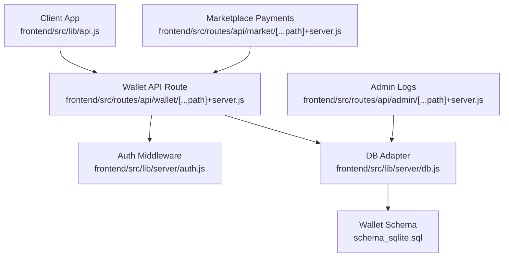
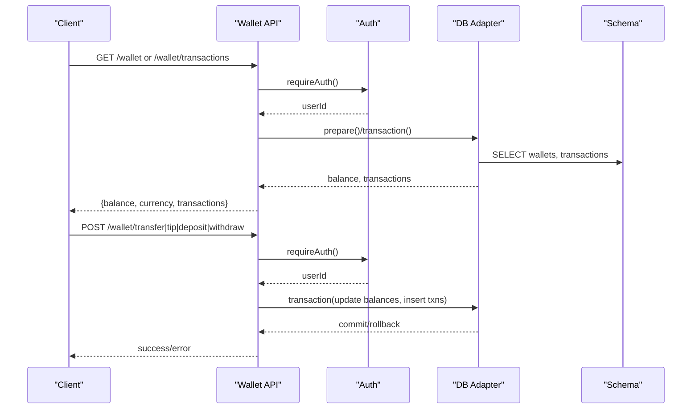
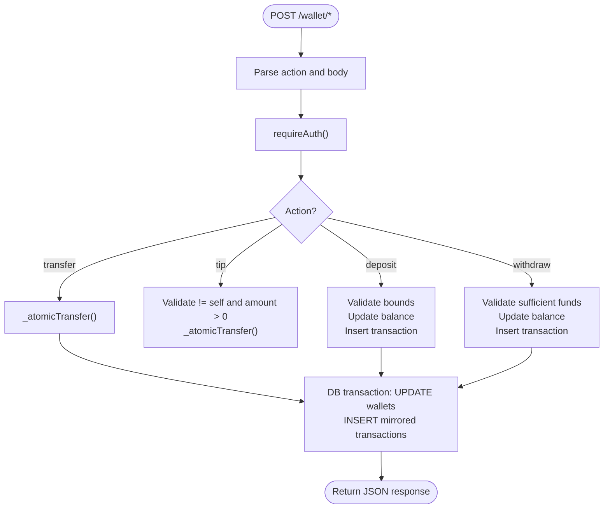
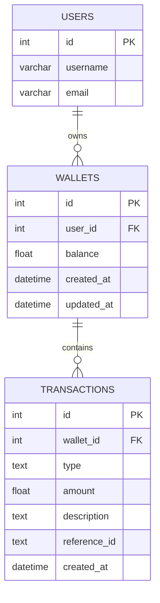
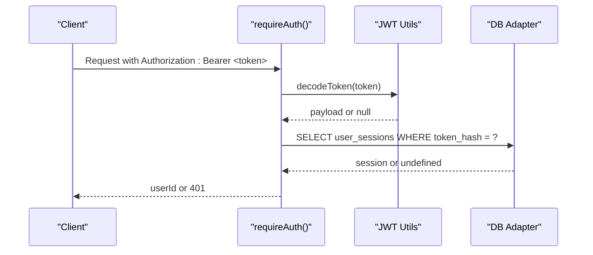
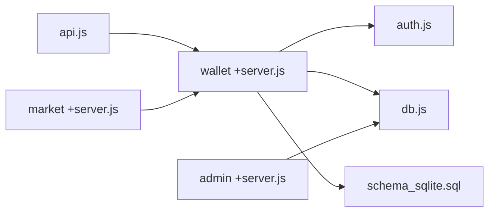
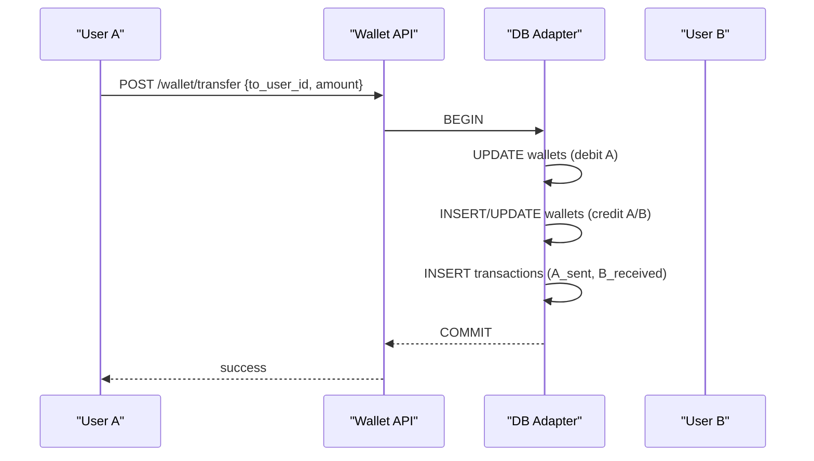

# Wallet & Transactions

<cite>
**Referenced Files in This Document**
- [wallet +server.js](file://frontend/src/routes/api/wallet/[...path]+server.js)
- [api.js](file://frontend/src/lib/api.js)
- [db.js](file://frontend/src/lib/server/db.js)
- [auth.js](file://frontend/src/lib/server/auth.js)
- [jwt.js](file://frontend/src/lib/server/jwt.js)
- [admin +server.js](file://frontend/src/routes/api/admin/[...path]+server.js)
- [schema_sqlite.sql](file://schema_sqlite.sql)
- [001_schema.sql](file://migrations/001_schema.sql)
- [market +server.js](file://frontend/src/routes/api/market/[...path]+server.js)
</cite>

## Table of Contents
1. [Introduction](#introduction)
2. [Project Structure](#project-structure)
3. [Core Components](#core-components)
4. [Architecture Overview](#architecture-overview)
5. [Detailed Component Analysis](#detailed-component-analysis)
6. [Dependency Analysis](#dependency-analysis)
7. [Performance Considerations](#performance-considerations)
8. [Troubleshooting Guide](#troubleshooting-guide)
9. [Conclusion](#conclusion)
10. [Appendices](#appendices)

## Introduction
This document describes VSocial’s wallet and monetization system. It covers balance management, transaction history, tips, transfers, deposits, withdrawals, and administrative reporting. It also documents the API endpoints, internal processing logic, and audit trail mechanisms. Regulatory compliance, fraud prevention, and financial data security considerations are addressed alongside practical workflows and troubleshooting guidance.

## Project Structure
The wallet system is implemented as a SvelteKit server-side route with a shared client API module. Database access is abstracted via a unified adapter supporting both local and remote drivers. Authentication relies on JWT and session validation.

**Diagram sources**
- [wallet +server.js:1-112](file://frontend/src/routes/api/wallet/[...path]+server.js#L1-L112)
- [api.js:292-302](file://frontend/src/lib/api.js#L292-L302)
- [auth.js:15-44](file://frontend/src/lib/server/auth.js#L15-L44)
- [db.js:117-172](file://frontend/src/lib/server/db.js#L117-L172)
- [schema_sqlite.sql:344-371](file://schema_sqlite.sql#L344-L371)
- [admin +server.js:106-114](file://frontend/src/routes/api/admin/[...path]+server.js#L106-L114)
- [market +server.js:97-133](file://frontend/src/routes/api/market/[......path]+server.js#L97-L133)

**Section sources**
- [wallet +server.js:1-112](file://frontend/src/routes/api/wallet/[...path]+server.js#L1-L112)
- [api.js:292-302](file://frontend/src/lib/api.js#L292-L302)
- [db.js:117-172](file://frontend/src/lib/server/db.js#L117-L172)
- [auth.js:15-44](file://frontend/src/lib/server/auth.js#L15-L44)
- [schema_sqlite.sql:344-371](file://schema_sqlite.sql#L344-L371)
- [admin +server.js:106-114](file://frontend/src/routes/api/admin/[...path]+server.js#L106-L114)
- [market +server.js:97-133](file://frontend/src/routes/api/market/[...path]+server.js#L97-L133)

## Core Components
- Wallet API route: Provides GET and POST endpoints for balance, transactions, transfers, tips, deposits, and withdrawals.
- Client API module: Exposes convenience methods for wallet operations.
- Database adapter: Unified async interface for SQLite/WAL and remote drivers.
- Authentication: JWT-based bearer token validation and session checks.
- Administrative logs: Transaction log view for admins.

Key capabilities:
- Atomic transfers between user wallets with balanced debits/credits and mirrored transaction records.
- Transaction pagination and filtering.
- Deposit and withdrawal limits and validations.
- Tip validation preventing self-tipping.
- Admin visibility into transaction logs.

**Section sources**
- [wallet +server.js:8-30](file://frontend/src/routes/api/wallet/[...path]+server.js#L8-L30)
- [wallet +server.js:32-53](file://frontend/src/routes/api/wallet/[...path]+server.js#L32-L53)
- [wallet +server.js:55-111](file://frontend/src/routes/api/wallet/[...path]+server.js#L55-L111)
- [api.js:292-302](file://frontend/src/lib/api.js#L292-L302)
- [db.js:31-112](file://frontend/src/lib/server/db.js#L31-L112)
- [auth.js:15-44](file://frontend/src/lib/server/auth.js#L15-L44)
- [admin +server.js:106-114](file://frontend/src/routes/api/admin/[...path]+server.js#L106-L114)

## Architecture Overview
The wallet subsystem integrates client requests, authentication, and database transactions. Admins can inspect transaction logs for auditing.

**Diagram sources**
- [wallet +server.js:32-53](file://frontend/src/routes/api/wallet/[...path]+server.js#L32-L53)
- [wallet +server.js:55-111](file://frontend/src/routes/api/wallet/[...path]+server.js#L55-L111)
- [auth.js:15-44](file://frontend/src/lib/server/auth.js#L15-L44)
- [db.js:60-112](file://frontend/src/lib/server/db.js#L60-L112)
- [schema_sqlite.sql:344-371](file://schema_sqlite.sql#L344-L371)

## Detailed Component Analysis

### Wallet API Endpoints
- GET /wallet
  - Returns current user’s balance and currency.
  - Ensures wallet row exists; creates if missing.
- GET /wallet/transactions
  - Returns paginated transaction history for the current user.
  - Supports page and limit query parameters.
- POST /wallet/transfer
  - Transfers amount from caller to another user.
  - Validates non-zero amount and sufficient balance.
  - Uses atomic transaction to debit sender and credit/add recipient.
  - Records mirrored sent/received entries.
- POST /wallet/tip
  - Sends a tip to another user.
  - Prohibits self-tips.
  - Mirrors transaction records for both parties.
- POST /wallet/deposit
  - Adds funds to caller’s wallet.
  - Validates amount bounds.
  - Inserts transaction record.
- POST /wallet/withdraw
  - Deducts funds from caller’s wallet.
  - Validates sufficient balance.
  - Inserts transaction record.

**Diagram sources**
- [wallet +server.js:55-111](file://frontend/src/routes/api/wallet/[...path]+server.js#L55-L111)
- [wallet +server.js:8-30](file://frontend/src/routes/api/wallet/[...path]+server.js#L8-L30)

**Section sources**
- [wallet +server.js:32-53](file://frontend/src/routes/api/wallet/[...path]+server.js#L32-L53)
- [wallet +server.js:55-111](file://frontend/src/routes/api/wallet/[...path]+server.js#L55-L111)

### Client API Integration
The client exposes wallet methods mirroring backend endpoints:
- wallet.balance()
- wallet.transactions({ page, limit })
- wallet.transfer(data)
- wallet.tip(data)
- wallet.deposit(data)
- wallet.withdraw(data)

These map to GET/POST calls against /wallet/*.

**Section sources**
- [api.js:292-302](file://frontend/src/lib/api.js#L292-L302)

### Database Schema and Transactions
Wallets and transactions are stored in dedicated tables. The schema defines:
- wallets: per-user balance and timestamps.
- transactions: per-wallet transaction records with mirrored entries for transfers/tips.

**Diagram sources**
- [schema_sqlite.sql:344-371](file://schema_sqlite.sql#L344-L371)

**Section sources**
- [schema_sqlite.sql:344-371](file://schema_sqlite.sql#L344-L371)

### Authentication and Sessions
- requireAuth extracts Bearer token, validates signature, and checks session existence/expiry.
- Tokens are hashed and stored in user_sessions for expiry enforcement.
- JWT utilities provide encode/decode helpers and Bearer extraction.

**Diagram sources**
- [auth.js:15-44](file://frontend/src/lib/server/auth.js#L15-L44)
- [jwt.js:26-42](file://frontend/src/lib/server/jwt.js#L26-L42)
- [db.js:117-172](file://frontend/src/lib/server/db.js#L117-L172)

**Section sources**
- [auth.js:15-44](file://frontend/src/lib/server/auth.js#L15-L44)
- [jwt.js:19-42](file://frontend/src/lib/server/jwt.js#L19-L42)

### Administrative Reporting
Admins can view recent transaction logs with user context for auditing.

- GET /admin/logs
  - Returns latest transactions joined with user and wallet info.

**Section sources**
- [admin +server.js:106-114](file://frontend/src/routes/api/admin/[...path]+server.js#L106-L114)

### Marketplace Payment Integration
Marketplace offers use the same atomic transfer mechanism for secure payments, including platform fee deductions and mirrored transaction records.

- Accept offer and pay seller net minus fees.
- Platform fee recorded as a negative transaction on buyer’s wallet.
- Offer/listing/job statuses updated upon completion.

**Section sources**
- [market +server.js:97-133](file://frontend/src/routes/api/market/[...path]+server.js#L97-L133)

## Dependency Analysis
- Wallet API depends on:
  - Authentication middleware for user identity.
  - Database adapter for prepared statements and transactions.
  - Shared schema for wallets and transactions.
- Client API depends on SvelteKit’s json helper and fetch semantics.
- Admin API depends on DB adapter and joins for transaction logs.

**Diagram sources**
- [wallet +server.js:1-112](file://frontend/src/routes/api/wallet/[...path]+server.js#L1-L112)
- [auth.js:1-92](file://frontend/src/lib/server/auth.js#L1-L92)
- [db.js:1-209](file://frontend/src/lib/server/db.js#L1-L209)
- [schema_sqlite.sql:344-371](file://schema_sqlite.sql#L344-L371)
- [api.js:292-302](file://frontend/src/lib/api.js#L292-L302)
- [admin +server.js:106-114](file://frontend/src/routes/api/admin/[...path]+server.js#L106-L114)
- [market +server.js:97-133](file://frontend/src/routes/api/market/[...path]+server.js#L97-L133)

**Section sources**
- [wallet +server.js:1-112](file://frontend/src/routes/api/wallet/[...path]+server.js#L1-L112)
- [auth.js:1-92](file://frontend/src/lib/server/auth.js#L1-L92)
- [db.js:1-209](file://frontend/src/lib/server/db.js#L1-L209)
- [schema_sqlite.sql:344-371](file://schema_sqlite.sql#L344-L371)
- [api.js:292-302](file://frontend/src/lib/api.js#L292-L302)
- [admin +server.js:106-114](file://frontend/src/routes/api/admin/[...path]+server.js#L106-L114)
- [market +server.js:97-133](file://frontend/src/routes/api/market/[...path]+server.js#L97-L133)

## Performance Considerations
- WAL mode and PRAGMAs improve concurrency and durability for SQLite.
- Prepared statements and transactions reduce overhead and ensure consistency.
- Pagination limits prevent heavy queries on transaction lists.
- Indexes on user_id and created_at optimize transaction retrieval.

[No sources needed since this section provides general guidance]

## Troubleshooting Guide
Common issues and resolutions:
- 401 Unauthorized
  - Missing or invalid Bearer token; verify JWT secret and session expiry.
- Insufficient funds
  - Withdrawal or transfer fails if balance is insufficient; ensure prior deposit or tip received.
- Race conditions
  - Atomic transfers prevent overdrafts; retry on transient failures.
- Endpoint not found
  - Verify action path matches supported endpoints (/wallet/transactions, /wallet/transfer, /wallet/tip, /wallet/deposit, /wallet/withdraw).
- Admin logs empty
  - Confirm transaction records exist and join with wallets/users.

**Section sources**
- [wallet +server.js:32-53](file://frontend/src/routes/api/wallet/[...path]+server.js#L32-L53)
- [wallet +server.js:55-111](file://frontend/src/routes/api/wallet/[...path]+server.js#L55-L111)
- [auth.js:15-44](file://frontend/src/lib/server/auth.js#L15-L44)
- [admin +server.js:106-114](file://frontend/src/routes/api/admin/[...path]+server.js#L106-L114)

## Conclusion
VSocial’s wallet system provides a robust, auditable, and secure foundation for user balance management and peer-to-peer monetization. Its use of atomic transactions, clear audit trails, and administrative oversight supports both operational transparency and regulatory readiness. Extending to external payment processors or cryptocurrency would involve integrating gateway APIs while preserving the existing transaction model and audit logging.

[No sources needed since this section summarizes without analyzing specific files]

## Appendices

### API Reference Summary
- GET /wallet
  - Returns: balance, currency
- GET /wallet/transactions?page&limit
  - Returns: array of transactions
- POST /wallet/transfer
  - Body: to_user_id, amount, description
- POST /wallet/tip
  - Body: to_user_id, amount, message
- POST /wallet/deposit
  - Body: amount
- POST /wallet/withdraw
  - Body: amount

Administrative:
- GET /admin/logs
  - Returns: recent transaction logs with user context

**Section sources**
- [wallet +server.js:32-53](file://frontend/src/routes/api/wallet/[...path]+server.js#L32-L53)
- [wallet +server.js:55-111](file://frontend/src/routes/api/wallet/[...path]+server.js#L55-L111)
- [admin +server.js:106-114](file://frontend/src/routes/api/admin/[...path]+server.js#L106-L114)
- [api.js:292-302](file://frontend/src/lib/api.js#L292-L302)

### Transaction Workflow Examples
- Transfer
  - Debit sender, credit/add recipient, insert mirrored transaction records.
- Tip
  - Same as transfer with self-tip prohibition.
- Deposit
  - Credit caller’s wallet and record deposit.
- Withdraw
  - Debit caller’s wallet and record withdrawal.

**Diagram sources**
- [wallet +server.js:8-30](file://frontend/src/routes/api/wallet/[...path]+server.js#L8-L30)
- [wallet +server.js:62-70](file://frontend/src/routes/api/wallet/[...path]+server.js#L62-L70)

### Fraud Prevention and Compliance Notes
- Session-based authentication with token hashing and expiry reduces replay risk.
- Atomic transfers and mirrored transaction records provide immutable audit trails.
- Admin logs enable oversight of suspicious activity.
- Consider adding:
  - Rate limiting for transfers/tips.
  - KYC/AML thresholds and reporting triggers.
  - Exportable transaction reports for tax purposes.
  - Encryption at rest and in transit for sensitive data.

[No sources needed since this section provides general guidance]