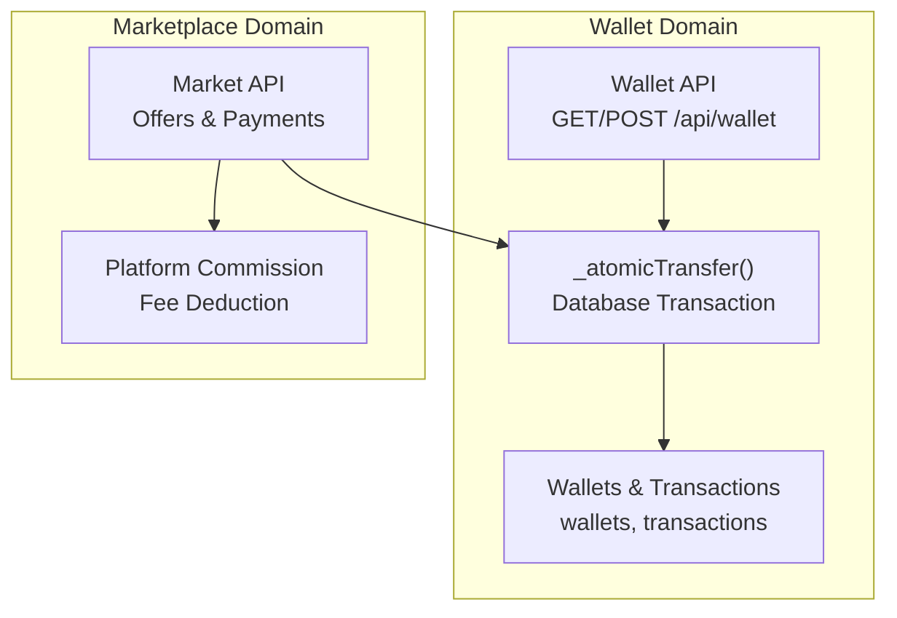
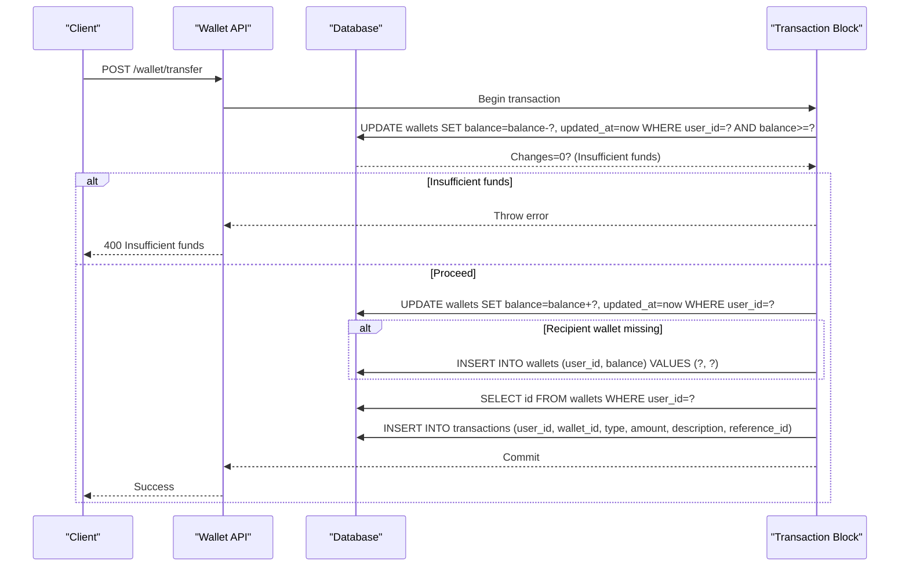
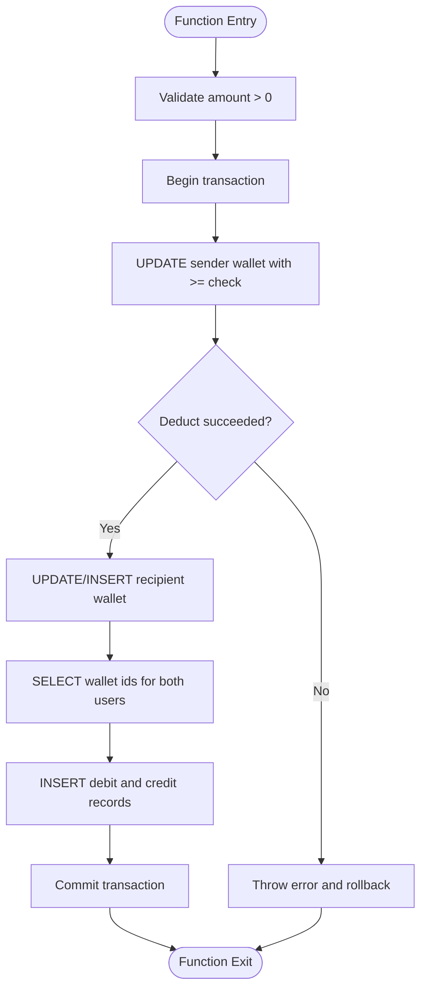
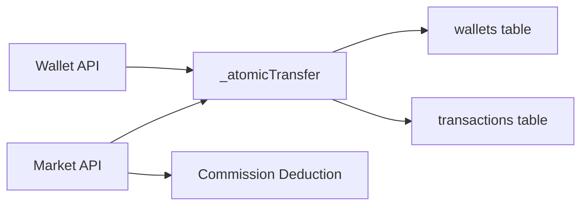

# Wallet Balance Management

<cite>
**Referenced Files in This Document**
- [wallet/+server.js](file://frontend/src/routes/api/wallet/+server.js)
- [market/+server.js](file://frontend/src/routes/api/market/+server.js)
- [schema_sqlite.sql](file://schema_sqlite.sql)
- [001_schema.sql](file://migrations/001_schema.sql)
- [002_phase2.sql](file://migrations/002_phase2.sql)
- [setup/+server.js](file://frontend/src/routes/api/setup/+server.js)
</cite>

## Table of Contents
1. [Introduction](#introduction)
2. [Project Structure](#project-structure)
3. [Core Components](#core-components)
4. [Architecture Overview](#architecture-overview)
5. [Detailed Component Analysis](#detailed-component-analysis)
6. [Dependency Analysis](#dependency-analysis)
7. [Performance Considerations](#performance-considerations)
8. [Troubleshooting Guide](#troubleshooting-guide)
9. [Conclusion](#conclusion)

## Introduction
This document provides comprehensive coverage of the wallet balance management system, focusing on atomic transfers, wallet creation and initialization, balance updates, concurrency control, and rollback mechanisms. It also documents the wallet table schema, indexing strategies, and balance aggregation patterns, along with practical examples for balance inquiries, automatic wallet creation, and marketplace payment flows.

## Project Structure
The wallet system spans three primary areas:
- Wallet API endpoints for balance queries, deposits, withdrawals, and transfers
- Atomic transfer function implementing database transactions
- Marketplace integration for secure payments with platform commissions

**Diagram sources**
- [wallet/+server.js:8-30](file://frontend/src/routes/api/wallet/+server.js#L8-L30)
- [market/+server.js:7-124](file://frontend/src/routes/api/market/+server.js#L7-L124)
- [schema_sqlite.sql:355-371](file://schema_sqlite.sql#L355-L371)

**Section sources**
- [wallet/+server.js:1-113](file://frontend/src/routes/api/wallet/+server.js#L1-L113)
- [market/+server.js:1-134](file://frontend/src/routes/api/market/+server.js#L1-L134)
- [schema_sqlite.sql:355-371](file://schema_sqlite.sql#L355-L371)

## Core Components
- Wallet API: Provides endpoints for balance retrieval, transaction history, deposits, withdrawals, and peer-to-peer transfers
- Atomic Transfer Function: Ensures transaction integrity using database transactions and optimistic checks
- Wallet Schema: Defines wallets and transactions tables with appropriate constraints and indexes
- Marketplace Integration: Uses atomic transfers for secure offer acceptance and platform fee collection

Key implementation references:
- Atomic transfer definition and transaction block: [wallet/+server.js:8-30](file://frontend/src/routes/api/wallet/+server.js#L8-L30)
- Balance inquiry and auto-creation: [wallet/+server.js:32-52](file://frontend/src/routes/api/wallet/+server.js#L32-L52)
- Deposit flow with transaction wrapping: [wallet/+server.js:83-95](file://frontend/src/routes/api/wallet/+server.js#L83-L95)
- Withdrawal flow with insufficient funds protection: [wallet/+server.js:97-109](file://frontend/src/routes/api/wallet/+server.js#L97-L109)
- Marketplace payment with commission: [market/+server.js:90-124](file://frontend/src/routes/api/market/+server.js#L90-L124)

**Section sources**
- [wallet/+server.js:8-113](file://frontend/src/routes/api/wallet/+server.js#L8-L113)
- [market/+server.js:90-124](file://frontend/src/routes/api/market/+server.js#L90-L124)

## Architecture Overview
The wallet system centers around two tables: wallets and transactions. All monetary operations occur within database transactions to guarantee atomicity. The atomic transfer function performs:
- Sender balance deduction with availability check
- Recipient balance increment or wallet creation
- Transaction logging for both parties

**Diagram sources**
- [wallet/+server.js:8-30](file://frontend/src/routes/api/wallet/+server.js#L8-L30)

## Detailed Component Analysis

### Atomic Transfer Mechanism
The `_atomicTransfer` function encapsulates the core atomic operation:
- Validates positive amount
- Starts a database transaction
- Deducts from sender with availability check
- Increments recipient balance or creates wallet if missing
- Records debits and credits for both parties

**Diagram sources**
- [wallet/+server.js:8-30](file://frontend/src/routes/api/wallet/+server.js#L8-L30)

**Section sources**
- [wallet/+server.js:8-30](file://frontend/src/routes/api/wallet/+server.js#L8-L30)

### Wallet Creation and Initialization
- On first access, if a user lacks a wallet, the system automatically creates one with zero balance
- During setup, administrators receive starter credits to facilitate testing and onboarding

Implementation highlights:
- Automatic wallet creation during balance inquiry: [wallet/+server.js:38-42](file://frontend/src/routes/api/wallet/+server.js#L38-L42)
- Initial credits for admin users during setup: [setup/+server.js](file://frontend/src/routes/api/setup/+server.js#L45)

**Section sources**
- [wallet/+server.js:38-42](file://frontend/src/routes/api/wallet/+server.js#L38-L42)
- [setup/+server.js](file://frontend/src/routes/api/setup/+server.js#L45)

### Balance Update Logic and Concurrency Control
- Optimistic locking pattern: UPDATE with a condition that requires sufficient balance
- Transactional guarantees: All steps either succeed atomically or fail together
- Race condition prevention: The availability check in the UPDATE statement prevents overspending

References:
- Sender deduction with availability check: [wallet/+server.js:12-14](file://frontend/src/routes/api/wallet/+server.js#L12-L14)
- Recipient creation fallback: [wallet/+server.js:16-19](file://frontend/src/routes/api/wallet/+server.js#L16-L19)
- Withdrawal insufficient funds protection: [wallet/+server.js:100-103](file://frontend/src/routes/api/wallet/+server.js#L100-L103)

**Section sources**
- [wallet/+server.js:12-19](file://frontend/src/routes/api/wallet/+server.js#L12-L19)
- [wallet/+server.js:100-103](file://frontend/src/routes/api/wallet/+server.js#L100-L103)

### Rollback Mechanisms
- Database transactions automatically roll back on exceptions
- Explicit error throwing on insufficient funds halts the operation before committing
- Marketplace commission withdrawal uses a separate transaction block to ensure isolation

References:
- Atomic transfer rollback on failure: [wallet/+server.js](file://frontend/src/routes/api/wallet/+server.js#L14)
- Marketplace commission rollback on failure: [market/+server.js:105-114](file://frontend/src/routes/api/market/+server.js#L105-L114)

**Section sources**
- [wallet/+server.js](file://frontend/src/routes/api/wallet/+server.js#L14)
- [market/+server.js:105-114](file://frontend/src/routes/api/market/+server.js#L105-L114)

### Practical Examples

#### Balance Inquiry
- Endpoint: GET /api/wallet
- Behavior: Returns current balance and transaction history; auto-creates wallet if missing
- Pagination: Supports page and limit parameters

Reference:
- [wallet/+server.js:32-52](file://frontend/src/routes/api/wallet/+server.js#L32-L52)

#### Automatic Wallet Creation for New Users
- Occurs on first balance access when no wallet exists
- Initializes with zero balance

Reference:
- [wallet/+server.js:38-42](file://frontend/src/routes/api/wallet/+server.js#L38-L42)

#### Peer-to-Peer Transfer
- Endpoint: POST /api/wallet/transfer
- Uses atomic transfer with database transaction
- Prevents negative balances via availability check

Reference:
- [wallet/+server.js:62-70](file://frontend/src/routes/api/wallet/+server.js#L62-L70)

#### Tip Sending
- Endpoint: POST /api/wallet/tip
- Includes self-tip validation (not allowed)
- Uses atomic transfer for safe credit movement

Reference:
- [wallet/+server.js:72-81](file://frontend/src/routes/api/wallet/+server.js#L72-L81)

#### Deposit and Withdrawal
- Deposit: Adds funds with transaction wrapping; creates wallet if needed
- Withdrawal: Deducts funds with insufficient funds protection

References:
- [wallet/+server.js:83-95](file://frontend/src/routes/api/wallet/+server.js#L83-L95)
- [wallet/+server.js:97-109](file://frontend/src/routes/api/wallet/+server.js#L97-L109)

#### Marketplace Payment with Platform Commission
- Accept offer triggers atomic transfer to seller
- Platform commission deducted from buyer’s wallet in a separate transaction
- Updates offer and listing/job statuses upon completion

References:
- [market/+server.js:90-124](file://frontend/src/routes/api/market/+server.js#L90-L124)

### Edge Cases and Safety Measures
- Insufficient funds detection: Availability-checked UPDATE throws error when balance is too low
- Self-transfer prevention: Tip endpoint rejects transfers to self
- Race condition prevention: Single UPDATE with balance condition prevents concurrent overspending
- Constraint violations: INSERT fallback ensures wallet existence; transaction rollback handles errors

References:
- [wallet/+server.js](file://frontend/src/routes/api/wallet/+server.js#L14)
- [wallet/+server.js](file://frontend/src/routes/api/wallet/+server.js#L76)
- [wallet/+server.js:16-19](file://frontend/src/routes/api/wallet/+server.js#L16-L19)

**Section sources**
- [wallet/+server.js](file://frontend/src/routes/api/wallet/+server.js#L14)
- [wallet/+server.js](file://frontend/src/routes/api/wallet/+server.js#L76)
- [wallet/+server.js:16-19](file://frontend/src/routes/api/wallet/+server.js#L16-L19)

## Dependency Analysis
The wallet system integrates with the marketplace domain for secure payments. The marketplace relies on the atomic transfer function to move funds between parties and collects platform fees separately.

**Diagram sources**
- [wallet/+server.js:8-30](file://frontend/src/routes/api/wallet/+server.js#L8-L30)
- [market/+server.js:7-124](file://frontend/src/routes/api/market/+server.js#L7-L124)

**Section sources**
- [wallet/+server.js:8-30](file://frontend/src/routes/api/wallet/+server.js#L8-L30)
- [market/+server.js:7-124](file://frontend/src/routes/api/market/+server.js#L7-L124)

## Performance Considerations
- Indexing strategy: The wallets table uses a unique index on user_id for fast lookups and inserts
- Transaction batching: Using database transactions minimizes round trips and ensures consistency
- Aggregation patterns: Balance queries and transaction lists leverage indexed columns for efficient retrieval

Schema references:
- Unique index on user_id for wallets: [schema_sqlite.sql](file://schema_sqlite.sql#L357)
- Transaction index on user_id and created_at: [schema_sqlite.sql](file://schema_sqlite.sql#L353)

**Section sources**
- [schema_sqlite.sql:353-361](file://schema_sqlite.sql#L353-L361)

## Troubleshooting Guide
Common issues and resolutions:
- Insufficient funds: The system throws a specific error when the sender’s balance is insufficient; verify the user’s current balance before attempting transfers
- Missing wallet: On first access, wallets are auto-created; if absent, ensure the user exists and retry the operation
- Self-transfer attempts: The tip endpoint rejects transfers to self; ensure distinct sender and receiver IDs
- Concurrency anomalies: The atomic transfer function prevents race conditions via a single UPDATE with availability check; if conflicts persist, review concurrent requests and consider retry logic at the application layer

Operational references:
- Insufficient funds error path: [wallet/+server.js](file://frontend/src/routes/api/wallet/+server.js#L14)
- Auto-create wallet on access: [wallet/+server.js:38-42](file://frontend/src/routes/api/wallet/+server.js#L38-L42)
- Self-transfer rejection: [wallet/+server.js](file://frontend/src/routes/api/wallet/+server.js#L76)

**Section sources**
- [wallet/+server.js](file://frontend/src/routes/api/wallet/+server.js#L14)
- [wallet/+server.js:38-42](file://frontend/src/routes/api/wallet/+server.js#L38-L42)
- [wallet/+server.js](file://frontend/src/routes/api/wallet/+server.js#L76)

## Conclusion
The wallet balance management system employs atomic database transactions, optimistic locking, and defensive programming to ensure transaction integrity and prevent race conditions. The design supports automatic wallet creation, robust error handling, and seamless integration with marketplace payments, including platform commission collection. Proper indexing and transactional patterns provide strong performance characteristics for typical usage scenarios.